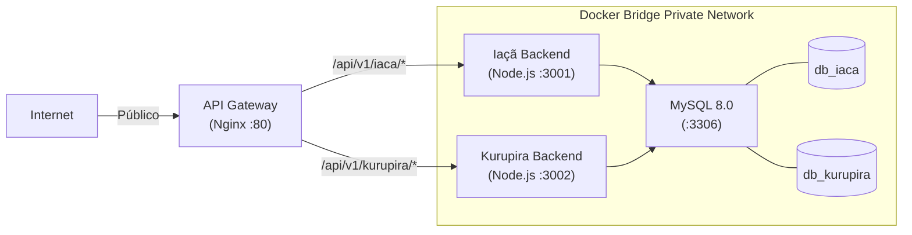

# Relatório de Execução (As-Built) — Dockerização e Reestruturação

> **Referência do Plano Original:** `Plano de refatoração/DOCUMENTO DE PLANEAMENTO ARQUITETURAL.md` (Operação Guardiões)
> **Data de Conclusão:** 2026-03-20
> **Estado:** ✅ CONCLUÍDO

Este documento cruza o planeamento arquitetural original com o que foi fisicamente entregue, documentando a transição bem-sucedida do monólito obsoleto para o workspace multi-serviço.

---

## 🏗️ 1. Topologia Entregue vs. Planeada

O planeamento exigia uma arquitetura distribuída em 4 contentores principais com rede isolada. **Foi entregue exatamente conforme o planeado:**

### ✅ Objetivos do Diagnóstico Atingidos
| Dor Original | Solução Implementada | Status |
|--------------|----------------------|--------|
| **Event Loop Bloqueado** | CPU-bound e I/O-bound separados em portas distintas (3001 e 3002). | ✅ Resolvido |
| **Blast Radius 100%** | Crash do Kurupira (simulação) já não afeta o Iaçã (CRM/Finanças). | ✅ Resolvido |
| **God Object no Prisma** | Prisma dividido em 2 schemas distintos (`db_iaca` e `db_kurupira`). | ✅ Resolvido |

---

## 🛠️ 2. Execução das Fases (Planeado vs Real)

| Fase Original | Descrição do Planeamento | Execução Realizada (As-Built) |
|--------------|--------------------------|-----------------------------|
| **Fase 1: Transplante Físico** | Criar monorepo, isolar frontends/backends. | Criado `/iaca-erp` e `/kurupira`. Apagadas >130 mil linhas de código legado do repositório raiz e diretórios órfãos. |
| **Fase 2: Docker + MySQL** | `docker-compose.yml`, 4 contentores, Nginx. | Implementado. Arquivo `init.sql` criado limitando privilégios (GRANT) dos utiilizadores por schema. |
| **Fase 3: Workspace UI** | Reescrever o Kurupira p/ Canvas imersivo. | "Wizard" substituído por Sidebar de Projetos + Header Técnico focado em engenharia (Dark Mode Slate). CRM removido da vista técnica. |
| **Fase 4: EDA + Deep Linking** | Integração silenciosa M2M + botões. | Botão "Dimensionar no Kurupira" no Iaçã (LeadDrawer e Pipeline) injetando o contexto no Kurupira. |
| **Fase 5 (EXTRA): Supabase** | *Não planeada inicialmente.* | Débito técnico massivo removido. Dependências do Supabase eliminadas dos serviços de Auth, Projects e Settings no Kurupira. |

---

## ⚠️ 3. Tratamento de Riscos durante a Execução

### O "White Screen of Death" (ES6 Module Deadlock)
Durante a separação da Fase 3 para a Fase 4, a cisão do estado global (`solarStore.ts`) gerou uma importação órfã em cadeia (`selectFinanceResults`) que impedia o frontend do Kurupira de arrancar. O problema foi isolado usando scripts de captura de erros nativos injetados no `<head>` do `index.html`, sendo corrigido via refatoração da hook `useProposalCalculator` com stub local.

### Estratégia de Dados M2M
Conforme planeado, foi adotada a diretriz **SSOT (Single Source of Truth)**. O Kurupira não duplicou os dados de CRM; a Sidebar do Kurupira exibe informação de contato renderizada de forma delegada à chamada M2M via `KurupiraClient`.

---

## 📦 4. Considerações Finais e Próximos Passos

O plano de Reestruturação e Dockerização foi **100% implantado e enviado para o GitHub (`main`)**. 
O monólito Neonorte não existe mais. A empresa opera agora sob o paradigma de **Workspace Multi-Serviço**.

**Débito Técnico Remanescente:**
1. Os serviços no Kurupira (`ProjectService`, `SettingsService`) estão funcionais como **Stubs/Mocks**, pois a Fase 5 (Remoção do Supabase) os isolou.
2. A Segurança M2M está preparada com pacotes e headers, precisando de ser validada a chave secreta JWT (compartilhada) na arquitetura real de produção.
