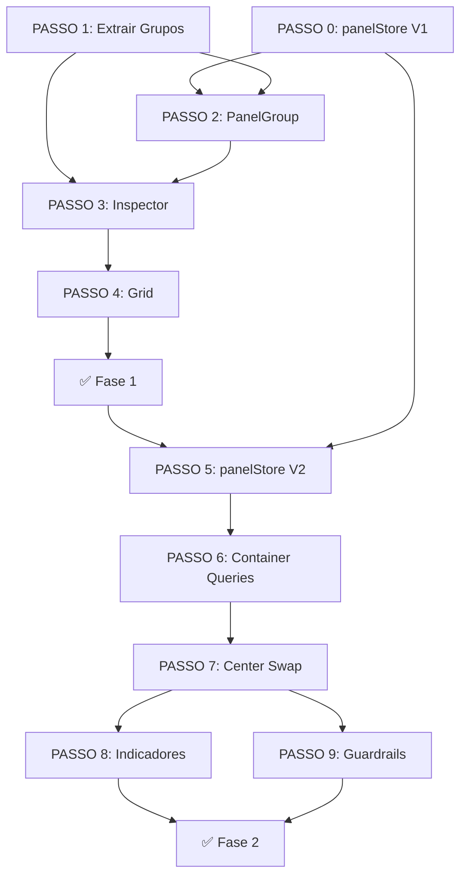

# SPEC-000 — Contrato de Integração (Como Casar Tudo)

**Épico**: UX-002 Panel System  
**Tipo**: Meta-Spec (governa a coesão entre SPECs 001–007)  
**Prioridade**: P-CRITICA (deve ser lida ANTES de implementar qualquer spec)  

---

## Motivação

As SPECs 001–007 foram escritas como unidades independentes. Implementá-las 
isoladamente introduziria **5 conflitos reais** e **3 inconsistências de design** 
que se tornariam dívida técnica permanente. Esta SPEC documenta cada conflito, 
resolve a decisão e define o **contrato de interface** entre as specs.

---

## 🔴 Conflito 1: Dono do Estado de Colapso

### O Problema

- **SPEC-002** diz que `PanelGroup` tem `defaultCollapsed` e estado **local** (`useState`)
- **SPEC-005** diz que `panelStore` tem `collapsedGroups: Set<PanelGroupId>` como estado **global**

Dois donos para o mesmo dado = dessincronização garantida.

### Decisão: panelStore é a Single Source of Truth (desde o início)

Antecipar o `panelStore` para a **Fase 1** (não esperar a Fase 2). Motivo:

1. O store é trivial — ~30 linhas de Zustand, zero risco
2. Se `PanelGroup` gerenciar colapso local na Fase 1, a Fase 2 precisará de uma **migração interna** de `useState` → `panelStore`, resquebrando a API de props
3. O `panelStore` pode ser criado na Fase 1 **sem** as actions de swap (`promoteToCenter`/`restoreMap`) — elas são adicionadas na Fase 2

### Contrato

```typescript
// Fase 1: panelStore MÍNIMO (apenas colapso)
interface PanelStateV1 {
  collapsedGroups: Set<PanelGroupId>;
  toggleCollapse: (id: PanelGroupId) => void;
}

// Fase 2: panelStore COMPLETO (colapso + swap)
interface PanelStateV2 extends PanelStateV1 {
  centerContent: 'map' | PanelGroupId;
  promoteToCenter: (groupId: PanelGroupId) => void;
  restoreMap: () => void;
}
```

**Impacto**: SPEC-002 muda — `PanelGroup` NÃO usa `useState`. Consome `useIsCollapsed(id)` do panelStore. A prop `defaultCollapsed` vira `initialCollapsed` e é usada como seed no panelStore na primeira montagem.

---

## 🔴 Conflito 2: PropertiesGroup — Cidadão de segunda classe

### O Problema

- **SPEC-003** diz: "PropertiesGroup NÃO usa PanelGroup wrapper — tem seu próprio header com botão ✕"
- **SPEC-006** diz: "PropertiesGroup pode ser promovido ao center via GROUP_REGISTRY"
- **SPEC-005** diz: "PanelGroupId = 'site' | 'simulation' | 'electrical' | 'properties'"

Se `properties` é um PanelGroupId registrado mas NÃO usa PanelGroup, o sistema 
de swap (SPEC-006) precisa de tratamento especial para ele. Isso é um code smell: 
exceções silenciosas geram bugs em features futuras.

### Decisão: PropertiesGroup USA PanelGroup — mas com variante contextual

O PropertiesGroup é wrappeado pelo `PanelGroup` como todos os outros, mas com 
comportamento especial via props:

```tsx
<PanelGroup 
  id="properties" 
  label="Propriedades" 
  icon={<Layers size={10} />}
  contextual              // ← NOVA PROP: só renderiza se há seleção
  onDismiss={clearSelection}  // ← NOVA PROP: botão ✕ ao invés de collapse
>
  <PropertiesGroup />
</PanelGroup>
```

**Novas props no PanelGroup:**

```typescript
interface PanelGroupProps {
  // ... props existentes ...
  
  /** Se true, o grupo inteiro só renderiza quando tem children com conteúdo.
   *  Usado pelo PropertiesGroup que depende de seleção. */
  contextual?: boolean;
  
  /** Se definido, mostra botão ✕ no header ao invés de chevron de colapso.
   *  Usado pelo PropertiesGroup para limpar seleção. */
  onDismiss?: () => void;
}
```

**Impacto**: SPEC-002 ganha 2 props. SPEC-003 muda — PropertiesGroup agora usa PanelGroup. SPEC-006 simplifica — GROUP_REGISTRY funciona uniformemente sem exceções.

---

## 🔴 Conflito 3: React.memo do CenterCanvas vs useCenterContent

### O Problema

- `CenterCanvas` é exportado com `React.memo()` para performance de GPU
- SPEC-006 adiciona `useCenterContent()` dentro do CenterCanvas
- `React.memo` compara **props** (que são zero). Mas `useCenterContent()` é um hook Zustand que bypassa memo e forçar re-render quando o store muda

Isso é correto — hooks internos re-renderizam independente de memo. Mas é 
**sutil**: um dev futuro pode mover o hook para props e quebrar o memo.

### Decisão: Documentar com comentário explicativo + extrair MapLayer

```tsx
// CenterCanvas.tsx — o React.memo protege contra re-renders por props do pai.
// O hook useCenterContent() é intencional: only triggers re-render on swap events
// (raros), não em cada interação do mapa. Performance OK.
export const CenterCanvas = React.memo(CenterCanvasInner);
```

Adicionalmente, extrair o bloco do mapa para um sub-componente memoizado:

```tsx
const MapLayer = React.memo(() => (
  <>
    <MapCore activeTool={useActiveTool()} />
    <WebGLOverlay />
  </>
));
```

Isso garante que o MapLayer **nunca** re-renderiza por causa de swap events.

---

## 🟡 Conflito 4: Leaflet invalidateSize() na restauração

### O Problema

SPEC-006 diz: "Ao restaurar, invalidateSize() é chamado". Mas **quem** chama? 
O MapCore é um componente React que wrappeia Leaflet. Ele não expõe `invalidateSize()` 
publicamente.

### Decisão: useEffect no MapCore que observa visibilidade

```typescript
// Dentro do MapCore.tsx — auto-invalidate quando visibilidade muda
useEffect(() => {
  const mapInstance = mapRef.current;
  if (!mapInstance) return;
  
  const observer = new IntersectionObserver(
    ([entry]) => {
      if (entry.isIntersecting) {
        // Leaflet precisa recalcular tamanho após display:none → block
        setTimeout(() => mapInstance.invalidateSize(), 50);
      }
    },
    { threshold: 0.1 }
  );
  
  const container = mapInstance.getContainer();
  if (container) observer.observe(container);
  return () => observer.disconnect();
}, []);
```

**Impacto**: SPEC-006 não precisa se preocupar com invalidateSize — o MapCore é auto-suficiente. Zero acoplamento entre CenterCanvas e MapCore.

---

## 🟡 Conflito 5: Grupos renderizados em 2 contextos diferentes

### O Problema

SPEC-006 usa um `GROUP_REGISTRY` para renderizar grupos no center:
```tsx
<GroupComponent />  // No center, dentro de PromotedPanelView
```

Mas os mesmos componentes são renderizados no dock pelo RightInspector:
```tsx
<PanelGroup id="simulation" ...>
  <SimulationGroup />  // No dock, dentro de PanelGroup wrapper
</PanelGroup>
```

Os grupos são desenhados para **300px de largura** no dock. No center, eles 
terão **~70% do viewport** (ex: 1000px+). Se os componentes usam `w-full`, 
os layouts vão se esticar e ficar feios.

### Decisão: Layout Mode via prop ou CSS container query

Cada grupo recebe uma prop `layout` (ou detecta via container query):

```tsx
type PanelLayout = 'compact' | 'expanded';

// Opção A: prop explícita
<SimulationGroup layout="expanded" />  // No center
<SimulationGroup layout="compact" />   // No dock

// Opção B: CSS Container Query (preferido, zero props)
// O PanelGroup e o PromotedPanelView definem @container
```

**Recomendação**: Usar **CSS Container Queries**. Motivo:
1. Zero props a mais — componentes não sabem onde estão renderizados
2. O CSS adapta automaticamente (ex: grid de consumo mensal de 2 colunas → 4 colunas)
3. Suporte de browser: Chrome 105+, Safari 16+ (nossos targets)

```css
/* Dentro do PanelGroup wrapper — dock */
.panel-group-content {
  container-type: inline-size;
  container-name: panel;
}

/* Dentro do PromotedPanelView — center */
.promoted-content {
  container-type: inline-size;
  container-name: panel;
}

/* Dentro dos grupos: */
@container panel (min-width: 500px) {
  .consumption-grid { grid-template-columns: repeat(4, 1fr); }
  .bar-chart-wrapper { height: 280px; }
}
@container panel (max-width: 499px) {
  .consumption-grid { grid-template-columns: repeat(2, 1fr); }
  .bar-chart-wrapper { height: 140px; }
}
```

**Impacto**: SPEC-001 (grupos) ganha classes de container query. SPEC-002 (PanelGroup) adiciona `container-type`. SPEC-006 (PromotedPanelView) adiciona `container-type`.

---

## 🟢 Inconsistência de Design 1: Exportação API Snapshot

### O Problema

O `TopRibbon` tem um botão "Exportar API" que captura screenshot do `#engineering-viewport` 
via html2canvas. O `#engineering-viewport` é o grid area `canvas`. Se o canvas estiver 
mostrando um painel (não o mapa), o screenshot vai capturar o **painel**, não o mapa.

### Decisão: Exportação força restauração do mapa

```typescript
// No TopRibbon, botão Exportar:
const handleExport = async () => {
  // Garante que o mapa está visível antes de capturar
  if (usePanelStore.getState().centerContent !== 'map') {
    usePanelStore.getState().restoreMap();
    await new Promise(r => setTimeout(r, 300)); // Aguarda Leaflet re-render
  }
  // ... captura snapshot normalmente
};
```

---

## 🟢 Inconsistência de Design 2: Atalho Escape

### O Problema

SPEC-006 define `Escape` para restaurar mapa. Mas `Escape` já é usado pelo 
`PropRowEditable` (shared.tsx L78-82) para cancelar edição inline.

### Decisão: Escape só restaura mapa se nenhum input está em foco

```typescript
useEffect(() => {
  const handler = (e: KeyboardEvent) => {
    if (e.key === 'Escape' && document.activeElement?.tagName !== 'INPUT') {
      restoreMap();
    }
  };
  window.addEventListener('keydown', handler);
  return () => window.removeEventListener('keydown', handler);
}, []);
```

---

## 🟢 Inconsistência de Design 3: WebGL frameloop durante swap

### O Problema

SPEC-006 diz: "R3F frameloop muda para 'never' quando mapa oculto". Mas o 
`frameloop` é uma prop do `<Canvas>` que **não pode ser alterada dinamicamente** 
no React Three Fiber v8+. Mudar requer remount do Canvas.

### Decisão: Não mudar o frameloop — usar `invalidate()` gate

O `frameloop="demand"` já é o correto. Nesse modo, R3F só renderiza quando 
`invalidate()` é chamado. Como nenhum componente chama `invalidate()` quando 
o mapa está oculto (`display: none`), a GPU automaticamente fica idle.

**Remover** a linha da tabela da SPEC-006 sobre `frameloop="never"`. O 
comportamento correto já acontece naturalmente.

---

## Sequência de Implementação Revisada

Com as decisões acima, a sequência de execução muda:

```
┌─────────────────────────────────────────────────┐
│ PASSO 0: panelStore MÍNIMO (colapso only)       │  ← Antecipado da Fase 2
│          Arquivo: panelStore.ts (V1)             │
├─────────────────────────────────────────────────┤
│ PASSO 1: Extrair grupos (SPEC-001)              │  ← Sem mudanças
│          Arquivos: groups/*.tsx                   │
├─────────────────────────────────────────────────┤
│ PASSO 2: PanelGroup container (SPEC-002)        │  ← Revisado: con consume panelStore
│          Arquivo: PanelGroup.tsx                  │     + props contextual/onDismiss
├─────────────────────────────────────────────────┤
│ PASSO 3: Inspector orquestrador (SPEC-003)      │  ← Revisado: Properties usa PanelGroup
│          Arquivo: RightInspector.tsx              │
├─────────────────────────────────────────────────┤
│ PASSO 4: Grid simplificado (SPEC-004)           │  ← Sem mudanças
│          Arquivo: WorkspaceLayout.tsx             │
├───────────────────────────── checkpoint──────────┤
│                 ✅ FASE 1 COMPLETA               │
│                 🔒 TSC + Visual QA               │
├─────────────────────────────────────────────────┤
│ PASSO 5: panelStore V2 (swap actions) (SPEC-005)│  ← Extensão, não reescrita
│          Arquivo: panelStore.ts (V2)             │
├─────────────────────────────────────────────────┤
│ PASSO 6: Container queries nos grupos           │  ← NOVO: prepara layout flexível
│          Arquivos: groups/*.tsx + index.css       │
├─────────────────────────────────────────────────┤
│ PASSO 7: Center Slot swap (SPEC-006)            │  ← Sem mudanças conceituais
│          Arquivo: CenterCanvas.tsx               │
├─────────────────────────────────────────────────┤
│ PASSO 8: Indicadores visuais (SPEC-007)         │  ← Sem mudanças
│          Arquivos: RightInspector + TopRibbon     │
├─────────────────────────────────────────────────┤
│ PASSO 9: Guardrails (Escape, Export, Leaflet)   │  ← NOVO: correções cross-cutting
│          Arquivos: TopRibbon, MapCore             │
├─────────────────────────────checkpoint──────────┤
│                 ✅ FASE 2 COMPLETA               │
│                 🔒 TSC + Visual QA + Swap QA     │
└─────────────────────────────────────────────────┘
```

---

## Mapa de Dependências (DAG)



---

## Checklist de Dívida Técnica Evitada

| # | Dívida que seria criada | Decisão que a previne |
|---|------------------------|----------------------|
| 1 | Estado de colapso duplicado (local + store) | panelStore desde Fase 1 |
| 2 | PropertiesGroup como exceção no registry | PropertiesGroup usa PanelGroup com props `contextual`/`onDismiss` |
| 3 | Layout fixo de 300px nos grupos promovidos | CSS Container Queries adaptam automaticamente |
| 4 | invalidateSize() chamado manualmente | IntersectionObserver no MapCore (auto) |
| 5 | frameloop hack impossível | Removido — demand mode já funciona |
| 6 | Escape conflita com edição inline | Guard: só quando nenhum input está em foco |
| 7 | Export captura painel ao invés de mapa | restoreMap() antes de html2canvas |
| 8 | React.memo quebra com hook interno | MapLayer memoizado separadamente |
