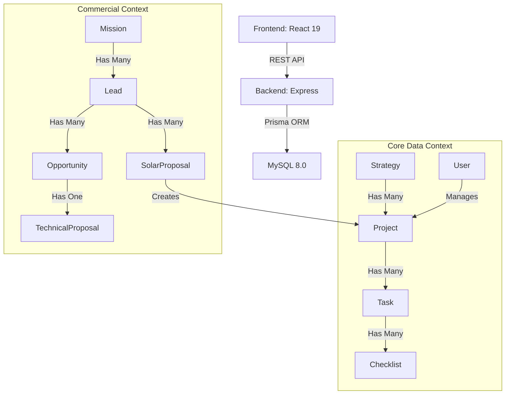

# CONTEXT.md - Sistema NEONORTE NEXUS

> **Última Atualização:** 2026-01-26
> **Arquiteto:** Antigravity AI
> **Versão do Sistema:** 2.2.0 (Neonorte | Nexus SQL - Commercial Expansion)

---

## 📋 VISÃO GERAL

**NEXUS** é um ecossistema **ERP/Gestão** robusto projetado para o setor de energia solar, focado na orquestração de estratégia, tática e operacional. O sistema foi otimizado para eliminar complexidade acidental, mantendo foco estrito na execução de projetos e estratégias.

### Domínio de Negócio

- **Setor:** Energia Solar & Gestão Estratégica
- **Usuários:** Colaboradores, Gestores (COORD), e Administradores (ADMIN).
- **Missão:** Transformar estratégias macro em ações táticas (projetos) e operações detalhadas (tarefas/checklists).

---

## 🏗️ ARQUITETURA DO SISTEMA (NEXUS 2.2)

### Stack Tecnológico

#### **Backend**

- **Runtime:** Node.js 18/20
- **Framework:** Express.js (Universal Controller Pattern)
- **ORM:** Prisma 5.10+
- **Database:** MySQL 8.0 (Dockerizado ou Hospedagem Hostinger)
- **Segurança:** Autenticação via `/auth/login` e validação Zod.

#### **Frontend**

- **Framework:** React 19.2 / Vite
- **Linguagem:** TypeScript (Strict Mode)
- **Estilização:** TailwindCSS
- **Bibliotecas Especializadas:**
  - Leaflet 1.9.4 (mapas - módulo Solar)
  - @geoman-io/leaflet-geoman-free (desenho de polígonos)
  - Frappe Gantt (timelines)
  - Recharts (gráficos)
  - jspdf + html2canvas (geração de PDF)

#### **Infraestrutura**

- Docker (desenvolvimento e produção)
- MySQL 8.0
- Hostinger (produção)

---

## 🧩 MÓDULOS INTEGRADOS

### 🌞 Solar (INTEGRADO - 2026-01-20)

**Localização:** `nexus-monolith/frontend/src/modules/solar/`

**Descrição:** Sistema completo de propostas fotovoltaicas com wizard de 6 etapas, mapeamento via Leaflet, cálculos de dimensionamento, seleção de equipamentos e geração de PDF.

**Persistência:** `SolarProposal.proposalData` (JSON com validação Zod obrigatória)

**Segurança:**

- ✅ Validação Zod
- ✅ RBAC (controle por papel)
- ✅ Auditoria (AuditLog registra todas as mudanças)
- ✅ Proteção CVE-2025-55182 (serialização segura)

**Status:** ✅ Operacional em produção

### 💼 Commercial (EXPANDIDO - 2026-01-26)

**Localização:** `nexus-monolith/frontend/src/views/commercial/`

**Descrição:** Sistema completo de CRM com gestão de leads, oportunidades, missões comerciais e propostas técnicas.

**Entidades Principais:**

- **Lead:** Contatos de pré-venda com scoring e qualificação
- **Mission:** Campanhas regionais com metas e gamificação
- **Opportunity:** Funil de vendas com 8 estágios
- **TechnicalProposal:** Propostas técnicas validadas por engenharia
- **SolarProposal:** Propostas fotovoltaicas completas

**Features:**

- Pipeline Kanban drag-and-drop
- Mission Control (metas e gamificação)
- Solar Wizard (geração de propostas)
- Lead scoring automático
- Validação "Sem Jeitinho" (guardrails de qualidade)

**Status:** ✅ Operacional em produção

### ⚙️ Operations (CORE - 2026-01-23)

**Localização:** `nexus-monolith/frontend/src/modules/ops/`

**Descrição:** Gestão completa do ciclo de vida de projetos, desde planejamento estratégico até execução tática.

**Features:**

- Project Cockpit (visão micro)
- Kanban Board (execução diária)
- Gantt Matrix (cronograma mestre)
- Strategy Review (alinhamento OKRs)

**Status:** ✅ Operacional em produção

### 🎯 Strategy (CORE - 2026-01-20)

**Localização:** `nexus-monolith/frontend/src/modules/strategy/`

**Descrição:** Gestão de estratégias organizacionais (OKRs, PPAs) com hierarquia e key results.

**Status:** ✅ Operacional em produção

### 🎓 Academy (PLANEJADO)

**Localização:** `nexus-monolith/frontend/src/views/academy/`

**Descrição:** Plataforma de treinamento e capacitação interna.

**Status:** 🚧 Em desenvolvimento

### 👥 IAM (Identity & Access Management)

**Localização:** `nexus-monolith/backend/src/modules/iam/`

**Descrição:** Gestão de usuários, permissões e hierarquia organizacional.

**Status:** ✅ Operacional

---

## 🗄️ SCHEMA DE BANCO DE DADOS (PRISMA)

### Entidades Core

#### **1. User & Hierarchy**

Gerencia autenticação e subordinação direta.

- **Roles:** `ADMIN`, `COORDENACAO`, `VENDEDOR`, etc.
- **Atributos:** `username`, `password`, `role`, `supervisorId`, `orgUnitId`
- **Relações:** `supervisor`, `subordinates`, `leadsOwned`, `missionsCoordinated`

#### **2. Strategy (PPA)**

O "Cérebro" do sistema. Define objetivos macro.

- **Atributos:** `code`, `title`, `colorCode`, `startDate`, `endDate`, `type`
- **Hierarquia:** Suporta estratégias aninhadas via `parentId`
- **Filhos:** `KeyResult` (Métricas quantitativas), `Project` (Táticas)

#### **3. Project (Tático)**

Container de trabalho vinculado a uma estratégia.

- **Tipos:** `GENERIC`, `SOLAR`, `INFRASTRUCTURE`
- **Atributos:** `title`, `status`, `progressPercentage`, `details` (JSON)
- **Relações:** `strategy`, `manager`, `tasks`, `risks`, `proposal`

#### **4. OperationalTask (Operacional)**

Unidade mínima de trabalho com suporte a recorrência e dependências.

- **Atributos:** `title`, `status`, `assignedTo`, `completionPercent`, `isMilestone`
- **Features:** Recorrência, dependências (FS/SS), checklists, tags
- **Relações:** `project`, `assignee`, `predecessors`, `successors`, `checklists`

#### **5. Lead (Comercial)**

Contatos de pré-venda com scoring e qualificação.

- **Atributos:** `name`, `email`, `phone`, `status`, `source`, `engagementScore`
- **Enriquecimento:** `city`, `state`, `academyScore`, `technicalProfile`
- **Relações:** `owner`, `mission`, `proposals`, `opportunities`, `interactions`

#### **6. Mission (Comercial)**

Campanhas regionais com metas e gamificação.

- **Atributos:** `name`, `region`, `regionPolygon`, `startDate`, `endDate`, `status`
- **Relações:** `coordinator`, `leads`, `opportunities`

#### **7. Opportunity (Comercial)**

Funil de vendas com 8 estágios.

- **Status:** `LEAD_QUALIFICATION` → `VISIT_SCHEDULED` → `TECHNICAL_VISIT_DONE` → `PROPOSAL_GENERATED` → `NEGOTIATION` → `CONTRACT_SENT` → `CLOSED_WON`/`CLOSED_LOST`
- **Atributos:** `title`, `estimatedValue`, `probability`
- **Relações:** `lead`, `mission`, `technicalProposal`

#### **8. TechnicalProposal (Comercial)**

Propostas técnicas validadas por engenharia.

- **Atributos:** `kitData`, `consumptionAvg`, `infrastructurePhotos`, `paybackData`, `validatedByEng`
- **Relações:** `opportunity`

#### **9. SolarProposal (Solar)**

Propostas fotovoltaicas completas.

- **Atributos:** `name`, `status`, `totalValue`, `systemSize`, `paybackYears`, `monthlySavings`
- **Persistência:** `proposalData` (JSON com dossiê técnico completo)
- **Relações:** `lead`, `project`

---

## 🛣️ ROTAS DA API

O Neonorte | Nexus 2.2 utiliza um **Universal CRUD Controller** para a maioria dos recursos, permitindo escalabilidade rápida.

### Autenticação

- `POST /auth/login` - Login de usuário

### Universal CRUD

- `[GET|POST|PUT|DELETE] /api/:resource` - CRUD genérico
  - `:resource` mapeia dinamicamente para modelos Prisma
  - Exemplos: `users`, `projects`, `strategies`, `leads`, `opportunities`

### Módulos Especializados

#### Commercial

- `GET /api/commercial/missions` - Listar missões
- `POST /api/commercial/missions` - Criar missão
- `GET /api/commercial/leads` - Listar leads
- `PATCH /api/commercial/leads/:id/score` - Atualizar scoring
- `GET /api/commercial/opportunities` - Listar oportunidades
- `PATCH /api/commercial/opportunities/:id/stage` - Mover estágio

#### Solar

- `POST /api/solar/proposals` - Criar proposta
- `GET /api/solar/proposals/:id` - Buscar proposta
- `PATCH /api/solar/proposals/:id` - Atualizar proposta
- `POST /api/solar/proposals/:id/generate-pdf` - Gerar PDF

#### Operations

- `GET /api/ops/projects` - Listar projetos
- `GET /api/ops/projects/:id` - Buscar projeto
- `POST /api/ops/tasks` - Criar tarefa
- `PATCH /api/ops/tasks/:id` - Atualizar tarefa
- `POST /api/ops/tasks/:id/dependencies` - Criar dependência

---

## 🔐 SEGURANÇA & SEGREDOS

### Princípios de Segurança

1. **Validação Zod Mandatória:** Toda entrada de dados deve ser validada na fronteira do protocolo
2. **Proteção CVE-2025-55182:** Serialização segura em Server Actions (React 19)
3. **RBAC:** Controle de acesso baseado em papéis
4. **Auditoria:** Registro completo de ações via `AuditLog`
5. **Multi-Tenancy:** Isolamento de dados via `tenantId`

### Gestão de Segredos

- **Desenvolvimento:** Arquivos `.env` (não versionados)
- **Produção:** Docker Environment Variables
- **Senhas:** Hashing via `bcrypt`
- **Tokens:** JWT com expiração configurável

---

## 🚀 AMBIENTE DOCKER

Neonorte | Nexus 2.2 é totalmente containerizado para desenvolvimento e produção:

- **`nexus_db`:** MySQL 8.0
- **`nexus_backend`:** Node API (Express)
- **`nexus_frontend`:** React Dev Server (Vite)

> [!IMPORTANT]
> A URL de conexão interna no Docker entre Backend e MySQL utiliza o hostname `mysql` definido no `docker-compose.yml`.

---

## 📊 PADRÕES ARQUITETURAIS

### Fluxo de Dados

### Event-Driven Architecture

O sistema utiliza eventos para orquestrar ações entre módulos:

- **Deal Won:** Cria projeto automaticamente em Operations
- **Lead Scored:** Atualiza prioridade no pipeline
- **Task Completed:** Recalcula progresso do projeto
- **Proposal Approved:** Dispara criação de oportunidade

---

## 📚 DOCUMENTAÇÃO ADICIONAL

Para informações detalhadas sobre arquitetura, decisões técnicas e guias de desenvolvimento, consulte:

- **ADRs:** `nexus-monolith/docs/adr/`
- **Mapas de Interface:** `nexus-monolith/docs/map_nexus_monolith/`
- **Guias:** `nexus-monolith/docs/guides/`
- **Segurança:** `nexus-monolith/docs/security/`

---

## 🔄 CHANGELOG

### v2.2.0 (2026-01-26)

- ✅ Expansão do módulo Commercial (Mission, Opportunity, TechnicalProposal)
- ✅ Implementação de Lead Scoring
- ✅ Validação "Sem Jeitinho" (guardrails de qualidade)
- ✅ Mission Control com gamificação
- ✅ Navegação dinâmica (NavigationGroup, NavigationItem)

### v2.1.0 (2026-01-23)

- ✅ Migração para TypeScript Strict Mode
- ✅ Refatoração de Layouts (Neonorte | Nexus View Standard 2.0)
- ✅ Otimização de queries do banco de dados
- ✅ Auditoria de lógica de negócio

### v2.0.0 (2026-01-20)

- ✅ Integração do módulo Solar
- ✅ Implementação de Universal CRUD Controller
- ✅ Migração para Prisma ORM
- ✅ Containerização completa via Docker
