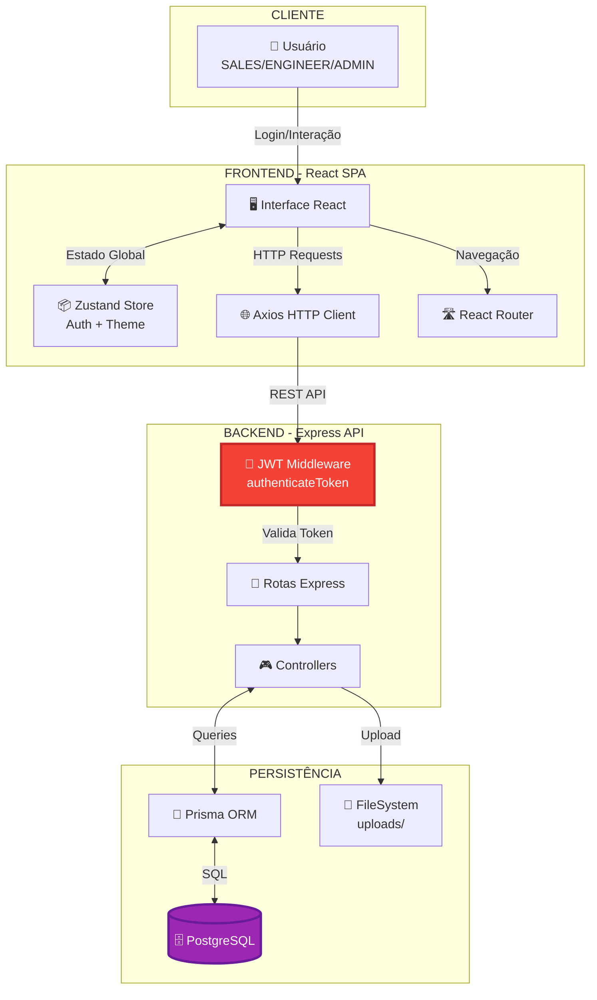
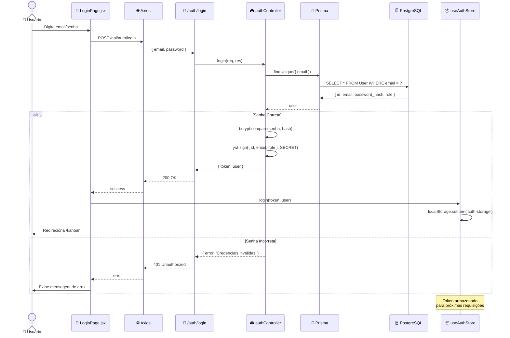
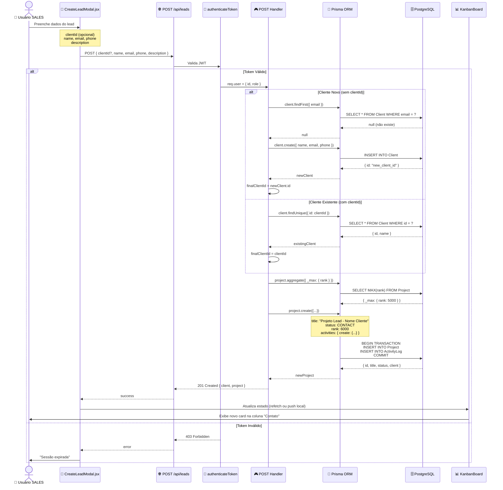
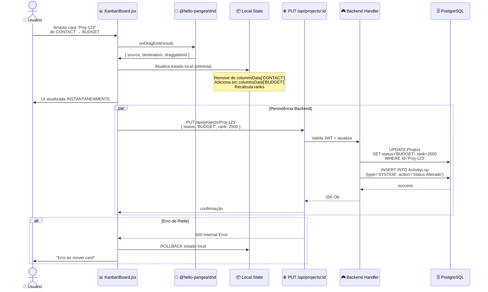
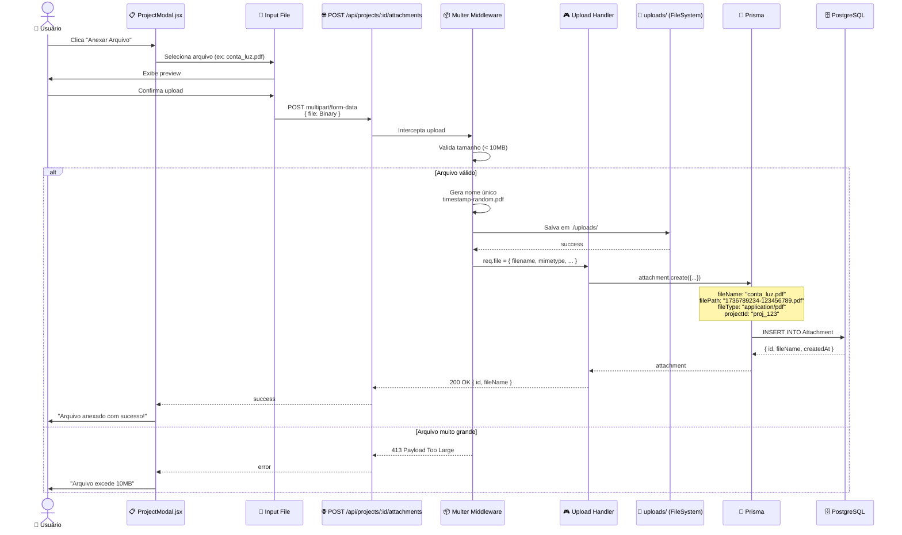
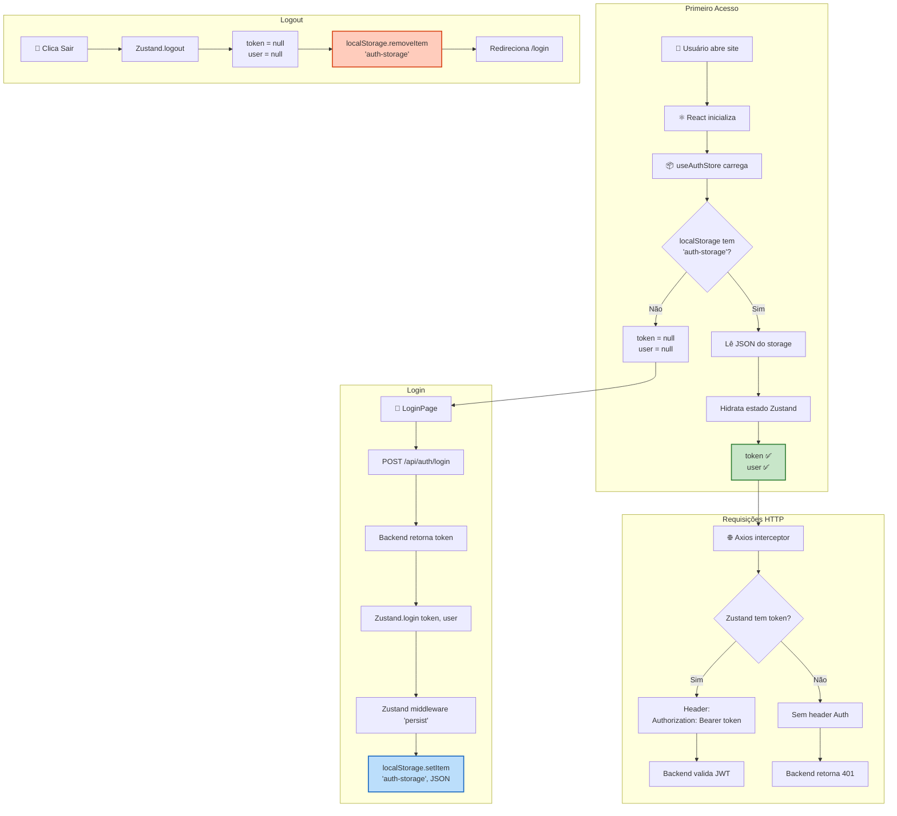
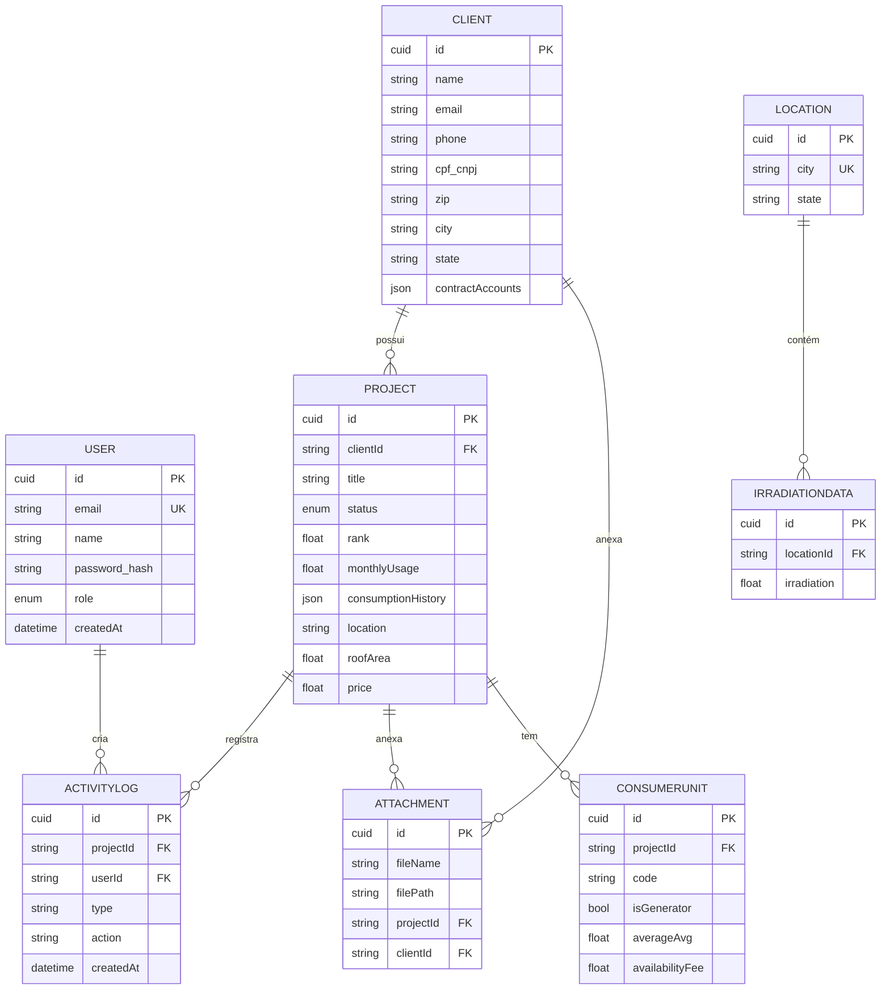
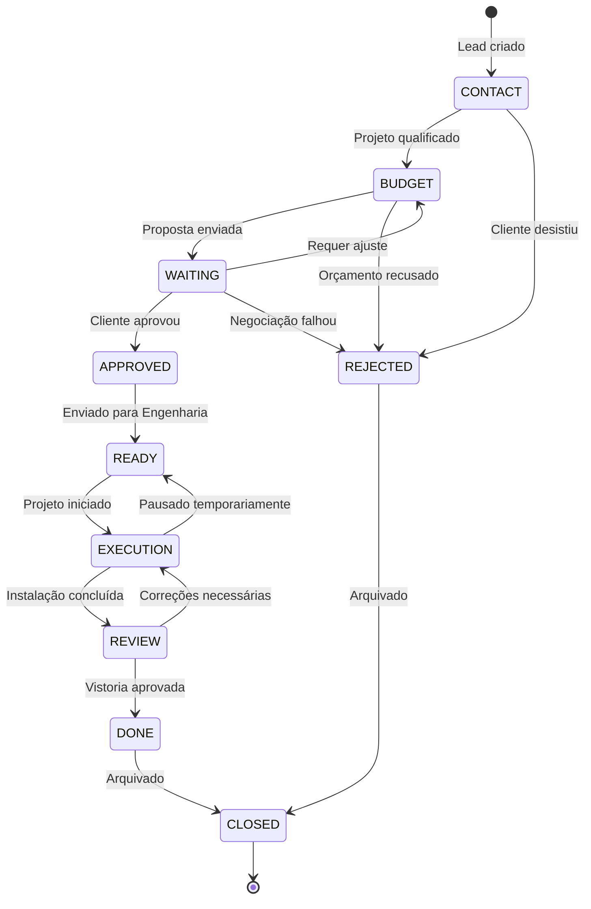

# DFD.md - Data Flow Diagrams - Sistema NEONORTE NEXUS

> **Última Atualização:** 2026-01-15  
> **Arquiteto:** Tecnologia Neonorte

---

## 📊 VISÃO GERAL

Este documento apresenta os **Diagramas de Fluxo de Dados (DFD)** do sistema NEXUS, visualizando como os dados transitam entre Cliente, Frontend, Backend e Banco de Dados. Os diagramas foram criados usando **Mermaid**.

---

## 🏗️ ARQUITETURA GERAL DO SISTEMA



---

## 🔐 FLUXO 1: AUTENTICAÇÃO JWT



---

## 📋 FLUXO 2: CRIAÇÃO DE LEAD



---

## 🎯 FLUXO 3: KANBAN DRAG & DROP



---

## 📤 FLUXO 4: UPLOAD DE ARQUIVOS



---

## 🔄 FLUXO 5: SINCRONIZAÇÃO DE ESTADO (Zustand + LocalStorage)



---

## 🗺️ MAPA DE ENTIDADES E RELACIONAMENTOS (ERD)



---

## 🎭 DIAGRAMA DE ESTADOS DO PROJETO



---

## ⚡ FLUXO COMPLETO SIMPLIFICADO

```mermaid
flowchart TD
    START([👤 Usuário acessa /kanban]) --> LOGIN{Autenticado?}
    LOGIN -->|Não| REDIR[Redireciona /login]
    LOGIN -->|Sim| LOAD[Carrega projetos<br/>GET /api/projects]

    LOAD --> KANBAN[Exibe Kanban Board]
    KANBAN --> ACTION{Ação do usuário}

    ACTION -->|Novo Lead| MODAL1[CreateLeadModal]
    MODAL1 --> POST1[POST /api/leads]
    POST1 --> DB1[(Cria Client + Project)]
    DB1 --> REFRESH1[Atualiza UI]

    ACTION -->|Abrir Projeto| MODAL2[ProjectModal]
    MODAL2 --> VIEW[Exibe dados do projeto e anexos]
    VIEW --> UPLOAD[Upload de Arquivos]

    ACTION -->|Mover Card| DRAG[Drag & Drop]
    DRAG --> UPDATE[PUT /api/projects/:id<br/>{ status, rank }]
    UPDATE --> DB2[(Atualiza Project)]
    DB2 --> REFRESH2[Atualiza UI]

    REFRESH1 --> KANBAN
    REFRESH2 --> KANBAN
    UPLOAD --> MODAL2

    style DB1 fill:#9c27b0,stroke:#6a1b9a,stroke-width:2px,color:#fff
    style DB2 fill:#9c27b0,stroke:#6a1b9a,stroke-width:2px,color:#fff
```
