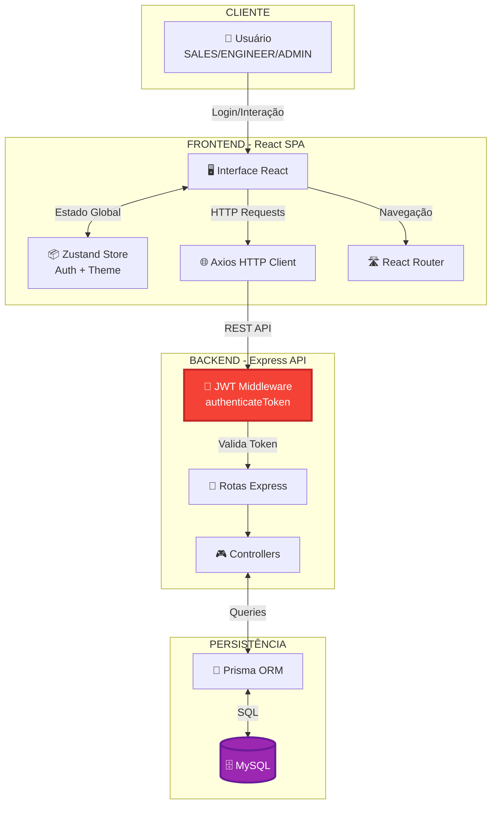
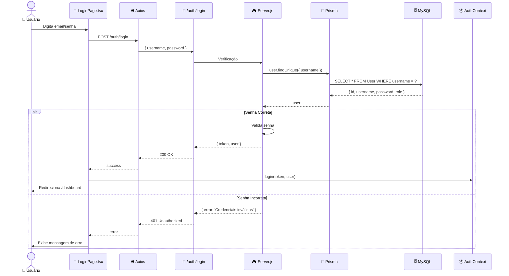
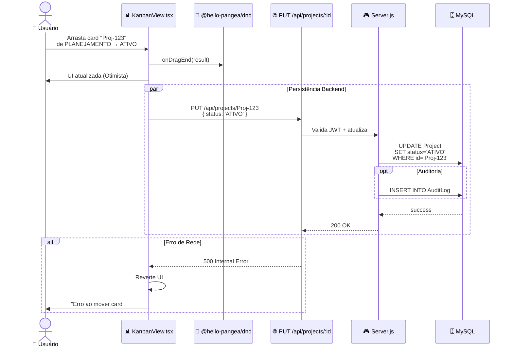
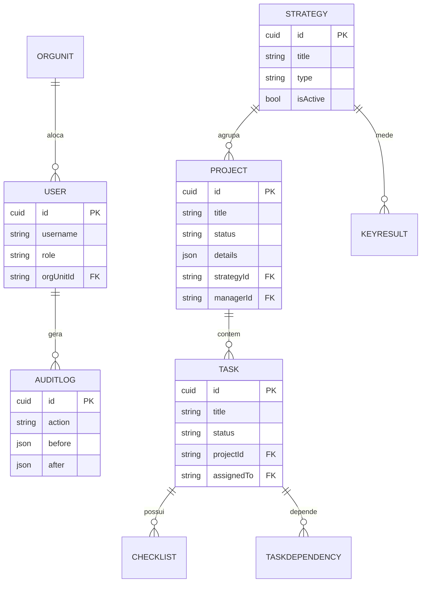
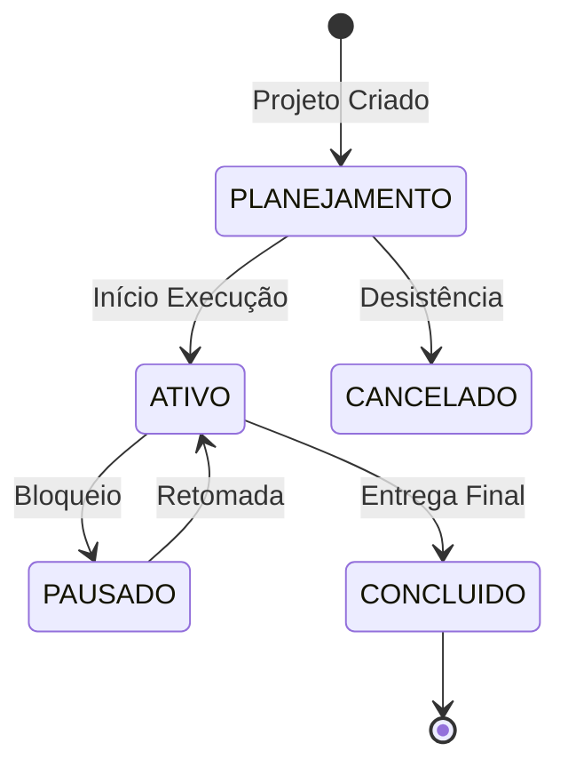

# DFD.md - Data Flow Diagrams - Sistema NEONORTE NEXUS

> **Última Atualização:** 2026-01-23
> **Arquiteto:** Antigravity AI
> **Status:** Atualizado Pós-Purge

---

## 📊 VISÃO GERAL

Este documento apresenta os **Diagramas de Fluxo de Dados (DFD)** do sistema NEXUS, visualizando como os dados transitam entre Cliente, Frontend, Backend e Banco de Dados.

---

## 🏗️ ARQUITETURA GERAL DO SISTEMA

---

## 🔐 FLUXO 1: AUTENTICAÇÃO JWT

---

## 🎯 FLUXO 2: GESTÃO DE PROJETOS (KANBAN)

---

## 🗺️ MAPA DE ENTIDADES REAL (ERD)

---

## 🎭 DIAGRAMA DE ESTADOS DO PROJETO

