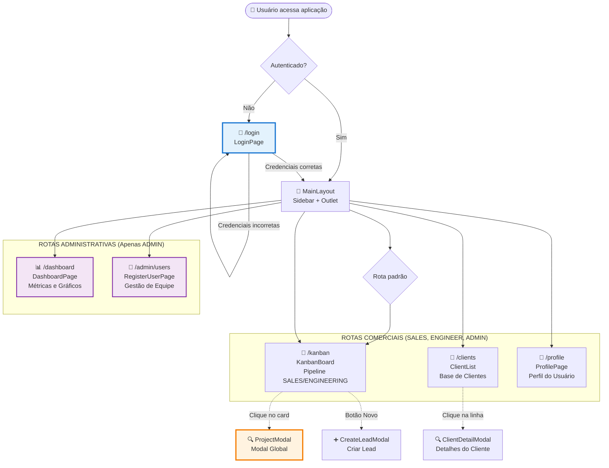

# INTERFACE_MAP.md - Mapa de Interface - Sistema NEONORTE NEXUS

> **Última Atualização:** 2026-01-15  
> **Arquiteto:** Tecnologia Neonorte  
> **Versão:** 1.1.0 (Lean CRM)

---

## 📋 VISÃO GERAL

Este documento mapeia **TODA a interface do usuário** do sistema NEXUS, incluindo estruturas de navegação e componentes principais.

---

## 🗺️ MAPA DE NAVEGAÇÃO



---

## 🧭 SIDEBAR - Navegação Principal

### Sidebar.jsx

**Seções:**

#### 1. **Navegação Principal**

- 🎯 **Quadro Kanban** (`/kanban`)
- 👥 **Base de Clientes** (`/clients`)
- 📊 **Dashboard** (`/dashboard`) - ADMIN only

#### 2. **Navegação Admin** (ADMIN only)

- 👥 **Gestão de Equipe** (`/admin/users`)

#### 3. **Sistema**

- 🌙 **Alternar Tema**
- **Perfil do Usuário**

---

## 📄 PÁGINAS PRINCIPAIS

### 1. 🔑 LoginPage - Autenticação

**Rota:** `/login`

### 2. 🎯 KanbanBoard - Pipeline de Projetos

**Rota:** `/kanban`

**Pipelines:**

- **COMERCIAL:** Contact -> Proposal -> Budget -> Waiting -> Approved/Rejected
- **ENGENHARIA:** Ready -> Execution -> Review -> Done/Closed

**Modais:**

- `ProjectModal` (Detalhes)
- `CreateLeadModal` (Novo Lead)

### 3. 👥 ClientList - Base de Clientes

**Rota:** `/clients`

- Lista com busca e filtros.
- Abre `ClientDetailModal`.

### 4. 📊 DashboardPage - Métricas (ADMIN)

**Rota:** `/dashboard`

- KPIs: Projetos Totais, Pipeline, Conversão.
- Gráficos de Status.

### 5. 👥 RegisterUserPage - Gestão de Equipe (ADMIN)

**Rota:** `/admin/users`

- CRUD de usuários.

---

## 🪟 MODAIS E OVERLAYS

### ProjectModal - Modal Detalhado de Projeto

**Estrutura Simplificada (Lean):**

```
┌──────────────────────────────────────────────┐
│ [Visão Geral] [Anexos]                    🗑️ │
├──────────────────────────────────────────────┤
│                                              │
│  (Conteúdo da aba ativa)                     │
│                                              │
└──────────────────────────────────────────────┘
```

#### **Aba 1: Visão Geral**

- **Dados do Projeto:** Título, Cliente, Status, Valor (Input manual).
- **Dados Técnicos (Opcional):** Consumo médio (Input manual), Localização.
- **Timeline:** Histórico de atividades (`ActivityLog`).
- **Notas:** Adicionar comentários.

#### **Aba 2: Anexos**

- **Upload:** Enviar arquivos (PDF, Imagens).
- **Lista:** Visualizar e excluir anexos.

---

### CreateLeadModal

- Cria Lead selecionando cliente existente ou cadastrando novo.

### ClientDetailModal

- Edita dados cadastrais do cliente (Nome, Email, Telefone, Endereço).
- Visualiza lista de projetos do cliente.

---

## 🎨 DESIGN SYSTEM

### Paleta de Cores (Tailwind/Neon)

- Background: `#0a0a0b`
- Surface: `#141416`
- Primary: `#ffffff`
- Accents: Neon Purple (`#a78bfa`), Neon Green (`#10b981`)
