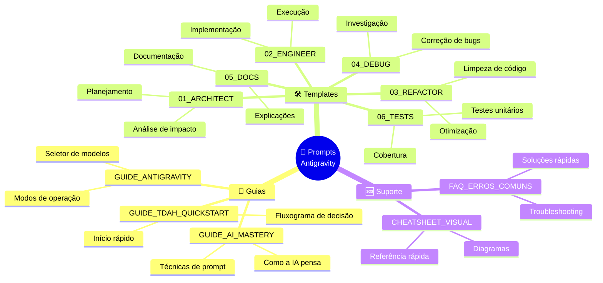
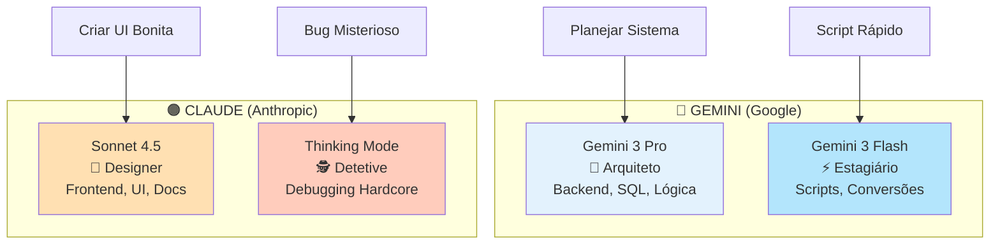
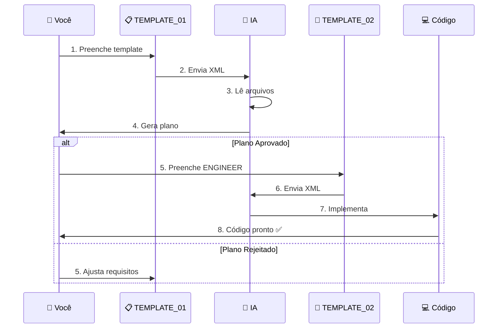

# 🎨 Cheatsheet Visual: Referência Rápida

> **📍 VOCÊ ESTÁ AQUI:** 🏠 [Início](./) > 🆘 Suporte > 🎨 Cheatsheet Visual  
> **🎯 OBJETIVO:** Consulta instantânea quando você esqueceu algo  
> **⏱️ TEMPO:** Encontre o que precisa em **menos de 10 segundos**  
> **🛠️ USO:** Imprima e cole na parede ou salve nos favoritos!

**💡 DICA:** Use Ctrl+F para buscar rapidamente nesta página.

---

## 🗺️ Mapa Mental: Ecossistema de Templates



---

## 🎯 Decisão Rápida: Qual Template?

### **Por Situação**

| Você Está...              | Use                     | Tempo Estimado |
| ------------------------- | ----------------------- | -------------- |
| 💡 Começando algo novo    | `TEMPLATE_01_ARCHITECT` | 3-5 min        |
| ✅ Com plano aprovado     | `TEMPLATE_02_ENGINEER`  | 1 min          |
| 🧹 Limpando código feio   | `TEMPLATE_03_REFACTOR`  | 2 min          |
| 🐛 Caçando um bug         | `TEMPLATE_04_DEBUG`     | 2-3 min        |
| 📖 Explicando para outros | `TEMPLATE_05_DOCS`      | 2 min          |
| 🧪 Garantindo qualidade   | `TEMPLATE_06_TESTS`     | 2 min          |

### **Por Emoção** (TDAH Friendly)

| Como Você Se Sente            | Template       | Por Quê              |
| ----------------------------- | -------------- | -------------------- |
| 😰 "Não sei por onde começar" | `01_ARCHITECT` | Ele organiza o caos  |
| 🚀 "Quero ver código AGORA"   | `02_ENGINEER`  | Mas só DEPOIS do 01! |
| 😤 "Esse código tá horrível"  | `03_REFACTOR`  | Terapia para código  |
| 😵 "WTF está acontecendo?!"   | `04_DEBUG`     | Detetive digital     |
| 😴 "Ninguém entende isso"     | `05_DOCS`      | Tradutor humano      |
| 😨 "E se quebrar depois?"     | `06_TESTS`     | Seguro de vida       |

---

## 📋 Anatomia de um Template

### **Estrutura Universal**

```xml
<!-- CABEÇALHO: Quem é a IA? -->
<system_role>
  Define a "personalidade" técnica da IA
</system_role>

<!-- MISSÃO: O que fazer? -->
<mission>
  Objetivo principal em 1-2 frases
</mission>

<!-- CONTEXTO: Onde olhar? -->
<input_context>
  <critical_files>
    <!-- Lista de arquivos para ler -->
  </critical_files>

  <user_requirements>
    <!-- O que você quer -->
  </user_requirements>
</input_context>

<!-- RESTRIÇÕES: O que NÃO fazer? -->
<red_lines>
  <!-- Cercas elétricas -->
</red_lines>

<!-- SAÍDA: Como entregar? -->
<output_instruction>
  <!-- Formato esperado -->
</output_instruction>
```

---

## 🔑 Glossário de Tags XML

| Tag                    | Significado          | Exemplo                      |
| ---------------------- | -------------------- | ---------------------------- |
| `<system_role>`        | Papel da IA          | "Atue como Arquiteto Senior" |
| `<mission>`            | Objetivo principal   | "Planejar feature X"         |
| `<critical_files>`     | Arquivos para ler    | `<file path="..."/>`         |
| `<user_requirements>`  | O que você quer      | Lista de requisitos          |
| `<constraints>`        | Restrições gerais    | "Use apenas lib X"           |
| `<red_lines>`          | Proibições absolutas | "NÃO remova validação"       |
| `<output_instruction>` | Formato de saída     | "Gere um plano em MD"        |

---

## 🎨 Código de Cores: Modelos de IA



---

## 🔄 Fluxo de Trabalho Ideal



---

## ⚡ Atalhos de Teclado (Mentais)

### **Substituição Rápida de `{{CHAVES}}`**

| Chave                     | Substitua Por                   | Exemplo                           |
| ------------------------- | ------------------------------- | --------------------------------- |
| `{{NOME_DA_FEATURE}}`     | Nome curto e descritivo         | "Filtro de data"                  |
| `{{DESCREVA_O_OBJETIVO}}` | Complete: "O usuário poderá..." | "filtrar vendas por período"      |
| `{{CAMINHO_DO_ARQUIVO}}`  | Caminho absoluto ou relativo    | `frontend/src/views/Sales.tsx`    |
| `{{REQUISITO_X}}`         | Ação específica                 | "Botão vermelho no canto direito" |
| `{{OUTRA_REGRA}}`         | Proibição clara                 | "NÃO quebre os testes"            |

---

## 🎯 Checklist Universal (Antes de Enviar)

```
┌─────────────────────────────────────┐
│ ✅ PRÉ-ENVIO CHECKLIST              │
├─────────────────────────────────────┤
│ [ ] Substituí TODAS as {{CHAVES}}?  │
│ [ ] Listei 2+ arquivos críticos?    │
│ [ ] Coloquei 1+ regra em red_lines? │
│ [ ] Removi comentários de exemplo?  │
│ [ ] Reli o objetivo (está claro)?   │
└─────────────────────────────────────┘
```

**Comando rápido (Cole no console do navegador):**

```javascript
// Validador de Template
const xml = `[COLE SEU XML AQUI]`;
const checks = {
  "Chaves não substituídas": xml.includes("{{"),
  "Sem arquivos listados": !xml.includes("<file path="),
  "Sem restrições":
    !xml.includes("<red_lines>") && !xml.includes("<constraints>"),
};

Object.entries(checks).forEach(([check, failed]) => {
  console.log(failed ? "❌" : "✅", check);
});
```

---

## 🎨 Paleta de Emojis (Para Organizar Seus Prompts)

| Categoria        | Emojis Sugeridos |
| ---------------- | ---------------- |
| **Planejamento** | 🧠 📋 🗺️ 🎯      |
| **Execução**     | 👷 🔨 ⚙️ 🚀      |
| **Qualidade**    | 🩺 🧹 ✨ 💎      |
| **Problemas**    | 🐛 🕵️ 🆘 🔥      |
| **Documentação** | 📜 📖 📚 ✍️      |
| **Testes**       | 🧪 🔬 ✅ 🛡️      |
| **Atenção**      | ⚠️ 🚨 ❗ 💥      |
| **Sucesso**      | ✅ 🎉 🎊 🏆      |

---

## 📊 Tabela de Decisão: Modelo vs. Tarefa

| Tarefa                  | Gemini Pro | Gemini Flash | Claude Sonnet | Claude Thinking |
| ----------------------- | :--------: | :----------: | :-----------: | :-------------: |
| Planejar arquitetura    |     ✅     |      ❌      |      ⚠️       |       ✅        |
| Criar componente React  |     ⚠️     |      ❌      |      ✅       |       ❌        |
| Escrever SQL complexo   |     ✅     |      ❌      |      ⚠️       |       ✅        |
| Gerar script bash       |     ⚠️     |      ✅      |      ⚠️       |       ❌        |
| Documentar código       |     ⚠️     |      ❌      |      ✅       |       ❌        |
| Debug de race condition |     ⚠️     |      ❌      |      ⚠️       |       ✅        |
| Refatorar para SOLID    |     ✅     |      ❌      |      ✅       |       ⚠️        |
| Criar testes unitários  |     ✅     |      ⚠️      |      ⚠️       |       ❌        |

**Legenda:**  
✅ Ideal | ⚠️ Funciona | ❌ Não recomendado

---

## 🎓 Exemplos Rápidos (Copie e Cole)

### **Exemplo 1: Adicionar Botão**

```xml
<mission>
  Adicionar botão "Exportar PDF" em ReportsView.
</mission>

<critical_files>
  <file path="frontend/src/views/ReportsView.tsx" />
</critical_files>

<user_requirements>
  - Botão no canto superior direito
  - Ícone de download
  - Cor primária do tema
</user_requirements>

<red_lines>
  - NÃO quebre o layout responsivo
</red_lines>
```

### **Exemplo 2: Corrigir Bug**

```xml
<symptoms>
  Erro 500 ao salvar usuário:
  "Cannot read property 'id' of undefined"
</symptoms>

<suspected_files>
  <file path="backend/src/controllers/UserController.js" />
</suspected_files>

<recent_changes>
  - Adicionamos validação de email ontem
</recent_changes>
```

### **Exemplo 3: Refatorar Código**

```xml
<mission>
  Refatorar UserService.ts aplicando SOLID.
</mission>

<target_file>
  <file path="backend/src/services/UserService.ts" />
</target_file>

<refactoring_goals>
  - Extrair validações para classe separada
  - Remover código duplicado
  - Tipar corretamente (sem 'any')
</refactoring_goals>

<safety_protocols>
  - NÃO altere a assinatura das funções públicas
</safety_protocols>
```

---

## 🔗 Links Rápidos

| Documento                                           | Quando Usar             |
| --------------------------------------------------- | ----------------------- |
| [GUIDE_TDAH_QUICKSTART](./GUIDE_TDAH_QUICKSTART.md) | Primeira vez aqui       |
| [GUIDE_AI_MASTERY](./GUIDE_AI_MASTERY.md)           | Quer entender a teoria  |
| [GUIDE_ANTIGRAVITY](./GUIDE_ANTIGRAVITY.md)         | Quer dominar os modos   |
| [FAQ_ERROS_COMUNS](./FAQ_ERROS_COMUNS.md)           | Algo deu errado         |
| [TEMPLATE_01](./TEMPLATE_01_ARCHITECT.md)           | Planejar algo novo      |
| [TEMPLATE_02](./TEMPLATE_02_ENGINEER.md)            | Executar plano aprovado |
| [TEMPLATE_03](./TEMPLATE_03_REFACTOR.md)            | Limpar código           |
| [TEMPLATE_04](./TEMPLATE_04_DEBUG.md)               | Corrigir bugs           |
| [TEMPLATE_05](./TEMPLATE_05_DOCS.md)                | Documentar              |
| [TEMPLATE_06](./TEMPLATE_06_TESTS.md)               | Criar testes            |

---

## 💡 Dicas Finais

### **Para Cérebros Acelerados (TDAH)**

1. **Marque esta página** nos favoritos
2. **Imprima a tabela "Qual Template?"** e cole na parede
3. **Use o fluxograma** quando estiver perdido
4. **Não decore, consulte** - É para isso que este cheatsheet existe!

### **Para Máxima Eficiência**

- ⏱️ **Tempo médio por template:** 2-3 minutos
- 🎯 **Taxa de sucesso:** 90%+ se seguir os checklists
- 🚀 **Produtividade:** 5-10x mais rápido que codificar manualmente

---

## ✅ Resumo em 3 Frases

1. **Este cheatsheet é seu mapa mental** → Volte aqui sempre que esquecer algo
2. **Tabelas e diagramas > textos longos** → Informação visual é mais rápida
3. **Consulta ≠ Decorar** → Use esta referência sem culpa!

## 🔗 Próximos Passos

**Se é sua primeira vez:**
→ Vá para [GUIDE_TDAH_QUICKSTART](./GUIDE_TDAH_QUICKSTART.md)

**Se quer praticar:**
→ Escolha um [Template](./TEMPLATE_01_ARCHITECT.md) e teste agora

**Se está com erro:**
→ Consulte [FAQ_ERROS_COMUNS](./FAQ_ERROS_COMUNS.md)

---

**🎨 Este documento é vivo!** Se você descobrir um atalho novo, adicione aqui.

**💬 Lembre-se:** A IA é uma ferramenta. Os templates são o manual de instruções. Use-os! 🚀

[🔝 Voltar ao topo](#-cheatsheet-visual-referência-rápida)
