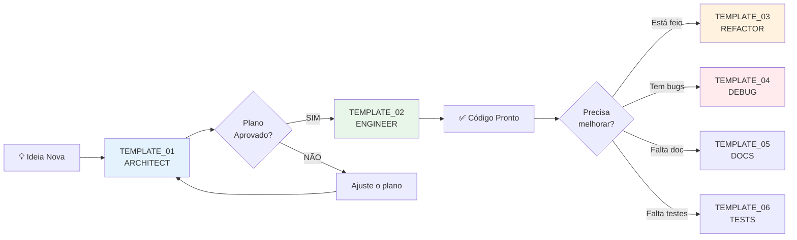

# 🆘 FAQ: Erros Comuns e Soluções Rápidas

> **📍 VOCÊ ESTÁ AQUI:** 🏠 [Início](./) > 🆘 FAQ de Erros Comuns  
> **🎯 PARA QUE SERVE:** Quando algo der errado, venha aqui ANTES de entrar em pânico  
> **⏱️ TEMPO ESTIMADO:** 5-10min (encontrar seu erro) | 15-20min (ler tudo)  
> **📋 FORMATO:** Problema → Causa → Solução (em 3 passos ou menos)

---

## ✅ Checkpoint Inicial

Antes de começar, confirme:

- [ ] Estou com um erro/problema específico
- [ ] Já tentei dar Ctrl+F para procurar a mensagem de erro neste documento
- [ ] Tenho 5-10 minutos para focar na solução

**💡 DICA:** Use Ctrl+F e busque palavras-chave do seu erro!

---

## 🔍 Índice por Sintoma

| Sintoma                                      | Vá para                            |
| -------------------------------------------- | ---------------------------------- |
| 🤖 "A IA ignorou minhas instruções"          | [#1](#1-ia-ignorou-instruções)     |
| 🌀 "A IA ficou dando voltas e não fez nada"  | [#2](#2-ia-ficou-em-loop)          |
| 💥 "A IA quebrou código que funcionava"      | [#3](#3-ia-quebrou-código-antigo)  |
| 🎭 "A IA inventou código que não existe"     | [#4](#4-ia-alucinou)               |
| 📝 "O plano ficou muito genérico/vago"       | [#5](#5-plano-genérico)            |
| 🐌 "A IA está muito lenta para responder"    | [#6](#6-ia-lenta)                  |
| 🗂️ "A IA editou o arquivo errado"            | [#7](#7-arquivo-errado)            |
| 🔄 "A IA não entendeu o contexto do projeto" | [#8](#8-sem-contexto)              |
| ❓ "Não sei qual template usar"              | [#9](#9-template-errado)           |
| 🧩 "Preenchi o template mas não funcionou"   | [#10](#10-template-mal-preenchido) |

---

## 🚨 Problemas e Soluções

### #1: IA Ignorou Instruções

#### **Sintomas:**

```
Você: "NÃO remova a validação de segurança"
IA: *Remove a validação de segurança*
```

#### **Causa Raiz:**

Você colocou a instrução no lugar errado ou usou linguagem ambígua.

#### **Solução:**

<table>
<tr>
<td width="50%" bgcolor="#FFEBEE">

### ❌ **Errado**

```xml
<mission>
  Adicione um botão de deletar.
  Não quebre nada.
</mission>
```

**Problema:** "Não quebre nada" é vago demais.

</td>
<td width="50%" bgcolor="#E8F5E9">

### ✅ **Certo**

```xml
<mission>
  Adicione um botão de deletar.
</mission>

<red_lines>
  - NÃO remova a validação Zod existente
  - NÃO altere o endpoint DELETE /users
  - NÃO quebre os testes em UserService.test.ts
</red_lines>
```

**Solução:** Seja específico e use a tag `<red_lines>`.

</td>
</tr>
</table>

---

### #2: IA Ficou em Loop

#### **Sintomas:**

```
IA: "Vou criar o arquivo X..."
IA: "Analisando o arquivo X..."
IA: "Vou criar o arquivo X..." (de novo)
```

#### **Causa Raiz:**

Você pediu muitas coisas ao mesmo tempo ou deu instruções contraditórias.

#### **Solução:**

1. **PARE a execução** (digite "PARE" no chat)
2. **Divida a tarefa:**
   - Use `TEMPLATE_01_ARCHITECT` para planejar
   - Depois use `TEMPLATE_02_ENGINEER` para executar
3. **Regra de Ouro:** 1 objetivo por prompt

**Exemplo de Divisão:**

```
❌ Ruim: "Crie um dashboard com gráficos, tabelas e exportação PDF"

✅ Bom:
  Prompt 1: "Planeje a estrutura do dashboard" (TEMPLATE_01)
  Prompt 2: "Implemente os gráficos" (TEMPLATE_02)
  Prompt 3: "Adicione a exportação PDF" (TEMPLATE_02)
```

---

### #3: IA Quebrou Código Antigo

#### **Sintomas:**

```
Antes: Login funcionava
Depois: Erro 500 no login
IA: "Refatorei o AuthService para melhorar a performance"
```

#### **Causa Raiz:**

Você não especificou quais arquivos/funções são "intocáveis".

#### **Solução:**

<table>
<tr>
<td width="50%" bgcolor="#FFEBEE">

### ❌ **Sem Proteção**

```xml
<mission>
  Adicione autenticação com Google.
</mission>
```

</td>
<td width="50%" bgcolor="#E8F5E9">

### ✅ **Com Proteção**

```xml
<mission>
  Adicione autenticação com Google.
</mission>

<input_context>
  <critical_files>
    <file path="backend/src/auth/AuthService.js" />
  </critical_files>
</input_context>

<red_lines>
  - NÃO altere a função `validateToken()`
  - NÃO remova o middleware `authMiddleware`
  - NÃO quebre a autenticação por email existente
</red_lines>
```

</td>
</tr>
</table>

**Dica Extra:** Use `TEMPLATE_03_REFACTOR` quando quiser mexer em código antigo.

---

### #4: IA Alucinou

#### **Sintomas:**

```javascript
// A IA gerou isso:
import { magicFunction } from "@/utils/magic";

// Mas esse arquivo não existe no seu projeto!
```

#### **Causa Raiz:**

Você não forneceu contexto suficiente. A IA "inventou" baseado em padrões da internet.

#### **Solução:**

1. **Sempre liste arquivos existentes** em `<critical_files>`
2. **Use `<constraints>`** para proibir criação de novos arquivos

**Exemplo:**

```xml
<input_context>
  <critical_files>
    <file path="frontend/src/utils/helpers.ts" />
    <file path="frontend/src/types/index.ts" />
  </critical_files>
</input_context>

<constraints>
  - Use APENAS as funções que já existem em helpers.ts
  - NÃO crie novos arquivos de utilitários
  - NÃO importe bibliotecas que não estão no package.json
</constraints>
```

---

### #5: Plano Genérico

#### **Sintomas:**

```markdown
## Plano de Implementação

1. Criar componente
2. Adicionar lógica
3. Testar
```

_Isso não ajuda em nada!_

#### **Causa Raiz:**

Você não deu detalhes suficientes no `<user_requirements>`.

#### **Solução:**

<table>
<tr>
<td width="50%" bgcolor="#FFEBEE">

### ❌ **Vago**

```xml
<user_requirements>
  <frontend>
    - Adicionar um formulário
  </frontend>
</user_requirements>
```

</td>
<td width="50%" bgcolor="#E8F5E9">

### ✅ **Específico**

```xml
<user_requirements>
  <frontend>
    - Formulário com 3 campos: nome, email, telefone
    - Validação em tempo real (email deve ter @)
    - Botão "Salvar" desabilitado se houver erros
    - Mensagem de sucesso após salvar
  </frontend>

  <backend>
    - Endpoint POST /contacts
    - Validar com Zod: nome (min 3 chars), email (formato válido)
    - Salvar na tabela `contacts` (schema.prisma)
  </backend>
</user_requirements>
```

</td>
</tr>
</table>

---

### #6: IA Lenta

#### **Sintomas:**

A IA demora 30+ segundos para responder ou fica "pensando" sem fazer nada.

#### **Causa Raiz:**

- Você pediu para analisar muitos arquivos de uma vez
- Ou está usando o modelo errado para a tarefa

#### **Solução:**

1. **Reduza o escopo:**
   - Liste no máximo 3-5 arquivos em `<critical_files>`
   - Divida tarefas grandes em subtarefas

2. **Use o modelo certo:**
   | Tarefa | Modelo Rápido | Modelo Lento (mas preciso) |
   |--------|---------------|----------------------------|
   | Scripts simples | Gemini Flash | - |
   | Planejamento | Gemini Pro | Claude Thinking |
   | Frontend/UI | Claude Sonnet | - |
   | Debugging complexo | - | Claude Thinking |

---

### #7: Arquivo Errado

#### **Sintomas:**

```
Você: "Edite o componente de login"
IA: *Edita LoginPage.tsx*
Você: "Eu queria o LoginModal.tsx!" 😤
```

#### **Causa Raiz:**

Você não especificou o caminho completo do arquivo.

#### **Solução:**

**Sempre use caminhos absolutos ou relativos claros:**

```xml
❌ Ruim: "Edite o componente de login"

✅ Bom:
<critical_files>
  <file path="frontend/src/components/auth/LoginModal.tsx" />
</critical_files>
```

---

### #8: Sem Contexto

#### **Sintomas:**

```
IA: "Vou criar uma nova tabela no banco de dados"
Você: "Mas essa tabela já existe!" 😵
```

#### **Causa Raiz:**

A IA não leu o `schema.prisma` ou a documentação do projeto.

#### **Solução:**

**Sempre inclua arquivos de contexto críticos:**

```xml
<input_context>
  <critical_files>
    <!-- Banco de Dados -->
    <file path="backend/prisma/schema.prisma" />

    <!-- Documentação -->
    <file path="docs/ARCHITECTURE.md" />

    <!-- Tipos -->
    <file path="frontend/src/types/index.ts" />
  </critical_files>
</input_context>
```

**Dica:** Crie um arquivo `CONTEXT.md` no projeto com as regras principais e sempre liste ele.

---

### #9: Template Errado

#### **Sintomas:**

Você usou `TEMPLATE_02_ENGINEER` mas a IA não fez nada porque não tinha um plano.

#### **Causa Raiz:**

Você pulou etapas.

#### **Solução:**

**Siga a ordem correta:**



**Regra:** Nunca pule o `TEMPLATE_01` em tarefas novas!

---

### #10: Template Mal Preenchido

#### **Sintomas:**

Você preencheu o template, mas a IA deu uma resposta estranha.

#### **Causa Raiz:**

Você esqueceu de substituir alguma `{{CHAVE}}` ou colocou informação no lugar errado.

#### **Solução:**

**Checklist antes de enviar:**

- [ ] Substituí TODAS as `{{CHAVES}}`? (Use Ctrl+F para procurar `{{`)
- [ ] Listei pelo menos 2 arquivos em `<critical_files>`?
- [ ] Coloquei pelo menos 1 regra em `<constraints>` ou `<red_lines>`?
- [ ] Removi os comentários `<!-- EXEMPLO -->` que não fazem sentido?

**Ferramenta:** Use o validador abaixo:

```javascript
// Cole seu XML aqui e rode no console do navegador
const xml = `seu_xml_aqui`;

// Verifica se ainda tem chaves não substituídas
if (xml.includes("{{")) {
  console.error("❌ Você esqueceu de substituir as {{CHAVES}}!");
  console.log("Encontradas:", xml.match(/\{\{[^}]+\}\}/g));
} else {
  console.log("✅ Template preenchido corretamente!");
}
```

---

## 🎯 Prevenção: Como Evitar 90% dos Erros

### **Regra 1: Sempre Comece com TEMPLATE_01**

Mesmo que pareça "perda de tempo", planejar economiza horas de debug.

### **Regra 2: Seja Específico, Não Educado**

```
❌ "Por favor, você poderia melhorar o código?"
✅ "Refatore UserService.ts aplicando SOLID principles"
```

### **Regra 3: Liste Arquivos Explicitamente**

Nunca assuma que a IA "sabe" quais arquivos existem.

### **Regra 4: Use `<red_lines>` Sempre**

Mesmo que seja óbvio para você, não é para a IA.

### **Regra 5: Um Objetivo Por Vez**

Se você tem 3 tarefas, faça 3 prompts separados.

---

## 🆘 Ainda Está Travado?

Se nenhuma solução acima funcionou:

1. **Respire fundo** 🧘
2. **Copie o erro completo** (console, terminal, mensagem da IA)
3. **Use TEMPLATE_04_DEBUG:**

   ```xml
   <symptoms>
     [Cole o erro aqui]
   </symptoms>

   <recent_changes>
     - Tentei usar TEMPLATE_XX
     - Preenchi as chaves X, Y, Z
     - A IA respondeu: [cole a resposta estranha]
   </recent_changes>
   ```

4. **Envie para a IA** e peça para ela investigar

---

## 📚 Links Úteis

- [Guia Rápido TDAH](./GUIDE_TDAH_QUICKSTART.md) - Volte ao básico
- [Cheatsheet Visual](./CHEATSHEET_VISUAL.md) - Referência rápida
- [Guia de Maestria](./GUIDE_AI_MASTERY.md) - Entenda como a IA pensa

---

## ✅ Resumo em 3 Frases

1. **90% dos erros vêm de prompts vagos** → Use templates estruturados sempre
2. **Especifique o que NÃO fazer** (`<red_lines>`) é mais poderoso que dizer o que fazer
3. **Liste arquivos explicitamente** em `<critical_files>` para evitar alucinações da IA

## 🔗 Próximos Passos

**Se resolveu o erro:**
→ Volte para o [Template](./TEMPLATE_01_ARCHITECT.md) que estava usando

**Se ainda está travado:**
→ Use [TEMPLATE_04_DEBUG](./TEMPLATE_04_DEBUG.md) e cole o erro completo

**Se quer evitar erros futuros:**
→ Leia [GUIDE_AI_MASTERY](./GUIDE_AI_MASTERY.md) para entender como a IA pensa

## 🆘 Ficou com Dúvida?

Digite no chat: "Estou com o erro [DESCREVA] e já tentei [O QUE FEZ]"

---

**💡 Lembre-se:** A IA é uma ferramenta poderosa, mas ela precisa de instruções precisas. Use os templates, seja específico e você terá sucesso! 🚀

[🔝 Voltar ao topo](#-faq-erros-comuns-e-soluções-rápidas)
