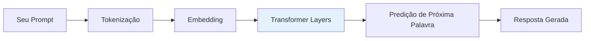
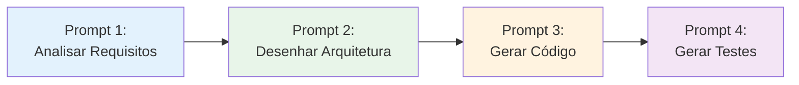

# 🧠 Guia de Maestria: Falando a Língua da IA

> **📍 VOCÊ ESTÁ AQUI:** 🏠 [Início](./) > 📘 Guias > 🧠 AI Mastery  
> **🎯 OBJETIVO:** Entender COMO a IA pensa (não só o que ela faz)  
> **⏱️ TEMPO:** 10-12min leitura profunda  
> **🛠️ PRÉ-REQUISITO:** Leu o [GUIDE_TDAH_QUICKSTART](./GUIDE_TDAH_QUICKSTART.md)

---

> **💡 CONCEITO FUNDAMENTAL:**  
> "A IA é um gênio onipotente, mas que sofre de amnésia a cada 5 minutos e leva tudo ao pé da letra."

Este guia não é sobre código. É sobre **como pensar** para extrair o melhor da Inteligência Artificial, especialmente se você tem um cérebro acelerado (TDAH).

---

## 0. 🤖 Como Funciona uma IA de Linguagem (LLM)?

> **💡 TL;DR:** Entender o básico de como a IA "pensa" te torna 10x melhor em criar prompts.

### A Arquitetura Transformer (Simplificado)

Imagine a IA como uma **rede neural gigante** treinada em trilhões de palavras da internet.



**O que acontece:**

1. **Tokenização**: Seu texto é dividido em "tokens" (pedaços de palavras)
2. **Embedding**: Cada token vira um vetor matemático
3. **Transformer**: Camadas de atenção processam relações entre tokens
4. **Predição**: A IA calcula qual palavra tem maior probabilidade de vir a seguir

### Janela de Contexto: A Memória de Curto Prazo

| Modelo     | Janela de Contexto | Equivalente     |
| ---------- | ------------------ | --------------- |
| GPT-3.5    | ~4k tokens         | ~3 páginas      |
| GPT-4      | ~8k-32k tokens     | ~6-24 páginas   |
| Claude 3   | ~200k tokens       | ~150 páginas    |
| Gemini Pro | ~32k-1M tokens     | ~24-750 páginas |

**Implicações Práticas:**

- ✅ Modelos com contexto maior podem analisar mais arquivos
- ❌ Contexto maior = mais lento e mais caro
- 💡 Escolha o modelo baseado no tamanho da tarefa

### Temperatura e Criatividade

```python
# Temperatura controla aleatoriedade
temperatura = 0.0  # Determinístico, sempre mesma resposta
temperatura = 0.7  # Balanceado (padrão)
temperatura = 1.5  # Criativo, imprevisível
```

**Quando usar cada:**

- **Temp 0.0-0.3**: Código, lógica, matemática
- **Temp 0.5-0.8**: Escrita geral, documentação
- **Temp 0.9-1.5**: Brainstorming, criatividade

---

## 1. O Princípio Fundamental: "Calculadora de Palavras"

Pare de antropomorfizar (tratar como humano). A IA não "entende" o que você quer; ela **calcula** qual é a palavra mais provável de vir a seguir.

- **Se você é vago:** "Melhore este código."
  - _Cálculo da IA:_ "Melhorar" é subjetivo. Vou aplicar o padrão mais genérico da internet.
- **Se você é específico (XML):** "Refatore para Solid Principles aplicando injeção de dependência."
  - _Cálculo da IA:_ O universo de respostas diminuiu de "Infinito" para "Engenharia de Software Avançada".

### 🎯 Exercício Prático: Vago vs Específico

**Cenário:** Você quer criar um componente de botão reutilizável.

<table>
<tr>
<td width="50%" bgcolor="#FFEBEE">

#### ❌ Prompt Vago

```
Crie um botão
```

**Resultado da IA:**

```jsx
function Button() {
  return <button>Click me</button>;
}
```

**Problemas:**

- Sem props
- Sem estilização
- Sem tipos TypeScript
- Não reutilizável

</td>
<td width="50%" bgcolor="#E8F5E9">

#### ✅ Prompt Específico

```xml
<system_role>
  Atue como Senior Frontend Engineer.
  Framework: React + TypeScript.
</system_role>

<mission>
  Criar componente Button reutilizável.
</mission>

<requirements>
  - Props: label, onClick, variant (primary/secondary)
  - TypeScript com interface
  - Suporte a disabled state
  - Acessibilidade (ARIA)
</requirements>
```

**Resultado da IA:**

```tsx
interface ButtonProps {
  label: string;
  onClick: () => void;
  variant?: "primary" | "secondary";
  disabled?: boolean;
}

export const Button: React.FC<ButtonProps> = ({
  label,
  onClick,
  variant = "primary",
  disabled = false,
}) => {
  return (
    <button
      onClick={onClick}
      disabled={disabled}
      className={`btn btn-${variant}`}
      aria-label={label}
    >
      {label}
    </button>
  );
};
```

**Ganhos:**

- ✅ Tipagem completa
- ✅ Reutilizável
- ✅ Acessível
- ✅ Profissional

</td>
</tr>
</table>

**🎮 Desafio:** Tente criar um prompt específico para um formulário de login. Quais tags XML você usaria?

<details>
<summary>💡 Solução Sugerida (clique para expandir)</summary>

```xml
<system_role>
  Atue como Senior Frontend Engineer.
  Framework: React + TypeScript + React Hook Form.
</system_role>

<mission>
  Criar componente LoginForm com validação.
</mission>

<requirements>
  - Campos: email, password
  - Validação: email formato válido, senha min 8 caracteres
  - Mostrar erros em tempo real
  - Botão submit desabilitado se houver erros
  - Loading state durante autenticação
</requirements>
```

</details>

---

## 2. A Técnica de Cercamento Cognitivo ("Cognitive Fencing")

Imagine que a IA é um cachorro muito rápido num campo aberto infinito. Se você jogar a bolinha (prompt), ele pode correr para qualquer lugar.

A sua função não é correr atrás dele. **Sua função é construir a cerca.**

Quanto mais "cercas" (restrições) você coloca, mais rápido o cachorro acha a bolinha.

- **Cerca 1: Contexto (<context_files>)** -> "Não olhe para a internet, olhe só para ESTES 3 arquivos."
- **Cerca 2: Restrições (<red_lines>)** -> "Você pode fazer tudo, MENOS isso."
- **Cerca 3: Papel (<system_role>)** -> "Não aja como um poeta, aja como um Engenheiro Sênior."

> **Regra de Ouro:** Dizer o que a IA **NÃO** deve fazer é mais poderoso do que dizer o que ela deve fazer.

---

## 3. Por que XML? (`<tag>`)

Você viu os templates cheios de `<mission>`, `<constraints>`, etc. Isso não é preciosismo.

Para a IA, cada tag funciona como uma gaveta no cérebro:

- Quando ela lê `<constraints>`, ela muda para o modo "Crítico".
- Quando ela lê `<context>`, ela carrega dados na memória de curto prazo.

Se você escreve um texto corrido (bloco de texto), a IA pode misturar instruções com contexto. O XML separa o **COMANDO** do **DADO**.

---

## 4. O Protocolo de 2 Passos (Arquiteto vs. Engenheiro)

Por que dividimos os prompts em dois?

### 🎩 O Arquiteto (Modo Lento)

- **Foco:** Planejamento, Análise, Segurança.
- **Por que separar:** Se você pedir para a IA planejar E codar ao mesmo tempo, ela vai pular o planejamento para chegar logo na parte "divertida" (código). O resultado é código que não funciona ("Vibe Coding").

### 👷 O Engenheiro (Modo Rápido)

- **Foco:** Execução, Sintaxe, Velocidade.
- **Por que separar:** Aqui a IA não deve pensar "será que isso é boa ideia?". Ela deve confiar cegamente no plano do Arquiteto.

---

## 5. Dicas para Cérebros Acelerados (TDAH Friendly) ⚡

1.  **Não converse, Comande.** Evite "Por favor, você poderia...". Vá direto: "Analise X. Gere Y."
2.  **Um objetivo por vez.** Não peça "Arrume o bug do login e mude a cor do botão". Isso confunde o "foco de atenção" da janela de contexto.
3.  **Se a IA errou, a culpa é do Prompt.**
    - A IA alucinou (inventou código)? -> Você não deu o contexto (<context_files>).
    - A IA quebrou algo antigo? -> Você não colocou as cercas (<red_lines>).
4.  **Use os Templates.** Eles são seu "Exoesqueleto Cognitivo". Eles lembram das regras quando você esquece.

---

## 6. 🎓 Técnicas Avançadas de Prompt Engineering

> **💡 TL;DR:** Técnicas profissionais para extrair o máximo da IA em situações complexas.

### Chain-of-Thought (Cadeia de Pensamento)

Force a IA a "pensar em voz alta" antes de responder.

**Técnica:**

```xml
<reasoning_protocol>
  Antes de fornecer a solução:
  1. Analise o problema
  2. Liste possíveis abordagens
  3. Avalie prós e contras de cada
  4. Escolha a melhor opção
  5. Explique sua escolha
  6. Então forneça o código
</reasoning_protocol>
```

**Quando usar:**

- Problemas complexos de arquitetura
- Debugging de bugs difíceis
- Decisões de trade-off

**Exemplo Prático:**

```xml
<mission>
  Escolher estratégia de cache para API de e-commerce.
</mission>

<reasoning_protocol>
  Analise: Redis vs Memcached vs Cache HTTP
  Liste trade-offs de cada opção
  Recomende baseado em: escala, custo, complexidade
</reasoning_protocol>
```

---

### Few-Shot Learning (Aprendizado por Exemplos)

Ensine a IA mostrando exemplos do que você quer.

**Exemplo:**

```xml
<examples>
  <example>
    Input: "Usuário clicou em salvar"
    Output: "handleSaveClick"
  </example>

  <example>
    Input: "Formulário foi submetido"
    Output: "handleFormSubmit"
  </example>

  <example>
    Input: "Modal foi fechado"
    Output: "handleModalClose"
  </example>
</examples>

<task>
  Agora crie um nome de função para: "Botão de deletar foi pressionado"
</task>
```

**Resultado:** `handleDeleteButtonPress`

**Quando usar:**

- Padrões de nomenclatura específicos do projeto
- Formatação de código customizada
- Estruturas de dados particulares

---

### Prompt Chaining (Encadeamento)

Divida tarefas complexas em sequência de prompts simples.



**Vantagens:**

- ✅ Cada etapa é mais precisa
- ✅ Fácil de debugar (sabe onde falhou)
- ✅ Pode usar modelos diferentes para cada etapa
- ✅ Economiza tokens (contexto menor por prompt)

**Exemplo Prático:**

```
Prompt 1 (Análise):
  "Liste todos os endpoints necessários para um CRUD de produtos"

Prompt 2 (Validação):
  "Para cada endpoint, defina o schema de validação Zod"

Prompt 3 (Implementação):
  "Implemente o endpoint POST /products usando o schema definido"

Prompt 4 (Testes):
  "Crie testes unitários para o endpoint POST /products"
```

---

### Self-Consistency (Auto-Consistência)

Peça múltiplas soluções e escolha a melhor.

```xml
<task>
  Gere 3 abordagens diferentes para implementar autenticação JWT.
  Para cada uma, liste:
  - Prós
  - Contras
  - Complexidade de implementação
  - Segurança

  Depois recomende a melhor para um projeto de médio porte.
</task>
```

**Quando usar:**

- Decisões arquiteturais importantes
- Múltiplas soluções viáveis
- Precisa justificar escolha para o time

---

### Negative Prompting (Restrições Negativas)

Diga explicitamente o que a IA **NÃO** deve fazer.

```xml
<red_lines>
  - NÃO use bibliotecas externas não listadas no package.json
  - NÃO crie novos arquivos de configuração
  - NÃO altere a estrutura do banco de dados
  - NÃO remova validações de segurança existentes
</red_lines>
```

**Por que funciona:**

- Reduz espaço de soluções possíveis
- Evita "criatividade" indesejada
- Protege código crítico

---

### 🎯 Exercício Final: Combinando Técnicas

**Desafio:** Crie um prompt usando TODAS as técnicas acima para planejar um sistema de notificações em tempo real.

<details>
<summary>💡 Solução Sugerida (clique para expandir)</summary>

```xml
<system_role>
  Atue como Arquiteto de Software Senior.
  Stack: Node.js, WebSockets, Redis.
</system_role>

<!-- CHAIN-OF-THOUGHT -->
<reasoning_protocol>
  1. Analise requisitos de notificações em tempo real
  2. Compare WebSockets vs Server-Sent Events vs Polling
  3. Avalie necessidade de persistência (Redis/Database)
  4. Escolha arquitetura baseado em: escala, custo, complexidade
</reasoning_protocol>

<!-- FEW-SHOT LEARNING -->
<examples>
  <example>
    Tipo: "Novo comentário"
    Payload: { userId, postId, comment, timestamp }
  </example>
  <example>
    Tipo: "Curtida"
    Payload: { userId, targetId, targetType }
  </example>
</examples>

<!-- SELF-CONSISTENCY -->
<task>
  Gere 3 arquiteturas diferentes.
  Recomende a melhor para 10k usuários simultâneos.
</task>

<!-- NEGATIVE PROMPTING -->
<red_lines>
  - NÃO use polling (ineficiente)
  - NÃO armazene tudo em memória (não escala)
  - NÃO exponha WebSocket diretamente (segurança)
</red_lines>

<!-- PROMPT CHAINING - Este é o Prompt 1 -->
<output_instruction>
  Gere apenas o plano arquitetural.
  NÃO escreva código ainda.
  Próximo prompt: implementação.
</output_instruction>
```

</details>

---

## Resumo da Ópera

A IA é um espelho.

- Input Caótico -> Output Caótico.
- Input Estruturado (XML) -> Output Engenharia de Precisão.

Use a pasta `_prompts` sempre que for começar uma tarefa complexa. É a diferença entre passar 1 hora codando ou 4 horas debugando.

---

## 🔧 Adaptando para Sua Stack

Este framework é **agnóstico de tecnologia**. Os princípios funcionam para qualquer linguagem ou framework.

### Como Adaptar os Templates

1. **Identifique sua stack**: Frontend, Backend, Database, ORM
2. **Configure `STACK_CONFIG.md`**: Preencha com suas tecnologias
3. **Substitua placeholders**: Onde ver `{{FRONTEND_FRAMEWORK}}`, use "React", "Vue", "Angular", etc.

### Exemplos de Adaptação

**Se você usa Python/Django:**

```xml
<system_role>
  Stack: Django REST Framework, PostgreSQL, SQLAlchemy.
</system_role>
```

**Se você usa Java/Spring:**

```xml
<system_role>
  Stack: Spring Boot, MySQL, JPA/Hibernate.
</system_role>
```

**Se você usa Vue.js:**

```xml
<system_role>
  Stack: Vue 3 + Composition API, Vite, Pinia.
</system_role>
```

> **💡 Dica:** Os templates usam exemplos em React/Node.js por serem populares, mas os **princípios** (planejamento, validação, segurança) aplicam-se universalmente.

---

## ✅ Resumo em 3 Frases

1. **IA = Calculadora probabilística** → Não "entende", calcula palavra mais provável
2. **Cercamento Cognitivo** → Quanto mais restrições (cercas), melhor o resultado
3. **XML estrutura pensamento** → Tags separam comando de contexto de restrição

## 🔗 Próximos Passos

**Se entendeu os conceitos:**
→ Pratique com [TEMPLATE_01_ARCHITECT](./TEMPLATE_01_ARCHITECT.md)

**Se quer ver como aplicar em diferentes modos:**
→ Leia [GUIDE_ANTIGRAVITY](./GUIDE_ANTIGRAVITY.md)

**Se precisa de exemplos visuais:**
→ Consulte [CHEATSHEET_VISUAL](./CHEATSHEET_VISUAL.md)

---

[🔝 Voltar ao topo](#-guia-de-maestria-falando-a-língua-da-ia)
