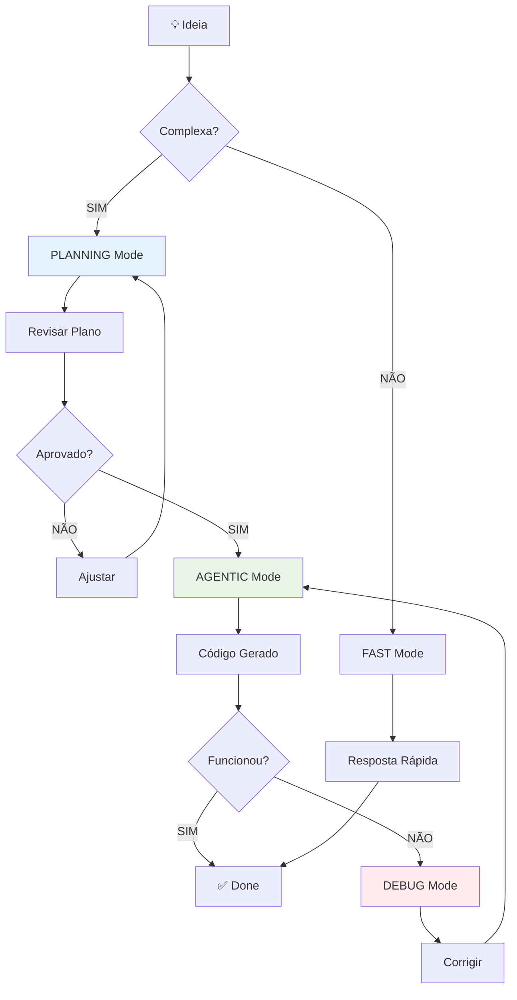

# 🌌 Guia do Antigravity: Manual de Operação

> **📍 VOCÊ ESTÁ AQUI:** 🏠 [Início](./) > 📘 Guias > 🌌 Antigravity Engine  
> **🎯 OBJETIVO:** Dominar os modos, modelos e alavancas do sistema  
> **⏱️ TEMPO:** 8-10min leitura + tempo de consultas futuras  
> **🛠️ PRÉ-REQUISITO:** Familiaridade básica com os templates

---

> **📌 LEITURA RÁPIDA (TL;DR)**  
> Este sistema não é um simples Chatbot. É uma **Engine de Engenharia de Software**.  
> Este guia explica como operar as alavancas para obter código de alta qualidade.

---

## 1. 🧠 Escolhendo o Modelo de IA Certo

Cada modelo de IA tem características únicas. Escolher o modelo adequado para cada tarefa aumenta significativamente a qualidade dos resultados.

### Critérios de Seleção

| Tipo de Tarefa                | Características Ideais do Modelo                                                | Exemplos de Modelos                               |
| :---------------------------- | :------------------------------------------------------------------------------ | :------------------------------------------------ |
| **Planejamento Arquitetural** | Raciocínio profundo, contexto longo (32k+ tokens), análise de trade-offs        | GPT-4, Claude Opus, Gemini Pro, o1-preview        |
| **Geração de Código**         | Velocidade, sintaxe precisa, conhecimento de múltiplas linguagens               | GPT-3.5 Turbo, Claude Sonnet, Gemini Flash, Codex |
| **Debugging Complexo**        | Análise lógica detalhada, "pensamento" explícito (chain-of-thought)             | Claude (Thinking Mode), o1-preview, GPT-4         |
| **Design de UI/UX**           | Criatividade visual, conhecimento de frameworks frontend, acessibilidade        | Claude Sonnet, GPT-4, Gemini Pro                  |
| **Documentação**              | Clareza na escrita, tom didático, capacidade de simplificar conceitos complexos | Claude Sonnet, GPT-4, Gemini Pro                  |
| **Tarefas Repetitivas**       | Velocidade, custo-benefício, consistência                                       | GPT-3.5 Turbo, Gemini Flash, modelos locais       |

### 💡 Dicas de Seleção

**Para Planejamento (Fase Arquiteto):**

- Priorize modelos com **contexto longo** para analisar múltiplos arquivos
- Escolha modelos com **raciocínio profundo** para avaliar impactos e trade-offs

**Para Execução (Fase Engenheiro):**

- Modelos **rápidos** são suficientes se o plano estiver bem definido
- Priorize modelos com **boa sintaxe** na linguagem do seu projeto

**Para Debugging (Fase Emergência):**

- Use modelos com **modo de pensamento explícito** (thinking/reasoning)
- Prefira modelos que mostram o raciocínio passo-a-passo

---

## 2. 🎛️ Modos de Operação

O sistema opera em duas frequências distintas. Saber alternar é o segredo da produtividade.

### 🅰️ Conversation Mode (O Chat)

_Estado padrão. Respostas rápidas, interação direta._

#### Perfil: ⚡ FAST (Rápido)

- **Comportamento:** Resposta imediata. Assume o caminho mais curto.
- **Ideal para:** Dúvidas de sintaxe, comandos de terminal, correções de uma linha.
- **Exemplo:** "Como reverto o último commit no git?", "Centralize essa div."

#### Perfil: 🧠 PLANNING (Planejamento)

- **Comportamento:** Analisa o pedido, simula cenários, gera estratégias.
- **Ideal para:** Antes de começar uma tarefa grande.
- **Prompt Sugerido:** `TEMPLATE_01_ARCHITECT.md`

### 🅱️ Agentic Mode (A Fábrica)

_Estado de trabalho autônomo. O sistema assume o controle do terminal e editor._

- **Comportamento:** Cria arquivos, roda testes, corrige erros sozinho.
- **Gatilho:** Pedidos complexos ("Crie um módulo...", "Refatore o sistema...").
- **Visualização:** A interface muda para blocos de tarefas (`Task Boundary`).

### 📸 Exemplos Práticos de Cada Modo

#### Conversation Mode: FAST

**Cenário Real:**

````
Você: Como centralizo uma div com Flexbox?

IA (5 segundos depois):
```css
.container {
  display: flex;
  justify-content: center;
  align-items: center;
}
````

````

**Características:**
- ⚡ Resposta em segundos
- 💬 Sem criar arquivos
- 🚫 Sem executar comandos
- 👁️ Apenas informação

---

#### Conversation Mode: PLANNING

**Cenário Real:**
```xml
<mission>
  Planejar sistema de autenticação com JWT.
</mission>

IA gera (30 segundos depois):
📄 implementation_plan.md
  ├── 1. Database Schema (Users table)
  ├── 2. Backend (JWT generation, validation)
  ├── 3. Frontend (Login form, token storage)
  └── 4. Security (Refresh tokens, HTTPS)
````

**Características:**

- 📋 Cria artefato de planejamento
- 🔍 Analisa impactos
- ⏸️ Não executa nada ainda
- ✅ Você revisa e aprova

---

#### Agentic Mode

**Cenário Real:**

```xml
<mission>
  Executar o plano de autenticação aprovado.
</mission>

IA executa (3-5 minutos):
✅ Criou backend/src/auth/AuthService.ts
✅ Criou backend/src/auth/jwt.utils.ts
✅ Atualizou backend/src/routes/auth.routes.ts
✅ Criou frontend/src/hooks/useAuth.ts
✅ Rodou npm install jsonwebtoken
✅ Gerou walkthrough.md
```

**Características:**

- 🤖 Autonomia total
- 📝 Cria/edita múltiplos arquivos
- ⚙️ Executa comandos
- 👀 Você só observa

---

### ⚠️ Quando NÃO Usar Agentic Mode

| Situação                     | Use Conversation Mode | Motivo                                  |
| ---------------------------- | --------------------- | --------------------------------------- |
| Dúvida rápida                | ✅                    | Agentic é overkill                      |
| Explorar ideias              | ✅                    | Você quer conversar, não executar       |
| Código crítico de produção   | ✅                    | Você quer revisar cada linha            |
| Aprendendo algo novo         | ✅                    | Você quer entender, não só ter o código |
| Projeto sem testes           | ✅                    | Muito arriscado deixar IA mudar tudo    |
| Primeira vez usando template | ✅                    | Aprenda o fluxo primeiro                |

**Regra de Ouro:** Se você não tem certeza do que quer, use Conversation Mode primeiro.

---

## 3. 🗺️ Mapa de Batalha: Qual Prompt Usar?

Use esta tabela para decidir rapidamente qual ferramenta sacar do cinto `_prompts/`.

| Cenário (O que você quer?)             |      Modo Indicado      | Tipo de Modelo Sugerido | Prompt (Template)          |
| :------------------------------------- | :---------------------: | :---------------------: | :------------------------- |
| **"Tenho uma ideia de Feature nova"**  | Conversation (Planning) |   Raciocínio Profundo   | `TEMPLATE_01_ARCHITECT.md` |
| **"O plano está pronto. Code agora."** |      Agentic Mode       |    Geração de Código    | `TEMPLATE_02_ENGINEER.md`  |
| **"O código está sujo/feio."**         |      Agentic Mode       |       Refatoração       | `TEMPLATE_03_REFACTOR.md`  |
| **"Deu erro e não sei porquê."**       | Conversation (Thinking) |   Debugging Complexo    | `TEMPLATE_04_DEBUG.md`     |
| **"Ninguém sabe usar isso aqui."**     |      Agentic Mode       |      Documentação       | `TEMPLATE_05_DOCS.md`      |
| **"Preciso garantir que não quebre."** |      Agentic Mode       |    Geração de Código    | `TEMPLATE_06_TESTS.md`     |

---

## 4. ⚙️ Ciclo de Vida do "Agentic Mode"

Quando o sistema entra no **Agentic Mode**, ele segue um protocolo rígido. Não interrompa, a menos que o sistema peça.

1.  **� PLANNING (Planejamento)**
    - O sistema cria `task.md` (Checklist).
    - Gera `implementation_plan.md` (Plano Técnico).
    - **AÇÃO DO USUÁRIO:** Revisar e aprovar o plano quando solicitado (`notify_user`).

2.  **🔨 EXECUTION (Execução)**
    - Edição de arquivos em massa.
    - Execução de comandos de terminal.
    - **AÇÃO DO USUÁRIO:** Apenas observar os logs.

3.  **✅ VERIFICATION (Verificação)**
    - Testes finais.
    - Geração de `walkthrough.md` (Relatório do que foi feito).
    - **AÇÃO DO USUÁRIO:** Testar a feature no navegador.

---

## 5. ⚡ Otimizando Seu Workflow

> **💡 TL;DR:** Trabalhe mais inteligente, não mais difícil. Aprenda atalhos e padrões.

### Padrão: Ciclo Completo



### Atalhos para Tarefas Comuns

| Tarefa                   | Atalho             | Tempo Economizado |
| ------------------------ | ------------------ | ----------------- |
| Criar componente simples | FAST Mode direto   | ~5min             |
| Refatorar arquivo único  | FAST + TEMPLATE_03 | ~10min            |
| Feature completa         | PLANNING → AGENTIC | ~30min            |
| Bug crítico              | DEBUG Mode         | ~15min            |
| Documentar módulo        | DOCS Mode          | ~20min            |

### Batching (Agrupamento)

Agrupe tarefas similares para economizar contexto:

```
❌ Ruim (3 prompts separados):
  Prompt 1: "Criar Button.tsx"
  Prompt 2: "Criar Input.tsx"
  Prompt 3: "Criar Card.tsx"

✅ Bom (1 prompt com lista):
  "Criar 3 componentes seguindo o mesmo padrão:
   - Button (props: label, onClick, variant)
   - Input (props: value, onChange, type)
   - Card (props: title, children, footer)"
```

**Vantagens:**

- ✅ IA mantém consistência entre componentes
- ✅ Economiza tempo de setup
- ✅ Usa menos tokens

### Reutilização de Contexto

Mantenha um arquivo `PROJECT_CONTEXT.md` na raiz:

```markdown
# Contexto do Projeto

## Stack

- Frontend: React + TypeScript + Vite
- Backend: Node.js + Express
- Database: PostgreSQL + Prisma

## Convenções

- Componentes em PascalCase
- Hooks começam com `use`
- Testes em `*.test.ts`
- Estilos em CSS Modules

## Arquivos Críticos

- `schema.prisma` - Nunca edite sem migração
- `auth.middleware.ts` - Não remova validações
- `CONTEXT.md` - Leia sempre antes de começar
```

**Use em todo prompt:**

```xml
<input_context>
  <file path="PROJECT_CONTEXT.md" />
</input_context>
```

### Template Snippets (Atalhos Pessoais)

Crie seus próprios atalhos para prompts frequentes:

```xml
<!-- Salve como: snippets/quick-component.xml -->
<system_role>
  Senior Frontend Engineer.
  Stack: {{CONSULTE_STACK_CONFIG.md}}.
</system_role>

<mission>
  Criar componente {{NOME}}.
</mission>

<requirements>
  - TypeScript com interface
  - Props bem tipadas
  - Acessibilidade (ARIA)
  - Responsivo
</requirements>
```

**Uso:**

1. Copie o snippet
2. Substitua `{{NOME}}`
3. Cole no chat

---

## 6. 📚 Casos de Uso Reais

> **💡 TL;DR:** Aprenda com exemplos do mundo real.

### Caso 1: Migração de Banco de Dados

**Contexto:** Adicionar campo `avatar_url` na tabela Users sem perder dados.

**Workflow:**

1. **PLANNING Mode:**

   ```xml
   <mission>
     Planejar migração para adicionar avatar_url em Users.
   </mission>

   <constraints>
     - NÃO perder dados existentes
     - Campo deve ser opcional (nullable)
     - Adicionar valor padrão para registros antigos
   </constraints>
   ```

   **Output:** `db_migration_plan.md` com estratégia segura

2. **AGENTIC Mode:**

   ```xml
   <mission>
     Executar migração conforme plano aprovado.
   </mission>
   ```

   **Output:** Migration criada, schema atualizado, seed ajustado

3. **VERIFICATION:**
   - Rodar `npm run migrate`
   - Verificar dados antigos intactos
   - Testar criação de novo usuário

**Tempo Total:** 10 minutos (vs 40 minutos manual)

---

### Caso 2: Debugging de Performance

**Contexto:** Dashboard lento, carregando 5+ segundos.

**Workflow:**

1. **DEBUG Mode:**

   ```xml
   <symptoms>
     Dashboard demora 5+ segundos para carregar.
     Console mostra 20+ requisições HTTP.
   </symptoms>

   <suspected_files>
     <file path="frontend/src/views/DashboardView.tsx" />
   </suspected_files>
   ```

2. **IA Identifica:**
   - Falta de memoização em componentes
   - Requisições não estão em paralelo
   - Sem lazy loading de gráficos

3. **REFACTOR Mode:**

   ```xml
   <mission>
     Otimizar DashboardView conforme análise.
   </mission>

   <refactoring_goals>
     - Adicionar React.memo
     - Usar Promise.all para requisições
     - Lazy load com React.lazy
   </refactoring_goals>
   ```

**Resultado:** Tempo de carregamento reduzido para 1.2s

---

### Caso 3: Onboarding de Novo Dev

**Contexto:** Novo desenvolvedor precisa entender o projeto.

**Workflow:**

1. **DOCS Mode:**

   ```xml
   <mission>
     Gerar documentação de onboarding.
     Público: Desenvolvedor Junior.
   </mission>

   <source_material>
     <file path="backend/src/server.ts" />
     <file path="frontend/src/App.tsx" />
     <file path="prisma/schema.prisma" />
   </source_material>
   ```

2. **Output:** `ONBOARDING.md` com:
   - Arquitetura visual (Mermaid)
   - Fluxo de dados
   - Como rodar localmente
   - Onde encontrar cada coisa

**Tempo:** 15 minutos (vs 2 horas escrevendo manual)

---

> **DICA DE OURO (TDAH):**  
> Se você sentir que perdeu o controle do que a IA está fazendo:
>
> 1. Digite **"PARE"**.
> 2. Vá na pasta `_prompts`.
> 3. Copie o `TEMPLATE_01_ARCHITECT.md`.
> 4. Recomece organizando o caos.

---

## ✅ Resumo em 3 Frases

1. **Escolha o modelo certo para cada tarefa** → Raciocínio profundo (planejamento), Rápido (execução), Debugging (análise)
2. **Conversation Mode vs Agentic Mode** → Chat interativo vs Execução autônoma (use Conversation quando em dúvida)
3. **Otimize seu workflow** → Use batching, reutilize contexto, aprenda com casos reais

## 🔗 Próximos Passos

**Se quer praticar a seleção de modelos:**
→ Teste com [TEMPLATE_01_ARCHITECT](./TEMPLATE_01_ARCHITECT.md) usando diferentes modelos

**Se quer entender O PORQUÊ dos templates:**
→ Leia [GUIDE_AI_MASTERY](./GUIDE_AI_MASTERY.md)

**Se precisa de referência rápida:**
→ Imprima o [CHEATSHEET_VISUAL](./CHEATSHEET_VISUAL.md)

**Se está com problema específico:**
→ Consulte [FAQ_ERROS_COMUNS](./FAQ_ERROS_COMUNS.md)

---

[🔝 Voltar ao topo](#-guia-do-antigravity-manual-de-operação)
