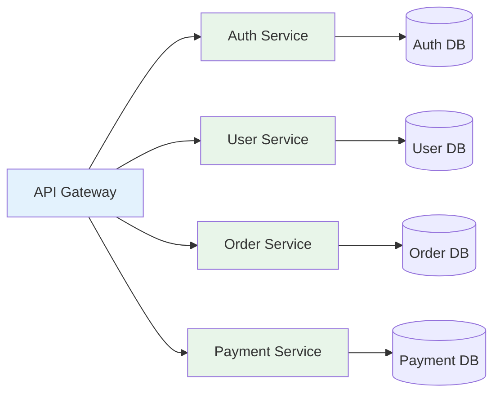
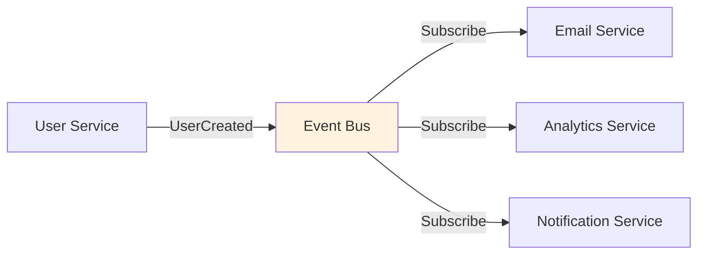

# 📚 Almanaque do Desenvolvedor

> **🎯 Objetivo:** Guia de referência rápida com conhecimentos fundamentais que todo desenvolvedor fullstack precisa dominar.

---

## 📖 Índice

1. [🏛️ Fundamentos de Arquitetura](#1-fundamentos-de-arquitetura)
2. [🎨 Padrões de Design](#2-padrões-de-design)
3. [🎨 Frontend Essencial](#3-frontend-essencial)
4. [⚙️ Backend Essencial](#4-backend-essencial)
5. [🗄️ Database Essencial](#5-database-essencial)
6. [🚀 DevOps e Infraestrutura](#6-devops-e-infraestrutura)
7. [🔒 Segurança](#7-segurança)
8. [⚡ Performance](#8-performance)
9. [✅ Boas Práticas](#9-boas-práticas)
10. [📖 Glossário de Termos](#10-glossário-de-termos)

---

## 1. 🏛️ Fundamentos de Arquitetura

> **💡 TL;DR:** Entenda as principais arquiteturas de software e quando usar cada uma.

### Comparação de Arquiteturas

| Característica     | Monolith          | Microservices                    | Serverless             |
| ------------------ | ----------------- | -------------------------------- | ---------------------- |
| **Complexidade**   | Baixa             | Alta                             | Média                  |
| **Escalabilidade** | Vertical          | Horizontal (granular)            | Automática             |
| **Deploy**         | Tudo junto        | Independente                     | Por função             |
| **Custo Inicial**  | Baixo             | Alto                             | Muito baixo            |
| **Manutenção**     | Simples (pequeno) | Complexa                         | Baixa                  |
| **Ideal para**     | MVPs, startups    | Apps grandes, times distribuídos | Event-driven, variável |

### Monolithic Architecture

**O que é:**
Aplicação construída como uma única unidade, com todos os componentes fortemente acoplados.

**Quando usar:**

- ✅ Startups e MVPs
- ✅ Equipes pequenas
- ✅ Aplicações internas
- ✅ Prototipagem rápida

**Prós:**

- ✅ Desenvolvimento inicial rápido
- ✅ Deploy simples
- ✅ Debugging mais fácil
- ✅ Menos overhead operacional

**Contras:**

- ❌ Difícil escalar partes específicas
- ❌ Deploy de tudo mesmo para pequenas mudanças
- ❌ Tecnologia única para todo projeto
- ❌ Pode ficar difícil de manter com crescimento

**Exemplo de Stack:**

```
Frontend + Backend + Database em um único repositório
├── /frontend (React)
├── /backend (Node.js/Express)
└── /database (PostgreSQL)
```

---

### Microservices Architecture

**O que é:**
Aplicação dividida em serviços pequenos e independentes que se comunicam via APIs.



**Quando usar:**

- ✅ Aplicações grandes e complexas
- ✅ Times distribuídos
- ✅ Necessidade de escalar partes específicas
- ✅ Diferentes tecnologias por serviço

**Prós:**

- ✅ Escalabilidade granular
- ✅ Deploy independente
- ✅ Isolamento de falhas
- ✅ Flexibilidade tecnológica

**Contras:**

- ❌ Complexidade operacional alta
- ❌ Comunicação entre serviços (latência)
- ❌ Debugging distribuído é difícil
- ❌ Custo de infraestrutura maior

---

### Serverless Architecture

**O que é:**
Execução de código sem gerenciar servidores, pagando apenas pelo tempo de execução.

**Quando usar:**

- ✅ Workloads variáveis/imprevisíveis
- ✅ Event-driven (webhooks, processamento de arquivos)
- ✅ Micro-tarefas
- ✅ Prototipagem rápida

**Prós:**

- ✅ Zero gerenciamento de servidor
- ✅ Escala automática
- ✅ Pay-per-use (custo otimizado)
- ✅ Deploy extremamente rápido

**Contras:**

- ❌ Vendor lock-in
- ❌ Cold starts (latência inicial)
- ❌ Difícil manter estado
- ❌ Debugging limitado

**Exemplo (AWS Lambda):**

```javascript
// handler.js
export const handler = async (event) => {
  const body = JSON.parse(event.body);

  // Processar dados
  const result = await processData(body);

  return {
    statusCode: 200,
    body: JSON.stringify(result),
  };
};
```

---

### Event-Driven Architecture

**O que é:**
Componentes se comunicam através de eventos assíncronos ao invés de chamadas diretas.



**Quando usar:**

- ✅ Sistemas desacoplados
- ✅ Processamento assíncrono
- ✅ Real-time (chat, notificações)
- ✅ E-commerce (pedidos, pagamentos)

**Prós:**

- ✅ Desacoplamento total
- ✅ Escalabilidade
- ✅ Fácil adicionar novos consumidores

**Contras:**

- ❌ Complexidade de debugging
- ❌ Eventual consistency
- ❌ Requer message broker

---

### Clean/Hexagonal Architecture

**O que é:**
Isola lógica de negócio de detalhes de infraestrutura (DB, UI, APIs externas).

**Camadas:**

```
┌─────────────────────────────────┐
│   Presentation (UI/API)         │
├─────────────────────────────────┤
│   Application (Use Cases)       │
├─────────────────────────────────┤
│   Domain (Business Logic)       │ ← Core
├─────────────────────────────────┤
│   Infrastructure (DB, External) │
└─────────────────────────────────┘
```

**Prós:**

- ✅ Testabilidade máxima
- ✅ Independência de frameworks
- ✅ Fácil trocar infraestrutura

**Contras:**

- ❌ Mais código (abstrações)
- ❌ Curva de aprendizado

---

## 2. 🎨 Padrões de Design

> **💡 TL;DR:** Soluções comprovadas para problemas comuns de design de software.

### Padrões Criacionais

#### Singleton

**O que é:** Garante que uma classe tenha apenas uma instância.

**Quando usar:**

- Configurações globais
- Connection pools
- Loggers

**Exemplo (TypeScript):**

```typescript
class Database {
  private static instance: Database;
  private connection: any;

  private constructor() {
    this.connection = createConnection();
  }

  public static getInstance(): Database {
    if (!Database.instance) {
      Database.instance = new Database();
    }
    return Database.instance;
  }

  query(sql: string) {
    return this.connection.execute(sql);
  }
}

// Uso
const db1 = Database.getInstance();
const db2 = Database.getInstance();
console.log(db1 === db2); // true
```

---

#### Factory Method

**O que é:** Interface para criar objetos, permitindo subclasses decidirem qual classe instanciar.

**Exemplo:**

```typescript
interface Button {
  render(): void;
}

class WindowsButton implements Button {
  render() {
    console.log("Renderizando botão Windows");
  }
}

class MacButton implements Button {
  render() {
    console.log("Renderizando botão Mac");
  }
}

class ButtonFactory {
  static createButton(os: string): Button {
    switch (os) {
      case "windows":
        return new WindowsButton();
      case "mac":
        return new MacButton();
      default:
        throw new Error("OS não suportado");
    }
  }
}

// Uso
const button = ButtonFactory.createButton("windows");
button.render();
```

---

### Padrões Estruturais

#### Adapter

**O que é:** Converte interface de uma classe em outra esperada pelo cliente.

**Quando usar:**

- Integrar bibliotecas de terceiros
- Migração gradual de sistemas

**Exemplo:**

```typescript
// Sistema antigo
class OldPaymentSystem {
  processPayment(amount: number) {
    console.log(`Processando $${amount}`);
  }
}

// Interface nova esperada
interface PaymentProcessor {
  pay(value: number, currency: string): void;
}

// Adapter
class PaymentAdapter implements PaymentProcessor {
  constructor(private oldSystem: OldPaymentSystem) {}

  pay(value: number, currency: string) {
    // Adapta para o sistema antigo
    this.oldSystem.processPayment(value);
  }
}

// Uso
const oldSystem = new OldPaymentSystem();
const adapter = new PaymentAdapter(oldSystem);
adapter.pay(100, "USD");
```

---

#### Decorator

**O que é:** Adiciona comportamento a objetos dinamicamente sem modificar sua estrutura.

**Exemplo:**

```typescript
interface Coffee {
  cost(): number;
  description(): string;
}

class SimpleCoffee implements Coffee {
  cost() {
    return 5;
  }
  description() {
    return "Café simples";
  }
}

class MilkDecorator implements Coffee {
  constructor(private coffee: Coffee) {}

  cost() {
    return this.coffee.cost() + 2;
  }
  description() {
    return this.coffee.description() + ", com leite";
  }
}

class SugarDecorator implements Coffee {
  constructor(private coffee: Coffee) {}

  cost() {
    return this.coffee.cost() + 1;
  }
  description() {
    return this.coffee.description() + ", com açúcar";
  }
}

// Uso
let coffee = new SimpleCoffee();
coffee = new MilkDecorator(coffee);
coffee = new SugarDecorator(coffee);

console.log(coffee.description()); // "Café simples, com leite, com açúcar"
console.log(coffee.cost()); // 8
```

---

### Padrões Comportamentais

#### Observer

**O que é:** Define dependência um-para-muitos onde mudanças em um objeto notificam dependentes.

**Quando usar:**

- Event systems
- Pub/Sub
- State management

**Exemplo:**

```typescript
interface Observer {
  update(data: any): void;
}

class Subject {
  private observers: Observer[] = [];

  subscribe(observer: Observer) {
    this.observers.push(observer);
  }

  unsubscribe(observer: Observer) {
    this.observers = this.observers.filter((obs) => obs !== observer);
  }

  notify(data: any) {
    this.observers.forEach((obs) => obs.update(data));
  }
}

class EmailNotifier implements Observer {
  update(data: any) {
    console.log(`Email enviado: ${data}`);
  }
}

class SMSNotifier implements Observer {
  update(data: any) {
    console.log(`SMS enviado: ${data}`);
  }
}

// Uso
const subject = new Subject();
subject.subscribe(new EmailNotifier());
subject.subscribe(new SMSNotifier());
subject.notify("Novo pedido recebido!");
```

---

#### Strategy

**O que é:** Define família de algoritmos intercambiáveis.

**Exemplo:**

```typescript
interface PaymentStrategy {
  pay(amount: number): void;
}

class CreditCardPayment implements PaymentStrategy {
  pay(amount: number) {
    console.log(`Pagando $${amount} com cartão de crédito`);
  }
}

class PayPalPayment implements PaymentStrategy {
  pay(amount: number) {
    console.log(`Pagando $${amount} com PayPal`);
  }
}

class ShoppingCart {
  private strategy: PaymentStrategy;

  setPaymentStrategy(strategy: PaymentStrategy) {
    this.strategy = strategy;
  }

  checkout(amount: number) {
    this.strategy.pay(amount);
  }
}

// Uso
const cart = new ShoppingCart();
cart.setPaymentStrategy(new CreditCardPayment());
cart.checkout(100);

cart.setPaymentStrategy(new PayPalPayment());
cart.checkout(200);
```

---

### Padrões Arquiteturais

#### MVC (Model-View-Controller)

**O que é:** Separa aplicação em três componentes interconectados.

```
┌──────────┐      ┌──────────────┐      ┌───────┐
│   View   │◄─────│  Controller  │─────►│ Model │
│   (UI)   │      │   (Logic)    │      │ (Data)│
└──────────┘      └──────────────┘      └───────┘
```

**Responsabilidades:**

- **Model**: Dados e lógica de negócio
- **View**: Apresentação (UI)
- **Controller**: Intermediário, processa input

---

#### Repository Pattern

**O que é:** Abstrai acesso a dados, centralizando queries.

**Exemplo:**

```typescript
interface User {
  id: number;
  name: string;
  email: string;
}

interface UserRepository {
  findById(id: number): Promise<User | null>;
  findAll(): Promise<User[]>;
  create(user: Omit<User, "id">): Promise<User>;
  update(id: number, user: Partial<User>): Promise<User>;
  delete(id: number): Promise<void>;
}

class PrismaUserRepository implements UserRepository {
  async findById(id: number) {
    return await prisma.user.findUnique({ where: { id } });
  }

  async findAll() {
    return await prisma.user.findMany();
  }

  async create(user: Omit<User, "id">) {
    return await prisma.user.create({ data: user });
  }

  async update(id: number, user: Partial<User>) {
    return await prisma.user.update({ where: { id }, data: user });
  }

  async delete(id: number) {
    await prisma.user.delete({ where: { id } });
  }
}

// Uso no Service
class UserService {
  constructor(private userRepo: UserRepository) {}

  async getUser(id: number) {
    return await this.userRepo.findById(id);
  }
}
```

**Vantagens:**

- ✅ Fácil trocar ORM/Database
- ✅ Testável (mock do repository)
- ✅ Centraliza queries

---

[Continua na próxima seção...]
