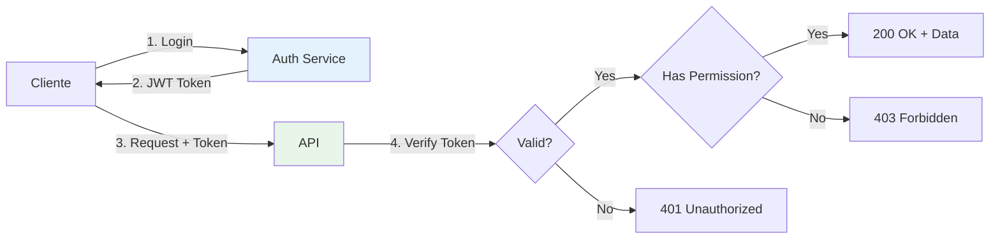
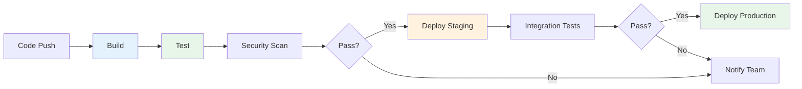

# 📚 Almanaque do Desenvolvedor (Continuação)

## 3. 🎨 Frontend Essencial

> **💡 TL;DR:** Fundamentos de desenvolvimento frontend moderno.

### Comparação de Frameworks

| Framework   | Curva Aprendizado | Performance | Ecossistema | Ideal para                       |
| ----------- | ----------------- | ----------- | ----------- | -------------------------------- |
| **React**   | Média             | Alta        | Enorme      | SPAs, apps complexas             |
| **Vue**     | Baixa             | Alta        | Grande      | Prototipagem rápida, apps médias |
| **Angular** | Alta              | Alta        | Completo    | Enterprise, apps grandes         |
| **Svelte**  | Baixa             | Muito Alta  | Crescente   | Performance crítica              |

### HTML5 Semântico

**Tags Essenciais:**

```html
<header>
  <!-- Cabeçalho da página/seção -->
  <nav>
    <!-- Navegação -->
    <main>
      <!-- Conteúdo principal -->
      <article>
        <!-- Conteúdo independente -->
        <section>
          <!-- Seção temática -->
          <aside>
            <!-- Conteúdo relacionado -->
            <footer><!-- Rodapé --></footer>
          </aside>
        </section>
      </article>
    </main>
  </nav>
</header>
```

**Por que usar:**

- ✅ SEO melhorado
- ✅ Acessibilidade
- ✅ Manutenibilidade

### CSS3 Essencial

**Flexbox (1D Layout):**

```css
.container {
  display: flex;
  justify-content: center; /* horizontal */
  align-items: center; /* vertical */
  gap: 1rem;
}
```

**Grid (2D Layout):**

```css
.grid {
  display: grid;
  grid-template-columns: repeat(3, 1fr);
  gap: 1rem;
}
```

**Responsive Design:**

```css
/* Mobile First */
.container {
  width: 100%;
}

/* Tablet */
@media (min-width: 768px) {
  .container {
    width: 750px;
  }
}

/* Desktop */
@media (min-width: 1024px) {
  .container {
    width: 960px;
  }
}
```

### JavaScript Moderno (ES6+)

**Destructuring:**

```javascript
const user = { name: "João", age: 30 };
const { name, age } = user;

const arr = [1, 2, 3];
const [first, second] = arr;
```

**Spread/Rest:**

```javascript
// Spread
const arr1 = [1, 2];
const arr2 = [...arr1, 3, 4]; // [1, 2, 3, 4]

// Rest
function sum(...numbers) {
  return numbers.reduce((a, b) => a + b, 0);
}
```

**Async/Await:**

```javascript
async function fetchUser(id) {
  try {
    const response = await fetch(`/api/users/${id}`);
    const user = await response.json();
    return user;
  } catch (error) {
    console.error("Erro:", error);
  }
}
```

### State Management

**Quando usar cada:**

| Solução         | Complexidade | Quando usar                   |
| --------------- | ------------ | ----------------------------- |
| **useState**    | Baixa        | Estado local de componente    |
| **Context API** | Média        | Estado compartilhado simples  |
| **Redux**       | Alta         | Apps grandes, estado complexo |
| **Zustand**     | Baixa        | Alternativa leve ao Redux     |
| **Recoil**      | Média        | Estado atômico, React         |

**Exemplo (Zustand):**

```typescript
import create from 'zustand';

interface Store {
  count: number;
  increment: () => void;
  decrement: () => void;
}

const useStore = create<Store>((set) => ({
  count: 0,
  increment: () => set((state) => ({ count: state.count + 1 })),
  decrement: () => set((state) => ({ count: state.count - 1 })),
}));

// Uso
function Counter() {
  const { count, increment } = useStore();
  return <button onClick={increment}>{count}</button>;
}
```

### Checklist de Acessibilidade (WCAG)

- [ ] Contraste mínimo 4.5:1 (texto normal)
- [ ] Navegação por teclado funciona
- [ ] ARIA labels em elementos interativos
- [ ] Alt text em imagens
- [ ] Formulários com labels associados
- [ ] Foco visível em elementos
- [ ] Sem dependência apenas de cor
- [ ] Conteúdo responsivo (zoom 200%)

---

## 4. ⚙️ Backend Essencial

> **💡 TL;DR:** Fundamentos de desenvolvimento backend e APIs.

### REST vs GraphQL

| Característica        | REST            | GraphQL              |
| --------------------- | --------------- | -------------------- |
| **Endpoints**         | Múltiplos       | Único                |
| **Over-fetching**     | Comum           | Não                  |
| **Under-fetching**    | Comum (N+1)     | Não                  |
| **Versionamento**     | URLs (/v1, /v2) | Schema evolution     |
| **Caching**           | Nativo (HTTP)   | Requer implementação |
| **Curva aprendizado** | Baixa           | Média                |

### RESTful API Design

**Verbos HTTP:**

```
GET    /users       → Lista todos
GET    /users/123   → Busca um
POST   /users       → Cria novo
PUT    /users/123   → Atualiza completo
PATCH  /users/123   → Atualiza parcial
DELETE /users/123   → Remove
```

**Status Codes Essenciais:**

```
200 OK              → Sucesso
201 Created         → Recurso criado
204 No Content      → Sucesso sem retorno
400 Bad Request     → Dados inválidos
401 Unauthorized    → Não autenticado
403 Forbidden       → Sem permissão
404 Not Found       → Não encontrado
500 Internal Error  → Erro no servidor
```

**Exemplo (Express + TypeScript):**

```typescript
import express from "express";
import { z } from "zod";

const app = express();
app.use(express.json());

// Schema de validação
const createUserSchema = z.object({
  name: z.string().min(3),
  email: z.string().email(),
});

// POST /users
app.post("/users", async (req, res) => {
  try {
    // Validar
    const data = createUserSchema.parse(req.body);

    // Criar
    const user = await prisma.user.create({ data });

    // Retornar
    res.status(201).json(user);
  } catch (error) {
    if (error instanceof z.ZodError) {
      return res.status(400).json({ errors: error.errors });
    }
    res.status(500).json({ error: "Erro interno" });
  }
});
```

### Authentication vs Authorization



**Authentication (Quem você é):**

- Login/Password
- JWT Tokens
- OAuth 2.0
- Biometria

**Authorization (O que você pode fazer):**

- Role-Based (RBAC)
- Permission-Based
- Attribute-Based (ABAC)

**Exemplo JWT:**

```typescript
import jwt from "jsonwebtoken";

// Gerar token
function generateToken(userId: number) {
  return jwt.sign({ userId }, process.env.JWT_SECRET!, { expiresIn: "7d" });
}

// Middleware de autenticação
function authMiddleware(req, res, next) {
  const token = req.headers.authorization?.split(" ")[1];

  if (!token) {
    return res.status(401).json({ error: "Token não fornecido" });
  }

  try {
    const decoded = jwt.verify(token, process.env.JWT_SECRET!);
    req.userId = decoded.userId;
    next();
  } catch (error) {
    res.status(401).json({ error: "Token inválido" });
  }
}

// Uso
app.get("/profile", authMiddleware, async (req, res) => {
  const user = await prisma.user.findUnique({
    where: { id: req.userId },
  });
  res.json(user);
});
```

### Caching Strategies

**Níveis de Cache:**

```
Browser Cache → CDN → Application Cache → Database Cache
```

**Redis Example:**

```typescript
import Redis from "ioredis";

const redis = new Redis();

async function getUser(id: number) {
  // Tentar cache primeiro
  const cached = await redis.get(`user:${id}`);
  if (cached) {
    return JSON.parse(cached);
  }

  // Se não, buscar do DB
  const user = await prisma.user.findUnique({ where: { id } });

  // Salvar no cache (TTL 1 hora)
  await redis.setex(`user:${id}`, 3600, JSON.stringify(user));

  return user;
}
```

**Estratégias:**

- **Cache-Aside**: App gerencia cache
- **Write-Through**: Escreve em cache e DB simultaneamente
- **Write-Behind**: Escreve em cache, DB depois (async)
- **Refresh-Ahead**: Atualiza cache antes de expirar

---

## 5. 🗄️ Database Essencial

> **💡 TL;DR:** Fundamentos de bancos de dados SQL e NoSQL.

### SQL vs NoSQL

| Aspecto            | SQL                            | NoSQL                |
| ------------------ | ------------------------------ | -------------------- |
| **Estrutura**      | Tabelas fixas                  | Flexível             |
| **Schema**         | Rígido                         | Dinâmico             |
| **Escalabilidade** | Vertical                       | Horizontal           |
| **Transações**     | ACID                           | Eventual consistency |
| **Joins**          | Sim                            | Limitado/Não         |
| **Ideal para**     | Dados estruturados, financeiro | Big data, real-time  |

### SQL Essencial

**Joins:**

```sql
-- INNER JOIN (apenas matches)
SELECT u.name, o.total
FROM users u
INNER JOIN orders o ON u.id = o.user_id;

-- LEFT JOIN (todos da esquerda + matches)
SELECT u.name, o.total
FROM users u
LEFT JOIN orders o ON u.id = o.user_id;

-- RIGHT JOIN (todos da direita + matches)
SELECT u.name, o.total
FROM users u
RIGHT JOIN orders o ON u.id = o.user_id;
```

**Indexes:**

```sql
-- Criar índice
CREATE INDEX idx_email ON users(email);

-- Índice composto
CREATE INDEX idx_name_age ON users(name, age);

-- Índice único
CREATE UNIQUE INDEX idx_unique_email ON users(email);
```

**Transactions (ACID):**

```sql
BEGIN TRANSACTION;

UPDATE accounts SET balance = balance - 100 WHERE id = 1;
UPDATE accounts SET balance = balance + 100 WHERE id = 2;

COMMIT; -- ou ROLLBACK em caso de erro
```

### Normalização

**1NF (First Normal Form):**

- Valores atômicos (não arrays)
- Cada coluna tem um tipo
- Ordem não importa

**2NF:**

- Está em 1NF
- Sem dependências parciais

**3NF:**

- Está em 2NF
- Sem dependências transitivas

**Exemplo:**

```sql
-- ❌ Não normalizado
CREATE TABLE orders (
  id INT,
  customer_name VARCHAR(100),
  customer_email VARCHAR(100),
  products TEXT -- "Produto1,Produto2"
);

-- ✅ Normalizado (3NF)
CREATE TABLE customers (
  id INT PRIMARY KEY,
  name VARCHAR(100),
  email VARCHAR(100) UNIQUE
);

CREATE TABLE orders (
  id INT PRIMARY KEY,
  customer_id INT REFERENCES customers(id),
  created_at TIMESTAMP
);

CREATE TABLE order_items (
  id INT PRIMARY KEY,
  order_id INT REFERENCES orders(id),
  product_id INT REFERENCES products(id),
  quantity INT
);
```

### NoSQL - Document Store (MongoDB)

```javascript
// Inserir
await db.users.insertOne({
  name: "João",
  email: "joao@example.com",
  addresses: [
    { street: "Rua A", city: "São Paulo" },
    { street: "Rua B", city: "Rio" },
  ],
});

// Buscar
const user = await db.users.findOne({ email: "joao@example.com" });

// Atualizar
await db.users.updateOne(
  { email: "joao@example.com" },
  { $set: { name: "João Silva" } },
);

// Agregação
const result = await db.orders.aggregate([
  { $match: { status: "completed" } },
  { $group: { _id: "$userId", total: { $sum: "$amount" } } },
  { $sort: { total: -1 } },
]);
```

### CAP Theorem

**Você pode ter apenas 2 de 3:**

- **C**onsistency: Todos veem os mesmos dados
- **A**vailability: Sistema sempre responde
- **P**artition Tolerance: Funciona mesmo com falhas de rede

**Exemplos:**

- **CA**: PostgreSQL (single node)
- **CP**: MongoDB, Redis
- **AP**: Cassandra, DynamoDB

---

## 6. 🚀 DevOps e Infraestrutura

> **💡 TL;DR:** Fundamentos de deploy, CI/CD e infraestrutura.

### Git Essencial

```bash
# Configuração inicial
git config --global user.name "Seu Nome"
git config --global user.email "seu@email.com"

# Comandos básicos
git init                    # Iniciar repositório
git clone <url>             # Clonar repositório
git status                  # Ver status
git add .                   # Adicionar tudo
git commit -m "mensagem"    # Commit
git push origin main        # Enviar para remoto
git pull origin main        # Puxar do remoto

# Branches
git branch feature-x        # Criar branch
git checkout feature-x      # Mudar para branch
git checkout -b feature-y   # Criar e mudar
git merge feature-x         # Mergear branch

# Desfazer
git reset HEAD~1            # Desfazer último commit (mantém mudanças)
git reset --hard HEAD~1     # Desfazer último commit (perde mudanças)
git revert <commit-hash>    # Reverter commit específico
```

### CI/CD Pipeline



**Exemplo (GitHub Actions):**

```yaml
name: CI/CD Pipeline

on:
  push:
    branches: [main]
  pull_request:
    branches: [main]

jobs:
  build-and-test:
    runs-on: ubuntu-latest

    steps:
      - uses: actions/checkout@v3

      - name: Setup Node.js
        uses: actions/setup-node@v3
        with:
          node-version: "18"

      - name: Install dependencies
        run: npm ci

      - name: Run tests
        run: npm test

      - name: Build
        run: npm run build

      - name: Deploy to Production
        if: github.ref == 'refs/heads/main'
        run: npm run deploy
        env:
          DEPLOY_KEY: ${{ secrets.DEPLOY_KEY }}
```

### Docker Essencial

**Dockerfile:**

```dockerfile
# Base image
FROM node:18-alpine

# Working directory
WORKDIR /app

# Copy package files
COPY package*.json ./

# Install dependencies
RUN npm ci --only=production

# Copy source code
COPY . .

# Build
RUN npm run build

# Expose port
EXPOSE 3000

# Start command
CMD ["npm", "start"]
```

**Docker Compose:**

```yaml
version: "3.8"

services:
  app:
    build: .
    ports:
      - "3000:3000"
    environment:
      - DATABASE_URL=postgresql://user:pass@db:5432/mydb
    depends_on:
      - db

  db:
    image: postgres:15
    environment:
      - POSTGRES_USER=user
      - POSTGRES_PASSWORD=pass
      - POSTGRES_DB=mydb
    volumes:
      - postgres_data:/var/lib/postgresql/data

volumes:
  postgres_data:
```

**Comandos:**

```bash
docker build -t myapp .              # Build image
docker run -p 3000:3000 myapp        # Run container
docker-compose up                    # Start all services
docker-compose down                  # Stop all services
docker ps                            # List running containers
docker logs <container-id>           # View logs
```

---

## 7. 🔒 Segurança

> **💡 TL;DR:** Fundamentos de segurança em aplicações web.

### OWASP Top 10 (2021)

1. **Broken Access Control**
2. **Cryptographic Failures**
3. **Injection**
4. **Insecure Design**
5. **Security Misconfiguration**
6. **Vulnerable Components**
7. **Authentication Failures**
8. **Software/Data Integrity Failures**
9. **Logging/Monitoring Failures**
10. **Server-Side Request Forgery (SSRF)**

### SQL Injection

**❌ Vulnerável:**

```javascript
// NUNCA faça isso!
const query = `SELECT * FROM users WHERE email = '${userInput}'`;
db.query(query);
```

**✅ Seguro (Prepared Statements):**

```javascript
// Use parameterized queries
const query = "SELECT * FROM users WHERE email = ?";
db.query(query, [userInput]);

// Ou com ORM
const user = await prisma.user.findUnique({
  where: { email: userInput },
});
```

### XSS (Cross-Site Scripting)

**❌ Vulnerável:**

```javascript
// Renderizar HTML não sanitizado
element.innerHTML = userInput;
```

**✅ Seguro:**

```javascript
// Escapar HTML
element.textContent = userInput;

// Ou usar biblioteca de sanitização
import DOMPurify from "dompurify";
element.innerHTML = DOMPurify.sanitize(userInput);
```

### CSRF (Cross-Site Request Forgery)

**Proteção:**

```javascript
// Gerar token CSRF
app.use(csrf());

app.get("/form", (req, res) => {
  res.render("form", { csrfToken: req.csrfToken() });
});

// Validar token
app.post("/submit", (req, res) => {
  // Token validado automaticamente pelo middleware
  // ...
});
```

### Password Hashing

**❌ NUNCA:**

```javascript
// NUNCA armazene senhas em texto plano!
const password = "123456";
```

**✅ Use bcrypt:**

```javascript
import bcrypt from "bcrypt";

// Hash password
const saltRounds = 10;
const hashedPassword = await bcrypt.hash(password, saltRounds);

// Verify password
const isValid = await bcrypt.compare(inputPassword, hashedPassword);
```

### Security Headers

```javascript
import helmet from "helmet";

app.use(helmet()); // Adiciona vários headers de segurança

// Ou manualmente:
app.use((req, res, next) => {
  res.setHeader("X-Content-Type-Options", "nosniff");
  res.setHeader("X-Frame-Options", "DENY");
  res.setHeader("X-XSS-Protection", "1; mode=block");
  res.setHeader("Strict-Transport-Security", "max-age=31536000");
  next();
});
```

### Checklist de Segurança

- [ ] Validação de input (backend)
- [ ] Prepared statements (SQL)
- [ ] Password hashing (bcrypt/Argon2)
- [ ] HTTPS/TLS
- [ ] Security headers
- [ ] CORS configurado
- [ ] Rate limiting
- [ ] Secrets em variáveis de ambiente
- [ ] Dependências atualizadas
- [ ] Logs de segurança
- [ ] Autenticação multi-fator (MFA)

---

## 8. ⚡ Performance

> **💡 TL;DR:** Otimizações essenciais de performance.

### Web Vitals

**Core Web Vitals:**

- **LCP (Largest Contentful Paint)**: < 2.5s
- **FID (First Input Delay)**: < 100ms
- **CLS (Cumulative Layout Shift)**: < 0.1

### Frontend Optimization

**Code Splitting:**

```javascript
// React lazy loading
import { lazy, Suspense } from "react";

const HeavyComponent = lazy(() => import("./HeavyComponent"));

function App() {
  return (
    <Suspense fallback={<div>Loading...</div>}>
      <HeavyComponent />
    </Suspense>
  );
}
```

**Image Optimization:**

```html
<!-- Responsive images -->


<!-- Modern formats -->
<picture>
  <source srcset="image.webp" type="image/webp" />
  <source srcset="image.jpg" type="image/jpeg" />
  
</picture>
```

### Backend Optimization

**N+1 Query Problem:**

```javascript
// ❌ N+1 queries
const users = await prisma.user.findMany();
for (const user of users) {
  user.posts = await prisma.post.findMany({
    where: { userId: user.id },
  });
}

// ✅ 1 query com include
const users = await prisma.user.findMany({
  include: { posts: true },
});
```

**Connection Pooling:**

```javascript
// PostgreSQL com pg
const { Pool } = require("pg");

const pool = new Pool({
  max: 20, // Máximo de conexões
  idleTimeoutMillis: 30000,
  connectionTimeoutMillis: 2000,
});

// Usar pool ao invés de criar nova conexão
const result = await pool.query("SELECT * FROM users");
```

### Caching Checklist

- [ ] Browser cache (Cache-Control headers)
- [ ] CDN para assets estáticos
- [ ] Redis para dados frequentes
- [ ] Database query cache
- [ ] API response cache
- [ ] Service Worker (PWA)

---

## 9. ✅ Boas Práticas

> **💡 TL;DR:** Princípios e práticas essenciais de desenvolvimento.

### SOLID Principles

**S - Single Responsibility:**

```typescript
// ❌ Múltiplas responsabilidades
class User {
  save() {
    /* salva no DB */
  }
  sendEmail() {
    /* envia email */
  }
  generateReport() {
    /* gera relatório */
  }
}

// ✅ Responsabilidade única
class User {
  constructor(
    public name: string,
    public email: string,
  ) {}
}

class UserRepository {
  save(user: User) {
    /* salva no DB */
  }
}

class EmailService {
  send(to: string, subject: string) {
    /* envia email */
  }
}
```

**O - Open/Closed:**

```typescript
// ✅ Aberto para extensão, fechado para modificação
interface PaymentMethod {
  pay(amount: number): void;
}

class CreditCard implements PaymentMethod {
  pay(amount: number) {
    /* lógica cartão */
  }
}

class PayPal implements PaymentMethod {
  pay(amount: number) {
    /* lógica PayPal */
  }
}

// Adicionar novo método não requer modificar código existente
class Crypto implements PaymentMethod {
  pay(amount: number) {
    /* lógica crypto */
  }
}
```

**L - Liskov Substitution:**

```typescript
// Subclasses devem ser substituíveis por suas classes base
class Bird {
  fly() {
    console.log("Flying");
  }
}

class Sparrow extends Bird {
  fly() {
    console.log("Sparrow flying");
  }
}

// ❌ Viola LSP
class Penguin extends Bird {
  fly() {
    throw new Error("Can't fly");
  }
}

// ✅ Melhor design
interface Bird {
  move(): void;
}

class FlyingBird implements Bird {
  move() {
    this.fly();
  }
  fly() {
    console.log("Flying");
  }
}

class Penguin implements Bird {
  move() {
    this.swim();
  }
  swim() {
    console.log("Swimming");
  }
}
```

**I - Interface Segregation:**

```typescript
// ❌ Interface grande
interface Worker {
  work(): void;
  eat(): void;
  sleep(): void;
}

// ✅ Interfaces específicas
interface Workable {
  work(): void;
}

interface Eatable {
  eat(): void;
}

class Human implements Workable, Eatable {
  work() {
    /* ... */
  }
  eat() {
    /* ... */
  }
}

class Robot implements Workable {
  work() {
    /* ... */
  }
}
```

**D - Dependency Inversion:**

```typescript
// ❌ Depende de implementação concreta
class UserService {
  private db = new MySQLDatabase();

  getUser(id: number) {
    return this.db.query(`SELECT * FROM users WHERE id = ${id}`);
  }
}

// ✅ Depende de abstração
interface Database {
  query(sql: string): Promise<any>;
}

class UserService {
  constructor(private db: Database) {}

  getUser(id: number) {
    return this.db.query(`SELECT * FROM users WHERE id = ${id}`);
  }
}

// Pode injetar qualquer implementação
const service = new UserService(new PostgreSQLDatabase());
```

### DRY (Don't Repeat Yourself)

```typescript
// ❌ Repetição
function calculateTotalWithTax(price: number) {
  return price * 1.1;
}

function calculateDiscountedTotal(price: number, discount: number) {
  const discounted = price - discount;
  return discounted * 1.1; // Repetição da taxa
}

// ✅ DRY
const TAX_RATE = 1.1;

function applyTax(price: number) {
  return price * TAX_RATE;
}

function calculateTotalWithTax(price: number) {
  return applyTax(price);
}

function calculateDiscountedTotal(price: number, discount: number) {
  return applyTax(price - discount);
}
```

### Code Review Checklist

**Funcionalidade:**

- [ ] Código faz o que deveria?
- [ ] Edge cases tratados?
- [ ] Erros tratados adequadamente?

**Qualidade:**

- [ ] Código é legível?
- [ ] Nomes descritivos?
- [ ] Funções pequenas e focadas?
- [ ] Comentários onde necessário?

**Segurança:**

- [ ] Input validado?
- [ ] Sem vulnerabilidades óbvias?
- [ ] Secrets não commitados?

**Performance:**

- [ ] Queries otimizadas?
- [ ] Sem N+1?
- [ ] Recursos liberados?

**Testes:**

- [ ] Testes passam?
- [ ] Cobertura adequada?
- [ ] Testes de edge cases?

---

## 10. 📖 Glossário de Termos

> **💡 TL;DR:** Definições rápidas de termos técnicos essenciais.

**A**

- **API (Application Programming Interface)**: Interface para comunicação entre sistemas
- **Async/Await**: Sintaxe para lidar com código assíncrono em JavaScript
- **Authentication**: Verificação de identidade
- **Authorization**: Verificação de permissões

**C**

- **Cache**: Armazenamento temporário para acesso rápido
- **CDN (Content Delivery Network)**: Rede distribuída para servir conteúdo
- **CI/CD**: Continuous Integration/Continuous Deployment
- **CORS**: Cross-Origin Resource Sharing
- **CRUD**: Create, Read, Update, Delete

**D**

- **DTO (Data Transfer Object)**: Objeto para transferir dados entre camadas
- **Dependency Injection**: Padrão para injetar dependências

**E**

- **Endpoint**: URL específica de uma API
- **Event Loop**: Mecanismo de execução assíncrona do JavaScript

**J**

- **JWT (JSON Web Token)**: Token para autenticação stateless

**M**

- **Middleware**: Função que intercepta requests/responses
- **Migration**: Script para alterar schema do banco

**O**

- **ORM (Object-Relational Mapping)**: Abstração para banco de dados
- **OAuth**: Protocolo de autorização

**R**

- **REST (Representational State Transfer)**: Estilo arquitetural para APIs
- **RBAC (Role-Based Access Control)**: Controle de acesso baseado em papéis

**S**

- **SPA (Single Page Application)**: App que carrega uma única página HTML
- **SSR (Server-Side Rendering)**: Renderização no servidor
- **SSL/TLS**: Protocolos de criptografia

**W**

- **Webhook**: Callback HTTP para notificações
- **WebSocket**: Protocolo para comunicação bidirecional em tempo real

---

## 🎓 Como Usar Este Almanaque

1. **Referência Rápida**: Use Ctrl+F para encontrar conceitos específicos
2. **Estudo**: Leia seção por seção para consolidar fundamentos
3. **Comparação**: Use tabelas comparativas para decisões arquiteturais
4. **Prática**: Teste os exemplos de código em seus projetos
5. **Revisão**: Volte periodicamente para reforçar conceitos

---

## 📚 Recursos Adicionais

- [MDN Web Docs](https://developer.mozilla.org) - Referência web
- [OWASP](https://owasp.org) - Segurança
- [Patterns.dev](https://patterns.dev) - Padrões de design
- [web.dev](https://web.dev) - Performance e boas práticas

---

**Versão:** 1.0  
**Última atualização:** 2026-01-25  
**Licença:** MIT - Use livremente, adapte para sua realidade

[🔝 Voltar ao topo](#-almanaque-do-desenvolvedor-continuação)
