# ⚡ Guia Rápido TDAH: 2 Minutos para Começar

> **📍 VOCÊ ESTÁ AQUI:** 🏠 [Início](./) > 📘 Guias > ⚡ TDAH Quickstart  
> **🎯 OBJETIVO:** Sair daqui sabendo EXATAMENTE qual template usar e como preencher  
> **⏱️ TEMPO REAL:** 2min leitura + 3min prática = **5min total**  
> **🛠️ PRÉ-REQUISITO:** Nenhum! Este é o ponto de partida.

---

## ⏳ Challenge Gamificado

**🎮 DESAFIO:** Consiga fazer seu primeiro prompt em menos de 5 minutos

1. ⏰ Inicie um timer no seu celular (5min)
2. 👁️ Leia o fluxograma abaixo
3. 📋 Copie o template sugerido
4. ✏️ Preencha as `{{CHAVES}}`
5. 🚀 Envie para a IA

**🏆 Se conseguir:** Você dominou 80% do sistema!

---

## 🧭 Fluxograma: Qual Template Usar?

```mermaid
graph TD
    Start[🤔 O que você precisa fazer?] --> Q1{Já tem um<br/>plano pronto?}

    Q1 -->|NÃO| Idea[💡 Tenho uma ideia nova]
    Q1 -->|SIM| HasPlan[✅ Plano aprovado]

    Idea --> T1[📋 TEMPLATE_01_ARCHITECT<br/>Planejamento]
    HasPlan --> T2[👷 TEMPLATE_02_ENGINEER<br/>Execução]

    Start --> Q2{O código<br/>funciona?}
    Q2 -->|SIM, mas está feio| T3[🩺 TEMPLATE_03_REFACTOR<br/>Limpeza]
    Q2 -->|NÃO, está quebrado| T4[🕵️ TEMPLATE_04_DEBUG<br/>Investigação]

    Start --> Q3{Precisa de...}
    Q3 -->|Documentação| T5[📜 TEMPLATE_05_DOCS<br/>Escriba]
    Q3 -->|Testes| T6[🧪 TEMPLATE_06_TESTS<br/>QA]

    style T1 fill:#E3F2FD
    style T2 fill:#E8F5E9
    style T3 fill:#FFF3E0
    style T4 fill:#FFEBEE
    style T5 fill:#F3E5F5
    style T6 fill:#E0F2F1
```



---

## 🎯 Os 3 Passos Universais (Para QUALQUER Template)

### **PASSO 1: Copie o Bloco XML** 📋

Cada template tem uma seção `✂️ COPIE ISSO AQUI`. Copie tudo.

### **PASSO 2: Substitua as `{{CHAVES}}`** 🔑

Procure por `{{TEXTO_EM_MAIUSCULA}}` e substitua pelos seus dados.

**Exemplo:**

```xml
<!-- ANTES -->
<mission>
  Planejar a implementação da feature: "{{NOME_DA_FEATURE}}".
</mission>

<!-- DEPOIS -->
<mission>
  Planejar a implementação da feature: "Botão de exportar PDF".
</mission>
```

### **PASSO 3: Cole no Chat da IA** 🚀

Envie o XML completo. A IA vai entender perfeitamente.

---

## 🎨 Código de Cores dos Templates

| Cor             | Tipo         | Quando Usar                                           |
| --------------- | ------------ | ----------------------------------------------------- |
| 🔵 **AZUL**     | Planejamento | Antes de começar qualquer coisa                       |
| 🟢 **VERDE**    | Execução     | Quando já tem um plano aprovado                       |
| 🟠 **LARANJA**  | Manutenção   | Código funciona, mas precisa melhorar                 |
| 🔴 **VERMELHO** | Emergência   | Algo quebrou e você não sabe porquê                   |
| 🟣 **ROXO**     | Comunicação  | Precisa explicar para outros (ou para você no futuro) |
| 🟦 **CIANO**    | Qualidade    | Garantir que não vai quebrar depois                   |

---

## ⚡ Atalhos para Cérebros Acelerados

### **Situação 1: "Quero fazer algo novo, mas não sei por onde começar"**

```
→ Use TEMPLATE_01_ARCHITECT
→ Preencha só 3 coisas: Nome da feature, Objetivo, Arquivos relacionados
→ Envie e deixe a IA pensar por você
```

### **Situação 2: "A IA já fez o plano, agora quero o código"**

```
→ Use TEMPLATE_02_ENGINEER
→ Copie o nome da feature do template anterior
→ Adicione 1-2 regras do que NÃO fazer
→ Envie e vá tomar um café ☕
```

### **Situação 3: "Deu erro e eu tô perdido"**

```
→ Use TEMPLATE_04_DEBUG
→ Cole a mensagem de erro (do console ou terminal)
→ Liste os últimos arquivos que você mexeu
→ A IA vai investigar como um detetive
```

---

## 🆘 SOS: Perdi o Foco no Meio do Caminho

Se você está no meio de uma tarefa e esqueceu o que estava fazendo:

1. **PARE** ✋
2. Abra `GUIDE_ANTIGRAVITY.md` → Seção "Mapa de Batalha"
3. Identifique em qual fase você está
4. Use o template correspondente para reorganizar

---

## 🎓 Exemplo Completo (Do Zero ao Código)

### **Cenário Real:** "Quero adicionar um botão de exportar PDF no relatório"

#### **1️⃣ Planejamento (2 minutos)**

```xml
<!-- Uso TEMPLATE_01_ARCHITECT -->
<mission>
  Planejar a implementação da feature: "Botão Exportar PDF".
  Objetivo: Usuário clica no botão e baixa o relatório em PDF.
</mission>

<input_context>
  <critical_files>
    <file path="frontend/src/views/ReportsView.tsx" />
  </critical_files>

  <user_requirements>
    <frontend>
      - Botão "Exportar PDF" no canto superior direito
      - Mostrar loading enquanto gera o PDF
    </frontend>

    <constraints>
      - NÃO quebre o layout atual
    </constraints>
  </user_requirements>
</input_context>
```

**Resultado:** IA gera `implementation_plan.md` com 5 passos.

---

#### **2️⃣ Execução (30 segundos)**

```xml
<!-- Uso TEMPLATE_02_ENGINEER -->
<mission>
  Executar o plano aprovado para "Botão Exportar PDF".
</mission>

<red_lines>
  - NÃO remova o botão de imprimir existente
  - NÃO quebre a build
</red_lines>
```

**Resultado:** IA cria os arquivos e implementa tudo.

---

#### **3️⃣ Teste (1 minuto)**

Você testa no navegador. Funciona! 🎉

**Tempo Total:** ~5 minutos (vs. 2 horas fazendo na mão)

---

## 📚 Próximos Passos

Agora que você entendeu o básico:

1. **Leia os Guias Conceituais:**
   - `GUIDE_AI_MASTERY.md` → Entenda COMO a IA pensa
   - `GUIDE_ANTIGRAVITY.md` → Domine os modos de operação

2. **Explore os Templates:**
   - Abra cada um e veja os exemplos completos
   - Copie e adapte para suas necessidades

3. **Consulte Quando Travar:**
   - `FAQ_ERROS_COMUNS.md` → Soluções para problemas típicos
   - `CHEATSHEET_VISUAL.md` → Referência rápida ilustrada

---

## 💡 Dica de Ouro

> **A IA é um espelho.**  
> Se você der instruções confusas → Código confuso  
> Se você usar os templates → Engenharia de precisão

**Use os templates. Sempre.** Eles são seu exoesqueleto cognitivo.

---

## ✅ Checklist: Você Está Pronto?

- [ ] Sei qual template usar para cada situação
- [ ] Entendi que preciso substituir as `{{CHAVES}}`
- [ ] Sei que devo começar sempre pelo TEMPLATE_01 (planejamento)
- [ ] Salvei esta pasta nos favoritos

**Se marcou tudo:** Você está pronto para dominar a IA! 🚀

---

## ✅ Resumo em 3 Frases

1. **Use SEMPRE os templates** → Eles são seu "exoesqueleto cognitivo"
2. **Planeje antes de executar** → Template 01 (plano) → Template 02 (código)
3. **Templates são atalhos mentais** → Economizam sua energia cognitiva para o que importa

## 🔗 Próximos Passos

**Agora que entendeu o básico:**
→ Leia [GUIDE_AI_MASTERY](./GUIDE_AI_MASTERY.md) para entender COMO a IA pensa

**Se quiser dominar os modos de operação:**
→ Explore [GUIDE_ANTIGRAVITY](./GUIDE_ANTIGRAVITY.md)

**Se tiver dúvidas no futuro:**
→ Consulte o [CHEATSHEET_VISUAL](./CHEATSHEET_VISUAL.md) ou [FAQ_ERROS_COMUNS](./FAQ_ERROS_COMUNS.md)

## 🆘 Ficou com Dúvida?

**Perdeu o fio da meada?**
→ Volte ao [fluxograma](#-fluxograma-qual-template-usar) no início deste guia

**Não sabe qual modelo IA usar?**
→ Use a tabela em [GUIDE_ANTIGRAVITY](./GUIDE_ANTIGRAVITY.md#-seletor-de-inteligência-modelos)

---

**🔗 Links Rápidos:**

- [Guia de Maestria](./GUIDE_AI_MASTERY.md) - Como a IA pensa
- [Guia Antigravity](./GUIDE_ANTIGRAVITY.md) - Modos de operação
- [FAQ de Erros](./FAQ_ERROS_COMUNS.md) - Troubleshooting
- [Cheatsheet Visual](./CHEATSHEET_VISUAL.md) - Referência rápida

[🔝 Voltar ao topo](#-guia-rápido-tdah-2-minutos-para-começar)
