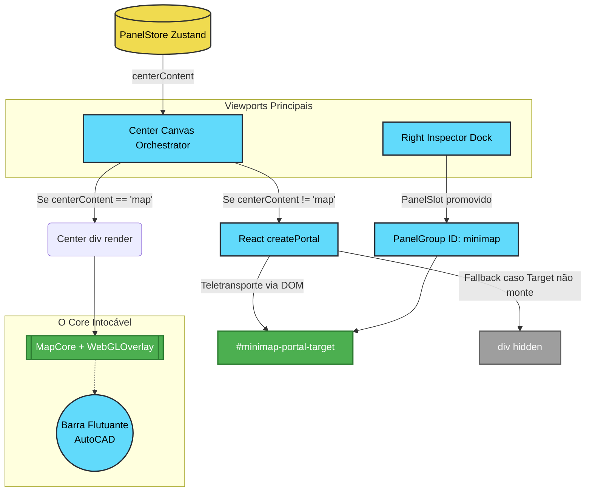

# Walkthrough e Arquitetura: Portal Transport & Minimap Docking (UX-003)

**Data**: 2024-04
**Domínio**: Frontend da Engenharia (`kurupira`)
**Status**: Concluído e Estabilizado 

## 1. O Que Foi Feito
O Épico **UX-003** executou uma transição arquitetural profunda na forma como o Mapa Interativo (`Leaflet` + `WebGLOverlay`) é gerenciado no `CenterCanvas`. 

Até o UX-002, o mapa sumia (`display: none`) caso a aba "Simulação" tomasse o centro. O UX-003 transformou e inseriu o mapa nativamente dentro da dock lateral (Right Inspector) como um Minimapa de contexto, **sem desmontá-lo**, fazendo com que seja possível o teletransporte dos `Layers` inteiros (`MapPayload`) de uma `div` para a outra graças à API `createPortal` do React.

Junto à estruturação de Docking, implementamos a padronização via Cânone, convertendo o minimapa num verdadeiro `PanelGroup` e expurgamos do cabeçalho global os botões de ferramentas (que agora habitam uma exclusiva **Barra Flutuante estilo AutoCAD** ligada à div mestre do Root Canvas).

## 2. Arquitetura de Estado e Portal Transport (Diagrama)

## 3. Arquivos Modificados e Impacto

- `[MODIFY] frontend/src/modules/engineering/store/panelStore.ts`: Expansão da tipagem de `PanelGroupId` para integrar e permitir o colapso independente do novo enum `'minimap'`.
- `[MODIFY] frontend/src/modules/engineering/components/MapCore.tsx`: Acoplagem do `MapMinimapObserver`; trava os eventos de Input (scroll, drag) nativos da Engine Leaflet estritamente quando renderizado dentro do Dock (evitando acionamentos acidentais).
- `[MODIFY] frontend/src/modules/engineering/ui/panels/CenterCanvas.tsx`: Substituição condicional pura por infraestrutura de Portal (`createPortal`). Migração maciça das "Tools de Desenho" antes presentes no Header para a moldura Esquerda do `<CenterCanvasInner>` como uma barra interativa.
- `[MODIFY] frontend/src/modules/engineering/ui/panels/RightInspector.tsx`: Refatoração base eliminando propriedades lixo (`dockLabel`) e envelopando a div receptora (`minimap-portal-target`) em um autêntico `<PanelGroup onMaximize={restoreMap}>`.
- `[MODIFY] frontend/src/modules/engineering/ui/panels/TopRibbon.tsx`: Expurgo rigoroso de elementos redundantes como a velha "Tool Palette" global e o "Badge" Mapa Dock que conflituavam com o novo formato cadístico.

## 4. Como Verificar (Definition of Done)
1. **Navegação Cíclica**: No UI do SaaS, maximize a janela "Simulação". Repare que o painel flui para o meio e o enorme Mapa Satélite transita sem flickering ou lentidão diretamente para dentro do painel lateral.
2. **Estabilidade Poka-Yoke**: Gire a scrollwheel em cima da miniatura e ateste o congelamento do Zoom do Leaflet (interação nativa bypassada).
3. **Flotação de Ferramentas**: Durante o modo 'Mapa Cheio', interaja com a barra vertical esmeralda (estilo AutoCAD) localizada na extrema esquerda. Promova o 'Elétrico' e ateste que as ferramentas magicamente somem, sem poluir a NavBar superior.

## 5. Próximos Passos Cânones
- Integrar os `Stores` do Zustand ligados à interatividade com testes Playwright visando atestar que instâncias WebGL (`R3F`) não recarreguem shaders entre transições do Portal API.
