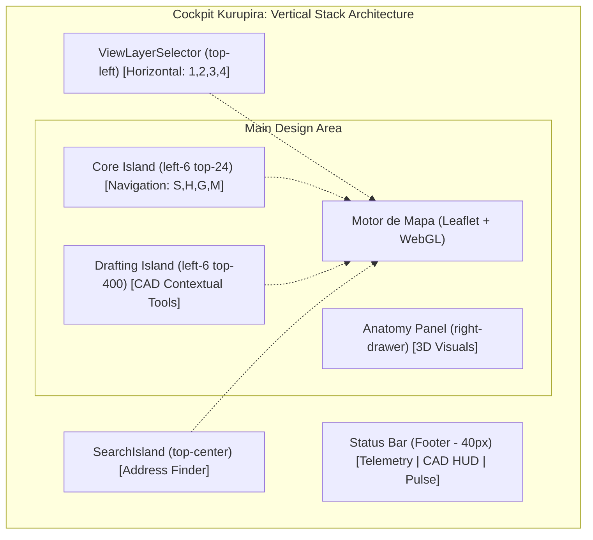

Este documento mapeia a arquitetura visual e funcional do cockpit de **Arranjo Físico**. O design segue a estética de "Ferramenta de Engenharia" com a arquitetura **Zero-UI**, caracterizada pela ausência de barras fixas e o uso de **Ilhas Flutuantes Contextuais**.

## 0. Desenho Técnico do Layout (Zero-UI Architecture)

---

## 1. Estrutura de Camadas (Z-Index Hierarchy)
1. **Z-Base**: Mapa Cartográfico (Google/Mapbox/Esri)
2. **Z-GFX**: Motor WebGL (WebGLOverlay) - Renderização de módulos e blocos.
3. **Z-UI-Interativa**: Camadas Leaflet (Markers, Polygons de desenho).
4. **Z-Floating-UI**: ViewLayerSelector, CoreIsland (top-24), DraftingIsland (top-400) e SearchIsland (z-1100 a z-1200).
5. **Z-Panels**: Anatomy Sheet (Side drawer).

---

## 2. Componentes de Interface (Floating Islands)
O cockpit elimina sidebars tradicionais em favor de pílulas flutuantes com `backdrop-blur` e bordas industriais, agora alinhadas em uma coluna única à esquerda.

### 2.1 View Layer Selector (Horizontal - top-left)
Localizado no topo esquerdo (`left-6 top-8`), permite alternar a "consciência" técnica do canvas.
- **Nomenclatura Técnica**:
    - `1`: **Locação** (Mapeamento geográfico).
    - `2`: **Prancheta** (Desenho CAD e Arranjo).
    - `3`: **Topologia** (Lógica de interconexão).
    - `4`: **Unifilar** (Diagrama normativo).

### 2.2 Atomic Action Islands (Stacked - left-6 top-24)
O cockpit utiliza o padrão de **Tool Stacks** (Grupos de Ferramentas) com interação **Split-click** para máxima velocidade operacional.

- **Interação (Split-click)**:
    - **Corpo do Botão**: Ativa instantaneamente a ferramenta visível (Zero Latency).
    - **Canto Inferior Direito (Hitbox Otimizada)**: Um alvo de clique dedicado sobre o indicador visual que abre o menu **Flyout** lateral.
- **Feedback Visual**: Botões com sub-ferramentas exibem um triângulo no canto. O ícone principal do slot é atualizado para refletir a ferramenta ativa do grupo.

#### 2.2.1 Manipulation Island (Grouped)
- **Foco**: Controle e alteração de objetos.
- **Ferramentas Agrupadas**: `Selecionar` (S), `Mover / Transformar` (G).

#### 2.2.2 Navigation Island
- **Foco**: Deslocamento e leitura da cena.
- **Ferramentas**: `Mão / Pan` (H), `Medir / Régua` (M).

#### 2.2.3 Vision Island
- **Foco**: Diagnósticos visuais.
- **Ferramentas**: `Anatomia` (Eye).

### 2.3 Drafting Island (Creation - Stacked)
Ilha contextual que emerge para tarefas de criação, integrada à base da pilha vertical. Aparece apenas nos modos **Locação** e **Prancheta**.
- **Site Controls**: `Área` (POLYGON).
- **Arrangement**: Seletor de Superfície (`C`, `M`, `F`, `L`), `Auto-Layout`.
- **Electrical**: Ferramentas de `Stringing` e `Interconexão`.

### 2.4 Navigation Lock (Arranjo Mode)
No modo **Arranjo (Prancheta)**, a navegação do canvas (arrasto e scroll) é **travada por padrão**.
- **Regra**: O deslocamento do "papel" só é permitido quando a ferramenta **Mão (PAN)** estiver ativa.
- **Objetivo**: Evitar deslocamentos acidentais da viewport durante o posicionamento milimétrico de equipamentos.

### 2.4 Status Bar e HUDs (Footer)
Concentra telemetria passiva e feedbacks de modos ativos (CAD/Stringing).
- **Telemetria**: Lat/Lng, Área Total, Área Útil, FDI e Contador de Módulos.
- **CAD HUD**: Ativado durante o desenho, exibe contagem de vértices e botões de `Finalizar/Cancelar`.
- **Stringing HUD**: Exibe `Voc Total` e `Isc` em tempo real durante a conexão.

---

## 3. Arquitetura das Visões (The Four Pillars)

### 3.1 Modo Locação (Shortcut: 1)
**Propósito**: Identificação de obstáculos e posicionamento macro.
- **Visual**: Satélite em brilho total, foco em detalhes geográficos reais.

### 3.2 Modo Prancheta (Shortcut: 2)
**Propósito**: Design técnico e precisão de desenho.
- **Visual**: Satélite desaturado com Grid Técnico Indigo (#4f46e5).
- **Foco**: Geometrias WebGL ganham contraste máximo sobre o fundo escurecido.

### 3.3 Modo Topologia (Shortcut: 3)
**Propósito**: Análise de blocos lógicos.
- **Visual**: Mapa oculto. Fundo sólido em `slate-950`.

### 3.4 Modo Unifilar (Shortcut: 4)
**Propósito**: Diagramação elétrica normativa.

---

## 4. Engenharia de Gesto e Feedback Visual
- **Desenho Ativo**: Indigo (#6366f1) - Perímetros de área.
- **Stringing Ativo**: Cyan (#22d3ee) - Fluxo CC.
- **Violance de Limite**: Rose (#f43f5e) - Sobrevoltagem de string (>800V).

---

## 5. Atalhos de Teclado (Shortcuts)
| Comando | Tecla | Função |
| :--- | :---: | :--- |
| **Locação** | `1` | Modo Contexto Geográfico |
| **Prancheta** | `2` | Modo Desenho CAD |
| **Topologia** | `3` | Modo Esquema Lógico |
| **Unifilar** | `4` | Modo Elétrico Normativo |
| **Polygon** | `P` | Desenhar perímetro |
| **Pan** | `H` | Ferramenta Mão |
| **Measure** | `M` | Régua |

---

## 6. Referências Técnicas (Código)
- **Orquestrador**: `PhysicalCanvasView.tsx`
- **Core Island**: `toolbars/MainActionIsland.tsx`
- **Drafting Island**: `toolbars/DraftingIsland.tsx`
- **Layer Selector**: `components/ViewLayerSelector.tsx`
- **Estado Global**: `uiStore.ts`

---

## 7. Workflow de Projeto (The Zero-UI Path)
1. **Locação (1)**: Uso da `SearchIsland` para centro geográfico -> `DraftingIsland` para desenhar perímetro (`P`).
2. **Prancheta (2)**: Seleção da superfície (`C`, `M`, `F`, `L`) -> Acionamento do `Auto-Layout`.
3. **Topologia (3)**: Refinamento das conexões entre strings e inversores.
4. **Validação (4)**: Verificação final de `Voc` e `FDI` no Footer antes do fechamento do projeto.
ão do modo `Contexto` para selecionar módulos e criar strings através da `StringToolbar`.
5. **Validação Final**: Verificação das métricas de `FDI` e `Voc` nos HUDs superiores antes da exportação.
