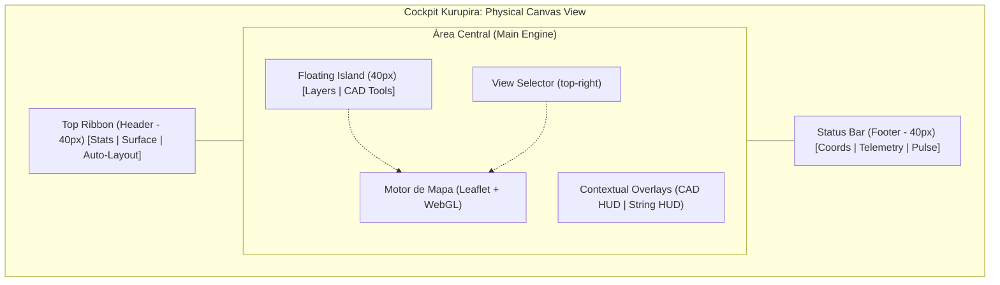

Este documento mapeia a arquitetura visual e funcional do cockpit de **Arranjo Físico**. O design segue a estética de "Ferramenta de Engenharia" com alta densidade de dados e controles iconográficos puros.

## 0. Desenho Técnico do Layout (Mockup de Interface)

---

## 1. Estrutura de Camadas (Z-Index Hierarchy)
1. **Z-Base**: Mapa Cartográfico (Google/Mapbox/Esri)
2. **Z-GFX**: Motor WebGL (WebGLOverlay) - Renderização de módulos e blocos.
3. **Z-UI-Interativa**: Camadas Leaflet (Markers, Polygons de desenho).
4. **Z-Overlays**: Ribbons, Island Toolbars e HUDs de Telemetria.

---

## 2. Componentes de Interface (Layout 40px Engineering Grid)
O cockpit é construído sobre uma unidade básica de **40px (10 unidades Tailwind)**, garantindo alinhamento industrial.

### 2.1 Faixa Superior (Top Ribbon - h-10)
Localizada no topo do `PhysicalCanvasView`, contém os parâmetros globais da área selecionada.
- **KPIs Elétricos**:
    - `Módulos`: Contador de módulos instalados vs. meta do dimensionamento.
    - `FDI Est.`: Fator de Dimensionamento do Inversor calculado em tempo real para a área.
- **Seletor de Superfície (SurfaceSelector)**:
    - Tipos: `Cerâmica`, `Metálico`, `Fibrocimento`, `Laje`.
    - Função: Altera o `roofType` no estado global, impactando o cálculo de trilhos e fixadores.
- **Controles CAD**:
    - `Auto-Layout`: Gatilho para o motor de preenchimento automático da área selecionada.

### 2.2 Ilha Flutuante (Left Island - Floating Toolbar)
Barra vertical suspensa à esquerda operando em modo `backdrop-blur`.
- **GlobalLayerToolbar (Map Control)**:
    - Seleção de Provedor: Satellite (Mapbox), Google (Alta Recência), Streets (OSM).
    - Toggle: `High Visibility Satellite` (Filtro de contraste).
    - Shortcuts: Zoom In/Out via botões de UI.
- **ArrangementToolbar (Drawing Tools)**:
    - `Área` (POLYGON): Desenho do perímetro da área de instalação.
    - `Corredor Técnico` (SUBTRACT): Desenho de zonas de exclusão/manutenção internas.
    - `Orientação`: Toggle entre Retrato (Portrait) e Paisagem (Landscape).
    - `Ajustar`: Acesso a parâmetros finos de afastamento (Eave, Ridge).
- **Inspectors**:
    - `Anatomia`: Toggle para visualização 3D/explodida da estrutura de fixação.

### 2.3 Barra de Status e Telemetria (Footer)
Localizada na base, fornece feedback geométrico e de sistema.
- **Coordenadas**: Visualização de Lat/Lng em tempo real.
- **Estatísticas Geométricas**:
    - `Área Útil`: Soma das áreas desenhadas subtraindo os corredores técnicos.
    - `Trilhos`: Estimativa linear (m) baseada na tipologia de superfície e área total.
- **System Pulse**: Indicador visual do status do motor gráfico (`Motor On-Thread` com animação pulse).

### 2.4 Seletor de Vistas (View Engine HUD)
Localizado no canto superior direito (`top-4 right-4`), permite alternar a "consciência" do canvas.
- **Estética**: Estilo Blender/CAD, botões compactos com ícones `Lucide`.
- **Feedback Ativo**: Fundo indigo (`bg-indigo-600`) com sombra de brilho difuso.
- **Atalhos Rápidos**: Teclas `1` a `4`.

---

## 3. Arquitetura das Visões (The Four Pillars)
Cada visão altera drasticamente o processamento visual do cockpit para focar em diferentes disciplinas de engenharia.

### 3.1 Modo Contexto (Shortcut: 1)
**Propósito**: Validação de arredores e obstáculos reais.
- **Visual**: Satélite em brilho total (`brightness-100`), cores naturais.
- **Foco**: Posicionamento macro, identificação de árvores, chaminés e sombras de vizinhos.

### 3.2 Modo Blueprint (Shortcut: 2)
**Propósito**: Design técnico e precisão de desenho.
- **Visual**: Satélite desaturado e escurecido (`brightness-[0.4] saturate-0`).
- **Grid Técnico**: Sobreposição de malha induzida em linha Indigo (`#4f46e5`) com espaçamento de `40px` (representando escala métrica ajustável).
- **Contraste**: Geometrias WebGL e linhas de desenho CAD ganham brilho intenso sobre o fundo escuro.

### 3.3 Modo Diagrama (Shortcut: 3)
**Propósito**: Análise de fluxos e blocos lógicos.
- **Visual**: Mapa cartográfico totalmente oculto (`opacity-0`). Fundo sólido em `slate-950`.
- **Foco**: Conectividade entre áreas de instalação e inversores, sem poluição visual geográfica.

### 3.4 Modo Unifilar (Shortcut: 4)
**Propósito**: Diagramação elétrica normativa.
- **Visual**: Abstração total. Linhas de stringing tornam-se o elemento primário.
- **Foco**: Cálculo de perdas, queda de tensão e balanceamento de strings.

---

## 4. HUDs de Interação (Contextual Overlays)
Interfaces dinâmicas que aparecem no topo do canvas (`Top-Center`) durante ações específicas:

### 3.1 Painel CAD (Modo Desenho)
Ativado ao selecionar áreas ou corredores técnicos.
- **Feedback**: Contador de vértices marcados no polígono atual.
- **Ações**: Botões de `Cancelar` e `Finalizar` (também acionado via tecla `Enter`).
- **Animação**: Entrada via `slide-in-from-top-4`.

### 3.2 Painel de Stringing (Validação Elétrica)
Ativado durante a ferramenta de conexão de módulos.
- **Métricas**: Exibe contagem de módulos selecionados em tempo real.
- **Guardrails**:
    - `Voc Total`: Soma das voltagens em circuito aberto. Alerta visual (cor `#f43f5e` / `rose-500`) se o valor exceder **800V**.
    - `Isc`: Corrente de curto-circuito máxima detectada na string.

---

## 4. Engenharia de Gesto e Feedback Visual
Especificações técnicas dos elementos gráficos de auxílio ao design:

### 4.1 Linhas de Guia e Snapping
- **Geometria de Área**: Linhas em `#6366f1` (Indigo-500), peso 3, tracejado `5, 10`.
- **Cotas Temporárias**: Tooltips exibindo a distância entre vértices em tempo real (ex: `12.50m`).
- **Snapping**: Ponto de atração magnética (`getSnappedPos`) que força ângulos ortogonais ou alinhamento com vértices adjacentes.

### 4.2 Lógica de Cores por Contexto
- **Desenho Ativo**: Indigo (`#6366f1`) - Foco na criação de polígonos.
- **Stringing Ativo**: Cyan (`#22d3ee`) - Representação de fluxo de energia CC.
- **Aviso de Erro/Limite**: Rose (`#f43f5e`) - Violação de norma técnica ou limite elétrico.

---

## 5. Atalhos de Teclado (Shortcuts)
| Comando | Tecla | Função |
| :--- | :---: | :--- |
| **Polygon** | `P` | Ativa ferramenta de desenho de área |
| **Subtract** | `S` | Ativa ferramenta de corredor técnico |
| **Drop Point** | `D` | Marca a saída de cabos CC (Site Mode) |
| **Measure** | `M` | Régua de medição linear |
| **Cancel** | `ESC` | Reseta a ferramenta ativa para SELECT |
- **Foco**: Seleção de provedor de dados e nitidez de imagem.

---

## 6. Lógica de Snapping e Precisão
A precisão centimétrica é garantida por dois sistemas:
1. **Snapping Ortogonal**: Força linhas retas em ângulos de 90° durante o desenho de áreas.
2. **Snapping de Vértice**: Magnatismo que atrai o cursor para pontos existentes a uma distância de `10px` na tela.

---

## 7. Referências Técnicas (Código)
- **Orquestrador**: `PhysicalCanvasView.tsx`
- **Toolbar Arranjo**: `toolbars/ArrangementToolbar.tsx`
- **Motor de Tiles**: `MapCore.tsx`
- **Estado Global**: `uiStore.ts`
- **Visualização 3D**: `AnatomyView.tsx`

---

## 8. Workflow de Projeto (The Engineering Path)
Sequência lógica de utilização da interface para um projeto de sucesso:

1. **Camada Site (1)**: Uso da `SiteToolbar` para delimitar o perímetro do telhado (`P`) e locar a saída CC (`D`).
2. **Camada Arranjo (2)**: Seleção da superfície no `SurfaceSelector` -> Desenho de corretores técnicos (`S`) -> Acionamento do `Auto-Layout`.
3. **Refinamento Visual (Blueprint)**: Troca para a visão `Blueprint (2)` para validar alinhamentos sob alto contraste.
4. **Conectorização (Electrical)**: Utilização do modo `Contexto` para selecionar módulos e criar strings através da `StringToolbar`.
5. **Validação Final**: Verificação das métricas de `FDI` e `Voc` nos HUDs superiores antes da exportação.
