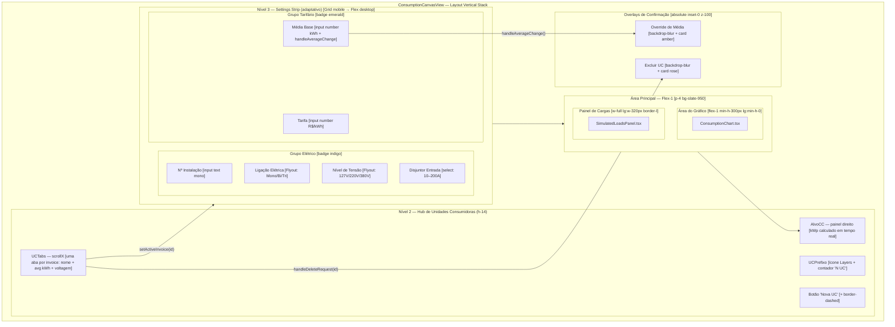
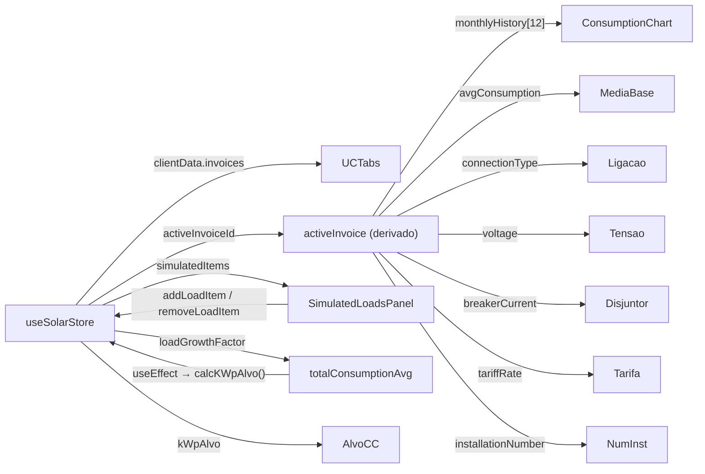

# Mapa de Interface — View de Consumo

Documento de arquitetura visual e funcional do cockpit **Consumo** no módulo de Engenharia do Kurupira. Esta view é responsável por capturar, validar e visualizar o perfil de consumo elétrico do cliente, configurar unidades consumidoras (UCs) e simular cargas futuras para dimensionamento do sistema FV.

---

## 0. Desenho Técnico do Layout



---

## 1. Hierarquia de Componentes

```
ConsumptionCanvasView.tsx (Orquestrador)
├── Nível 2: Hub de UCs
│   ├── UCPrefixo (ícone Layers, contagem)
│   ├── UCTabs (scroll horizontal, uma por invoice)
│   │   ├── Tab Ativa (border-t sky-500, dot pulse)
│   │   ├── Tab Inativa (hover bg-slate-900/40)
│   │   └── Botão Delete (X — visible on hover, somente se >1 UC)
│   ├── Botão Nova UC (+ border-dashed, addInvoice())
│   └── AlvoCC (kWpAlvo em kWp — lado direito)
│
├── Nível 3: Settings Strip
│   ├── Grupo Elétrico (badge indigo, Cable icon)
│   │   ├── Nº Instalação (input text)
│   │   ├── Flyout Ligação (Mono / Bi / Tri — click-to-expand)
│   │   ├── Flyout Tensão (127V / 220V / 380V — click-to-expand)
│   │   └── Select Disjuntor (10 a 200A)
│   └── Grupo Tarifário (badge emerald, DollarSign icon)
│       ├── Input Tarifa (R$/kWh)
│       └── Input Média (kWh — com guard hasManualHistory)
│
├── Área Principal
│   ├── ConsumptionChart.tsx
│   │   ├── KPI Bar (3 cards: Média / Pico / Total Anual)
│   │   ├── Controles TMY + Legenda
│   │   ├── Área do Gráfico (ResponsiveContainer + ComposedChart)
│   │   │   ├── Barras: consumoBase (sky) + cargasSimuladas (sky/30)
│   │   │   ├── Linha: média (ReferenceLine dashed)
│   │   │   ├── Linha Opcional: HSP (amber)
│   │   │   └── Linha Opcional: Temperatura Ambiente (rose dashed)
│   │   └── Grade Histórica (12 meses — inputs editáveis)
│   └── SimulatedLoadsPanel.tsx
│       ├── Header (Inventário de Cargas + total kWh)
│       ├── Atalho Rápido (select de presets de carga)
│       ├── Formulário Nova Carga (Nome + Potência + Uso + Add)
│       ├── Lista de Cargas Ativas (scroll, edit/delete por item)
│       └── Footer (Total Cargas + Projeção Média)
│
└── Overlays
    ├── Override de Média (pendingAvg !== null)
    └── Excluir UC (ucToDeleteId !== null)
```

---

## 2. Fluxo de Dados e Estado



### Regra Crítica: Guard de Histórico Manual
Quando `hasManualHistory = true` e o usuário altera a **Média Base**, o fluxo é interceptado:
1. `handleAverageChange(newVal)` → armazena `pendingAvg` no estado local (não grava no store ainda)
2. Overlay de Confirmação exibe a comparação visual (barras atual vs. novo padrão)
3. `confirmAverageChange()` → `updateActiveInvoice({ monthlyHistory: Array(12).fill(pendingAvg) })` e limpa `pendingAvg`

---

## 3. Anatomia dos Flyouts

Os flyouts de **Ligação Elétrica** e **Nível de Tensão** usam o padrão de **expansão contextual interna** (não um modal):

| Estado | Comportamento |
|--------|--------------|
| **Colapsado** | Exibe apenas a opção ativa (`bg-slate-800 text-indigo-400`) |
| **Expandido** | Exibe todas as opções com `animate-in slide-in-from-left-1` |
| **Seleção** | `updateActiveInvoice({ campo: valor })` + colapso automático |
| **Escape** | Click no overlay (`absolute inset-0 z-0`) fecha sem salvar |

---

## 4. Anatomia dos KPIs (ConsumptionChart)

| KPI | Ícone | Cor | Lógica |
|-----|-------|-----|--------|
| **Média Mensal** | TrendingUp | sky | `média dos meses com valor > 0` |
| **Pico Mensal** | ArrowUp | amber | `Math.max(...totais mensais)` |
| **Total Anual** | CalendarDays | indigo | `Σ mensais` — exibe em MWh se ≥1000 |

Estado vazio (`isEmpty`): todos os valores exibem `—` com sem unidade.

---

## 5. Camadas de Dados no Gráfico

```
ComposedChart (Recharts)
├── YAxis (left):  "energy" — kWh mensal (consumoBase + cargasSimuladas)
├── YAxis (right): "hsp" [opcional] — HSP com domínio adaptativo (min span 3.0)
├── YAxis (right): "temp" [opcional] — Temperatura °C com domínio adaptativo (min span 15°C)
├── Bar: consumoBase — barGradient (sky-500 → sky-500/60)
├── Bar: cargasSimuladas — barSimGradient (sky-500/40 → sky-500/10) [stackId="a"]
├── Line: media — ReferenceLine dashed sky/20 (referência visual)
├── Line: hsp — amber strokeWidth 2.5 [visível se showHSP]
└── Line: temp — rose strokeDasharray 4 2 [visível se showTemp]
```

**Tooltip customizado** (`CustomConsumptionTooltip`): Exibe base, simulado, total e (se ativo) HSP e Temperatura no formato técnico monoespaçado.

---

## 6. Presets de Carga (SimulatedLoadsPanel)

| Preset | Potência | H/Dia |
|--------|---------|-------|
| Ar-condicionado 12k BTU | 1200 W | 8 h |
| Geladeira Duplex | 150 W | 24 h |
| Chuveiro Elétrico | 5500 W | 0.5 h |
| Lavadora de Roupas | 500 W | 1 h |
| Micro-ondas | 1200 W | 0.2 h |
| Carregador VE | 7000 W | 4 h |
| Bomba de Piscina | 750 W | 6 h |
| Forno Elétrico | 1800 W | 0.5 h |

**Fórmula de cálculo de impacto:**
```
kWh/mês = (power × dutyCycle × hoursPerDay × daysPerMonth × qty) / 1000
```
*Preview ao vivo* é exibido quando `power > 0` e `hoursPerDay > 0`.

---

## 7. Responsividade por Breakpoint

| Elemento | Mobile (< sm) | Tablet (sm → lg) | Desktop (lg+) |
|---|---|---|---|
| **Settings Strip** | `flex-col` + grid 2 colunas por grupo | `grid-cols-4` (elétrico) / `grid-cols-3` (tarifário) | `flex-row` com `divide-x` |
| **UC Tabs** | Scroll horizontal, `min-w-[140px]` | `min-w-[160px]` | Livre |
| **KPI Bar** | `grid-cols-1` | `grid-cols-3` | `grid-cols-3` |
| **Controles TMY** | `flex-col` com border-bottom | `flex-row` com border-right | `flex-row` |
| **Grade Histórica** | `grid-cols-4` | `grid-cols-6` | `grid-cols-12` |
| **Formulário Nova Carga** | 2 colunas (Potência ocupa col-span-2) | 3 colunas | 3 colunas |
| **Botões de Ação** | Sempre visíveis (`opacity-100`) | Sempre visíveis | `opacity-0` → `group-hover:opacity-100` |
| **Layout Principal** | `flex-col` (gráfico acima, cargas abaixo) | `flex-col` | `flex-row` (gráfico + sidebar 320px) |

---

## 8. Padrões de Cor e Tokens

| Token | Hex / Classe | Uso |
|-------|-------------|-----|
| **Sky-500** | `#0ea5e9` | Dados históricos de consumo base |
| **Sky-500/30** | Opacity | Cargas simuladas (stacked bar) |
| **Amber-500** | `#f59e0b` | Linha de HSP e highlights de cargas |
| **Rose-500** | `#f43f5e` | Temperatura ambiente e alertas de exclusão |
| **Indigo-500** | `#6366f1` | Dot de kWpAlvo, badge Elétrico, tab ativa (borda) |
| **Emerald-400** | `#34d399` | Badge Tarifário, inputs de valores financeiros |
| **Slate-950** | bg | Background base da view |
| **Slate-900** | bg | Cards, tabelas, formulários internos |
| **Slate-800** | border | Separadores e bordas de componentes |

---

## 9. Overlays de Confirmação

### 9.1 Override de Média (`pendingAvg !== null`)
- **Gatilho**: Usuário altera o campo Média Base com `hasManualHistory = true`
- **Visual**: `backdrop-blur-md` + card `max-w-sm` amber
- **Conteúdo**: Texto explicativo + mini-gráfico (estado atual em cinza × novo padrão em amber)
- **Ações**: `Cancelar` (limpa `pendingAvg`) | `Aplicar` (commit ao store)

### 9.2 Excluir Unidade Consumidora (`ucToDeleteId !== null`)
- **Gatilho**: Clique no X da aba de uma UC com dados existentes
- **Proteção**: UCs sem dados são removidas diretamente sem overlay
- **Visual**: `backdrop-blur-md` + card rose com `AlertTriangle`
- **Ações**: `Cancelar` | `Confirmar Exclusão` → `removeInvoice(id)`

---

## 10. Referências Técnicas (Código)

| Arquivo | Responsabilidade |
|--------|-----------------|
| `ConsumptionCanvasView.tsx` | Orquestrador principal — Hub de UCs, Settings Strip, layout e overlays |
| `ConsumptionChart.tsx` | Gráfico Recharts, KPIs, controles TMY e grade histórica de edição |
| `SimulatedLoadsPanel.tsx` | Inventário de cargas simuladas — presets, formulário e lista |
| `solarStore.ts` → `clientSlice` | `invoices[]`, `activeInvoiceId`, `simulatedItems`, `kWpAlvo` |
| `journeySlice.ts` → `calcKWpAlvo()` | Motor de cálculo do kWp alvo a partir do histórico de consumo e HSP mensal |

---

## 11. Workflow de Operação (Engenheiro na View de Consumo)

```
1. SELEÇÃO DE UC
   └── Clicar na aba correspondente → setActiveInvoice(id)

2. CONFIGURAÇÃO ELÉTRICA (Nível 3)
   ├── Nº Instalação: digitar código da fatura
   ├── Ligação: clicar para expandir → selecionar Mono/Bi/Tri
   ├── Tensão: clicar para expandir → selecionar 127/220/380V
   └── Disjuntor: selecionar valor em Amperes

3. ENTRADA DE CONSUMO (ConsumptionChart)
   ├── Opção A — Média Simples: preencher campo "Média" (kWh)
   │   └── Preenche os 12 meses com o mesmo valor
   └── Opção B — Grade Histórica: editar cada mês individualmente
       └── Grade de 12 inputs editáveis inline

4. SIMULAÇÃO DE CARGAS FUTURAS (SimulatedLoadsPanel)
   ├── Atalho Rápido: selecionar preset (ex: Carregador VE)
   ├── Formulário Livre: Nome + Potência + Horas/dia → Add
   └── Lista Ativa: visualizar kWh/mês por item, editar ou excluir

5. VERIFICAÇÃO DO ALVO CC (Hub — canto direito)
   └── kWpAlvo atualizado automaticamente após cada mudança de consumo
       Fórmula: calcKWpAlvo(monthlyHistory, monthlyHSP, loadGrowthFactor)
```
