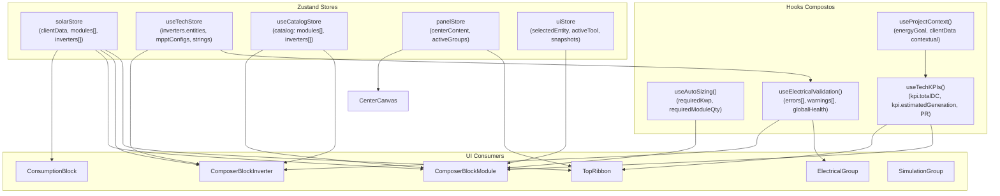

# Mapa de Interface Completo — Kurupira (Workspace de Engenharia Solar)

> **Última atualização**: 2026-04-14  
> **Versão do SaaS**: Kurupira v3.6.x  
> **Escopo**: Interface completa do módulo de Engenharia — do Hub ao Workspace

---

## Índice

1. [Visão Geral Macro](#1-visão-geral-macro)
2. [Hub de Projetos](#2-hub-de-projetos)
3. [Workspace de Engenharia](#3-workspace-de-engenharia)
   - 3.1 [Top Ribbon](#31-top-ribbon)
   - 3.2 [Center Canvas](#32-center-canvas-slot-polimórfico)
   - 3.3 [Left Outliner (Compositor Lego)](#33-left-outliner-compositor-lego)
   - 3.4 [Right Inspector (Grupos de Painéis)](#34-right-inspector-grupos-de-painéis)
   - 3.5 [Workspace Tabs (Bottom Excel-like)](#35-workspace-tabs-bottom-excel-like)
4. [Modais Globais](#4-modais-globais)
5. [Glossário de Terminologia Canônica](#5-glossário-de-terminologia-canônica)
6. [Mapa de Stores e Dependências](#6-mapa-de-stores-e-dependências)

---

## 1. Visão Geral Macro

```
┌──────────────────────────────────────────────────────────────────────────────┐
│                          HUB DE PROJETOS                                     │
│  [Header Strip: Busca + Filtros + "Novo Projeto"]                            │
│  [Grid de Project Cards (n×4)]                                               │
│      Click → SiteContextModal → "Dimensionar" → WORKSPACE                   │
└──────────────────────────────────────────────────────────────────────────────┘

                                    ↓ roteamento via setActiveModule()

┌──────────────────────────────────────────────────────────────────────────────┐
│  TOP RIBBON (40px)                                                           │
│  [Logo] [Arquivo/Editar/Exibir/Projeto] ──── [Ferramentas | Exportar | User]│
├──────────────┬────────────────────────────────────────────┬──────────────────┤
│              │                                            │                  │
│  LEFT        │           CENTER CANVAS                   │  RIGHT           │
│  OUTLINER    │    (Mapa Leaflet + WebGL Overlay)         │  INSPECTOR       │
│  (~240px)    │    ou                                     │  (~300px)        │
│              │    Canvas View alternativo                 │                  │
│  Compositor  │    (Simulação / Elétrica / Site /         │  Grupos de       │
│  Lego:       │     Propriedades / Settings / Proposta)   │  Painéis         │
│              │                                            │                  │
│  ⚡ Consumo  │                                            │  [PanelGroup]    │
│  ☀ Módulos  │                                            │  [ElecGroup]     │
│  🔲 Inversor │                                            │  [SimGroup]      │
│              │                                            │  [SiteGroup]     │
├──────────────┴────────────────────────────────────────────┴──────────────────┤
│  WORKSPACE TABS (Bottom Excel-like)                                          │
│  [📍 Mapa] [☀ Módulos] [⚡ Elétrica] [📊 Simulação] [🏗 Site] [📄 Proposta]│
└──────────────────────────────────────────────────────────────────────────────┘
```

---

## 2. Hub de Projetos

> **Componente raiz**: `ProjectExplorer.tsx`  
> Documentação detalhada: [mapa-projetos.md](./mapa-projetos.md)

### Layout

| Seção | Componente / Elemento | Função |
|-------|-----------------------|--------|
| Header Strip | Inline em `ProjectExplorer.tsx` | Busca, filtros de status, botão "Novo Projeto" |
| Grid de Cards | `ProjectCardComponent` (inline) | Visual-First: thumbnail satélite ou padrão generativo |
| Modal de Criação/Edição | `ProjectFormModal.tsx` | Wizard com mapa Leaflet inline |
| Modal de Contexto | `SiteContextModal.tsx` | Split-view: mapa + perfil de carga 12 meses |

### Fluxo de Entrada no Workspace

```
ProjectCard (click) → SiteContextModal (prévia)
    → "Dimensionar Projeto" → setActiveModule('engineering')
        → useProjectContext carrega solarStore com dados do projeto
        → Workspace renderiza com TopRibbon + CenterCanvas + LeftOutliner + RightInspector
```

---

## 3. Workspace de Engenharia

> **Componente raiz**: `EngineeringWorkspace.tsx` (orquestrador)  
> **Layout engine**: CSS Grid com colunas `[240px | 1fr | 300px]` e rows `[40px | 1fr | 32px]`

---

### 3.1 Top Ribbon

> **Arquivo**: `panels/TopRibbon.tsx` | Altura fixa: 40px

#### Seção Esquerda (Left)

| Elemento | Ícone / Tipo | Função |
|----------|-------------|--------|
| Logo Neonorte | `img` | Marca visual (opacidade 75%) |

#### Seção Central (Center)

| Elemento | Tipo | Função |
|----------|------|--------|
| Menu "Arquivo" | `button` | Placeholder (UI não implementada) |
| Menu "Editar" | `button` | Placeholder |
| Menu "Exibir" | `button` | Placeholder |
| Menu "Projeto" | `button` | Placeholder |

#### Seção Direita (Right)

| # | Nome Canônico | Ícone | Título | Ação |
|---|--------------|-------|--------|------|
| R-01 | **Botão Hub** | `LayoutDashboard` | "Voltar ao Explorador" | `setActiveModule('hub')` |
| R-02 | **Botão Desfazer** | `Undo2` | "Desfazer (Ctrl+Z)" | `undo()` via Zundo |
| R-03 | **Botão Refazer** | `Redo2` | "Refazer (Ctrl+Y)" | `redo()` via Zundo |
| R-04 | **Engineering Guidelines Widget** | `Info/CheckCircle2/AlertTriangle` | Status das diretrizes | Widget de KPIs inline |
| R-05 | **Health Check Widget** | `Info/CheckCircle2/AlertTriangle` | Saúde do sistema | Validação elétrica resumida |
| R-06 | **Approval Dropdown** | `Flag` + `ChevronDown` | Status do projeto | Dropdown: Rascunho ↔ Aprovado |
| R-07 | **Dados do Cliente** | `User` | "Dados do Cliente" | Abre `ClientDataModal` |
| R-08 | **Premissas Globais** | `Activity` | "Premissas e Perdas Globais" | Abre `SettingsDrawer` |
| R-09 | **Fullscreen Toggle** | `Maximize2` / `Minimize2` | "Modo Tela Cheia" | `requestFullscreen()` |
| R-10 | **Botão Exportar** | `Download` | "Exportar Proposta PDF" | Captura viewport → `setActiveModule('proposal')` |
| R-11 | **Badge Role** | `ShieldCheck` / `ShieldAlert` | Role do usuário | Read-only: ADMIN (vermelho) / USER (verde) |

---

### 3.2 Center Canvas (Slot Polimórfico)

> **Arquivo**: `panels/CenterCanvas.tsx`  
> **Paradigma**: Slot polimórfico — pode renderizar o mapa padrão **ou** uma Canvas View alternativa.  
> O mapa Leaflet **NUNCA desmonta** (usa `display:none`).

#### Modo Mapa (padrão)

| Layer | Componente | Tecnologia |
|-------|-----------|------------|
| Mapa Base | `MapCore.tsx` | Leaflet.js |
| Overlay 3D | `WebGLOverlay.tsx` | React Three Fiber (R3F) |

#### Ferramentas do Mapa (HUD flutuante)

| Ferramenta | Ícone | Shortcut | Descrição |
|-----------|-------|----------|-----------|
| **Selecionar** | `MousePointer2` | `V` | Seleção padrão |
| **Desenhar Polígono** | `Pentagon` | `P` | Define área de implantação |
| **Medir Distância** | `Ruler` | `M` | Régua no mapa |
| **Colocar Módulos** | `LayoutGrid` | `L` | Posicionamento de painéis |

#### Canvas Views Alternativas (Registry)

| ID | Componente | Descrição |
|----|-----------|-----------|
| `site` | `SiteCanvasView.tsx` | Vista de contexto do terreno |
| `simulation` | `SimulationCanvasView.tsx` | Simulação anual de geração (gráficos) |
| `electrical` | `ElectricalCanvasView.tsx` | Diagrama elétrico e strings |
| `properties` | `PropertiesGroup.tsx` | Inspector de propriedades do elemento selecionado |
| `settings` | `SettingsModule.tsx` | Configurações globais de perdas/premissas |
| `documentation` | `DocumentationModule.tsx` | Documentação técnica do sistema |
| `proposal` | `ProposalModule.tsx` | Preview e exportação da proposta PDF |

---

### 3.3 Left Outliner (Compositor Lego)

> **Arquivo**: `panels/LeftOutliner.tsx` + subcomponentes  
> Documentação detalhada: [mapa-left-outliner.md](./mapa-left-outliner.md)

#### Topologia de Arquivos

```
panels/
├── LeftOutliner.tsx                        ← Orquestrador + ConsumptionBlock + LockedBlock
└── canvas-views/composer/
    ├── LegoConnectors.tsx                  ← LegoTab + LegoNotch
    ├── ComposerBlockModule.tsx             ← Bloco Módulos FV
    ├── ComposerBlockInverter.tsx           ← Bloco Inversor
    └── ComposerPlaceholder.tsx             ← Placeholder genérico (legado)
```

#### Pilha de Blocos (v3.6)

```
┌─────────────────────────────────┐
│  ⚡ Consumo           [Cidade]  │  ← ConsumptionBlock (rounded-t-sm)
│  ────────────────────────────── │
│  Consumo Médio  |  (kWh/mês)   │  ← Stats Compact Row (hero)
│  ────────────────────────────── │
│  [anual] [tipo_ligação] [hsp]  │  ← Metadata Badges
│             [kWh]               │  ← LegoTab amber
├─────────────────────────────────┤  ← LegoNotch sky
│  ☀ Módulos FV     X.XX kWp    │  ← ComposerBlockModule
│  ────────────────────────────── │
│  Potência DC  |  Geração Est.  │  ← Stats Compact Row
│  [Rows: QTD× Modelo W]         │  ← Module Groups
│  [+ OUTRO MODELO]               │
│              [DC]               │  ← LegoTab sky
├─────────────────────────────────┤  ← LegoNotch emerald
│  🔲 Marca/Modelo     X.XkW    │  ← ComposerBlockInverter (rounded-b-sm)
│  [Ratio] [Voc] [Isc]           │  ← StatusChips
│  ⚠ Mensagens de validação      │  ← Validation Messages
│              [AC]               │  ← LegoTab emerald
└─────────────────────────────────┘
```

#### Cascata de Ativação

| Bloco | Condição de Ativação | Fallback |
|-------|---------------------|---------|
| **Consumo** | Sempre ativo | — |
| **Módulos FV** | `averageConsumption > 0` | `LockedBlock` cinza |
| **Inversor** | `modules.length > 0` | `LockedBlock` cinza |

---

### 3.4 Right Inspector (Grupos de Painéis)

> **Pasta**: `panels/groups/`  
> Cada grupo é um painel que pode ser renderizado no slot direito **ou** promovido para o Center Canvas.

| Arquivo | ID | Função | Trigger de Abertura |
|---------|-----|--------|---------------------|
| `PropertiesGroup.tsx` | `properties` | Inspetor de propriedades da entidade selecionada | Click em elemento no canvas |
| `ElectricalGroup.tsx` | `electrical` | Validação elétrica completa: strings, Voc, Isc, FDI | Tab "Elétrica" |
| `PanelGroup.tsx` | (base) | Layout base reutilizável dos grupos | — |
| `SimulationGroup.tsx` | `simulation` | Simulação de geração anual, TMY, irradiância | Tab "Simulação" |
| `SiteContextGroup.tsx` | `site` | Contexto espacial: área, cobertura, sombreamento | Tab "Site" |

#### PropertiesGroup

> **Arquivo**: `groups/PropertiesGroup.tsx`  
> Exibe propriedades contextuais do elemento selecionado via `useSelectedEntity()`.

| Estado | Conteúdo |
|--------|---------|
| Sem seleção | Placeholder "Selecione um elemento no canvas" |
| Módulo selecionado | Potência, modelo, posição |
| String selecionada | Módulos conectados, MPPT |

#### ElectricalGroup

> **Arquivo**: `groups/ElectricalGroup.tsx`  
> Validação elétrica completa via `useElectricalValidation()`.

| Seção | Dados |
|-------|-------|
| Sumário Global | `globalHealth`: OK / Warning / Error |
| Strings | Lista de strings com Voc, Isc, N_módulos |
| Chips de Status | Ratio DC/AC (FDI), Voc_max, Isc_max |
| Mensagens | Lista de erros/warnings com severidade |

#### SimulationGroup

> **Arquivo**: `groups/SimulationGroup.tsx`  
> Simulação de geração anual via `useElectricalValidation()` + dados TMY.

| Seção | Dados |
|-------|-------|
| Geração Mensal | Gráfico de barras 12 meses (kWh) |
| Totais | Geração anual (kWh), Cobertura (%) |
| Irradiância | HSP médio, dados CRESESB |
| PR (Performance Ratio) | Modo IEC 61724 ou Soma Simples |

---

### 3.5 Workspace Tabs (Bottom Excel-like)

> **Arquivo**: `panels/WorkspaceTabs.tsx`  
> Barra inferior de 32px com abas de navegação entre Canvas Views.

| Aba | Ícone | Canvas View | Ação |
|-----|-------|-------------|------|
| 📍 **Mapa** | `Map` | Leaflet + WebGL | `restoreMap()` |
| ☀ **Módulos** | `Sun` | `ComposerBlockModule` | Switch center |
| ⚡ **Elétrica** | `Zap` | `ElectricalCanvasView` | Switch center |
| 📊 **Simulação** | `BarChart2` | `SimulationCanvasView` | Switch center |
| 🏗 **Site** | `Building` | `SiteCanvasView` | Switch center |
| 📄 **Proposta** | `FileText` | `ProposalModule` | Switch center |

---

## 4. Modais Globais

| Modal | Componente | Trigger | Função |
|-------|-----------|---------|--------|
| **Dados do Cliente** | `ClientDataModal.tsx` | Botão `User` no TopRibbon | Edição dos dados de consumo, tarifa e localização |
| **Criar Projeto** | `ProjectFormModal.tsx` | Botão "+ Novo Projeto" no Hub | Formulário de criação com mapa Leaflet inline |
| **Editar Projeto** | `ProjectFormModal.tsx` (modo edit) | Botão ✏️ no ProjectCard | Pré-preenchido com dados do projeto |
| **Contexto do Site** | `SiteContextModal.tsx` | Click no ProjectCard | Preview split-view antes de abrir workspace |
| **Settings Drawer** | `SettingsModule` via Drawer | Botão `Activity` no TopRibbon | Premissas globais (PR, perdas, temp. mínima) |

---

## 5. Glossário de Terminologia Canônica

| Termo UI | Significado Técnico | Contraparte no Código |
|----------|--------------------|-----------------------|
| **Hub** | Tela de Explorador de Projetos | `ProjectExplorer.tsx` |
| **Card** | Item visual de projeto na grid | `ProjectCardComponent` |
| **Workspace** | Ambiente completo de engenharia | `EngineeringWorkspace.tsx` |
| **Left Outliner** | Painel esquerdo do workspace | `LeftOutliner.tsx` |
| **Right Inspector** | Painel direito com grupos de dados | `panels/groups/*.tsx` |
| **Center Canvas** | Slot polimórfico central | `CenterCanvas.tsx` |
| **Canvas View** | Vista renderizada no Center Canvas | `SiteCanvasView`, `SimulationCanvasView`, etc. |
| **Compositor Lego** | Metáfora dos blocos encaixáveis | Pilha `Consumo → Módulos → Inversor` |
| **Bloco** | Unidade visual e funcional do Compositor | `ConsumptionBlock`, `ComposerBlockModule`, `ComposerBlockInverter` |
| **LockedBlock** | Bloco fantasma (pré-condição não satisfeita) | `LockedBlock` em `LeftOutliner.tsx` |
| **LegoTab** | Aba de conexão na base de cada bloco | `LegoConnectors.tsx > LegoTab` |
| **LegoNotch** | Encaixe no topo de cada bloco receptor | `LegoConnectors.tsx > LegoNotch` |
| **Stats Compact Row** | Linha com 2 métricas hero lado a lado | Pattern visual: `kWh/mês | Custo` |
| **Metadata Badge** | Pílula de dado secundário compacto | `text-[8px] ... px-1.5 py-0.5 rounded-sm` |
| **Health Check** | Semáforo de validação elétrica | `HealthCheckWidget` no TopRibbon |
| **Approval Dropdown** | Controle de status do projeto | `ApprovalDropdown` no TopRibbon |
| **FDI** | Fator de Dimensionamento do Inversor | `dcAcRatio = totalDC / totalAC` |
| **HSP** | Horas de Sol Pleno média | `avgHsp` derivado de `monthlyIrradiation` |
| **PR** | Performance Ratio (eficiência sistêmica) | `getAdditivePerformanceRatio()` |
| **Visual-First** | Paradigma: thumbnail > texto tabular | ProjectCard: mapa satélite em destaque |
| **Lego Snap** | Animação de encaixe dos blocos | `@keyframes lego-snap` em `index.css` |

---

## 6. Mapa de Stores e Dependências



---

## Referências Cruzadas

| Doc | Conteúdo | Link |
|-----|---------|------|
| `mapa-projetos.md` | Hub de Projetos: cards, modais, fluxo de entrada | [mapa-projetos.md](./mapa-projetos.md) |
| `mapa-left-outliner.md` | LeftOutliner: detalhamento dos blocos, animações, geometria de encaixe | [mapa-left-outliner.md](./mapa-left-outliner.md) |
| `mapa-dimensionamento.md` | Motor de cálculo: PR, FDI, auto-sizing | [mapa-dimensionamento.md](./mapa-dimensionamento.md) |
