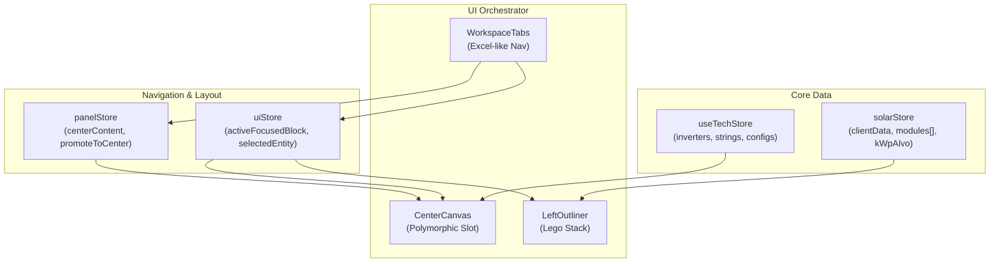

# Mapa de Interface Completo — Kurupira (Workspace de Engenharia Solar)

> **Última atualização**: 2026-04-16  
> **Versão do SaaS**: Kurupira v3.8.x  
> **Escopo**: Interface atualizada com Slot Polimórfico e Layout Minimalista (v2)

---

## Índice

1. [Visão Geral Macro](#1-visão-geral-macro)
2. [Hub de Projetos](#2-hub-de-projetos)
3. [Workspace de Engenharia](#3-workspace-de-engenharia)
   - 3.1 [Top Ribbon](#31-top-ribbon)
   - 3.2 [Center Canvas (Slot Polimórfico)](#32-center-canvas-slot-polimórfico)
   - 3.3 [Left Outliner (Compositor Lego)](#33-left-outliner-compositor-lego)
   - 3.4 [Centric Groups (Painéis Promovidos)](#34-centric-groups-painéis-promovidos)
   - 3.5 [Workspace Tabs (Bottom Excel-like)](#35-workspace-tabs-bottom-excel-like)
4. [Modais Globais](#4-modais-globais)
5. [Glossário de Terminologia Canônica](#5-glossário-de-terminologia-canônica)
6. [Mapa de Stores e Dependências](#6-mapa-de-stores-e-dependências)

---

## 1. Visão Geral Macro

```
┌──────────────────────────────────────────────────────────────────────────────┐
│                          HUB DE PROJETOS                                     │
│  [Header Strip: Busca + Filtros + "Novo Projeto"]                            │
│  [Grid de Project Cards (n×4)]                                               │
│      Click → SiteContextModal → "Dimensionar" → WORKSPACE                   │
└──────────────────────────────────────────────────────────────────────────────┘

                                    ↓ roteamento via setActiveModule()

┌──────────────────────────────────────────────────────────────────────────────┐
│  TOP RIBBON (40px)                                                           │
│  [Logo] [Arquivo/Editar/Exibir/Projeto] ──── [Ferramentas | Exportar | User]│
├──────────────┬──────────────────────────────────────────────────────────────┤
│              │                                                              │
│  LEFT        │           CENTER CANVAS (70-100% width)                      │
│  OUTLINER    │    (Slot Polimórfico: Mapa vs Views de Engenharia)           │
│  (240px)     │                                                              │
│              │    - Modo Mapa (Leaflet + WebGL)                             │
│  Compositor  │    - Modo Jornada (Overlay: Consumo/Elétrica/Simumação)      │
│  Lego:       │    - Modo Promovido (Full Body: Propriedades/Settings/Docs)  │
│              │                                                              │
│  ⚡ Consumo  │                                                              │
│  ☀ Módulos  │                                                              │
│  🔲 Inversor │                                                              │
│              │                                                              │
├──────────────┴──────────────────────────────────────────────────────────────┤
│  WORKSPACE TABS (Bottom Excel-like)                                          │
│  [⚡ Consumo] [☀ Módulos] [📐 Arranjo] [🛡 Elétrica] [📊 Simulação] [📍 Mapa]│
└──────────────────────────────────────────────────────────────────────────────┘
```

---

## 2. Hub de Projetos

> **Componente raiz**: `ProjectExplorer.tsx`  
> Documentação detalhada: [mapa-projetos.md](./mapa-projetos.md)

### Layout

| Seção | Componente / Elemento | Função |
|-------|-----------------------|--------|
| Header Strip | Inline em `ProjectExplorer.tsx` | Busca, filtros de status, botão "Novo Projeto" |
| Grid de Cards | `ProjectCardComponent` (inline) | Visual-First: thumbnail satélite ou padrão generativo |
| Modal de Criação/Edição | `ProjectFormModal.tsx` | Wizard com mapa Leaflet inline |
| Modal de Contexto | `SiteContextModal.tsx` | Split-view: mapa + perfil de carga 12 meses |

---

## 3. Workspace de Engenharia

> **Componente raiz**: `EngineeringWorkspace.tsx` (orquestrador)  
> **Layout engine**: CSS Grid simplificado: colunas `[240px | 1fr]` e rows `[40px | 1fr | 32px]`

---

### 3.1 Top Ribbon

> **Arquivo**: `panels/TopRibbon.tsx` | Altura fixa: 40px

#### Seção Esquerda (Left)

| Elemento | Ícone / Tipo | Função |
|----------|-------------|--------|
| Logo Neonorte | `img` | Marca visual (opacidade 75%) |

#### Seção Direita (Right)

| # | Nome Canônico | Ícone | Título | Ação |
|---|--------------|-------|--------|------|
| R-01 | **Botão Hub** | `LayoutDashboard` | "Voltar ao Explorador" | `setActiveModule('hub')` |
| R-02 | **Botão Desfazer** | `Undo2` | "Desfazer (Ctrl+Z)" | `undo()` via Zundo |
| R-03 | **Botão Refazer** | `Redo2` | "Refazer (Ctrl+Y)" | `redo()` via Zundo |
| R-04 | **Engineering Guidelines** | `Info/Check` | Status das diretrizes | Widget de KPIs inline |
| R-05 | **Health Check** | `Activity` | Saúde do sistema | Validação elétrica resumida |
| R-06 | **Approval Dropdown** | `Flag` | Status do projeto | Dropdown: Rascunho ↔ Aprovado |
| R-07 | **Dados do Cliente** | `User` | "Dados do Cliente" | Abre `ClientDataModal` |
| R-08 | **Premissas Globais** | `Settings` | "Premissas e Perdas" | Abre `isSettingsDrawerOpen` |
| R-09 | **Fullscreen Toggle** | `Maximize2` | "Modo Tela Cheia" | `requestFullscreen()` |

---

### 3.2 Center Canvas (Slot Polimórfico)

> **Arquivo**: `panels/CenterCanvas.tsx`  
> **Paradigma**: SLOT POLIMÓRFICO. A área central não é apenas um mapa, mas um container inteligente que alterna entre diferentes modos de visualização baseado no `centerContent` e `focusedBlock`.

#### 1. Modo Mapa (O Backbone)
O mapa Leaflet (`MapCore.tsx`) é carregado uma vez e **NUNCA é desmontado**. 
- Se `centerContent === 'map'`, ele ocupa todo o slot.
- Se `centerContent !== 'map'`, ele é movido via **Portal** para o `#minimap-portal-target`.

#### 2. Modo Jornada (Frozen Overlays)
As telas principais da jornada de engenharia não substituem o mapa, mas flutuam sobre ele usando o wrapper `FrozenViewContainer`.
- **Consumo**: `ConsumptionCanvasView.tsx`
- **Elétrica**: `ElectricalCanvasView.tsx`
- **Simulação**: `SimulationCanvasView.tsx`

#### 3. Modo Promovido (Painéis Centrais)
Painéis que exigem foco total e não se beneficiam de ter o mapa ao fundo (ex: Documentação, Proposta, Propriedades).
- São renderizados pelo componente `PromotedPanelView`.
- Ativados quando `centerContent` aponta para um `PanelGroupId`.

---

### 3.3 Left Outliner (Compositor Lego)

> **Arquivo**: `panels/LeftOutliner.tsx` | Largura: 240px  
> **Conceito**: Uma pilha vertical de blocos interativos que representam a topologia do sistema.

#### Pilha de Blocos
1. **Consumo ⚡**: Dados de fatura, localização e kWp alvo.
2. **Módulos FV ☀**: Seleção de equipamentos DC, potência total e arranjos.
3. **Inversor 🔲**: Dimensionamento AC, FDI e integração elétrica.

*Cada bloco possui "encaixes" (`LegoTab` / `LegoNotch`) que simbolizam o fluxo de energia.*

---

### 3.4 Centric Groups (Painéis Promovidos)

> **Pasta**: `panels/groups/`  
> Antigamente parte do *Right Inspector*, agora esses grupos assumem o centro da tela quando ativados.

| Grupo | ID | Função |
|-------|-----|--------|
| **PropertiesGroup** | `properties` | Inspetor de propriedades do elemento selecionado (módulo, string, área). |
| **ElectricalGroup** | `electrical` | Painel de monitoramento de saúde elétrica (Voc, Isc, FDI). |
| **SimulationGroup** | `simulation` | Gráficos de geração mensal, irradiância CRESESB e PR. |
| **SiteContextGroup** | `site` | Área do terreno, cobertura satélite e sombreamento. |

---

### 3.5 Workspace Tabs (Bottom Excel-like)

> **Arquivo**: `panels/WorkspaceTabs.tsx`  
> Barra inferior persistente para navegação rápida entre contextos.

| Aba | Ícone | Descrição |
|-----|-------|-----------|
| **Consumo** | `Zap` | Foco no perfil de carga e premissas iniciais. |
| **Módulos** | `LayoutDashboard` | Seleção e configuração de módulos no catálogo. |
| **Arranjo** | `Layers` | Distribuição física e strings no mapa. |
| **Elétrica** | `ShieldCheck` | Validação técnica e conformidade do inversor. |
| **Simulação** | `BarChart2` | Análise de ROI e geração estocástica. |
| **Mapa** | `MapPin` | Retorno à vista limpa do mapa satélite. |

---

### 4. Modais Globais

| Modal | Componente | Trigger |
|-------|-----------|---------|
| **Setup do Cliente** | `ClientDataModal.tsx` | Botão `User` no TopRibbon |
| **Premissas do Projeto** | `SettingsModule` | Botão `Settings` (abre Drawer lateral) |
| **Contexto do Site** | `SiteContextModal.tsx` | Click no ProjectCard no Hub |

---

## 5. Glossário de Terminologia Canônica

| Termo UI | Significado Técnico |
|----------|--------------------|
| **Slot Polimórfico** | Container central que muda de forma sem perder o estado dos componentes internos. |
| **Promoted Panel** | Um grupo de dados (ex: Elétrica) que foi "promovido" para ocupar o espaço central. |
| **Frozen View** | Componente sobreposto ao mapa que mantém seu estado "congelado" em background para performance. |
| **Compositor Lego** | A barra esquerda onde blocos de engenharia são empilhados. |
| **Lego Snap** | O efeito visual/mecânico de conectar um bloco ao outro através de dependências. |
| **Minimap Portal** | Sistema que move o mapa principal para um slot pequeno quando uma vista full-screen é ativada. |
| **Right Inspector** | *(DESCONTINUADO)* - Funcionalidade absorvida pelos Centric Groups. |

---

## 6. Mapa de Stores e Dependências



---

## Referências Cruzadas

| Doc | Conteúdo |
|-----|---------|
| `mapa-projetos.md` | Detalhamento do Hub e Fluxo de Entrada. |
| `mapa-left-outliner.md` | Detalhamento técnico da geometria dos blocos Lego. |
| `mapa-dimensionamento.md` | Regras de cálculo e motores de simulação. |
