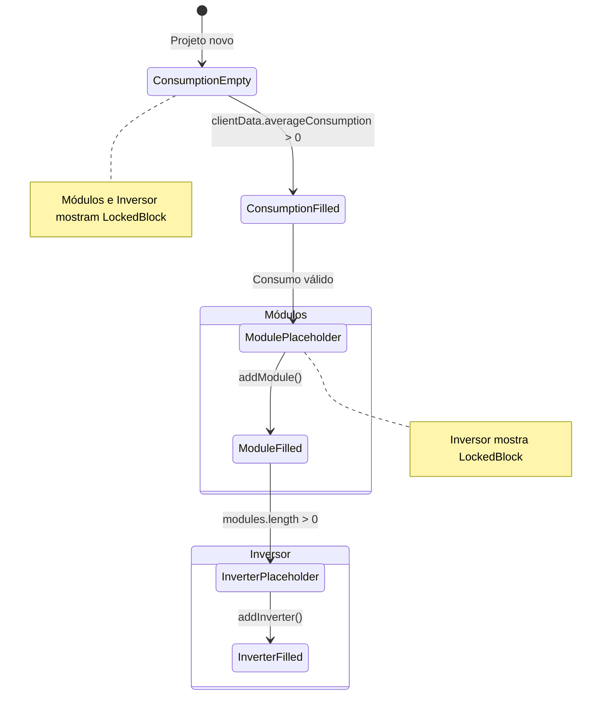
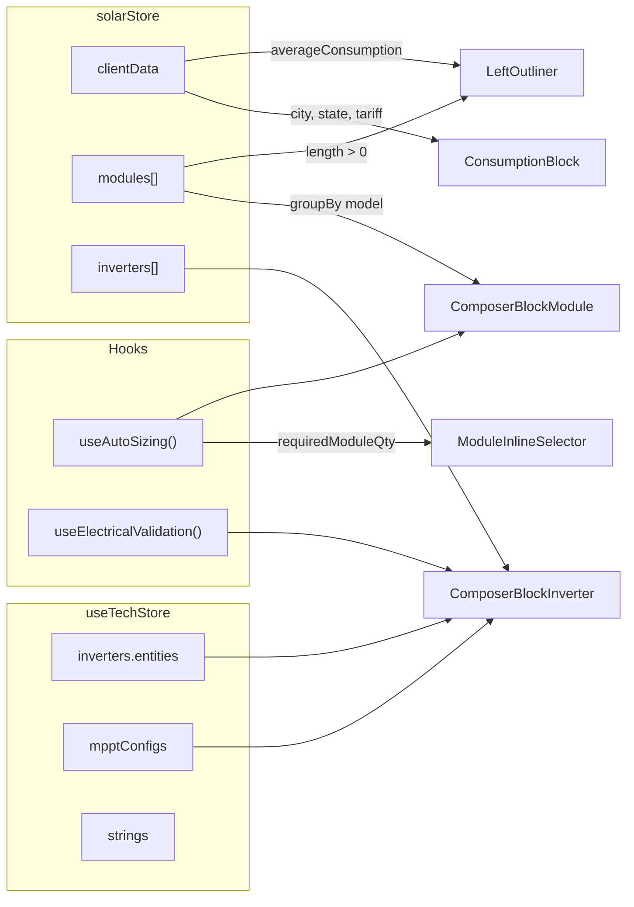

# Mapa de Interface — Left Outliner (Compositor Lego)

> **Última atualização**: 2026-04-14  
> **Componente raiz**: `LeftOutliner.tsx`  
> **Caminho**: `kurupira/frontend/src/modules/engineering/ui/panels/LeftOutliner.tsx`

---

## Visão Geral

O `LeftOutliner` é o painel esquerdo do workspace de engenharia. Ele implementa um **Compositor Lego** — uma pilha vertical fixa de blocos que representam o fluxo elétrico de um sistema fotovoltaico:

```
Consumo (kWh) → Módulos FV (DC) → Inversor (AC)
```

Cada bloco é independente, auto-gerenciado, e se encaixa fisicamente no bloco anterior via conectores Lego (tabs e notches).

---

## Topologia de Arquivos

```
panels/
├── LeftOutliner.tsx                        ← Orquestrador + ConsumptionBlock + LockedBlock
│
└── canvas-views/composer/
    ├── LegoConnectors.tsx                  ← LegoTab + LegoNotch (encaixes reutilizáveis)
    ├── ComposerBlockModule.tsx             ← Bloco Módulos FV + ModuleInlineSelector
    ├── ComposerBlockInverter.tsx           ← Bloco Inversor + InverterInlineSelector
    └── ComposerPlaceholder.tsx             ← [DEPRECATED] Placeholder genérico antigo
```

---

## Layout Visual

```text
┌─────────────────────────────────┐
│  ⊕ GERADOR SOLAR        [header]│  ← Layers icon, título fixo
├─────────────────────────────────┤
│ ╭───────────────────────────╮   │  ← rounded-t-xl
│ │  ⚡ Consumo    600 kWh/mês │   │  ← ConsumptionBlock
│ │  7.200 kWh/ano · Mono · …│   │  ← Stats Row
│ ╰──────┬──kWh──┬────────────╯   │  ← LegoTab "kWh"
│ ┌──────┴───────┴────────────┐   │  ← LegoNotch (encaixe)
│ │  ☀ Módulos FV    6.28 kWp │   │  ← ComposerBlockModule
│ │  9× DM630  │  1× DM610   │   │
│ │  + OUTRO MODELO           │   │
│ └──────┬───DC──┬────────────┘   │  ← LegoTab "DC"
│ ┌──────┴───────┴────────────┐   │  ← LegoNotch (encaixe)
│ │  🔲 Inversor              │   │  ← ComposerBlockInverter
│ │  Huawei SUN2000-5KTL      │   │
│ ╰──────┬───AC──┬────────────╯   │  ← LegoTab "AC", rounded-b-xl
│        └───────┘                │
└─────────────────────────────────┘
```

---

## Componentes Internos

### 1. Header do Painel

| Elemento | Ícone | Classe |
|----------|-------|--------|
| Título "Gerador Solar" | `Layers` (emerald) | `text-[11px] font-bold uppercase tracking-wider` |

---

### 2. ConsumptionBlock (Bloco Consumo)

> **Definido em**: `LeftOutliner.tsx` (inline)  
> **Função**: Exibir dados de consumo e localização do projeto. Sempre ativo (raiz da pilha).

| Elemento | Dados | Fonte |
|----------|-------|-------|
| Ícone | `Zap` (amber) | Lucide |
| Título | "Consumo" | Fixo |
| Localização | `{cidade}/{UF}` | `solarStore.clientData.city/state` |
| Chip principal | `{consumption} kWh/mês` | `solarStore.clientData.averageConsumption` |
| Stats Row | kWh/ano · Tipo Ligação · Tarifa · HSP | Derivados de `clientData` |
| Conector base | `LegoTab` label="kWh" | Âmbar quando válido, slate quando vazio |

**Border-radius**: `rounded-t-xl rounded-b-none` (topo arredondado, base reta para encaixe).

---

### 3. ComposerBlockModule (Bloco Módulos FV)

> **Arquivo**: `canvas-views/composer/ComposerBlockModule.tsx`  
> **Função**: Gerenciar o inventário global de módulos fotovoltaicos do projeto.

#### 3.1 Estado Vazio (Placeholder)

| Elemento | Descrição |
|----------|-----------|
| Borda | Dashed `border-amber-500/30` |
| Header | `Sun` icon + "MÓDULOS FV" + alvo kWp |
| Seletor Inline | `ModuleInlineSelector` — marca → modelo → qty → adicionar |
| AutoSizing | Sugestão de quantidade baseada no `useAutoSizing().requiredModuleQty` |

#### 3.2 Estado Preenchido

| Elemento | Descrição |
|----------|-----------|
| Borda | Sólida `border-sky-500/20` |
| Header | `Sun` icon + "Módulos FV" + `{totalModules} un.` + chip `{kWp}` |
| Module Rows | Agrupados por modelo: `{qty}× {model}` + controles ±/🗑 |
| Botão Adicionar | "+ OUTRO MODELO" — expande `ModuleInlineSelector` |

**Border-radius**: `rounded-t-none rounded-b-none` (meio da pilha).  
**Conectores**: `LegoNotch` (topo, recebe kWh) + `LegoTab` label="DC" (base).

---

### 4. ComposerBlockInverter (Bloco Inversor)

> **Arquivo**: `canvas-views/composer/ComposerBlockInverter.tsx`  
> **Função**: Gerenciar o inversor do projeto e exibir status de validação elétrica.

#### 4.1 Estado Vazio (Placeholder)

| Elemento | Descrição |
|----------|-----------|
| Borda | Dashed `border-emerald-500/30` |
| Header | `Cpu` icon + "INVERSOR" |
| Seletor Inline | `InverterInlineSelector` — marca → modelo → adicionar |

#### 4.2 Estado Preenchido

| Elemento | Descrição |
|----------|-----------|
| Header | `Cpu` icon + Fabricante/Modelo + Potência + botão remover |
| StatusChips | Validação elétrica via `useElectricalValidation()` |
| FDI | Fator de dimensionamento (ratio DC/AC) |
| Borda dinâmica | Verde (OK) / Âmbar (Warning) / Vermelho (Error) |

**Border-radius**: `rounded-t-none rounded-b-xl` (último bloco, base arredondada).  
**Conectores**: `LegoNotch` (topo, recebe DC) + `LegoTab` label="AC" (base).

---

### 5. LockedBlock (Bloco Fantasma)

> **Definido em**: `LeftOutliner.tsx` (inline)  
> **Função**: Placeholder visual para blocos que ainda não podem ser ativados.

| Propriedade | Valor |
|-------------|-------|
| Borda | `border-dashed border-slate-700/40` |
| Background | `bg-slate-900/20` (quase transparente) |
| Opacidade do conteúdo | `opacity-25` |
| Interatividade | `pointer-events-none select-none` |
| Ícone de estado | `Lock` (8px, `text-slate-700`) |
| Hint contextual | Texto dinâmico (ex: "Informe o consumo médio para desbloquear") |
| Conectores | `LegoNotch` + `LegoTab` em cor `slate` (cinza) |

---

### 6. LegoConnectors (Tabs + Notches)

> **Arquivo**: `canvas-views/composer/LegoConnectors.tsx`

#### LegoTab (Aba na base)

```text
        ┌──────────────┐
        │  label (5.5px)│  ← 14×10px, rounded-b-md
        └──────────────┘
```

| Prop | Tipo | Descrição |
|------|------|-----------|
| `label` | string | Texto do conector ("kWh", "DC", "AC") |
| `color` | enum | Paleta: `amber`, `sky`, `emerald`, `slate` |
| `dashed` | boolean | Borda tracejada (para placeholders/locked) |

**Posição**: `absolute -bottom-[10px] left-1/2 -translate-x-1/2 z-30`

#### LegoNotch (Encaixe no topo)

Mesmo formato visual do tab, mas posicionado no topo do bloco receptor.

**Posição**: `absolute -top-[1px] left-1/2 -translate-x-1/2 z-30`

---

## Máquina de Estados — Cascata de Ativação

O `LeftOutliner` implementa uma cascata progressiva: cada bloco só se torna ativo quando seu predecessor tem dados válidos.



### Regras de Ativação

| Bloco | Condição de Ativação | Quando Inválido |
|-------|---------------------|----------------|
| **Consumo** | Sempre ativo | N/A (é a raiz) |
| **Módulos FV** | `clientData.averageConsumption > 0` | `LockedBlock` → "Informe o consumo médio" |
| **Inversor** | `modules.length > 0` | `LockedBlock` → "Adicione módulos" ou "Preencha etapas anteriores" |

---

## Geometria de Encaixe

Os blocos se encaixam fisicamente com **gap zero** e **margem negativa** (`-mt-px`):

```text
Bloco A (Consumo)
├── rounded-t-xl rounded-b-none
├── border-bottom visível
├── LegoTab (-bottom-[10px]) ──┐ protrude 10px abaixo
│                               │
Bloco B (Módulos)               │
├── rounded-t-none rounded-b-none
├── pt-[10px] ←── zona reservada│ para o tab do bloco A
├── -mt-px ←── sobreposição de borda
├── LegoNotch (-top-[1px]) ────┘ mascara a junção
├── LegoTab (-bottom-[10px]) ──┐
│                               │
Bloco C (Inversor)              │
├── rounded-t-none rounded-b-xl
├── pt-[10px] ←── zona reservada│
├── -mt-px
├── LegoNotch (-top-[1px]) ────┘
└── LegoTab "AC" (base final)
```

---

## Animações

### Lego Snap (Encaixe)

Quando um bloco é desbloqueado (transição `LockedBlock` → `ComposerBlock*`), a animação `lego-snap` é executada:

```css
@keyframes lego-snap {
  0%   { opacity: 0; transform: translateY(-16px) scale(0.97); }
  50%  { opacity: 1; transform: translateY(3px) scale(1.005); }
  70%  { transform: translateY(-1px) scale(1); }
  100% { opacity: 1; transform: translateY(0) scale(1); }
}
```

| Propriedade | Valor |
|-------------|-------|
| Duração | `0.45s` |
| Easing | `cubic-bezier(0.34, 1.56, 0.64, 1)` (spring overshoot) |
| Classe CSS | `.animate-lego-snap` |
| Definição | `index.css` (global) |

---

## Dependências de Estado (Zustand)



---

## Fluxo de Dados dos Conectores

| Conector | Label | Cor (ativo) | Significado Elétrico |
|----------|-------|-------------|---------------------|
| Consumo → Módulos | `kWh` | Âmbar | Demanda energética define o dimensionamento |
| Módulos → Inversor | `DC` | Sky/Cyan | Corrente contínua dos painéis para o inversor |
| Inversor → Rede | `AC` | Esmerald | Corrente alternada injetada na rede |

---

## Paleta de Cores por Bloco

| Bloco | Cor Primária | Borda (ativo) | Borda (placeholder) | Background |
|-------|-------------|---------------|--------------------|----|
| Consumo | `amber-400/500` | `slate-800` | N/A | `slate-900/60` + `from-amber-900/10` |
| Módulos | `sky-400/500` | `sky-500/20` | `amber-500/30` dashed | `slate-900/60` |
| Inversor | `emerald-400/500` | Dinâmico (status) | `emerald-500/30` dashed | `slate-900/60` |
| Locked | `slate-600/700` | `slate-700/40` dashed | — | `slate-900/20` |

---

## Stores e Catálogos Consumidos

| Store | Dados Consumidos | Bloco |
|-------|-----------------|-------|
| `useSolarStore` | `clientData`, `modules[]`, `inverters[]`, `addModule`, `removeModule` | Todos |
| `useTechStore` | `inverters.entities`, `mpptConfigs`, `assignModulesToNewString`, `removeModules` | Módulos, Inversor |
| `useCatalogStore` | `modules[]` (catálogo), `inverters[]` (catálogo) | Seletores Inline |
| `useAutoSizing` | `requiredModuleQty`, `requiredKwp`, `isCalculable` | Módulos |
| `useElectricalValidation` | `errors[]`, `warnings[]` | Inversor |

---

## Anti-Padrões Eliminados (Legado)

| Padrão Legado | Substituição |
|---------------|-------------|
| Árvore hierárquica Inversor → MPPT → String → Módulo | Pilha Lego sequencial plana |
| `AddInverterPrompt` (componente grande, modal) | `InverterInlineSelector` (inline, compacto) |
| `ArrowDown` (seta genérica entre blocos) | `LegoTab` + `LegoNotch` (conectores contextuais) |
| `ComposerPlaceholder` (placeholder genérico) | Estados inline nos próprios blocos |
| Todos os blocos sempre visíveis | Cascata progressiva com `LockedBlock` |
| `space-y-4` (gap fixo entre blocos) | `gap-0` + `-mt-px` (encaixe físico) |
