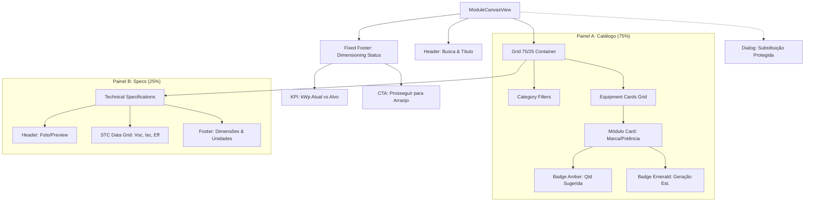

# Interface Map: ModuleCanvasView
**Versão:** 3.8.3 (Jornada do Integrador)  
**Domínio:** Kurupira (Engenharia Solar)  
**Status:** ✅ Produção / Estável

---

## 🗺️ Visão Geral da Estrutura

A `ModuleCanvasView` utiliza um layout de **Grid 75/25**, maximizando o espaço para a exploração do catálogo enquanto mantém um painel de detalhamento compacto e focado à direita.

---

## 🧩 Detalhamento dos Componentes

### 1. Header de Ação
- **Busca Global:** Filtro em tempo real por Marca, Potência ou Modelo.
- **Contexto:** Exibe o total de itens sincronizados com o Catálogo Neonorte.

### 2. Catálogo de Módulos (Painel A)
Os cards utilizam a **Matriz de Cores 10-20-400** e **Micro-Tipografia (v3.8.2)**:
- **Indicadores Preventivos:**
    - `minQty` (Amber): Calculado dinamicamente: `Math.ceil(kWpAlvo / pmod)`.
    - `estGen` (Emerald): Heurística baseada em `HSP 4.5` e `System PR`.
- **Rigor de Legibilidade:** Nomes de modelos em 12px (`text-xs`) e labels em 11px (`text-[11px]`).

### 3. Especificações Técnicas (Painel B)
Exibe os dados de laboratório (STC) do módulo ativo:
- **Data Grid Industrial:** 2 colunas com bordas de separação (`border-l-2`).
- **Estados:** Exibe placeholder de "Nenhum Módulo Selecionado" casso o projeto esteja vazio.

### 4. Rodapé de Status (Dimensioning HUD)
- **Barra de Progresso:** Feedback visual imediato. Se `Capacidade DC >= 95% do Alvo`, utiliza cor `emerald-400`.
- **CTA Industrial:** Botão de navegação para a próxima etapa (Arranjo), desabilitado até que um módulo seja escolhido.

---

## 🔄 Lógica de Interação: Substituição Protegida (v3.8.3)

O sistema implementa uma camada de segurança de dados (Ato 2):

1. **Gatilho:** Clique em um card do catálogo diferente do modelo ativo.
2. **Validação:** Se `projectModules.length > 0`, dispara o `SubstitutionDialog`.
3. **Diálogo Industrial:**
    - Exibe o novo modelo e a **Quantidade Sugerida** necessária.
    - Opções: `Substituir Tudo` ou `Manter Atual`.
4. **Execução:** Ao confirmar, o sistema limpa o inventário atual e popula o projeto com `minQty` instâncias do novo modelo, garantindo que o projeto nunca fique subdimensionado.

---

## 🎨 Design Tokens (v3.8.2 / Engineering Aesthetic)

| Token | Valor / Regra |
|:---|:---|
| **Geometria** | `rounded-sm` (Padrão Inegociável) |
| **Fonte de Dados** | `font-mono tabular-nums` |
| **Fonte de Interface** | Inter / Roboto (Sans-serif) |
| **Background** | `bg-slate-950` (Deep Black) |
| **Badges** | Sistema de opacidades fixas (10% bg / 20% border) |
