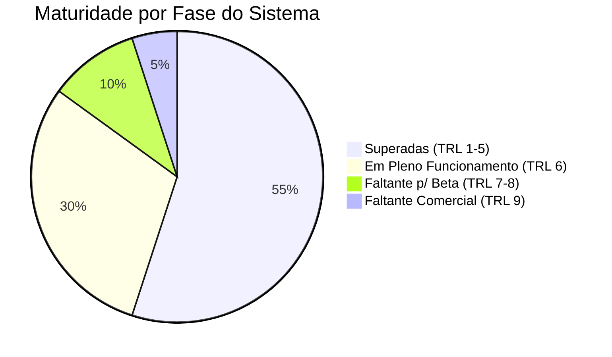

# 📊 Nível de Maturidade Tecnológica (TRL) - Neonorte | Lumi

Este documento serve como um mapa visual (infográfico textual) do nível de maturidade do **Lumi Propose Engine**, utilizando a escala **Technology Readiness Level (TRL)** adaptada para SaaS (Software as a Service).

---

## 🎯 Status Atual Global

> [!IMPORTANT]  
> **O Lumi encontra-se atualmente no TRL 6, em transição agressiva para TRL 7.**
> A tecnologia base e integrações chaves já operam num ambiente de software em nuvem de ponta a ponta simulando condições de uma integradora real.

---

## 🪜 O Caminho da Maturidade: Escadaria do Produto

Abaixo detalhamos cada uma das fases (TRLs) e confirmamos o que já foi dominado na plataforma Lumi:

### ✅ FASES INICIAIS (Atingidas com sucesso)

* **TRL 1 a 4 - Protótipo de Laboratório:** Ideação, formulação em React/Zustand e Prova de Conceito operando offline.
  > **🗣️ Em termos de negócios:** "O alicerce da casa foi erguido. Testamos no laboratório se as fórmulas matemáticas e leis elétricas para dimensionar placas e inversores estão corretas, antes de gastarmos tempo montando as paredes elétricas em um software em nuvem."

### 🟡 ONDE ESTAMOS AGORA (O Protótipo no Mundo Real)

* **TRL 5 - Validação em Ambiente Relevante** *(Completo)*
  * Componentes isolados integram uns com os outros. Conexão ativa com o banco de dados (Cresesb/Gemini) para puxar *HSP* com base na geolocalização.
  > **🗣️ Em termos de negócios:** "O sistema aprendeu a falar com o mundo exterior. Conseguimos baixar os mapas dinâmicos via satélite e buscar o clima solar real usando apenas um CEP ou coordenada GPS de uma fazenda."

* **TRL 6 - Demonstração de Protótipo Sistêmico** *(Atual)*
  * O sistema possui persistência local, interface responsiva modular e controla acessos por usuário (`RBAC/RLS` via Supabase). 
  * O fluxo do CRM até o painel Elétrico atende fielmente aos processos de um Engenheiro Master.
  > **🎯 🗣️ O QUE ISTO SIGNIFICA NA PRÁTICA:** "A casa inteira está de pé e com luz na tomada. A equipe de vendas já consegue logar com segurança, cadastrar as faturas de energia do cliente no CRM e gerar automaticamente a solução de engenharia — calculando cabos e painéis de acordo com as regras exatas do setor solar brasileiro."

### 🚀 PRÓXIMAS DEMANDAS (O Pulo do Gato)

* **TRL 7 - Demonstração no Ambiente Operacional** *(Próximo Épico) 🚧*
  * O **Motor Financeiro** e a renderização do **PDF de Proposta** devem estar prontos e fechando a venda de fato baseados nas taxas de financiamento aplicadas.
  > **🗣️ Em termos de negócios:** "A etapa que coroa a máquina de vendas. Ao cruzarmos essa linha, a nossa ferramenta cuspirá a Proposta Comercial em PDF elegante e mastigada (com Payback, Retorno sobre Investimento e a economia estimada na tarifa do banco), pronta para o vendedor assinar o contrato com o cliente final."

* **TRL 8 - Sistema Completo e Qualificado** *(Beta Fechado)*
  * Substituir os dados falsos de inversores (`modules` hardcoded) por um **Catálogo DB Real (CRUD)** manipulado por um Administrador dentro do sistema em nuvem.
  * O teste é efetuado por *1 integradora parceira* real.

* **TRL 9 - Sistema Madurado e Comercialmente Operacional** *(Lançamento Oficial)*
  * A arquitetura Multi-Tenant isola completamente clientes B2B (Múltiplas Empresas assinantes). Integrações de Billing aplicadas.
  > **🗣️ Em termos de negócios:** "Pronto para dominar o Brasil! O 'Lumi' já pode ser vendido como uma assinatura mensal. Qualquer Empresa XYZ de Energia Solar do país poderá criar uma conta, colocar sua própria logomarca na ferramenta, cadastrar seu catálogo próprio na base de dados (Ex: Inversores WEG, Growatt) e fornecer acessos restritos aos seus próprios vendedores."

---

## 🔍 Resumo de Maturidade por Módulo (Drill-Down)

| Módulo/Tecnologia | TRL Estimado | Status Atual | Próxima Fronteira |
| :--- | :---: | :--- | :--- |
| **Frontend Arquitetural** | **8** | Zustand, Vite, PWA nativo rodando perfeitamente. | Implementar testes unitários complexos. |
| **Backend & Cloud (Auth)** | **7** | Login sem timeout otimizado, Role Manager (RLS) funcionando. | Log de auditorias (quem alterou o projeto X). |
| **CRM de Clientes** | **7** | Painéis responsivos, Auto-Save ativo, busca Maps via Nominatim funcional. | Integração de disparo de WhatsApp. |
| **Engenharia e Mapas** | **6** | Cálculo de fileiras com Mismatch, Leaflet rodando desenho de telhados. | Banco de Inversores/Módulos gerenciáveis dinamicamente. |
| **Financeiro & Pricing** | **4** | Frontend construído, lógica parcial de Capex/Opex inserida. | Rodar as fórmulas puras de financiamento e geração de boletos simulados. |
| **Geração de Valiosos (PDF)**| **3** | Rascunhos de design validados em tela (HTML). | Transformar DOM em PDF nativo performático (`@react-pdf`). |

 

> [!TIP]  
> Para atingir o lucro comercial da plataforma, os seus **maiores focos imediatos** devem ser arrastar a **Linha Financeira (TRL 4)** e a **Geração de PDF (TRL 3)** em direção aos níveis operacionais (TRL 7)!
