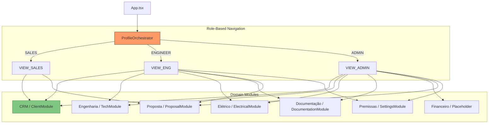

# Lumi UI/UX Interface Map - V3.0

> **Última Atualização:** 2026-01-28
> **Versão:** 3.1.0 (Detailed Analysis & Tech Standard)
> **Arquitetura:** ProfileOrchestrator + 7 Domain Modules

---

## 📋 Índice

1. [Visão Geral](#visão-geral)
2. [Sitemap por Perfis](#sitemap-por-perfis)
3. [Layout de 3 Colunas (CRM)](#layout-de-3-colunas-crm)
4. [Catálogo de Módulos](#catálogo-de-módulos)
5. [Componentes Globais](#componentes-globais)
6. [Fluxos de Usuário](#fluxos-de-usuário)

---

## 🎯 Visão Geral

A **V3.0.1** completa a integração de todos os módulos no ProfileOrchestrator.

### Tabs Disponíveis por Role

| Tab             | SALES | ENGINEER | ADMIN |
| --------------- | :---: | :------: | :---: |
| Levantamento    |  ✅   |    ✅    |  ✅   |
| Dimensionamento |  ❌   |    ✅    |  ✅   |
| Elétrico & BOS  |  ❌   |    ✅    |  ✅   |
| Documentação    |  ❌   |    ✅    |  ✅   |
| Viabilidade     |  ❌   |    ❌    |  ✅   |
| Proposta        |  ✅   |    ✅    |  ✅   |
| Premissas       |  ❌   |    ✅    |  ✅   |

---

## 🗺️ Sitemap por Perfis

---

## 🏛️ Layout de 3 Colunas (CRM)

O módulo CRM utiliza um sistema de **Abas** para organizar a complexidade:

1.  **Aba Levantamento**: Mantém o grid de alta densidade para visualização rápida.
2.  **Aba Análise**: Dedicada a gráficos e tabelas detalhadas de consumo.

---

## 📱 Catálogo de Módulos

### 1. ClientModule (CRM) 🟢

**Path**: `src/modules/crm/ClientModule.tsx`
**Layout**: Tabbed Interface
**Tabs**:

1.  **Levantamento** (`SurveyTab`): 3-Column Layout (Admin, Geo, Weather)
2.  **Análise** (`AnalysisTab`): Full-width (Energy Consumption)

**Status**: ✅ Produção

| Componente           | Aba          | Função                                  |
| -------------------- | ------------ | --------------------------------------- |
| `ClientDataPanel`    | Levantamento | Dense UI, Nome highlight, Grid compacto |
| `GeoLocationWidget`  | Levantamento | Mapa + HUD Flutuante (GPS, Layers)      |
| `WeatherStats`       | Levantamento | Cards HSP/Temperatura                   |
| `ConsumptionManager` | Análise      | Consumption Manager (Zero Scroll)       |
| `LoadSimulator`      | Análise      | High Density Table & Eng. Alerts        |
| `EnergyProfileChart` | Análise      | Stacked Bar (Histórico vs Simulado)     |

### 2. TechModule (Engenharia) 🔵

**Path**: `src/modules/engineering/TechModule.tsx`
**Path**: `src/modules/engineering/TechModule.tsx`
**Layout**: Flex-1 Min-Height-0 + Status Bar
**Tabs**:

1. **Arranjo DC** (`PVArrayTab`): Brain Panel + Inventário de Módulos
2. **Sistema AC** (`InverterSystemTab`): Dashboard FDI + Inventário de Inversores
3. **Geração** (`GenerationAnalysisTab`): Simulação de Performance

**Status**: ✅ Produção (Refatorado v3.1)

### 3. ElectricalModule (Elétrico) ⚡

**Path**: `src/modules/electrical/ElectricalModule.tsx`
**Status**: ✅ Conectado

### 4. DocumentationModule (Documentação) 📋

**Path**: `src/modules/documentation/DocumentationModule.tsx`
**Status**: ✅ Conectado

| Componente               | Função              |
| ------------------------ | ------------------- |
| `TechnicalMemorandum`    | Memorial descritivo |
| `CommissioningChecklist` | Checklist NBR 16274 |

### 5. ProposalModule (Proposta) 📄

**Path**: `src/modules/proposal/ProposalModule.tsx`
**Status**: ✅ Conectado

- Mostra checklist de dados obrigatórios
- Indica visualmente quais módulos estão completos
- Botão para geração de PDF (placeholder)

### 6. SettingsModule (Premissas) ⚙️

**Path**: `src/modules/settings/SettingsModule.tsx`
**Status**: ✅ Conectado

- **Tab Performance**: PR, inflação energética, fatores orientação
- **Tab Precificação**: Custos unitários, margens
- **Tab Institucional**: Engenheiro, CREA, CNPJ
- Persistência em `localStorage`

### 7. FinanceModule (Viabilidade) 💰

**path**: `src/modules/finance/FinanceModule.tsx`
**Status**: ✅ Produção

- **Painel de Parâmetros**: CAPEX, O&M, Inflação
- **Indicadores**: VPL, TIR, Payback, LCOE
- **Gráficos**: Fluxo de Caixa Acumulado (Recharts)
- Integado com ProposalModule para CAPEX dinâmico.

---

## 🧩 Componentes Globais

### ProfileOrchestrator

**Path**: `src/layout/ProfileOrchestrator.tsx`

- **Header**: Logo Lumi V3, navegação por 7 tabs, seletor de perfil
- **Main Area**: Sem padding (módulos controlam seu layout)
- **Role Switcher**: Toolbar para trocar perfis

---

## 🛣️ Fluxos de Usuário

### Jornada A: Vendedor (SALES)

1. Acessa sistema → Vê **CRM** e **Proposta**
2. Preenche dados do cliente (🟣)
3. Localiza telhado no mapa (🟢)
4. Vê estimativa de irradiação (🟠)
5. Vai para **Proposta** → Vê checklist incompleto
6. Completa dados e gera proposta

### Jornada B: Engenheiro (ENGINEER)

1. Acessa **CRM** → Review dos dados coletados
2. Troca para **Dimensionamento** → Seleciona módulos/inversores
3. Troca para **Elétrico** → Configura BOS
4. Troca para **Documentação** → Gera memorial
5. Acessa **Premissas** → Ajusta parâmetros técnicos

### Jornada C: Admin (ADMIN)

- Acesso completo a todos os 7 módulos
- Inclui **Viabilidade** financeira (quando implementado)

---

**Autor**: Neonorte Tecnologia  
**Versão**: 3.1.0  
**Última Atualização**: 2026-02-02
