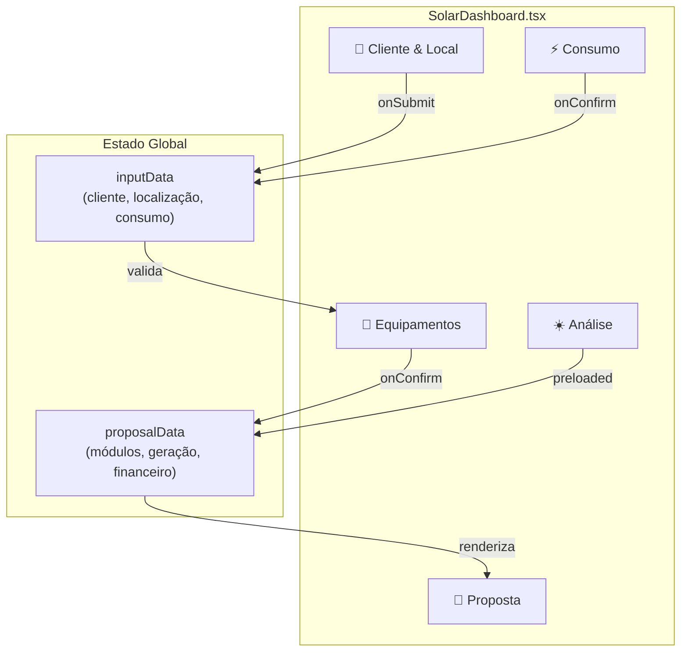

# ADR-003: Migração de Wizard Linear para Dashboard Tabbado

**Status:** Implementado  
**Data:** 2026-01-27  
**Decisor:** Breno Barbosa Guedes Nunes (Engenheiro Responsável)

---

## Contexto

O sistema Lumi utilizava um fluxo de navegação **Wizard Linear** (sequencial), onde o usuário era forçado a completar cada etapa antes de avançar para a próxima:

```
FORM → ENERGY_FLUX → TECH_CONFIG → ANALYSIS → SERVICE_COMPOSITION → PREVIEW
```

Este modelo apresentava as seguintes limitações:

1. **Rigidez de Navegação**: Impossibilidade de voltar a editar dados anteriores sem perder progresso
2. **UX Fragmentado**: Scroll da página inteira, sem visão unificada
3. **Acoplamento ViewState ↔ Componentes**: O `App.tsx` gerenciava um `switch/case` massivo
4. **Re-renderização Ineficiente**: A cada mudança de etapa, toda a árvore era remontada

---

## Decisão

Migrar para um **Single-Screen Tabbed Dashboard** com as seguintes características:

### Arquitetura de Componentes

```
App.tsx
  └── SolarDashboard.tsx (NOVO - Orquestrador)
        ├── <header> (Logo + Ações Globais)
        ├── <nav> (Tabs Verticais)
        │     └── TAB_DEFINITIONS[] (config-driven)
        └── <main> (Conteúdo da Aba Ativa)
              ├── InputForm
              ├── EnergyFluxForm
              ├── TechnicalForm
              ├── AnalysisPhase
              └── ProposalTemplate
```

### Modelo de Estado

```typescript
// Estado persiste entre trocas de aba
const [inputData, setInputData] = useState<InputData>(...)      // Abas 1-2
const [proposalData, setProposalData] = useState<ProposalData | null>(...) // Abas 3-5
const [selectedModules, setSelectedModules] = useState<ModuleSpecs[]>([])
const [selectedInverters, setSelectedInverters] = useState<InverterSpecs[]>([])
```

### Validação Cross-Tab

```typescript
const validationStatus = useMemo(
  () => ({
    cliente: hasClientData,
    consumo: hasConsumptionData,
    equipamentos: hasEquipmentData,
    analise: hasAnalysisData,
    proposta: allStepsComplete,
  }),
  [inputData, selectedModules, selectedInverters, proposalData],
);
```

---

## Alternativas Consideradas

### 1. Multi-Step Form com Progress Bar

- **Prós**: Familiar para usuários
- **Contras**: Ainda sequencial, não resolve edição livre

### 2. URL-Based Routing (React Router)

- **Prós**: Deep linking, bookmarking
- **Contras**: Overhead para SPA sem necessidade de SEO

### 3. State Machine (XState)

- **Prós**: Fluxo previsível, testável
- **Contras**: Complexidade excessiva para este caso

---

## Consequências

### Positivas

- ✅ Navegação livre entre seções
- ✅ Estado preservado durante edições
- ✅ Layout fit-to-screen (sem scroll externo)
- ✅ Recálculo sob demanda (botão global)
- ✅ Empty states defensivos

### Negativas / Trade-offs

- ⚠️ Componentes filhos ainda carregam botões de navegação (pendente remoção)
- ⚠️ Maior responsabilidade no orquestrador (`SolarDashboard.tsx`)
- ⚠️ Validação de dependências pode ser confusa para novos devs

---

## Próximos Passos

1. [x] Remover rodapés de navegação de `EnergyFluxForm`, `TechnicalForm`, `AnalysisPhase`, `ServiceCompositionPhase`
   - Implementado via prop `hideNavigation` condicional
2. [x] Integrar `ServiceCompositionPhase` na aba Análise
   - Agora ambos componentes são renderizados na mesma aba
3. [x] Remover branding inicial
   - Removido logo e títulos do Header para simplificar a UI
4. [x] Ajustar tema visual
   - Fundo alterado para Branco (`bg-white`) em App.tsx e Dashboard para visual mais limpo
5. [x] Compactar Sidebar (ViewState)
   - Labels simplificados, emojis removidos, padding reduzido e descrições ocultadas para ganhar espaço
6. [ ] Implementar indicador visual de "dados pendentes de recálculo"
7. [ ] Adicionar testes de integração para fluxo de abas

---

## Diagrama de Fluxo de Dados



---

## Referências

- [Figma: Dashboard Layout Concept](#) _(link interno)_
- [Nielsen Norman Group: Tabs vs Steppers](https://www.nngroup.com/articles/tabs-used-right/)

---

**Autor**: Neonorte Tecnologia  
**Última Atualização**: 2026-02-02
