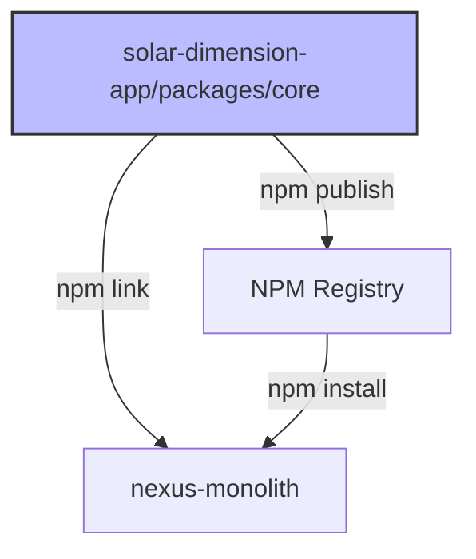

# ADR 008: Aplicação Standalone de Dimensionamento Fotovoltaico

## Status

**Proposto** (Aguardando Aprovação)

## Contexto

O módulo de dimensionamento fotovoltaico atualmente reside dentro do `nexus-monolith` (ADR 003), integrado ao módulo Commercial. No entanto, identificamos a necessidade de criar uma **aplicação standalone** de dimensionamento que possa:

1. **Operar Independentemente:** Ser utilizada como ferramenta isolada de dimensionamento, sem dependência do ecossistema Neonorte | Nexus.
2. **Ser Integrada Posteriormente:** Manter compatibilidade arquitetural para futura integração com o Neonorte | Nexus Monolith ou outras aplicações.
3. **Servir Múltiplos Contextos:** Funcionar como:
   - Ferramenta de vendas para equipes externas
   - Calculadora pública (lead generation)
   - Módulo embarcável em outras plataformas
   - Microserviço de cálculo fotovoltaico

## Decisão

Criar uma **aplicação modular standalone** seguindo os princípios arquiteturais do Neonorte | Nexus, mas com **fronteiras bem definidas** que permitam:

- **Deployment Independente:** Aplicação pode rodar isoladamente
- **API-First Design:** Toda lógica de negócio exposta via API REST/GraphQL
- **Integração via Contratos:** Comunicação com sistemas externos via schemas Zod compartilhados
- **Multi-Tenancy Opcional:** Suporte a multi-tenancy desde o início, mas não obrigatório

### Arquitetura Proposta

```
solar-dimension-app/
├── packages/
│   ├── core/                    # Lógica de Negócio Pura (Zero Dependências)
│   │   ├── domain/              # Entidades e Regras de Domínio
│   │   │   ├── SolarCalculator.ts
│   │   │   ├── IrradiationEngine.ts
│   │   │   ├── FinancialAnalyzer.ts
│   │   │   └── ProposalGenerator.ts
│   │   ├── schemas/             # Validação Zod (Contratos)
│   │   │   ├── input.schemas.ts
│   │   │   └── output.schemas.ts
│   │   └── types/               # TypeScript Interfaces
│   │       └── index.ts
│   │
│   ├── api/                     # Backend (Node.js + Express/Fastify)
│   │   ├── controllers/
│   │   ├── services/            # Orquestração (usa @core)
│   │   ├── middleware/
│   │   ├── routes/
│   │   └── prisma/              # (Opcional) Persistência
│   │
│   ├── web/                     # Frontend (React + Vite)
│   │   ├── src/
│   │   │   ├── components/
│   │   │   ├── views/
│   │   │   ├── hooks/
│   │   │   └── lib/             # Cliente API
│   │   └── public/
│   │
│   └── shared/                  # Utilitários Compartilhados
│       ├── constants/
│       └── utils/
│
├── docs/
│   ├── architecture/
│   ├── integration-guide.md     # Como integrar com Neonorte | Nexus
│   └── api-reference.md
│
└── deployment/
    ├── docker/
    ├── kubernetes/
    └── standalone/
```

## Princípios Arquiteturais

### 1. **Hexagonal Architecture (Ports & Adapters)**

```typescript
// Core Domain (Não conhece HTTP, DB, etc)
export class SolarCalculator {
  calculate(input: SolarInput): SolarOutput {
    // Lógica pura
  }
}

// Port (Interface)
export interface ISolarRepository {
  saveProposal(data: Proposal): Promise<void>;
}

// Adapter (Implementação Prisma)
export class PrismaSolarRepository implements ISolarRepository {
  async saveProposal(data: Proposal) {
    await prisma.solarProposal.create({ data });
  }
}

// Adapter (Implementação In-Memory para testes)
export class InMemorySolarRepository implements ISolarRepository {
  private proposals: Proposal[] = [];
  async saveProposal(data: Proposal) {
    this.proposals.push(data);
  }
}
```

### 2. **Dependency Injection**

```typescript
// API Service (Recebe dependências)
export class SolarService {
  constructor(
    private calculator: SolarCalculator,
    private repository: ISolarRepository,
    private eventBus?: IEventBus, // Opcional para integração
  ) {}

  async createProposal(input: SolarInput) {
    const result = this.calculator.calculate(input);
    await this.repository.saveProposal(result);

    // Emite evento APENAS se integrado
    this.eventBus?.emit("solar.proposal.created", result);

    return result;
  }
}
```

### 3. **Schema-First (Contratos Zod)**

```typescript
// packages/core/schemas/input.schemas.ts
import { z } from "zod";

export const SolarInputSchema = z.object({
  consumptionKwh: z.number().positive(),
  cityCode: z.string().min(7).max(7), // Código IBGE
  roofType: z.enum(["CERAMIC", "METAL", "CONCRETE"]),
  roofOrientation: z.enum(["NORTH", "SOUTH", "EAST", "WEST"]),
  roofInclination: z.number().min(0).max(90),
  voltage: z.enum(["127V", "220V", "380V"]),
  connectionType: z.enum(["MONOFASICO", "BIFASICO", "TRIFASICO"]),
});

export type SolarInput = z.infer<typeof SolarInputSchema>;
```

### 4. **Multi-Tenancy Opcional**

```typescript
// API Controller
export const createProposal = async (req, res) => {
  const input = SolarInputSchema.parse(req.body);

  // Contexto opcional (se integrado ao Neonorte | Nexus)
  const ctx = {
    tenantId: req.user?.tenantId || "standalone",
    userId: req.user?.id || "anonymous",
  };

  const result = await solarService.createProposal(input, ctx);
  res.json(result);
};
```

## Estratégia de Integração com Neonorte | Nexus

### Opção A: Microserviço Independente

```mermaid
graph LR
    A[Neonorte | Nexus Frontend] -->|HTTP| B[Neonorte | Nexus API Gateway]
    B -->|Proxy| C[Solar App API]
    C -->|Eventos| D[Neonorte | Nexus Event Bus]

    style C fill:#f9f,stroke:#333,stroke-width:4px
```

**Vantagens:**

- Escalabilidade independente
- Deploy isolado
- Tecnologia agnóstica

**Desvantagens:**

- Latência de rede
- Complexidade operacional

### Opção B: Biblioteca Compartilhada (Monorepo)



**Vantagens:**

- Zero latência
- Tipagem compartilhada
- Refatoração atômica

**Desvantagens:**

- Acoplamento de versões
- Build mais complexo

### Opção C: Módulo Embarcado (Recomendado para Fase 1)

```typescript
// nexus-monolith/backend/src/modules/solar/index.js
import { SolarService } from "@neonorte/solar-core";
import { PrismaSolarRepository } from "./adapters/prisma.adapter";

// Instancia com adaptadores do Neonorte | Nexus
export const solarService = new SolarService(
  new SolarCalculator(),
  new PrismaSolarRepository(prisma),
  nexusEventBus, // Integração com eventos do Neonorte | Nexus
);
```

## Requisitos de Desenvolvimento

### Funcionais

1. **Cálculo de Dimensionamento:**
   - Entrada: Consumo médio (kWh), localização, tipo de telhado
   - Saída: Quantidade de módulos, inversor, potência total, área necessária

2. **Análise Financeira:**
   - Investimento total
   - Payback simples e descontado
   - Economia mensal/anual
   - TIR e VPL

3. **Geração de Proposta:**
   - PDF profissional
   - Gráficos de geração vs consumo
   - Especificações técnicas

4. **Catálogo de Equipamentos:**
   - CRUD de módulos fotovoltaicos
   - CRUD de inversores
   - Kits pré-configurados

### Não-Funcionais

1. **Performance:**
   - Cálculo completo < 500ms
   - Geração de PDF < 2s
   - Suporte a 100 req/s

2. **Segurança:**
   - Validação Zod obrigatória em TODAS as entradas
   - Rate limiting (10 req/min para usuários anônimos)
   - Sanitização de inputs

3. **Testabilidade:**
   - Cobertura mínima: 80%
   - Testes unitários para lógica de domínio
   - Testes de integração para API

4. **Observabilidade:**
   - Logs estruturados (Winston/Pino)
   - Métricas (Prometheus)
   - Tracing (OpenTelemetry)

## Modelo de Dados

### Standalone Mode

```prisma
model SolarProposal {
  id              String   @id @default(cuid())

  // Input
  consumptionKwh  Float
  cityCode        String
  roofType        String

  // Output
  systemSizeKwp   Float
  moduleCount     Int
  inverterModel   String
  totalInvestment Decimal
  paybackYears    Float

  // Metadata
  createdAt       DateTime @default(now())
  tenantId        String?  // Opcional
  userId          String?  // Opcional

  proposalData    Json     // Dados completos
}

model SolarModule {
  id          String  @id @default(cuid())
  brand       String
  model       String
  powerWp     Int
  efficiency  Float
  price       Decimal
  isActive    Boolean @default(true)
}

model SolarInverter {
  id          String  @id @default(cuid())
  brand       String
  model       String
  powerKw     Float
  phases      Int
  price       Decimal
  isActive    Boolean @default(true)
}
```

### Integração com Neonorte | Nexus

```prisma
// Adicionar ao schema.prisma do Neonorte | Nexus
model SolarProposal {
  // ... campos existentes ...

  // Relações com Neonorte | Nexus
  leadId      String?
  lead        Lead?        @relation(...)

  projectId   String?      @unique
  project     Project?     @relation(...)

  // Auditoria Neonorte | Nexus
  tenantId    String       @default("default-tenant-001")
  createdBy   String?
  creator     User?        @relation(...)
}
```

## Checklist de Qualidade Enterprise

- [ ] **Isolamento:** Core domain não importa bibliotecas externas (exceto Zod)
- [ ] **Contratos:** Todos os inputs/outputs validados com Zod
- [ ] **Testes:** Cobertura >= 80% no core domain
- [ ] **Documentação:** API documentada com OpenAPI/Swagger
- [ ] **Segurança:** Rate limiting e validação implementados
- [ ] **Observabilidade:** Logs estruturados e métricas expostas
- [ ] **Multi-Tenancy:** Suporte opcional implementado desde o início
- [ ] **Integração:** Guia de integração com Neonorte | Nexus documentado

## Consequências

### Positivas

- **Reutilização:** Lógica de cálculo pode ser usada em múltiplos contextos
- **Testabilidade:** Core isolado facilita testes unitários
- **Flexibilidade:** Pode ser integrado como microserviço, biblioteca ou módulo embarcado
- **Manutenibilidade:** Fronteiras claras facilitam evolução independente

### Negativas

- **Complexidade Inicial:** Arquitetura hexagonal exige mais setup
- **Overhead:** Abstrações podem parecer excessivas para casos simples
- **Sincronização:** Manter contratos sincronizados entre aplicações exige disciplina

## Conformidade

1. Todo código de dimensionamento DEVE residir em `packages/core`
2. Adaptadores (Prisma, HTTP, etc) DEVEM estar em `packages/api` ou `packages/web`
3. Schemas Zod DEVEM ser a única fonte de verdade para contratos
4. Testes DEVEM cobrir >= 80% do core domain

## Próximos Passos

1. **Fase 1 - Fundação (Sprint 1):**
   - Criar estrutura de monorepo
   - Implementar core domain (SolarCalculator)
   - Definir schemas Zod completos

2. **Fase 2 - API (Sprint 2):**
   - Implementar backend REST
   - Adicionar persistência Prisma
   - Documentar API com Swagger

3. **Fase 3 - Frontend (Sprint 3):**
   - Criar wizard de dimensionamento
   - Implementar geração de PDF
   - Adicionar catálogo de equipamentos

4. **Fase 4 - Integração (Sprint 4):**
   - Integrar com Neonorte | Nexus via módulo embarcado
   - Implementar event bus
   - Adicionar multi-tenancy

## Referências

- ADR 001: Monólito Modular
- ADR 003: Migração do Solar Engine
- ADR 004: Arquitetura Orientada a Eventos
- [Hexagonal Architecture - Alistair Cockburn](https://alistair.cockburn.us/hexagonal-architecture/)
- [Clean Architecture - Robert C. Martin](https://blog.cleancoder.com/uncle-bob/2012/08/13/the-clean-architecture.html)
