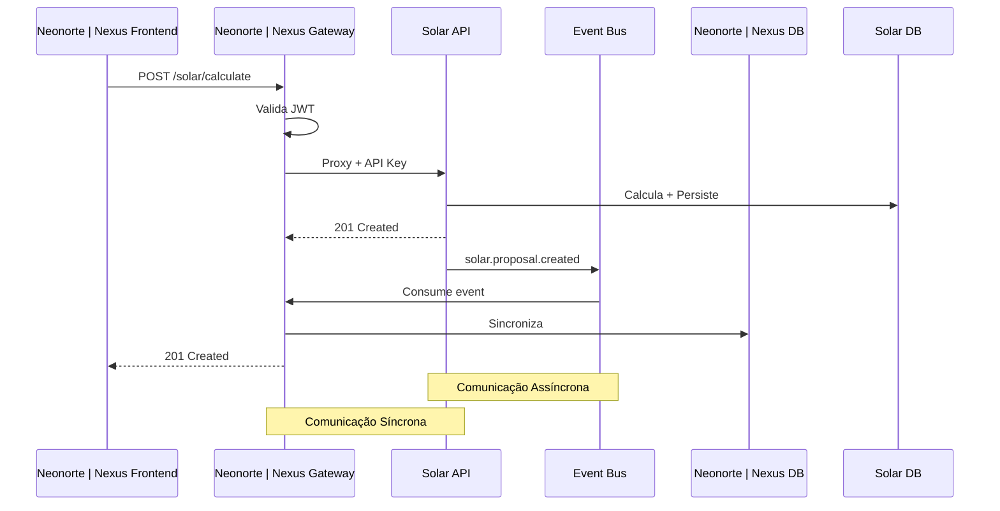
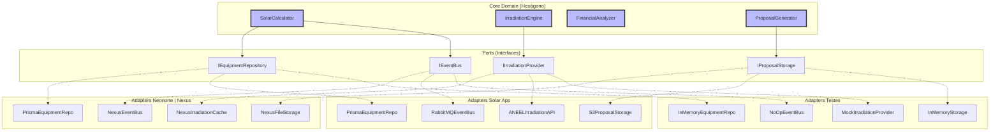
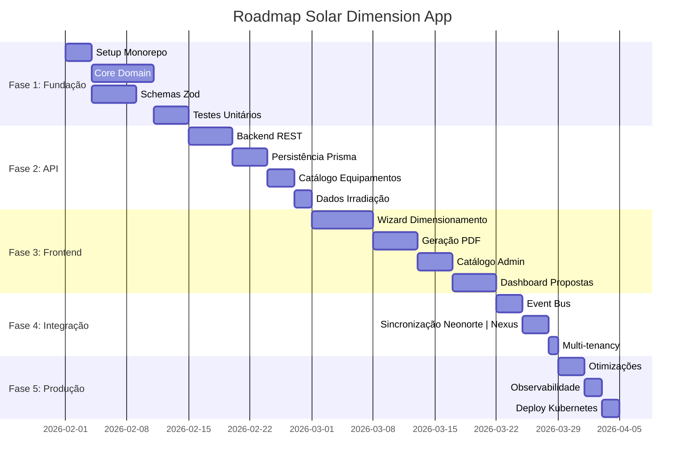
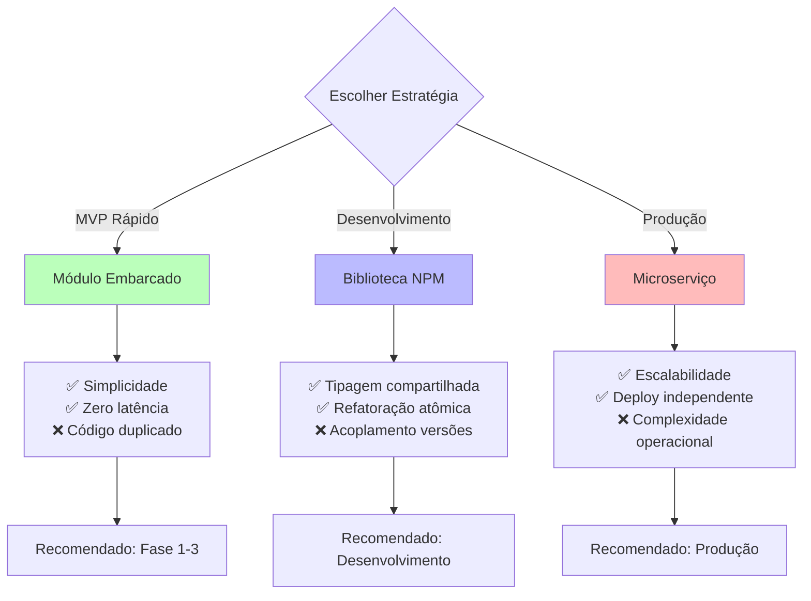
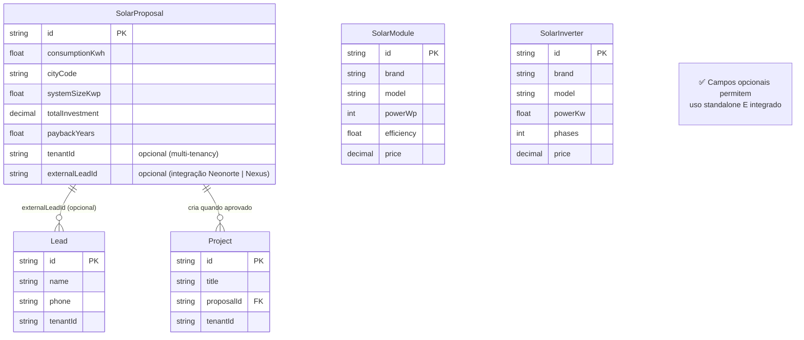

# Diagrama: Evolução da Arquitetura Solar

## Situação Atual (ADR 003)

```mermaid
graph TB
    subgraph "Neonorte | Nexus Monolith"
        A[Commercial Module]
        B[Solar Module<br/>Integrado]
        C[Ops Module]
        D[Database]
    end

    A -->|Cria proposta| B
    B -->|Persiste| D
    B -->|Cria projeto| C

    style B fill:#faa,stroke:#333,stroke-width:2px

    Note1[❌ Acoplado ao Neonorte | Nexus<br/>❌ Não reutilizável<br/>❌ Difícil testar isoladamente]
```

## Proposta: Aplicação Standalone (ADR 008)

```mermaid
graph TB
    subgraph "Solar Dimension App (Standalone)"
        SA[Solar API]
        SC[Solar Core<br/>Hexagonal]
        SDB[(Solar DB)]
        SWE[Solar Web]
    end

    subgraph "Neonorte | Nexus Monolith"
        NA[Neonorte | Nexus API Gateway]
        NM[Commercial Module]
        NDB[(Neonorte | Nexus DB)]
    end

    subgraph "Outras Aplicações"
        MA[Mobile App]
        PU[Calculadora Pública]
    end

    EB[Event Bus<br/>RabbitMQ]

    SWE -->|REST| SA
    MA -->|REST| SA
    PU -->|REST| SA

    SA --> SC
    SA --> SDB

    NA -->|Proxy| SA
    NM --> NA

    SA -->|Publish| EB
    EB -->|Subscribe| NA
    NA --> NDB

    style SC fill:#bfb,stroke:#333,stroke-width:3px
    style SA fill:#bbf,stroke:#333,stroke-width:2px

    Note2[✅ Independente<br/>✅ Reutilizável<br/>✅ Testável<br/>✅ Escalável]
```

## Estratégias de Integração

### Opção 1: Microserviço (Produção)



### Opção 2: Biblioteca Compartilhada (Desenvolvimento)

```mermaid
graph LR
    subgraph "NPM Package"
        P[@neonorte/solar-core]
    end

    subgraph "Neonorte | Nexus Backend"
        N1[Solar Service]
        N2[Prisma Adapter]
    end

    subgraph "Solar App"
        S1[Solar Service]
        S2[Prisma Adapter]
    end

    subgraph "Mobile App"
        M1[Solar Service]
        M2[SQLite Adapter]
    end

    P -->|npm install| N1
    P -->|npm install| S1
    P -->|npm install| M1

    N1 --> N2
    S1 --> S2
    M1 --> M2

    style P fill:#bbf,stroke:#333,stroke-width:3px
```

### Opção 3: Módulo Embarcado (MVP)

```mermaid
graph TB
    subgraph "Solar App (Origem)"
        O1[Core Domain]
        O2[Schemas Zod]
    end

    subgraph "Neonorte | Nexus Monolith"
        N1[modules/solar/domain]
        N2[modules/solar/schemas]
        N3[modules/solar/services]
        N4[Neonorte | Nexus Prisma]
        N5[Neonorte | Nexus Events]
    end

    O1 -.->|Copia| N1
    O2 -.->|Copia| N2

    N3 --> N1
    N3 --> N2
    N3 --> N4
    N3 --> N5

    style O1 fill:#faa,stroke:#333,stroke-width:2px
    style O2 fill:#faa,stroke:#333,stroke-width:2px
    style N1 fill:#bfb,stroke:#333,stroke-width:2px
    style N2 fill:#bfb,stroke:#333,stroke-width:2px
```

## Arquitetura Hexagonal (Core)



## Roadmap de Implementação



## Comparação de Estratégias



## Modelo de Dados (Compatibilidade)



---

**Legenda:**

- 🟦 **Azul:** Core Domain (lógica pura)
- 🟩 **Verde:** Componentes reutilizáveis
- 🟥 **Vermelho:** Componentes acoplados (a evitar)
- ⚪ **Branco:** Infraestrutura/Adaptadores
