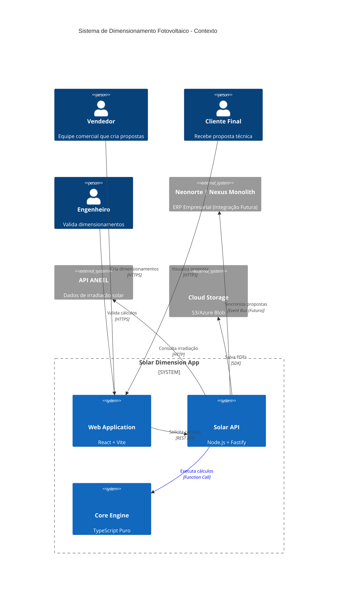
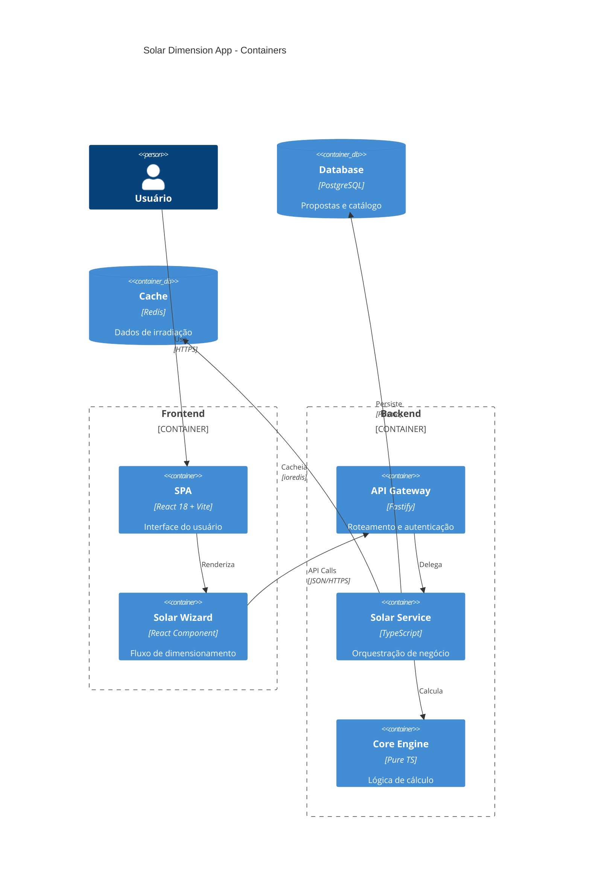
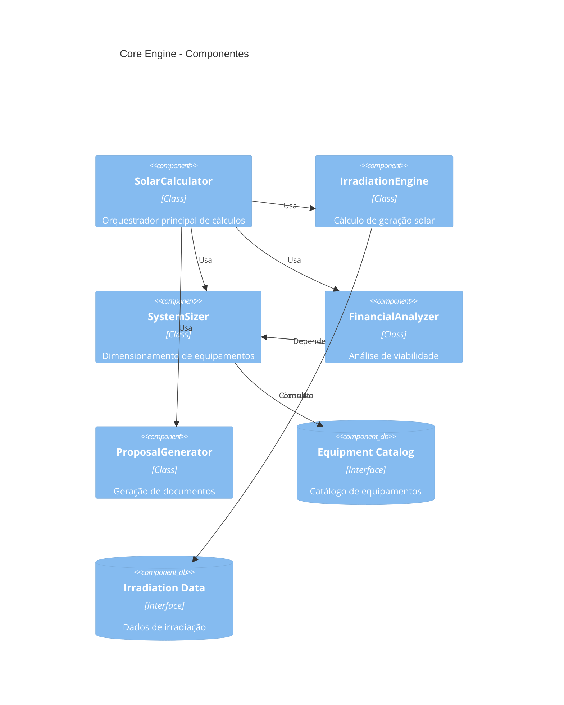
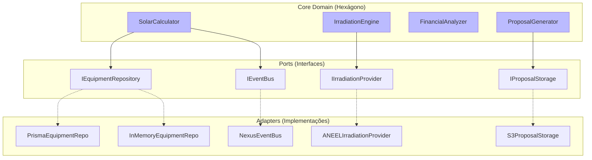
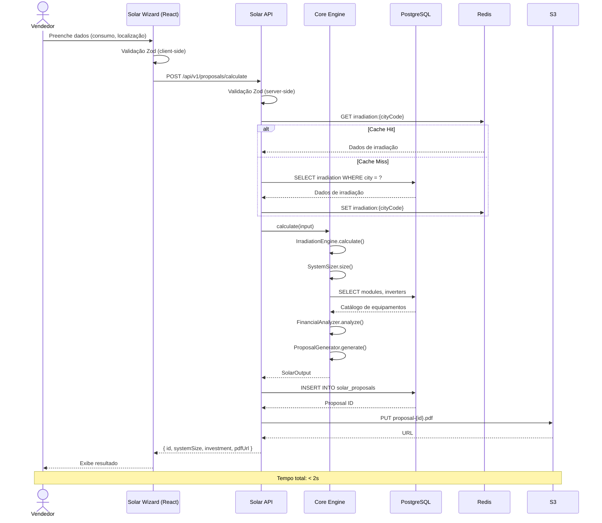
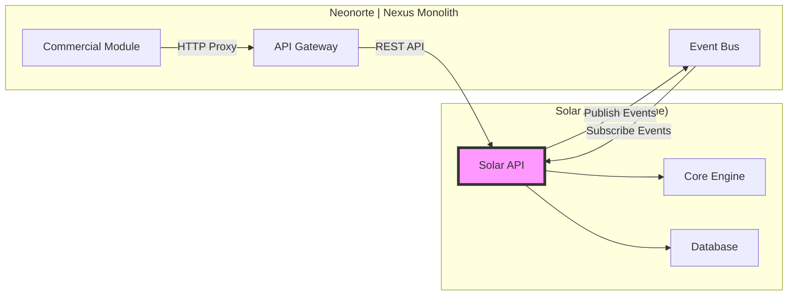

# Arquitetura: Aplicação Standalone de Dimensionamento Fotovoltaico

## Visão Geral

Este documento detalha a arquitetura técnica da aplicação standalone de dimensionamento fotovoltaico, projetada para operar independentemente mas com capacidade de integração futura ao Neonorte | Nexus Monolith.

## Diagrama de Contexto (C4 Model)



## Diagrama de Containers



## Diagrama de Componentes (Core Engine)



## Arquitetura Hexagonal (Ports & Adapters)



## Fluxo de Dados: Criação de Proposta



## Estratégias de Integração com Neonorte | Nexus

### 1. Microserviço Independente (Produção)



**Comunicação:**

- **Síncrona:** REST API para cálculos em tempo real
- **Assíncrona:** Event Bus para sincronização de propostas

**Eventos Emitidos:**

```typescript
{
  "event": "solar.proposal.created",
  "data": {
    "proposalId": "prop_123",
    "leadId": "lead_456",
    "systemSizeKwp": 5.4,
    "totalInvestment": 25000,
    "tenantId": "tenant_001"
  }
}
```

**Eventos Consumidos:**

```typescript
{
  "event": "commercial.deal.won",
  "data": {
    "dealId": "deal_789",
    "proposalId": "prop_123",
    "action": "create_project"
  }
}
```

### 2. Biblioteca Compartilhada (Desenvolvimento)

```mermaid
graph TD
    A[@neonorte/solar-core] -->|npm install| B[Neonorte | Nexus Backend]
    A -->|npm install| C[Solar Standalone]
    A -->|npm install| D[Mobile App]

    B --> E[Neonorte | Nexus Database]
    C --> F[Solar Database]

    style A fill:#bbf,stroke:#333,stroke-width:2px
```

**Package.json:**

```json
{
  "name": "@neonorte/solar-core",
  "version": "1.0.0",
  "main": "dist/index.js",
  "types": "dist/index.d.ts",
  "exports": {
    ".": "./dist/index.js",
    "./schemas": "./dist/schemas/index.js",
    "./types": "./dist/types/index.js"
  },
  "peerDependencies": {
    "zod": "^3.22.0"
  }
}
```

### 3. Módulo Embarcado (Híbrido)

```typescript
// nexus-monolith/backend/src/modules/solar/index.ts
import { SolarCalculator, SolarService } from "@neonorte/solar-core";
import { PrismaEquipmentRepository } from "./adapters/prisma.adapter";
import { NexusEventBusAdapter } from "./adapters/event-bus.adapter";
import { prisma } from "../../../lib/prisma";
import { eventBus } from "../../../core/events";

// Instancia com adaptadores do Neonorte | Nexus
export const solarService = new SolarService(
  new SolarCalculator(),
  new PrismaEquipmentRepository(prisma),
  new NexusEventBusAdapter(eventBus),
);

// Exporta para uso nos controllers do Neonorte | Nexus
export * from "@neonorte/solar-core/schemas";
export * from "@neonorte/solar-core/types";
```

## Modelo de Dados

### Schema Prisma (Standalone)

```prisma
generator client {
  provider = "prisma-client-js"
}

datasource db {
  provider = "postgresql"
  url      = env("DATABASE_URL")
}

// ==================== PROPOSTAS ====================

model SolarProposal {
  id              String   @id @default(cuid())

  // Input do Cliente
  consumptionKwh  Float
  cityCode        String   // Código IBGE
  roofType        RoofType
  roofOrientation Orientation
  roofInclination Float    // Graus
  voltage         Voltage
  connectionType  ConnectionType

  // Output do Cálculo
  systemSizeKwp   Float
  moduleCount     Int
  moduleBrand     String
  moduleModel     String
  inverterBrand   String
  inverterModel   String
  inverterPowerKw Float

  // Financeiro
  totalInvestment Decimal  @db.Decimal(10, 2)
  paybackYears    Float
  monthlySavings  Decimal  @db.Decimal(10, 2)
  annualSavings   Decimal  @db.Decimal(10, 2)
  roi             Float    // %
  irr             Float?   // Taxa Interna de Retorno
  npv             Decimal? @db.Decimal(10, 2) // Valor Presente Líquido

  // Geração
  monthlyGeneration Float  // kWh médio/mês
  annualGeneration  Float  // kWh/ano

  // Documentos
  proposalData    Json     // Dados completos (backup)
  pdfUrl          String?

  // Metadata
  status          ProposalStatus @default(DRAFT)
  createdAt       DateTime @default(now())
  updatedAt       DateTime @updatedAt

  // Multi-tenancy (Opcional)
  tenantId        String?
  userId          String?

  // Integração Neonorte | Nexus (Opcional)
  externalLeadId  String?  @unique
  externalDealId  String?  @unique

  @@index([cityCode])
  @@index([tenantId])
  @@index([createdAt])
}

// ==================== CATÁLOGO ====================

model SolarModule {
  id          String   @id @default(cuid())
  brand       String
  model       String
  powerWp     Int      // Potência em Watts
  efficiency  Float    // % (ex: 21.5)
  technology  ModuleTechnology

  // Dimensões
  widthMm     Int
  heightMm    Int
  weightKg    Float

  // Elétrico
  voc         Float    // Tensão de circuito aberto (V)
  isc         Float    // Corrente de curto-circuito (A)
  vmp         Float    // Tensão no ponto de máxima potência (V)
  imp         Float    // Corrente no ponto de máxima potência (A)

  // Comercial
  price       Decimal  @db.Decimal(10, 2)
  warranty    Int      // Anos
  supplier    String?

  // Metadata
  isActive    Boolean  @default(true)
  createdAt   DateTime @default(now())
  updatedAt   DateTime @updatedAt

  @@index([brand, model])
  @@index([powerWp])
}

model SolarInverter {
  id          String   @id @default(cuid())
  brand       String
  model       String
  powerKw     Float    // Potência nominal (kW)
  phases      Int      // 1, 2 ou 3

  // Elétrico
  maxInputVoltage    Float  // V
  minInputVoltage    Float  // V
  maxInputCurrent    Float  // A
  mpptTrackers       Int    // Número de MPPTs
  stringsPerMppt     Int    // Strings por MPPT

  // Eficiência
  maxEfficiency      Float  // % (ex: 97.5)
  europeanEfficiency Float  // %

  // Comercial
  price       Decimal  @db.Decimal(10, 2)
  warranty    Int      // Anos
  supplier    String?

  // Metadata
  isActive    Boolean  @default(true)
  createdAt   DateTime @default(now())
  updatedAt   DateTime @updatedAt

  @@index([brand, model])
  @@index([powerKw, phases])
}

model IrradiationData {
  id          String   @id @default(cuid())
  cityCode    String   @unique // Código IBGE
  cityName    String
  state       String   // UF
  latitude    Float
  longitude   Float

  // Irradiação Média Anual (kWh/m²/dia)
  avgIrradiation Float

  // Irradiação Mensal (JSON array de 12 valores)
  monthlyIrradiation Json

  // Metadata
  source      String   // Ex: "ANEEL", "CRESESB", "NASA"
  lastUpdated DateTime @updatedAt

  @@index([state])
}

// ==================== KITS PRÉ-CONFIGURADOS ====================

model SolarKit {
  id          String   @id @default(cuid())
  name        String
  description String?  @db.Text

  // Composição
  moduleId    String
  moduleQty   Int
  inverterId  String
  inverterQty Int      @default(1)

  // Calculado
  totalPowerKwp Float

  // Comercial
  price       Decimal  @db.Decimal(10, 2)
  margin      Float    // % de margem

  isActive    Boolean  @default(true)
  createdAt   DateTime @default(now())

  @@index([totalPowerKwp])
}

// ==================== ENUMS ====================

enum ProposalStatus {
  DRAFT
  PENDING_VALIDATION
  VALIDATED
  SENT_TO_CLIENT
  APPROVED
  REJECTED
}

enum RoofType {
  CERAMIC
  METAL
  CONCRETE
  FIBROCIMENT
  SHINGLE
}

enum Orientation {
  NORTH
  SOUTH
  EAST
  WEST
  NORTHEAST
  NORTHWEST
  SOUTHEAST
  SOUTHWEST
}

enum Voltage {
  V127
  V220
  V380
}

enum ConnectionType {
  MONOFASICO
  BIFASICO
  TRIFASICO
}

enum ModuleTechnology {
  MONOCRYSTALLINE
  POLYCRYSTALLINE
  THIN_FILM
  PERC
  TOPCON
  HJT
}
```

## Schemas Zod (Contratos)

```typescript
// packages/core/schemas/input.schemas.ts
import { z } from 'zod';

export const SolarInputSchema = z.object({
  // Consumo
  consumptionKwh: z.number()
    .positive('Consumo deve ser positivo')
    .max(100000, 'Consumo máximo: 100.000 kWh'),

  // Localização
  cityCode: z.string()
    .length(7, 'Código IBGE deve ter 7 dígitos')
    .regex(/^\d{7}$/, 'Código IBGE inválido'),

  // Telhado
  roofType: z.enum([
    'CERAMIC',
    'METAL',
    'CONCRETE',
    'FIBROCIMENT',
    'SHINGLE'
  ]),

  roofOrientation: z.enum([
    'NORTH', 'SOUTH', 'EAST', 'WEST',
    'NORTHEAST', 'NORTHWEST', 'SOUTHEAST', 'SOUTHWEST'
  ]),

  roofInclination: z.number()
    .min(0, 'Inclinação mínima: 0°')
    .max(90, 'Inclinação máxima: 90°'),

  // Elétrico
  voltage: z.enum(['V127', 'V220', 'V380']),
  connectionType: z.enum(['MONOFASICO', 'BIFASICO', 'TRIFASICO']),

  // Opcional: Preferências
  preferredBrand?: z.string().optional(),
  maxBudget?: z.number().positive().optional(),

  // Contexto (para integração)
  tenantId?: z.string().optional(),
  userId?: z.string().optional(),
  externalLeadId?: z.string().optional(),
});

export type SolarInput = z.infer<typeof SolarInputSchema>;

// packages/core/schemas/output.schemas.ts
export const SolarOutputSchema = z.object({
  // Sistema
  systemSizeKwp: z.number().positive(),
  moduleCount: z.number().int().positive(),
  moduleBrand: z.string(),
  moduleModel: z.string(),
  inverterBrand: z.string(),
  inverterModel: z.string(),
  inverterPowerKw: z.number().positive(),

  // Financeiro
  totalInvestment: z.number().positive(),
  paybackYears: z.number().positive(),
  monthlySavings: z.number().positive(),
  annualSavings: z.number().positive(),
  roi: z.number(), // Pode ser negativo
  irr: z.number().optional(),
  npv: z.number().optional(),

  // Geração
  monthlyGeneration: z.number().positive(),
  annualGeneration: z.number().positive(),

  // Metadata
  calculatedAt: z.date(),
  proposalId: z.string().optional(),
});

export type SolarOutput = z.infer<typeof SolarOutputSchema>;
```

## Requisitos Técnicos

### Performance

| Métrica                    | Alvo      | Crítico  |
| -------------------------- | --------- | -------- |
| Cálculo de dimensionamento | < 500ms   | < 1s     |
| Geração de PDF             | < 2s      | < 5s     |
| Consulta de catálogo       | < 100ms   | < 300ms  |
| API Response Time (p95)    | < 200ms   | < 500ms  |
| Throughput                 | 100 req/s | 50 req/s |

### Segurança

1. **Validação de Entrada:**
   - Zod em client-side (UX)
   - Zod em server-side (segurança)
   - Sanitização de strings

2. **Rate Limiting:**
   - Anônimos: 10 req/min
   - Autenticados: 100 req/min
   - API Keys: 1000 req/min

3. **Autenticação (Opcional):**
   - JWT para usuários
   - API Keys para integrações
   - OAuth2 para SSO (futuro)

### Observabilidade

```typescript
// Logs Estruturados (Pino)
logger.info({
  event: "solar.calculation.started",
  input: { consumptionKwh, cityCode },
  userId,
  tenantId,
});

// Métricas (Prometheus)
solarCalculationDuration.observe(duration);
solarProposalCreated.inc({ status: "success" });

// Tracing (OpenTelemetry)
const span = tracer.startSpan("solar.calculate");
span.setAttribute("consumption.kwh", consumptionKwh);
span.end();
```

## Deployment

### Docker Compose (Desenvolvimento)

```yaml
version: "3.8"

services:
  api:
    build: ./packages/api
    ports:
      - "3000:3000"
    environment:
      DATABASE_URL: postgresql://user:pass@db:5432/solar
      REDIS_URL: redis://cache:6379
    depends_on:
      - db
      - cache

  web:
    build: ./packages/web
    ports:
      - "5173:5173"
    environment:
      VITE_API_URL: http://localhost:3000

  db:
    image: postgres:15-alpine
    environment:
      POSTGRES_DB: solar
      POSTGRES_USER: user
      POSTGRES_PASSWORD: pass
    volumes:
      - postgres_data:/var/lib/postgresql/data

  cache:
    image: redis:7-alpine
    volumes:
      - redis_data:/data

volumes:
  postgres_data:
  redis_data:
```

### Kubernetes (Produção)

```yaml
apiVersion: apps/v1
kind: Deployment
metadata:
  name: solar-api
spec:
  replicas: 3
  selector:
    matchLabels:
      app: solar-api
  template:
    metadata:
      labels:
        app: solar-api
    spec:
      containers:
        - name: api
          image: neonorte/solar-api:latest
          ports:
            - containerPort: 3000
          env:
            - name: DATABASE_URL
              valueFrom:
                secretKeyRef:
                  name: solar-secrets
                  key: database-url
          resources:
            requests:
              memory: "256Mi"
              cpu: "250m"
            limits:
              memory: "512Mi"
              cpu: "500m"
          livenessProbe:
            httpGet:
              path: /health
              port: 3000
            initialDelaySeconds: 30
            periodSeconds: 10
```

## Próximos Passos

1. **Validação de Conceito (POC):**
   - Implementar SolarCalculator básico
   - Criar API mínima
   - Testar integração com Neonorte | Nexus

2. **MVP:**
   - Core completo com testes
   - API REST documentada
   - Frontend wizard funcional

3. **Produção:**
   - Otimizações de performance
   - Observabilidade completa
   - Deploy em Kubernetes

## Referências

- [C4 Model](https://c4model.com/)
- [Hexagonal Architecture](https://alistair.cockburn.us/hexagonal-architecture/)
- [Domain-Driven Design](https://martinfowler.com/bliki/DomainDrivenDesign.html)
- [Prisma Best Practices](https://www.prisma.io/docs/guides/performance-and-optimization)
