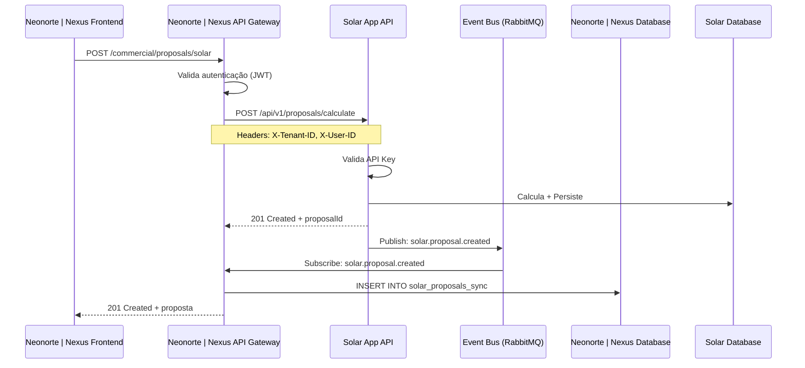

# Guia de Integração: Solar App ↔ Neonorte | Nexus Monolith

## Visão Geral

Este guia detalha as estratégias e implementações práticas para integrar a aplicação standalone de dimensionamento fotovoltaico ao Neonorte | Nexus Monolith.

---

## Estratégias de Integração

### Comparação das Abordagens

| Aspecto              | Microserviço | Biblioteca Compartilhada | Módulo Embarcado |
| -------------------- | ------------ | ------------------------ | ---------------- |
| **Deployment**       | Independente | Dependente               | Dependente       |
| **Latência**         | Alta (rede)  | Zero                     | Zero             |
| **Escalabilidade**   | Excelente    | Limitada                 | Limitada         |
| **Complexidade**     | Alta         | Média                    | Baixa            |
| **Manutenção**       | Isolada      | Sincronizada             | Sincronizada     |
| **Recomendado para** | Produção     | Desenvolvimento          | MVP/Fase 1       |

---

## Opção 1: Microserviço Independente (Produção)

### Arquitetura



### Implementação

#### 1. Configuração do API Gateway (Neonorte | Nexus)

```typescript
// nexus-monolith/backend/src/middleware/solar-proxy.middleware.ts
import { FastifyRequest, FastifyReply } from "fastify";
import axios from "axios";

const SOLAR_API_URL = process.env.SOLAR_API_URL || "http://solar-api:3000";
const SOLAR_API_KEY = process.env.SOLAR_API_KEY;

export const solarProxyMiddleware = async (
  req: FastifyRequest,
  reply: FastifyReply,
) => {
  try {
    // Extrai contexto do Neonorte | Nexus
    const { user, tenantId } = req;

    // Faz proxy para Solar API
    const response = await axios({
      method: req.method,
      url: `${SOLAR_API_URL}${req.url.replace("/api/v2/solar", "/api/v1")}`,
      data: req.body,
      headers: {
        "X-API-Key": SOLAR_API_KEY,
        "X-Tenant-ID": tenantId,
        "X-User-ID": user.id,
        "Content-Type": "application/json",
      },
      timeout: 10000, // 10s
    });

    reply.status(response.status).send(response.data);
  } catch (error) {
    if (error.response) {
      reply.status(error.response.status).send(error.response.data);
    } else {
      reply.status(503).send({
        error: {
          code: "SOLAR_API_UNAVAILABLE",
          message: "Serviço de dimensionamento temporariamente indisponível",
        },
      });
    }
  }
};

// Registra rotas
fastify.all("/api/v2/solar/*", solarProxyMiddleware);
```

#### 2. Autenticação via API Key (Solar App)

```typescript
// solar-app/packages/api/src/middleware/auth.middleware.ts
import { FastifyRequest, FastifyReply } from "fastify";

const VALID_API_KEYS = new Set(process.env.API_KEYS?.split(",") || []);

export const apiKeyAuth = async (req: FastifyRequest, reply: FastifyReply) => {
  const apiKey = req.headers["x-api-key"] as string;

  if (!apiKey || !VALID_API_KEYS.has(apiKey)) {
    return reply.status(401).send({
      error: {
        code: "INVALID_API_KEY",
        message: "API Key inválida ou ausente",
      },
    });
  }

  // Extrai contexto do Neonorte | Nexus (se presente)
  req.context = {
    tenantId: (req.headers["x-tenant-id"] as string) || "standalone",
    userId: (req.headers["x-user-id"] as string) || "anonymous",
    source: "nexus",
  };
};

// Aplica em rotas protegidas
fastify.register(async (instance) => {
  instance.addHook("preHandler", apiKeyAuth);

  instance.post("/api/v1/proposals/calculate", calculateProposalHandler);
  instance.get("/api/v1/proposals/:id", getProposalHandler);
});
```

#### 3. Event Bus (RabbitMQ)

**Solar App - Publisher:**

```typescript
// solar-app/packages/api/src/events/publisher.ts
import amqp from "amqplib";

class EventPublisher {
  private connection: amqp.Connection;
  private channel: amqp.Channel;

  async connect() {
    this.connection = await amqp.connect(process.env.RABBITMQ_URL);
    this.channel = await this.connection.createChannel();
    await this.channel.assertExchange("solar.events", "topic", {
      durable: true,
    });
  }

  async publish(event: string, data: any) {
    const message = {
      event,
      data,
      timestamp: new Date().toISOString(),
      source: "solar-app",
    };

    this.channel.publish(
      "solar.events",
      event, // routing key
      Buffer.from(JSON.stringify(message)),
      { persistent: true },
    );

    logger.info({ event, data }, "Event published");
  }
}

export const eventPublisher = new EventPublisher();

// Uso no service
await prisma.solarProposal.create({ data: proposalData });

await eventPublisher.publish("solar.proposal.created", {
  proposalId: proposal.id,
  leadId: proposal.externalLeadId,
  tenantId: proposal.tenantId,
  systemSizeKwp: proposal.systemSizeKwp,
  totalInvestment: proposal.totalInvestment,
});
```

**Neonorte | Nexus - Subscriber:**

```typescript
// nexus-monolith/backend/src/events/solar.subscriber.ts
import amqp from "amqplib";
import { prisma } from "../lib/prisma";

class SolarEventSubscriber {
  private connection: amqp.Connection;
  private channel: amqp.Channel;

  async connect() {
    this.connection = await amqp.connect(process.env.RABBITMQ_URL);
    this.channel = await this.connection.createChannel();

    await this.channel.assertExchange("solar.events", "topic", {
      durable: true,
    });
    const queue = await this.channel.assertQueue("nexus.solar.events", {
      durable: true,
    });

    // Bind routing keys
    await this.channel.bindQueue(
      queue.queue,
      "solar.events",
      "solar.proposal.*",
    );

    this.channel.consume(queue.queue, this.handleMessage.bind(this), {
      noAck: false,
    });
  }

  private async handleMessage(msg: amqp.ConsumeMessage) {
    try {
      const { event, data } = JSON.parse(msg.content.toString());

      switch (event) {
        case "solar.proposal.created":
          await this.handleProposalCreated(data);
          break;
        case "solar.proposal.approved":
          await this.handleProposalApproved(data);
          break;
      }

      this.channel.ack(msg);
    } catch (error) {
      logger.error({ error, msg }, "Error handling event");
      this.channel.nack(msg, false, true); // Requeue
    }
  }

  private async handleProposalCreated(data: any) {
    // Sincroniza com banco do Neonorte | Nexus
    await prisma.solarProposal.upsert({
      where: { id: data.proposalId },
      create: {
        id: data.proposalId,
        leadId: data.leadId,
        tenantId: data.tenantId,
        systemSizeKwp: data.systemSizeKwp,
        totalInvestment: data.totalInvestment,
        status: "DRAFT",
        // ... outros campos
      },
      update: {
        systemSizeKwp: data.systemSizeKwp,
        totalInvestment: data.totalInvestment,
      },
    });

    logger.info({ proposalId: data.proposalId }, "Solar proposal synced");
  }

  private async handleProposalApproved(data: any) {
    // Atualiza lead no Neonorte | Nexus
    await prisma.lead.update({
      where: { id: data.leadId },
      data: {
        status: "PROPOSAL_APPROVED",
        engagementScore: { increment: 20 },
      },
    });
  }
}

export const solarEventSubscriber = new SolarEventSubscriber();
```

#### 4. Circuit Breaker (Resiliência)

```typescript
// nexus-monolith/backend/src/lib/circuit-breaker.ts
import CircuitBreaker from "opossum";
import axios from "axios";

const solarApiCall = async (config: any) => {
  return axios(config);
};

export const solarApiCircuitBreaker = new CircuitBreaker(solarApiCall, {
  timeout: 5000, // 5s
  errorThresholdPercentage: 50, // Abre se 50% falharem
  resetTimeout: 30000, // Tenta fechar após 30s
  rollingCountTimeout: 10000, // Janela de 10s
  rollingCountBuckets: 10,
});

// Eventos
solarApiCircuitBreaker.on("open", () => {
  logger.warn("Solar API circuit breaker OPEN");
});

solarApiCircuitBreaker.on("halfOpen", () => {
  logger.info("Solar API circuit breaker HALF-OPEN");
});

solarApiCircuitBreaker.on("close", () => {
  logger.info("Solar API circuit breaker CLOSED");
});

// Uso
try {
  const response = await solarApiCircuitBreaker.fire({
    method: "POST",
    url: `${SOLAR_API_URL}/api/v1/proposals/calculate`,
    data: input,
  });
} catch (error) {
  if (error.message === "Breaker is open") {
    // Fallback: retornar proposta simplificada
    return generateSimplifiedProposal(input);
  }
  throw error;
}
```

---

## Opção 2: Biblioteca Compartilhada (Desenvolvimento)

### Arquitetura

```
@neonorte/solar-core (NPM Package)
    ↓
    ├── nexus-monolith (instala via npm)
    ├── solar-app-standalone (instala via npm)
    └── mobile-app (instala via npm)
```

### Implementação

#### 1. Estrutura do Package

```
packages/solar-core/
├── src/
│   ├── domain/
│   │   ├── SolarCalculator.ts
│   │   ├── IrradiationEngine.ts
│   │   └── FinancialAnalyzer.ts
│   ├── schemas/
│   │   ├── input.schemas.ts
│   │   └── output.schemas.ts
│   ├── types/
│   │   └── index.ts
│   └── index.ts
├── tests/
│   └── SolarCalculator.test.ts
├── package.json
├── tsconfig.json
└── README.md
```

#### 2. Package.json

```json
{
  "name": "@neonorte/solar-core",
  "version": "1.0.0",
  "description": "Core solar calculation engine",
  "main": "dist/index.js",
  "types": "dist/index.d.ts",
  "exports": {
    ".": "./dist/index.js",
    "./schemas": "./dist/schemas/index.js",
    "./types": "./dist/types/index.js"
  },
  "scripts": {
    "build": "tsc",
    "test": "vitest",
    "prepublishOnly": "npm run build && npm test"
  },
  "peerDependencies": {
    "zod": "^3.22.0"
  },
  "devDependencies": {
    "@types/node": "^20.0.0",
    "typescript": "^5.0.0",
    "vitest": "^1.0.0"
  }
}
```

#### 3. Uso no Neonorte | Nexus

```typescript
// nexus-monolith/backend/src/modules/solar/solar.service.ts
import { SolarCalculator } from "@neonorte/solar-core";
import { SolarInputSchema } from "@neonorte/solar-core/schemas";
import { prisma } from "../../../lib/prisma";

export class NexusSolarService {
  private calculator: SolarCalculator;

  constructor() {
    this.calculator = new SolarCalculator();
  }

  async createProposal(input: unknown, ctx: { user: User; tenantId: string }) {
    // Validação com schema compartilhado
    const validatedInput = SolarInputSchema.parse(input);

    // Cálculo com core compartilhado
    const result = this.calculator.calculate(validatedInput);

    // Persistência no banco do Neonorte | Nexus
    const proposal = await prisma.solarProposal.create({
      data: {
        ...result,
        leadId: validatedInput.externalLeadId,
        tenantId: ctx.tenantId,
        userId: ctx.user.id,
      },
    });

    // Emite evento interno do Neonorte | Nexus
    events.emit("solar.proposal.created", proposal);

    return proposal;
  }
}
```

#### 4. Versionamento e Publicação

```bash
# Desenvolvimento local (link simbólico)
cd packages/solar-core
npm link

cd nexus-monolith/backend
npm link @neonorte/solar-core

# Publicação no NPM Registry
cd packages/solar-core
npm version patch  # 1.0.0 -> 1.0.1
npm publish --access public

# Atualização no Neonorte | Nexus
cd nexus-monolith/backend
npm update @neonorte/solar-core
```

---

## Opção 3: Módulo Embarcado (MVP/Fase 1)

### Implementação

#### 1. Copiar Core para Neonorte | Nexus

```bash
# Estrutura
nexus-monolith/backend/src/modules/solar/
├── domain/              # Copiado de solar-app/packages/core/domain
│   ├── SolarCalculator.ts
│   └── IrradiationEngine.ts
├── schemas/             # Copiado de solar-app/packages/core/schemas
│   └── solar.schemas.ts
├── services/
│   └── solar.service.ts
├── controllers/
│   └── solar.controller.ts
└── routes/
    └── solar.routes.ts
```

#### 2. Service (Neonorte | Nexus)

```typescript
// nexus-monolith/backend/src/modules/solar/services/solar.service.ts
import { SolarCalculator } from "../domain/SolarCalculator";
import { SolarInputSchema } from "../schemas/solar.schemas";
import { prisma } from "../../../lib/prisma";
import { events } from "../../../core/events";

export const SolarService = {
  async calculate(input: unknown, ctx: { user: User; tenantId: string }) {
    // Validação
    const validatedInput = SolarInputSchema.parse(input);

    // Cálculo
    const calculator = new SolarCalculator();
    const result = calculator.calculate(validatedInput);

    // Persistência
    const proposal = await prisma.solarProposal.create({
      data: {
        ...result,
        tenantId: ctx.tenantId,
        userId: ctx.user.id,
      },
    });

    // Evento
    events.emit("solar.proposal.created", proposal);

    return proposal;
  },
};
```

#### 3. Controller (Neonorte | Nexus)

```typescript
// nexus-monolith/backend/src/modules/solar/controllers/solar.controller.ts
import { SolarService } from "../services/solar.service";

export const SolarController = {
  async calculate(req, res) {
    try {
      const result = await SolarService.calculate(req.body, {
        user: req.user,
        tenantId: req.user.tenantId,
      });

      res.status(201).json({ data: result });
    } catch (error) {
      if (error instanceof ZodError) {
        res.status(400).json({
          error: {
            code: "VALIDATION_ERROR",
            message: "Dados inválidos",
            details: error.errors,
          },
        });
      } else {
        res.status(500).json({
          error: {
            code: "INTERNAL_ERROR",
            message: "Erro ao calcular proposta",
          },
        });
      }
    }
  },
};
```

#### 4. Sincronização com Solar App Standalone

```typescript
// Script de sincronização (executar periodicamente)
// nexus-monolith/backend/src/scripts/sync-solar-proposals.ts
import { prisma as nexusPrisma } from "../lib/prisma";
import axios from "axios";

const SOLAR_API_URL = process.env.SOLAR_API_URL;
const SOLAR_API_KEY = process.env.SOLAR_API_KEY;

async function syncProposals() {
  // Busca propostas criadas no Neonorte | Nexus nas últimas 24h
  const proposals = await nexusPrisma.solarProposal.findMany({
    where: {
      createdAt: { gte: new Date(Date.now() - 24 * 60 * 60 * 1000) },
      syncedToSolarApp: false,
    },
  });

  for (const proposal of proposals) {
    try {
      // Envia para Solar App (backup/analytics)
      await axios.post(`${SOLAR_API_URL}/api/v1/proposals/import`, proposal, {
        headers: { "X-API-Key": SOLAR_API_KEY },
      });

      // Marca como sincronizado
      await nexusPrisma.solarProposal.update({
        where: { id: proposal.id },
        data: { syncedToSolarApp: true },
      });

      console.log(`✓ Synced proposal ${proposal.id}`);
    } catch (error) {
      console.error(`✗ Failed to sync ${proposal.id}:`, error.message);
    }
  }
}

syncProposals().catch(console.error);
```

---

## Migração de Dados

### Script de Migração (Neonorte | Nexus → Solar App)

```typescript
// solar-app/scripts/import-from-nexus.ts
import { PrismaClient as NexusPrisma } from "@prisma/nexus-client";
import { PrismaClient as SolarPrisma } from "@prisma/solar-client";

const nexus = new NexusPrisma({
  datasources: { db: { url: process.env.NEXUS_DATABASE_URL } },
});

const solar = new SolarPrisma({
  datasources: { db: { url: process.env.SOLAR_DATABASE_URL } },
});

async function migrate() {
  console.log("Starting migration...");

  // 1. Migrar módulos fotovoltaicos
  const modules = await nexus.solarModule.findMany();
  for (const module of modules) {
    await solar.solarModule.upsert({
      where: { id: module.id },
      create: module,
      update: module,
    });
  }
  console.log(`✓ Migrated ${modules.length} modules`);

  // 2. Migrar inversores
  const inverters = await nexus.solarInverter.findMany();
  for (const inverter of inverters) {
    await solar.solarInverter.upsert({
      where: { id: inverter.id },
      create: inverter,
      update: inverter,
    });
  }
  console.log(`✓ Migrated ${inverters.length} inverters`);

  // 3. Migrar propostas
  const proposals = await nexus.solarProposal.findMany({
    include: { lead: true },
  });

  for (const proposal of proposals) {
    await solar.solarProposal.upsert({
      where: { id: proposal.id },
      create: {
        ...proposal,
        externalLeadId: proposal.leadId,
        tenantId: proposal.tenantId || "migrated",
      },
      update: {
        systemSizeKwp: proposal.systemSizeKwp,
        totalInvestment: proposal.totalInvestment,
      },
    });
  }
  console.log(`✓ Migrated ${proposals.length} proposals`);

  console.log("Migration completed!");
}

migrate()
  .catch(console.error)
  .finally(() => {
    nexus.$disconnect();
    solar.$disconnect();
  });
```

---

## Testes de Integração

### Teste E2E (Neonorte | Nexus → Solar App)

```typescript
// nexus-monolith/backend/tests/integration/solar.test.ts
import { describe, it, expect, beforeAll } from "vitest";
import request from "supertest";
import { app } from "../../src/app";

describe("Solar Integration", () => {
  let authToken: string;
  let leadId: string;

  beforeAll(async () => {
    // Autentica usuário
    const authRes = await request(app)
      .post("/api/v2/auth/login")
      .send({ username: "test", password: "test123" });
    authToken = authRes.body.token;

    // Cria lead
    const leadRes = await request(app)
      .post("/api/v2/commercial/leads")
      .set("Authorization", `Bearer ${authToken}`)
      .send({ name: "Test Lead", phone: "11999999999" });
    leadId = leadRes.body.data.id;
  });

  it("deve calcular proposta solar via proxy", async () => {
    const response = await request(app)
      .post("/api/v2/solar/proposals/calculate")
      .set("Authorization", `Bearer ${authToken}`)
      .send({
        consumptionKwh: 500,
        cityCode: "3550308",
        roofType: "CERAMIC",
        roofOrientation: "NORTH",
        roofInclination: 15,
        voltage: "V220",
        connectionType: "BIFASICO",
        externalLeadId: leadId,
      });

    expect(response.status).toBe(201);
    expect(response.body.data).toHaveProperty("systemSizeKwp");
    expect(response.body.data).toHaveProperty("totalInvestment");
    expect(response.body.data.systemSizeKwp).toBeGreaterThan(0);
  });

  it("deve sincronizar proposta via event bus", async () => {
    // Aguarda processamento assíncrono
    await new Promise((resolve) => setTimeout(resolve, 2000));

    // Verifica se proposta foi sincronizada no Neonorte | Nexus
    const proposals = await request(app)
      .get(`/api/v2/commercial/leads/${leadId}/proposals`)
      .set("Authorization", `Bearer ${authToken}`);

    expect(proposals.body.data).toHaveLength(1);
    expect(proposals.body.data[0]).toHaveProperty("systemSizeKwp");
  });
});
```

---

## Monitoramento e Observabilidade

### Dashboard de Integração (Grafana)

```yaml
# Métricas Prometheus
solar_api_requests_total{source="nexus",status="success|error"}
solar_api_latency_seconds{source="nexus",endpoint="/calculate"}
solar_event_bus_messages_total{event="solar.proposal.created",status="published|consumed"}
solar_sync_lag_seconds{direction="nexus_to_solar"}
```

### Alertas

```yaml
# alerts.yml
groups:
  - name: solar_integration
    rules:
      - alert: SolarAPIHighErrorRate
        expr: rate(solar_api_requests_total{status="error"}[5m]) > 0.1
        for: 5m
        annotations:
          summary: "Solar API error rate > 10%"

      - alert: SolarEventBusLag
        expr: solar_sync_lag_seconds > 300
        for: 10m
        annotations:
          summary: "Solar event bus lag > 5 minutes"

      - alert: SolarAPIDown
        expr: up{job="solar-api"} == 0
        for: 1m
        annotations:
          summary: "Solar API is down"
```

---

## Checklist de Integração

### Pré-Requisitos

- [ ] Solar App deployado e acessível
- [ ] API Key gerada e configurada
- [ ] Event Bus (RabbitMQ) configurado
- [ ] Schemas Zod sincronizados

### Neonorte | Nexus (Cliente)

- [ ] Proxy middleware implementado
- [ ] Circuit breaker configurado
- [ ] Event subscriber implementado
- [ ] Testes de integração passando

### Solar App (Servidor)

- [ ] API Key authentication implementado
- [ ] Event publisher implementado
- [ ] Contexto multi-tenant suportado
- [ ] Logs estruturados configurados

### Observabilidade

- [ ] Métricas Prometheus expostas
- [ ] Dashboard Grafana criado
- [ ] Alertas configurados
- [ ] Tracing distribuído ativo

### Documentação

- [ ] API Reference atualizada
- [ ] Runbook de troubleshooting criado
- [ ] Diagramas de sequência documentados

---

## Troubleshooting

### Problema: Solar API retorna 503

**Diagnóstico:**

```bash
# Verifica se Solar API está rodando
curl http://solar-api:3000/health

# Verifica logs
kubectl logs -f deployment/solar-api --tail=100
```

**Solução:**

- Verificar se pods estão rodando
- Verificar se database está acessível
- Verificar circuit breaker status

---

### Problema: Eventos não são consumidos

**Diagnóstico:**

```bash
# Verifica filas RabbitMQ
rabbitmqctl list_queues name messages consumers

# Verifica bindings
rabbitmqctl list_bindings
```

**Solução:**

- Verificar se subscriber está conectado
- Verificar routing keys
- Verificar se mensagens estão na DLQ (Dead Letter Queue)

---

## Conclusão

Este guia fornece três estratégias de integração com diferentes trade-offs:

1. **Microserviço:** Melhor para produção, máxima flexibilidade
2. **Biblioteca:** Melhor para desenvolvimento, zero latência
3. **Módulo Embarcado:** Melhor para MVP, simplicidade

**Recomendação:** Começar com **Módulo Embarcado** (Fase 1), migrar para **Microserviço** (Produção).

---

**Versão:** 1.0.0  
**Última Atualização:** 2026-01-26
