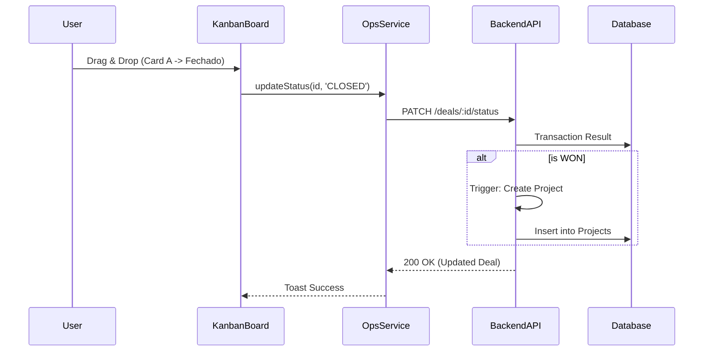

# 🗺️ Mapa Comercial: Neonorte | Nexus Monolith (`/commercial`)

> **Versão:** 2.2.0 (Commercial Expansion)  
> **Módulo:** Comercial / CRM  
> **Localização:** `frontend/src/views/commercial`  
> **Última Atualização:** 2026-01-26

---

## 🏗️ Visão Geral

O Módulo **Commercial** é responsável pela aquisição de clientes, gestão do funil de vendas (CRM) e controle de metas da equipe de vendas. Na versão 2.2, o módulo foi expandido significativamente para incluir:

- **Missões Comerciais:** Campanhas regionais com gamificação
- **Lead Scoring Automático:** Priorização inteligente de leads
- **Funil de 8 Estágios:** Processo estruturado com validações obrigatórias
- **Propostas Técnicas:** Validação de engenharia antes da comercialização
- **Guardrails de Qualidade:** Regra "Sem Jeitinho" para evitar atalhos

### 🧭 Estrutura de Navegação

| Rota                  | Label         | Ícone          | Função Macro                                       |
| :-------------------- | :------------ | :------------- | :------------------------------------------------- |
| `/commercial/crm`     | **Pipeline**  | 🤝 `Handshake` | Gestão visual de oportunidades (Kanban).           |
| `/commercial/leads`   | **Leads**     | 🎣 `Hook`      | Gestão de novos contatos (pré-venda).              |
| `/commercial/mission` | **Missão**    | 🚀 `Rocket`    | Painel de Metas e Gamificação (Mission Control).   |
| `/commercial/quotes`  | **Propostas** | 🌞 `Sun`       | Solar Wizard (geração de propostas fotovoltaicas). |

---

## 🧩 Detalhamento dos Componentes (Views)

### 1. Commercial Pipeline (`CommercialPipeline.tsx`)

**Localização:** `src/modules/commercial/ui/`

- **Função:** Kanban de Vendas Principal.
- **Colunas Típicas:** Prospecção -> Qualificação -> Proposta -> Negociação -> Fechado.
- **Features:**
  - Drag-and-drop de Cards.
  - Cálculo automático de valor em funil.
  - Abertura rápida de detalhes (`LeadDrawer`).

### 2. Leads Pipeline (`LeadsPipeline.tsx`)

**Localização:** `src/modules/commercial/ui/`

- **Função:** Triagem de Leads (SDR).
- **Foco:** Velocidade de contato e qualificação rápida.

### 3. Mission Control (`MissionControl.tsx`)

**Localização:** `src/modules/commercial/ui/`

- **Função:** Gestão de Equipe e Metas.
- **Features:**
  - Placar de Vendas.
  - Metas Individuais vs Realizado.

### 4. Solar Wizard / Quotes (`SolarWizardView.tsx`)

**Localização:** `src/views/commercial/`

- **Função:** Gerador de Propostas Fotovoltaicas.
- **Rota:** `/commercial/quotes`
- **Nota:** Implementa lógica complexa de engenharia (`solarEngine`). Detalhes em `SOLAR_ENGINE_MAP.md`.

---

## 📊 Entidades de Dados (v2.2)

### 1. Lead (Contato de Pré-Venda)

**Schema:**

```typescript
interface Lead {
  id: string;
  name: string;
  email?: string;
  phone: string;
  status: string;
  source: LeadSource;

  // Enriquecimento (v2.2)
  city?: string;
  state?: string;
  engagementScore: number; // 0-100
  academyScore?: number; // Pontuação em treinamentos
  technicalProfile?: Json; // Perfil técnico do cliente
  academyOrigin?: string; // Origem: Academy
  energyBillUrl?: string; // Obrigatório para avançar estágios

  // Relações
  ownerId?: string;
  missionId?: string;
  proposals: SolarProposal[];
  opportunities: Opportunity[];
  interactions: LeadInteraction[];
}

enum LeadSource {
  ORGANIC = "ORGANIC",
  REFERRAL = "REFERRAL",
  PAID_MEDIA = "PAID_MEDIA",
  ACADEMY = "ACADEMY",
  OUTBOUND = "OUTBOUND",
}
```

**Lead Scoring Automático:**

```typescript
const calculateEngagementScore = (lead: Lead): number => {
  let score = 0;

  // Dados completos (+20)
  if (lead.email && lead.phone && lead.city) score += 20;

  // Origem qualificada (+30)
  if (lead.source === "ACADEMY") score += 30;

  // Interações recentes (+10 por interação, max 40)
  const recentInteractions = lead.interactions.filter((i) =>
    isWithinDays(i.createdAt, 7),
  );
  score += Math.min(recentInteractions.length * 10, 40);

  // Perfil técnico (+10)
  if (lead.technicalProfile) score += 10;

  return Math.min(score, 100);
};
```

### 2. Mission (Missão Comercial)

**Schema:**

```typescript
interface Mission {
  id: string;
  name: string;
  region: string;
  regionPolygon?: Json; // GeoJSON para mapa
  startDate: DateTime;
  endDate: DateTime;
  status: MissionStatus;
  stats?: Json; // Métricas agregadas

  // Relações
  coordinatorId?: string;
  leads: Lead[];
  opportunities: Opportunity[];
}

enum MissionStatus {
  PLANNING = "PLANNING",
  ACTIVE = "ACTIVE",
  COMPLETED = "COMPLETED",
}
```

**Métricas da Missão:**

```typescript
interface MissionStats {
  leadsTotal: number;
  leadsQualified: number;
  opportunitiesCreated: number;
  dealsWon: number;
  totalRevenue: number;
  conversionRate: number; // %
  avgTicket: number;
}
```

### 3. Opportunity (Oportunidade de Venda)

**Schema:**

```typescript
interface Opportunity {
  id: string;
  title: string;
  leadId: string;
  missionId?: string;
  status: OpportunityStatus;
  estimatedValue: Decimal;
  probability: number; // 0-100

  // Relações
  technicalProposalId?: string;
  technicalProposal?: TechnicalProposal;
  lead: Lead;
  mission?: Mission;
}

enum OpportunityStatus {
  LEAD_QUALIFICATION = "LEAD_QUALIFICATION",
  VISIT_SCHEDULED = "VISIT_SCHEDULED",
  TECHNICAL_VISIT_DONE = "TECHNICAL_VISIT_DONE",
  PROPOSAL_GENERATED = "PROPOSAL_GENERATED",
  NEGOTIATION = "NEGOTIATION",
  CONTRACT_SENT = "CONTRACT_SENT",
  CLOSED_WON = "CLOSED_WON",
  CLOSED_LOST = "CLOSED_LOST",
}
```

**Funil de Vendas:**

```
LEAD_QUALIFICATION (Qualificação)
    ↓ [Requer: dados completos]
VISIT_SCHEDULED (Visita Agendada)
    ↓ [Requer: energyBillUrl]
TECHNICAL_VISIT_DONE (Visita Realizada)
    ↓ [Requer: fotos + medições]
PROPOSAL_GENERATED (Proposta Gerada)
    ↓ [Requer: validação engenharia]
NEGOTIATION (Negociação)
    ↓ [Requer: aprovação comercial]
CONTRACT_SENT (Contrato Enviado)
    ↓
CLOSED_WON (Ganho) → Cria Projeto em Ops
    ou
CLOSED_LOST (Perdido) → Registra motivo
```

### 4. TechnicalProposal (Proposta Técnica)

**Schema:**

```typescript
interface TechnicalProposal {
  id: string;
  kitData: Json; // Equipamentos selecionados
  consumptionAvg: number; // kWh médio
  infrastructurePhotos: Json; // Array de URLs
  paybackData: Json; // Análise de retorno
  validatedByEng: boolean; // Validação obrigatória

  // Relação
  opportunity?: Opportunity;
}
```

**Validação de Engenharia:**

```typescript
const validateTechnicalProposal = (proposal: TechnicalProposal): boolean => {
  // Checklist obrigatório
  const checks = {
    hasKitData: !!proposal.kitData,
    hasConsumption: proposal.consumptionAvg > 0,
    hasPhotos:
      Array.isArray(proposal.infrastructurePhotos) &&
      proposal.infrastructurePhotos.length >= 3,
    hasPayback: !!proposal.paybackData,
    isValidated: proposal.validatedByEng,
  };

  return Object.values(checks).every(Boolean);
};
```

---

## 🛡️ Guardrails de Qualidade ("Sem Jeitinho")

### Regras de Transição de Estágios

```typescript
// Não pode avançar sem dados obrigatórios
const canAdvanceStage = (
  opportunity: Opportunity,
  targetStage: OpportunityStatus,
): ValidationResult => {
  switch (targetStage) {
    case "VISIT_SCHEDULED":
      if (!opportunity.lead.energyBillUrl) {
        return {
          valid: false,
          message: "Conta de energia é obrigatória para agendar visita",
        };
      }
      break;

    case "PROPOSAL_GENERATED":
      if (!opportunity.technicalProposal?.validatedByEng) {
        return {
          valid: false,
          message: "Proposta técnica deve ser validada por engenharia",
        };
      }
      break;

    case "CONTRACT_SENT":
      if (opportunity.estimatedValue === 0) {
        return {
          valid: false,
          message: "Valor estimado deve ser definido antes de enviar contrato",
        };
      }
      break;
  }

  return { valid: true };
};
```

### Auditoria de Mudanças

Todas as transições de estágio são registradas em `AuditLog`:

```typescript
await prisma.auditLog.create({
  data: {
    userId: currentUser.id,
    action: "OPPORTUNITY_STAGE_CHANGED",
    entity: "Opportunity",
    resourceId: opportunity.id,
    before: { status: oldStatus },
    after: { status: newStatus },
    details: JSON.stringify({
      reason: transitionReason,
      validations: validationResults,
    }),
  },
});
```

---

## 🛠️ Componentes Satélites

- **`LeadDrawer.tsx`**: Painel lateral deslizante para edição rápida de dados do Lead/Cliente, sem sair do Kanban.

## 📡 Integração de Dados

- Sincroniza status com o Backend.
- Gatilhos automáticos: Ao mover card para "Fechado", pode disparar criação de Projeto em Ops.

## 🔄 Fluxo de Dados (Exemplo: Mover Card)


