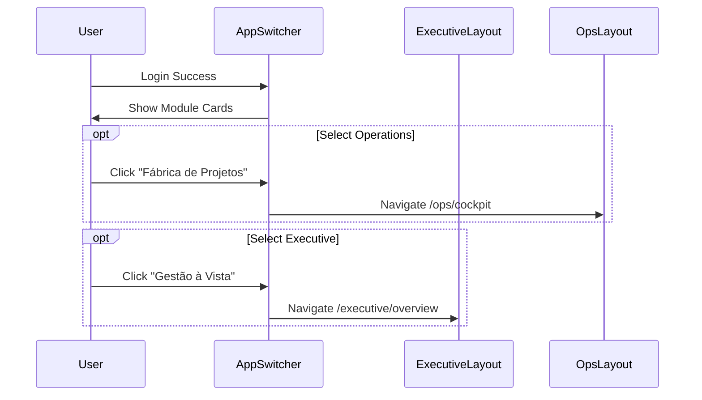

# 🗺️ Mapa Core: Neonorte | Nexus Monolith (`/` & `/executive`)

> **Módulo:** Core / Navegação
> **Localização:** `frontend/src/views`

---

## 🏗️ Visão Geral

O **Core** do Neonorte | Nexus Front-end gerencia a entrada (Portal) e a visão executiva consolidada.

### 🧭 Estrutura de Navegação

| Rota                   | Label              | Ícone                | Função Macro                                          |
| :--------------------- | :----------------- | :------------------- | :---------------------------------------------------- |
| `/`                    | **Portal de Apps** | 🏗️ `Grid`            | App Switcher. Ponto de entrada para escolher módulos. |
| `/executive`           | **Gestão à Vista** | 📊 `LayoutDashboard` | Wrapper para visões de BI, Financeiro e Estratégia.   |
| `/executive/overview`  | **Visão Geral**    | 📈 `LineChart`       | Analytics Dashboard (BI).                             |
| `/executive/strategy`  | **Estratégia**     | 🎯 `Target`          | Gerenciamento de Metas (Strategy).                    |
| `/executive/financial` | **Financeiro**     | 💰 `Wallet`          | Dashboard Financeiro (Fin).                           |

---

## 🧩 Detalhamento dos Componentes (Views)

### 1. App Switcher (`AppSwitcher.tsx`)

**Localização:** `src/views/AppSwitcher.tsx`

- **Função:** Landing Page Autenticada.
- **Features:**
  - Cards de Seleção de Módulo (Executive, Commercial, Ops, Academy).
  - Logout.
  - Design "Glassmorphism" e animações de entrada.

### 2. Executive Layout (`ExecutiveLayout.tsx`)

**Localização:** `src/views/executive/ExecutiveLayout.tsx`

- **Função:** Layout Mestre para a diretoria.
- **Padrão UX:** Sidebar com navegação executiva + Header com Breadcrumbs/User info.
- **Children:** Renderiza módulos de BI, Finanças e Estratégia via `Outlet`.

### 3. Dashboard Cockpit (`DashboardCockpit.tsx`) - _LEGADO_

**Localização:** `src/modules/dashboard/ui/`

- **Status:** ⚠️ Órfão/Deprecado.
- **Nota:** Substituído funcionalmente pelo `AppSwitcher` e `AnalyticsDashboard`. Mantido no código para referência histórica ou reutilização futura de widgets.

---

## 📡 Integração de Dados

- O `AppSwitcher` é puramente navegacional (Client-Side).
- O `ExecutiveLayout` mantém estado de sessão e layout responsivo.

## 🔄 Fluxo de Navegação

