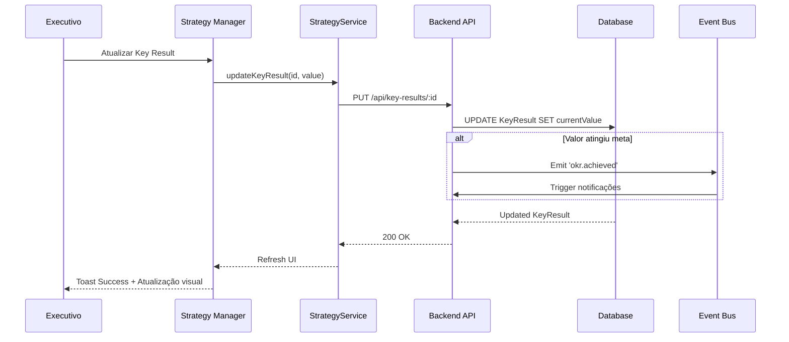

# 🗺️ Mapa Executivo: Neonorte | Nexus Monolith (`/executive`)

> **Módulo:** Executive / Diretoria
> **Localização:** `frontend/src/views/executive`

---

## 🏗️ Visão Geral

O Módulo **Executive** é o painel de comando estratégico do sistema. Ele fornece visões consolidadas e de alto nível para tomada de decisão executiva, focando em métricas, KPIs e alinhamento estratégico.

### 🧭 Estrutura de Navegação

| Rota | Label | Ícone | Função Macro |
| Rota | Label | Ícone | Função Macro |
| :--------------------- | :----------------- | :--------------- | :------------------------------------------------- |
| `/executive/dashboard` | **Dashboard** | 📊 `BarChart3` | Visão consolidada de métricas e KPIs. |
| `/executive/strategy` | **Estratégia** | 🎯 `Target` | Gestão de OKRs e Pilares Estratégicos. |
| `/executive/portfolio` | **Portfólio** | 💼 `Briefcase` | Visão executiva de todos os projetos. |
| `/executive/bi` | **Business Intel** | 📈 `TrendingUp` | Análises avançadas e relatórios customizados. |
| `/executive/risks` | **Riscos** | ⚠️ `AlertCircle` | Gestão de riscos estratégicos e operacionais. |
| `/executive/people` | **Pessoas** | 👥 `Users` | Gestão de Pessoas e Carga de Trabalho (Workload). |

---

## 🧩 Detalhamento dos Componentes (Views)

### 1. Executive Dashboard (`ExecutiveDashboard.tsx`)

**Localização:** `src/views/executive/`

- **Função:** Painel principal com visão 360° do negócio.
- **Features:**
  - Cards de KPIs principais (Receita, Projetos Ativos, Taxa de Conversão)
  - Gráficos de tendência (Recharts)
  - Alertas de riscos críticos
  - Progresso de OKRs estratégicos
  - Mapa de calor de performance por região

**Componentes Utilizados:**

- `MetricCard.tsx` - Card de métrica com variação percentual
- `TrendChart.tsx` - Gráfico de linha temporal
- `RiskAlert.tsx` - Alerta visual de riscos

### 2. Strategy Manager (`StrategyManagerView.tsx`)

**Localização:** `src/modules/strategy/ui/`

- **Função:** Gestão completa de estratégias organizacionais.
- **Features:**
  - Criação de Pilares Estratégicos (PPAs)
  - Definição de Key Results (OKRs)
  - Visualização hierárquica de estratégias
  - Acompanhamento de progresso
  - Vinculação de projetos a estratégias

**Padrão UX:** Master-Detail com árvore hierárquica

### 3. Portfolio View (`PortfolioView.tsx`)

**Localização:** `src/views/executive/`

- **Função:** Visão executiva de todos os projetos em andamento.
- **Features:**
  - Grid de cards com status visual
  - Filtros por estratégia, status, gerente
  - Indicadores de saúde do projeto (verde/amarelo/vermelho)
  - Drill-down para detalhes do projeto
  - Exportação de relatórios

**Métricas Exibidas:**

- Progresso percentual
- Desvio de prazo
- Desvio de orçamento (quando aplicável)
- Riscos ativos
- Tarefas críticas pendentes

### 4. Business Intelligence (`BIView.tsx`)

**Localização:** `src/views/executive/` (Planejado)

- **Função:** Análises avançadas e relatórios customizados.
- **Features Planejadas:**
  - Dashboards customizáveis
  - Análise de tendências históricas
  - Comparativos período a período
  - Projeções e forecasting
  - Exportação para Excel/PDF

**Status:** 🚧 Em planejamento

### 5. Risk Management (`RiskManagementView.tsx`)

**Localização:** `src/views/executive/` (Planejado)

- **Função:** Gestão centralizada de riscos estratégicos e operacionais.
- **Features Planejadas:**
  - Matriz de probabilidade x impacto
  - Planos de mitigação
  - Histórico de riscos materializados
  - Alertas automáticos
  - Vinculação a estratégias e projetos

**Status:** 🚧 Em planejamento

### 6. People & Workload (`PeopleView.tsx`)

**Localização:** `src/modules/ops/ui/` (Consumido por Executive)

- **Função:** Visão holística da capacidade do time e estrutura organizacional.
- **Features:**
  - **Workload Heatmap:** Mapa de calor de ocupação por usuário (Overload/Optimal/Under).
  - **Org Tree Chart:** Visualização gráfica da hierarquia da empresa.
  - **Team Calendar:** Calendário unificado de tarefas e entregas.

**Componentes Satélites:**

- `WorkloadHeatmap.tsx`
- `OrgTreeChart.tsx`
- `TeamCalendar.tsx`

**Status:** ✅ Implementado (Refatorado para V2)

---

## 🛠️ Componentes Satélites

### Componentes Compartilhados

- **`StrategyTree.tsx`**: Visualizador recursivo da árvore estratégica
- **`MetricCard.tsx`**: Card reutilizável para exibição de KPIs
- **`ProgressRing.tsx`**: Indicador circular de progresso
- **`StatusBadge.tsx`**: Badge colorido de status

### Componentes de Visualização

- **`TrendChart.tsx`**: Gráfico de linha para tendências temporais
- **`BarChart.tsx`**: Gráfico de barras para comparações
- **`PieChart.tsx`**: Gráfico de pizza para distribuições
- **`HeatMap.tsx`**: Mapa de calor para análise geográfica

---

## 📡 Integração de Dados

### Services Utilizados

- **`StrategyService.ts`**: Gestão de estratégias e OKRs
- **`ProjectService.ts`**: Dados agregados de projetos
- **`MetricsService.ts`**: Cálculo de KPIs e métricas
- **`RiskService.ts`**: Gestão de riscos

### Endpoints Principais

```typescript
// Estratégias
GET /api/strategies
POST /api/strategies
PUT /api/strategies/:id
DELETE /api/strategies/:id

// Key Results
GET /api/strategies/:id/key-results
POST /api/strategies/:id/key-results
PUT /api/key-results/:id

// Métricas Executivas
GET /api/executive/metrics
GET /api/executive/portfolio-health
GET /api/executive/risks-summary
```

---

## 🔄 Fluxo de Dados (Exemplo: Atualização de OKR)



---

## 🎨 Design System

### Paleta de Cores (Módulo Executive)

- **Primary:** `#8B5CF6` (Violeta) - Ações principais
- **Success:** `#10B981` (Verde) - Metas atingidas
- **Warning:** `#F59E0B` (Âmbar) - Atenção necessária
- **Danger:** `#EF4444` (Vermelho) - Riscos críticos
- **Neutral:** `#6B7280` (Cinza) - Informações secundárias

### Tipografia

- **Headings:** Inter Bold
- **Body:** Inter Regular
- **Metrics:** Inter SemiBold (números grandes)

---

## 🔐 Controle de Acesso

### Permissões Necessárias

- **Visualização:** `ADMIN`, `COORDENACAO`, `DIRETORIA`
- **Edição de Estratégias:** `ADMIN`, `DIRETORIA`
- **Criação de OKRs:** `ADMIN`, `DIRETORIA`
- **Exclusão:** `ADMIN` apenas

### RBAC Implementation

```typescript
// Exemplo de verificação de permissão
const canEditStrategy = (user: User) => {
  return ["ADMIN", "DIRETORIA"].includes(user.role);
};

const canViewExecutive = (user: User) => {
  return ["ADMIN", "COORDENACAO", "DIRETORIA"].includes(user.role);
};
```

---

## 📊 Métricas e KPIs Principais

### Métricas de Negócio

1. **Taxa de Conversão Comercial**
   - Fórmula: `(Deals Fechados / Leads Qualificados) * 100`
   - Meta: > 15%

2. **Ticket Médio**
   - Fórmula: `Receita Total / Número de Projetos`
   - Meta: Definida por estratégia

3. **Tempo Médio de Execução**
   - Fórmula: `Média(Data Conclusão - Data Início)`
   - Meta: < 90 dias

### Métricas Operacionais

1. **Taxa de Conclusão no Prazo**
   - Fórmula: `(Projetos no Prazo / Total Projetos) * 100`
   - Meta: > 80%

2. **Utilização de Equipe**
   - Fórmula: `(Horas Trabalhadas / Horas Disponíveis) * 100`
   - Meta: 70-85%

3. **Índice de Qualidade**
   - Fórmula: `(Projetos sem Retrabalho / Total Projetos) * 100`
   - Meta: > 95%

### Métricas Estratégicas

1. **Progresso de OKRs**
   - Fórmula: `Média(currentValue / targetValue) * 100`
   - Meta: > 70% ao final do ciclo

2. **Alinhamento Estratégico**
   - Fórmula: `(Projetos Vinculados a Estratégias / Total Projetos) * 100`
   - Meta: > 90%

---

## 🚀 Roadmap

### Fase 1 (Concluído)

- ✅ Layout base do módulo
- ✅ Navegação entre views
- ✅ Integração com Strategy Manager

### Fase 2 (Em Desenvolvimento)

- 🚧 Dashboard executivo completo
- 🚧 Portfolio view com filtros avançados
- 🚧 Exportação de relatórios

### Fase 3 (Planejado)

- 📋 Business Intelligence customizável
- 📋 Gestão de riscos integrada
- 📋 Análises preditivas
- 📋 Integração com ferramentas externas (Power BI, Tableau)

---

## 📝 Notas Técnicas

### Performance

- **Lazy Loading:** Views carregadas sob demanda
- **Caching:** Métricas cacheadas por 5 minutos
- **Paginação:** Listas com mais de 50 itens são paginadas
- **Debouncing:** Filtros com debounce de 300ms

### Acessibilidade

- **ARIA Labels:** Todos os componentes interativos
- **Keyboard Navigation:** Suporte completo
- **Screen Readers:** Compatível com NVDA/JAWS
- **Contraste:** WCAG AA compliant

### Responsividade

- **Desktop:** Layout completo (>1280px)
- **Tablet:** Layout adaptado (768-1279px)
- **Mobile:** View simplificada (<768px)

---

## 🔗 Referências

- [ADR 001 - Monólito Modular](../adr/001-modular-monolith.md)
- [ADR 004 - Event-Driven Architecture](../adr/004-event-driven-architecture.md)
- [Strategy Module Documentation](./CORE_VIEW_MAP.md#strategy)
- [CONTEXT.md - Schema de Dados](../../CONTEXT.md)
