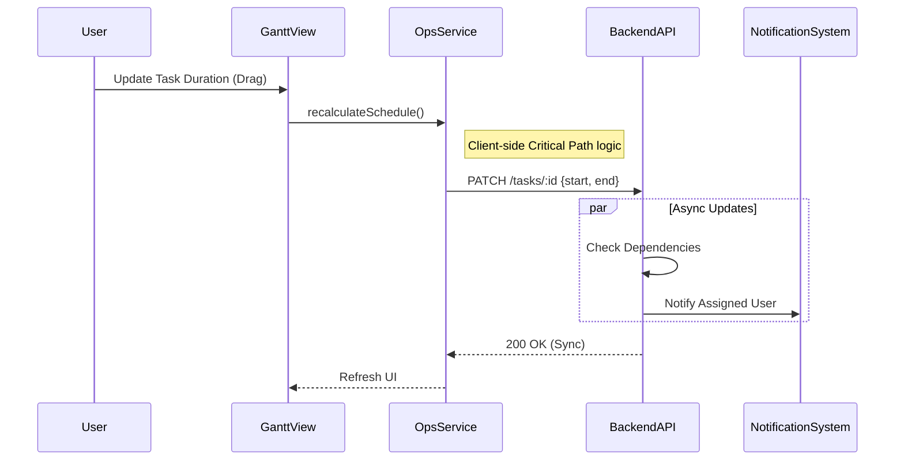

# 🗺️ Mapa Operacional: Neonorte | Nexus Monolith (`/ops`)

> **Versão:** 2.0 (Neonorte | Nexus SQL)
> **Módulo:** Operations (Fábrica de Projetos)
> **Localização:** `frontend/src/modules/ops`

---

## 🏗️ Visão Geral

O Módulo **Operations** é o coração produtivo do sistema. Ele gerencia o ciclo de vida completo da entrega, desde o planejamento estratégico até a execução tática de tarefas e vistorias.

### 🧭 Estrutura de Navegação (`OpsLayout`)

#### 1. Planejamento & Estratégia

| Rota             | Label                | Ícone          | Função Macro                                                  |
| :--------------- | :------------------- | :------------- | :------------------------------------------------------------ |
| `/ops/cockpit`   | **Cockpit Projetos** | 👷 `HardHat`   | Visão **Micro**. Detalhes profundos de um projeto específico. |
| `/ops/strategy`  | **Estratégia**       | 🎯 `Target`    | **Alinhamento**. OKRs e Metas da empresa.                     |
| `/ops/portfolio` | **Portfólio**        | 💼 `Briefcase` | Visão **Macro**. Status executivo de todos os projetos.       |

#### 2. Execução Tática

| Rota           | Label                 | Ícone               | Função Macro                                            |
| :------------- | :-------------------- | :------------------ | :------------------------------------------------------ |
| `/ops/gantt`   | **Cronograma Mestre** | 🗓️ `CalendarRange`  | **Planejamento**. Linha do tempo e dependências.        |
| `/ops/kanban`  | **Kanban**            | 🔄 `Workflow`       | **Execução**. Fluxo de tarefas diárias (To Do -> Done). |
| `/ops/reviews` | **Aprovações**        | ✅ `ClipboardCheck` | **Qualidade**. Aprovações formais e checklists.         |

#### 3. Inteligência

| Rota          | Label                | Ícone              | Função Macro                                    |
| :------------ | :------------------- | :----------------- | :---------------------------------------------- |
| `/ops/map`    | **Mapa Operacional** | 🗺️ `Map`           | **Georreferência**. Usinas e equipes no mapa.   |
| `/ops/issues` | **Gargalos**         | ⚠️ `AlertTriangle` | **Riscos**. Gestão de impedimentos e problemas. |

---

## 🧩 Detalhamento dos Componentes (Views)

### 1. Project Cockpit (`ProjectCockpit.tsx`)

**Localização:** `src/modules/ops/ui/`

- **Padrão UX:** Master-Detail (Lista lateral -> Detalhe Principal).
- **Função:** Central de comando para o Gerente de Projeto.
- **Features:**
  - Lista de Projetos Ativos (Sidebar).
  - Resumo de Progresso e Status.
  - Abas de Tarefas (Checklists rápidas) e Financeiro.

### 2. Project Board (`ProjectBoard.tsx`)

**Localização:** `src/modules/ops/ui/`

- **Padrão UX:** Dashboard / Cards Grid.
- **Função:** Visão Executiva/Diretoria.
- **Features:**
  - Cards visuais com barra de progresso.
  - Indicadores de Risco (Atraso).
  - Agrupamento por Estratégia (Em breve).

### 3. Kanban View (`KanbanView.tsx`)

**Localização:** `src/modules/ops/ui/`

- **Padrão UX:** Quadro Drag-and-Drop.
- **Função:** Chão de fábrica digital. Onde o trabalho acontece.
- **Colunas:**
  1.  `BACKLOG` (A fazer)
  2.  `EM_ANALISE` (Em andamento)
  3.  `ENCAMINHADO` (Validação)
  4.  `BLOQUEADO` (Impedimento)
  5.  `CONCLUIDO` (Finalizado)
- **Integrações:** Modal de Tarefa (`TaskFormModal`).

### 4. Gantt Matrix (`GanttMatrixView.tsx`)

**Localização:** `src/modules/ops/ui/`

- **Padrão UX:** Linha do Tempo Interativa / Cronograma.
- **Função:** Gestão de Prazos, Dependências e Caminho Crítico.
- **Componente Base:** `FrappeGantt.tsx` (Implementação customizada do `frappe-gantt-react`).
- **Features:**
  - **Visual Orgânico:** Estilo colorido e arredondado (Fase 2.0).
  - **Dependências:** Visualização de setas entre tarefas e cálculo automático de datas (FS - Finish to Start).
  - **Interatividade:** Drag-and-drop para mover tarefas, redimensionar duração e popups detalhados.
  - **Edição Integrada:** Clique duplo ou botão de editar abre o `TaskFormModal`.

### 5. Strategy Review (`StrategyReviewView.tsx`)

**Localização:** `src/modules/strategy/ui/` (Importado em Ops)

- **Função:** Acompanhamento de Metas Operacionais.
- **Contexto:** Visão tática da estratégia definida pelos executivos.

### 6. Solar Wizard (`SolarWizardView.tsx`)

**Localização:** `src/modules/commercial/ui/`

- **Nota:** Acessível via rota `/commercial/quotes`, mas referenciado aqui pela relevância na Engenharia de Pré-Venda.
- **Função:** Dimensionamento Técnico.
- **Status:** Migrado para o fluxo Comercial. Veja `SOLAR_VIEW_MAP.md` ou `COMMERCIAL_VIEW_MAP.md`.

---

## 🛠️ Componentes Satélites (`/components`)

Componentes reutilizáveis que dão suporte às views:

- **`TaskFormModal.tsx`**: Formulário unificado para Criar/Editar tarefas.
  - **Abas:** `DETALHES` (Campos padrão) e `BLOQUEIOS` (Gestão de Predecessoras/Dependências).
  - **Uso:** Compartilhado idêntico entre Kanban e Gantt.
- **`InspectionWizard.tsx`**: (Isolado/Mobile) Wizard passo-a-passo para vistorias técnicas offline. Captura GPS e Fotos.
- **`StrategyTree.tsx`**: Visualizador recursivo da árvore estratégica.

---

## 📡 Integração de Dados (`ops.service.ts`)

O módulo utiliza um Service Pattern leve (`OpsService`) para comunicação com o Backend Neonorte | Nexus:

- `getAllProjects()`: Busca lista leve.
- `getProject(id)`: Busca detalhes.
- `addTask()`, `updateTask()`: Transações operacionais.

> **Nota Técnica:** O módulo foi migrado para **TypeScript Estrito** (Strict Mode), garantindo que interfaces como `Project` e `OperationalTask` sejam respeitadas em todo o fluxo.

## 🔄 Fluxo de Dados (Gestão de Tarefa)

