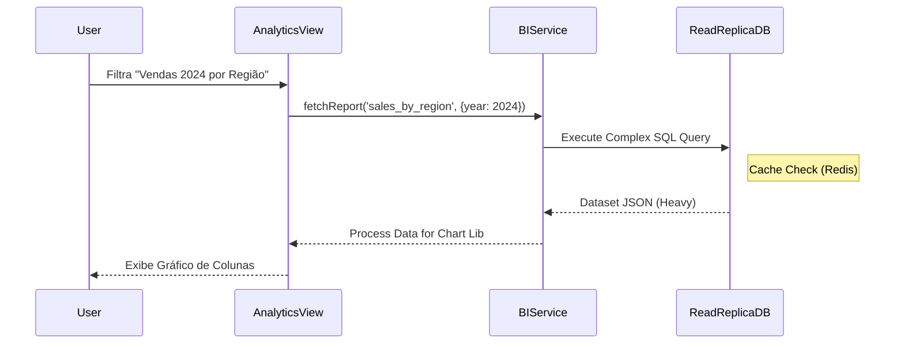

# 🗺️ Mapa BI: Neonorte | Nexus Monolith (`/bi`)

> **Módulo:** Business Intelligence
> **Localização:** `frontend/src/modules/bi`

---

## 🏗️ Visão Geral

O Módulo de **BI** foca na análise de dados históricos e geração de insights para tomada de decisão estratégica. Diferencia-se dos dashboards operacionais por focar em tendências de longo prazo.

### 🧭 Estrutura de Navegação

| Rota  | Label            | Ícone          | Função Macro                                |
| :---- | :--------------- | :------------- | :------------------------------------------ |
| `/bi` | **Inteligência** | 📈 `LineChart` | Relatórios analíticos e data visualization. |

---

## 🧩 Detalhamento dos Componentes (Views)

### 1. Analytics Dashboard (`AnalyticsDashboard.tsx`)

**Localização:** `src/modules/bi/ui/`

- **Função:** Central de Relatórios.
- **Features:**
  - Filtros Avançados (Data, Região, Equipe).
  - Exportação de Dados (CSV/PDF).
  - Gráficos Complexos (Sazonalidade, Conversão).

---

## 📡 Integração de Dados (`bi.service.ts`)

- Consome endpoints de agregação pesada (Data Warehouse pattern ou Queries Otimizadas no Backend).

## 🔄 Fluxo de Dados

