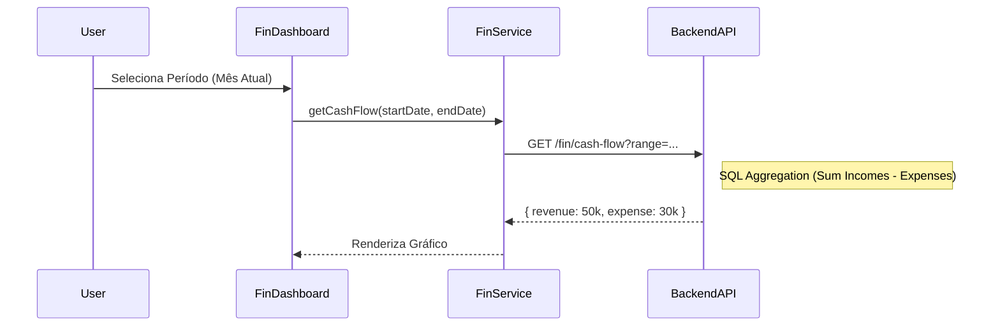

# 🗺️ Mapa Financeiro: Neonorte | Nexus Monolith (`/fin`)

> **Módulo:** Finanças
> **Localização:** `frontend/src/modules/fin`

---

## 🏗️ Visão Geral

O Módulo **Financeiro** gerencia todo o fluxo de caixa, faturamento, contas a pagar/receber e relatórios contábeis do sistema.

### 🧭 Estrutura de Navegação

| Rota   | Label          | Ícone           | Função Macro                                 |
| :----- | :------------- | :-------------- | :------------------------------------------- |
| `/fin` | **Financeiro** | 💰 `DollarSign` | Dashboard financeiro e gestão de transações. |

---

## 🧩 Detalhamento dos Componentes (Views)

### 1. Financial Dashboard (`FinancialDashboard.tsx`)

**Localização:** `src/modules/fin/ui/`

- **Função:** Visão Geral de Saúde Financeira.
- **Features:**
  - Gráficos de Receita x Despesa.
  - Fluxo de Caixa Projetado.
  - Indicadores de Inadimplência.
  - Listagem Rápida de Lançamentos Recentes.

### 2. Invoice List (Planejado)

- **Função:** Gestão de Notas Fiscais e Faturas.
- **Status:** Em desenvolvimento/Migração.

---

## 📡 Integração de Dados (`fin.service.ts`)

- `getMetrics()`: KPIs financeiros.
- `getTransactions()`: Extrato de movimentações.

## 🔄 Fluxo de Dados

