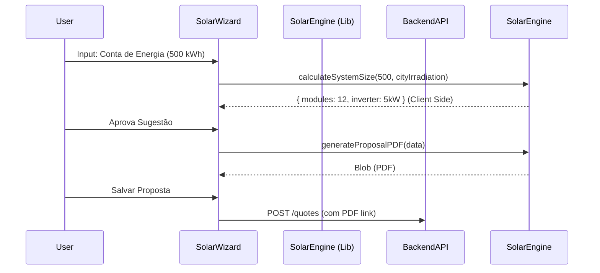

# 🗺️ Mapa Solar: Neonorte | Nexus Monolith (`/commercial/quotes`)

> **Módulo:** Engenharia Solar
> **Localização:** `frontend/src/modules/commercial/ui` (Temporariamente alocado)

---

## 🏗️ Visão Geral

O Módulo **Solar** contém as ferramentas de engenharia especializadas para dimensionamento fotovoltaico. Atualmente, a funcionalidade principal está acessível através do módulo Comercial, dada a forte ligação com a geração de propostas (`Quotes`).

### 🧭 Estrutura de Navegação

| Rota                 | Label             | Ícone     | Função Macro                                     |
| :------------------- | :---------------- | :-------- | :----------------------------------------------- |
| `/commercial/quotes` | **Geração Solar** | ☀️ `Sun`  | Wizard de criação de proposta e dimensionamento. |
| `/solar/library`     | **Catálogo**      | 📚 `Book` | Banco de dados de módulos (Em Breve).            |

---

## 🧩 Detalhamento dos Componentes (Views)

### 1. Solar Wizard View (`SolarWizardView.tsx`)

**Localização:** `src/modules/commercial/ui/SolarWizardView.tsx`

- **Padrão UX:** Stepper (Passo-a-passo).
- **Engine:** `solarEngine.ts` (Core de cálculo).
- **Contexto:** Acessado via Menu "Propostas" no Comercial ou "Solar Wizard" em Operations (Rota unificada).
- **Passos:**
  1.  **Input de Fatura:** Média kWh ou valor monetário.
  2.  **Irradiação:** Seleção de cidade/índice solar.
  3.  **Equipamentos:** Seleção de Kit (Inversor + Módulos).
  4.  **Financeiro:** Configuração de margem, financiamento.
  5.  **Output:** Geração de Proposta (PDF).

### 2. Proposal Preview (`SolarProposal.tsx`)

- **Função:** Visualização interativa da proposta para o cliente final (Web View).

---

## 📡 Integração de Dados

- Tipos compartilhados via Zod com o Backend para validação de Kits e Cálculos.
- Persistência em `Projects` e `Quotes`.

## 🔄 Fluxo de Dados (Dimensionamento)

