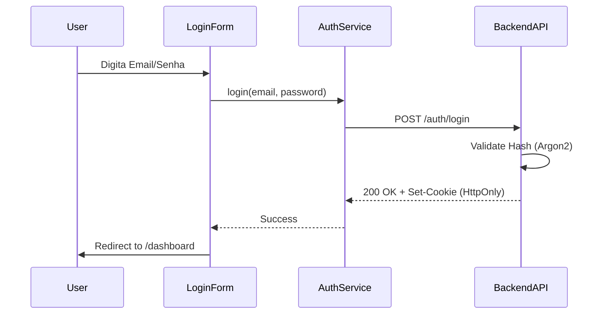

# 🗺️ Mapa IAM: Neonorte | Nexus Monolith (`/iam`)

> **Módulo:** Identity & Access Management
> **Localização:** `frontend/src/modules/iam`

---

## 🏗️ Visão Geral

O Módulo **IAM** gerencia a segurança, autenticação e autorização dos usuários. É a primeira barreira de defesa do sistema.

### 🧭 Estrutura de Navegação

| Rota       | Label      | Ícone       | Função Macro                             |
| :--------- | :--------- | :---------- | :--------------------------------------- |
| `/login`   | **Login**  | 🔒 `Lock`   | Acesso ao sistema.                       |
| `/profile` | **Perfil** | 👤 `User`   | Gestão de dados do usuário logado.       |
| `/admin`   | **Admin**  | 🛡️ `Shield` | (Admin Only) Gestão de usuários e roles. |

---

## 🧩 Detalhamento dos Componentes (Views)

### 1. Login Form (`LoginForm.tsx`)

**Localização:** `src/modules/iam/ui/`

- **Função:** Autenticação de Usuário.
- **Features:**
  - Login via Email/Senha.
  - Recuperação de Senha.
  - Validação Zod cliente-side.

### 2. Registration / User Management (Em Breve)

- **Função:** Cadastro de novos usuários e definição de permissões (RBAC).

---

## 📡 Integração de Dados

- Tokens JWT armazenados em Cookies Seguros (HttpOnly) ou LocalStorage (conforme política).
- Interceptadores HTTP para renovação automática de sessão.

## 🔄 Fluxo de Dados (Login)

