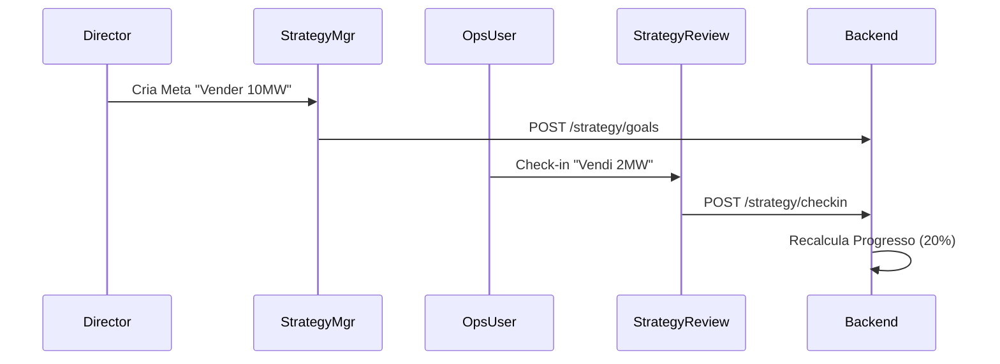

# 🗺️ Mapa Strategy: Neonorte | Nexus Monolith (`/executive/strategy` & `/ops/strategy`)

> **Módulo:** Estratégia Corporativa
> **Localização:** `frontend/src/modules/strategy`

---

## 🏗️ Visão Geral

O Módulo **Strategy** permeia toda a organização, definindo o rumo (VisãoExecutiva) e garantindo a execução (Visão Operacional).

### 🧭 Estrutura de Navegação

| Rota                  | Contexto      | Label            | Ícone       | Função Macro                                       |
| :-------------------- | :------------ | :--------------- | :---------- | :------------------------------------------------- |
| `/executive/strategy` | **Diretoria** | **Estratégia**   | 🎯 `Target` | Definição de Metas Globais e Pilares.              |
| `/ops/strategy`       | **Operação**  | **Hoshin Kanri** | 🎯 `Target` | Visualização Tática e Report de Key Results (KRs). |

---

## 🧩 Detalhamento dos Componentes (Views)

### 1. Strategy Manager View (`StrategyManagerView.tsx`)

**Localização:** `src/modules/strategy/ui/StrategyManagerView.tsx`

- **Função:** Painel Gerencial de OKRs/Hoshin Kanri.
- **Features:**
  - Árvore de Estratégia (`StrategyTree`).
  - CRUD de Pilares, Objetivos e Metas.
  - Definição de Responsáveis.

### 2. Strategy Review View (`StrategyReviewView.tsx`)

**Localização:** `src/modules/strategy/ui/StrategyReviewView.tsx`

- **Função:** Painel de Acompanhamento Tático.
- **Features:**
  - Lista de Metas do Setor/Pessoa.
  - Atualização de Progresso (Check-ins).
  - Comentários e Justificativas de Desvios.

---

## 📡 Integração de Dados (`strategy.service.ts` - Hipotético)

- Sincroniza Metas e seus progressos (`check-ins`).
- Cálculo de % de conclusão sobe da base (KR) para o topo (Objetivo -> Pilar).

## 🔄 Fluxo de Dados

