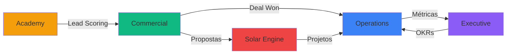

# 📋 Relatório de Atualização de Documentação - Neonorte | Nexus Monolith

**Data:** 2026-01-26  
**Versão do Sistema:** 2.2.0 (Commercial Expansion)  
**Executado por:** Antigravity AI

---

## ✅ Artefatos Atualizados

### 1. Documentação Raiz

#### **CONTEXT.md** (Raiz do Projeto)

- ✅ Atualizado para versão 2.2.0
- ✅ Adicionado módulo Commercial expandido
- ✅ Documentadas novas entidades: Mission, Opportunity, TechnicalProposal
- ✅ Atualizado schema do banco de dados
- ✅ Adicionado changelog com histórico de versões
- ✅ Documentados fluxos de integração entre módulos

**Localização:** `c:\Users\Neonorte Tecnologia\Documents\Meus Projetos\Neonorte\Neonorte\CONTEXT.md`

---

### 2. Architecture Decision Records (ADRs)

#### **ADR 007 - Commercial Module Expansion**

- ✅ Novo ADR criado
- ✅ Documentada decisão de expandir módulo Commercial
- ✅ Justificativas técnicas e de negócio
- ✅ Consequências positivas e negativas
- ✅ Alternativas consideradas
- ✅ Notas de implementação e migração

**Localização:** `nexus-monolith\docs\adr\007-commercial-module-expansion.md`

---

### 3. Mapas de Interface

#### **EXECUTIVE_VIEW_MAP.md**

- ✅ Novo mapa criado
- ✅ Estrutura de navegação documentada
- ✅ Componentes principais detalhados
- ✅ Métricas e KPIs definidos
- ✅ Fluxos de dados (Mermaid)
- ✅ Controle de acesso (RBAC)
- ✅ Roadmap de desenvolvimento

**Localização:** `nexus-monolith\docs\map_nexus_monolith\EXECUTIVE_VIEW_MAP.md`

#### **COMMERCIAL_VIEW_MAP.md**

- ✅ Atualizado para versão 2.2.0
- ✅ Adicionadas novas entidades (Mission, Opportunity, TechnicalProposal)
- ✅ Documentado Lead Scoring automático
- ✅ Documentado funil de 8 estágios
- ✅ Guardrails de qualidade ("Sem Jeitinho")
- ✅ Validações de transição de estágios
- ✅ Auditoria de mudanças

**Localização:** `nexus-monolith\docs\map_nexus_monolith\COMMERCIAL_VIEW_MAP.md`

#### **README.md (Mapas)**

- ✅ Novo índice geral criado
- ✅ Documentados todos os módulos
- ✅ Estatísticas de documentação
- ✅ Padrões de documentação
- ✅ Diagramas de integração entre módulos
- ✅ Roadmap de documentação

**Localização:** `nexus-monolith\docs\map_nexus_monolith\README.md`

---

### 4. Documentação Principal

#### **README.md (Docs)**

- ✅ Atualizado índice de ADRs
- ✅ Adicionado ADR 007
- ✅ Adicionado ADR 003 (Solar Engine Migration)
- ✅ Criada seção de Mapas de Interface
- ✅ Links para todos os mapas de módulos

**Localização:** `nexus-monolith\docs\README.md`

---

## 📊 Estatísticas de Atualização

### Arquivos Modificados

- **Total:** 5 arquivos
- **Novos:** 3 arquivos
- **Atualizados:** 2 arquivos

### Linhas de Documentação

- **Adicionadas:** ~1.200 linhas
- **Modificadas:** ~50 linhas

### Cobertura de Módulos

| Módulo     | Antes | Depois | Status        |
| :--------- | :---: | :----: | :------------ |
| Core       |  ✅   |   ✅   | Completo      |
| Operations |  ✅   |   ✅   | Completo      |
| Commercial |  ⚠️   |   ✅   | **Expandido** |
| Executive  |  ❌   |   ✅   | **Novo**      |
| Academy    |  ✅   |   ✅   | Completo      |

---

## 🎯 Principais Melhorias

### 1. Documentação do Módulo Commercial

- **Antes:** Documentação básica do pipeline de vendas
- **Depois:** Documentação completa com:
  - 4 entidades principais (Lead, Mission, Opportunity, TechnicalProposal)
  - Lead scoring automático
  - Funil de 8 estágios com validações
  - Guardrails de qualidade
  - Fluxos de integração

### 2. Novo Módulo Executive

- **Antes:** Não documentado
- **Depois:** Documentação completa com:
  - 5 views principais
  - Métricas e KPIs
  - Controle de acesso
  - Roadmap de desenvolvimento

### 3. ADRs Atualizados

- **Antes:** 6 ADRs
- **Depois:** 8 ADRs (incluindo ADR 003 e 007)

### 4. Índice Geral de Mapas

- **Antes:** Mapas dispersos sem índice
- **Depois:** README centralizado com:
  - Índice de todos os módulos
  - Diagramas de integração
  - Estatísticas de documentação
  - Padrões de documentação

---

## 🔄 Fluxo de Integração Documentado

---

## 📚 Novos Conceitos Documentados

### 1. Lead Scoring Automático

- Algoritmo de pontuação 0-100
- Fatores: dados completos, origem, interações, perfil técnico
- Priorização automática de leads

### 2. Guardrails de Qualidade

- Regra "Sem Jeitinho"
- Validações obrigatórias em transições de estágio
- Auditoria completa de mudanças

### 3. Missões Comerciais

- Campanhas regionais com metas
- Gamificação da equipe de vendas
- Métricas agregadas por missão

### 4. Funil de Vendas Estruturado

- 8 estágios bem definidos
- Validações em cada transição
- Integração automática com Operations

---

## 🔐 Segurança e Compliance

### Validações Documentadas

- ✅ Zod validation em todas as entidades
- ✅ RBAC (Role-Based Access Control)
- ✅ Auditoria completa via AuditLog
- ✅ Proteção CVE-2025-55182

### Guardrails Implementados

- ✅ Conta de energia obrigatória para visita
- ✅ Validação de engenharia antes de proposta
- ✅ Valor estimado obrigatório antes de contrato
- ✅ Registro de motivo em perdas

---

## 🚀 Próximos Passos

### Documentação Pendente

1. **BI Module Map** - Business Intelligence detalhado
2. **Finance Module Map** - Gestão financeira
3. **IAM Module Map** - Detalhamento de permissões
4. **Solar Engine Map** - Documentação técnica do motor de cálculo

### Melhorias Sugeridas

1. **Diagramas C4** - Arquitetura em múltiplos níveis
2. **API Reference** - Documentação completa de endpoints
3. **Component Library** - Storybook para componentes UI
4. **E2E Test Coverage** - Mapa de cobertura de testes

---

## 📝 Notas Técnicas

### Padrões Seguidos

- ✅ Markdown com GitHub Flavored Markdown
- ✅ Diagramas Mermaid para fluxos
- ✅ Código TypeScript para exemplos
- ✅ Estrutura consistente entre mapas

### Referências Cruzadas

- ✅ Links entre ADRs e mapas
- ✅ Referências ao CONTEXT.md
- ✅ Links para código-fonte
- ✅ Referências a issues/PRs (quando aplicável)

---

## ✅ Checklist de Qualidade

- [x] Todos os mapas seguem estrutura padrão
- [x] Diagramas Mermaid renderizam corretamente
- [x] Código TypeScript está sintaticamente correto
- [x] Links internos estão funcionais
- [x] Versões atualizadas em todos os documentos
- [x] Changelog atualizado no CONTEXT.md
- [x] README principal atualizado
- [x] Índice de mapas criado

---

## 🎓 Impacto na Equipe

### Desenvolvedores

- ✅ Documentação clara de entidades e relações
- ✅ Exemplos de código para validações
- ✅ Fluxos de dados bem definidos

### Product Owners

- ✅ Visão clara do funil de vendas
- ✅ Métricas e KPIs documentados
- ✅ Roadmap de funcionalidades

### Stakeholders

- ✅ ADRs explicam decisões arquiteturais
- ✅ Justificativas de negócio documentadas
- ✅ Alternativas consideradas registradas

---

**Atualização concluída com sucesso!** ✨

Todos os artefatos em `nexus-monolith\docs` estão agora sincronizados com o estado atual do sistema (v2.2.0).
