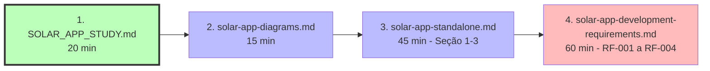
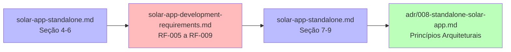

# 📦 Pacote de Documentação para Desenvolvedor Externo

## Solar Dimension App - Standalone Development Package

> **Objetivo:** Este documento lista TODOS os artefatos necessários para que um desenvolvedor **sem conhecimento do Neonorte | Nexus** possa criar a aplicação standalone de dimensionamento fotovoltaico.

---

## 📋 Checklist de Documentos

### ✅ Documentos Essenciais (Leitura Obrigatória)

#### 1. **Visão Geral e Contexto**

- [ ] `SOLAR_APP_STUDY.md` - **COMECE AQUI**
  - Sumário executivo do projeto
  - Objetivos e motivação
  - Visão geral da arquitetura
  - Roadmap de 9 semanas
  - **Tempo de leitura:** 20 minutos

#### 2. **Arquitetura Técnica**

- [ ] `architecture/solar-app-standalone.md` - **ARQUITETURA DETALHADA**
  - Diagramas C4 Model (Contexto, Containers, Componentes)
  - Arquitetura Hexagonal (Ports & Adapters)
  - Fluxos de dados (sequência de criação de proposta)
  - Modelo de dados (Schema Prisma completo)
  - Schemas Zod (contratos de API)
  - Estratégias de deployment
  - **Tempo de leitura:** 45 minutos

#### 3. **Requisitos Funcionais e Não-Funcionais**

- [ ] `guides/solar-app-development-requirements.md` - **ESPECIFICAÇÃO COMPLETA**
  - 9 Requisitos Funcionais (RF-001 a RF-009)
  - 18 Requisitos Não-Funcionais (RNF-001 a RNF-018)
  - Critérios de aceitação
  - Fórmulas de cálculo (dimensionamento, payback, TIR, VPL)
  - Checklist de qualidade
  - **Tempo de leitura:** 60 minutos

#### 4. **Diagramas Visuais**

- [ ] `architecture/solar-app-diagrams.md` - **REFERÊNCIA VISUAL**
  - Evolução da arquitetura
  - Fluxos de integração
  - Roadmap visual (Gantt)
  - Modelo de dados (ER Diagram)
  - **Tempo de leitura:** 15 minutos

---

### 📚 Documentos de Referência (Consulta Conforme Necessário)

#### 5. **Decisão Arquitetural**

- [ ] `adr/008-standalone-solar-app.md` - **ADR FORMAL**
  - Contexto da decisão
  - Princípios arquiteturais
  - Consequências (positivas e negativas)
  - Conformidade
  - **Quando ler:** Se precisar entender "por quê" de decisões arquiteturais

#### 6. **Guia de Integração (Futuro)**

- [ ] `guides/solar-app-integration-guide.md` - **INTEGRAÇÃO COM NEXUS**
  - Implementações práticas (Microserviço, Biblioteca, Módulo Embarcado)
  - Scripts de migração
  - Testes de integração
  - **Quando ler:** Apenas na Fase 4 (Integração com Neonorte | Nexus)
  - ⚠️ **NÃO é necessário para desenvolvimento standalone inicial**

---

## 🎯 Ordem de Leitura Recomendada

### Dia 1: Compreensão do Projeto (2-3 horas)



**Objetivo:** Entender WHAT (o que construir) e WHY (por quê)

---

### Dia 2-3: Arquitetura e Design (4-6 horas)



**Objetivo:** Entender HOW (como construir) e ARCHITECTURE (estrutura)

---

### Dia 4+: Desenvolvimento Iterativo

**Consultar conforme necessário:**

- `solar-app-development-requirements.md` → Critérios de aceitação
- `solar-app-standalone.md` → Schema Prisma, Schemas Zod
- `solar-app-diagrams.md` → Fluxos de dados

---

## 📁 Estrutura do Pacote de Entrega

### Opção A: Documentos Standalone (Recomendado)

Criar uma pasta separada com APENAS os documentos necessários:

```
solar-app-docs/
├── README.md                          # Este arquivo (índice)
├── 01-OVERVIEW.md                     # SOLAR_APP_STUDY.md
├── 02-ARCHITECTURE.md                 # solar-app-standalone.md
├── 03-REQUIREMENTS.md                 # solar-app-development-requirements.md
├── 04-DIAGRAMS.md                     # solar-app-diagrams.md
├── 05-ADR.md                          # adr/008-standalone-solar-app.md
└── assets/
    ├── architecture-diagram.png       # Exportar diagramas Mermaid
    ├── data-model.png
    └── roadmap.png
```

**Vantagens:**

- ✅ Desenvolvedor não precisa navegar no repositório Neonorte | Nexus
- ✅ Foco apenas no Solar App
- ✅ Pode ser enviado por email/Slack

---

### Opção B: Link para Repositório (Alternativa)

Se o desenvolvedor tiver acesso ao repositório Neonorte | Nexus:

```
nexus-monolith/docs/
├── SOLAR_APP_STUDY.md                 ← COMECE AQUI
├── architecture/
│   ├── solar-app-standalone.md        ← ARQUITETURA
│   └── solar-app-diagrams.md          ← DIAGRAMAS
├── guides/
│   └── solar-app-development-requirements.md  ← REQUISITOS
└── adr/
    └── 008-standalone-solar-app.md    ← ADR (opcional)
```

**Vantagens:**

- ✅ Sempre atualizado
- ✅ Pode fazer pull requests

**Desvantagens:**

- ❌ Pode se perder na documentação do Neonorte | Nexus
- ❌ Precisa de acesso ao repositório

---

## 🚀 Guia Rápido de Início (Quick Start)

### Para o Desenvolvedor Externo

**Passo 1: Leia o Resumo Executivo (20 min)**

```bash
# Abra este arquivo primeiro
SOLAR_APP_STUDY.md
```

**Passo 2: Visualize a Arquitetura (15 min)**

```bash
# Veja os diagramas
solar-app-diagrams.md
```

**Passo 3: Entenda os Requisitos (60 min)**

```bash
# Leia RF-001 a RF-004 (críticos)
solar-app-development-requirements.md
```

**Passo 4: Setup do Projeto (30 min)**

```bash
# Crie a estrutura de pastas
mkdir solar-dimension-app
cd solar-dimension-app

# Inicialize monorepo (Turborepo ou Nx)
npx create-turbo@latest

# Estrutura proposta:
# packages/
#   ├── core/       # Lógica de negócio pura
#   ├── api/        # Backend REST
#   ├── web/        # Frontend React
#   └── shared/     # Utilitários
```

**Passo 5: Implemente o Core (Fase 1 - 2 semanas)**

```bash
# Comece pelo SolarCalculator
packages/core/src/domain/SolarCalculator.ts

# Siga a arquitetura hexagonal:
# 1. Domain (lógica pura)
# 2. Ports (interfaces)
# 3. Adapters (implementações)
```

---

## 📊 Matriz de Dependências

| Documento                             | Depende de              | Necessário para     |
| ------------------------------------- | ----------------------- | ------------------- |
| SOLAR_APP_STUDY.md                    | Nenhum                  | Todos               |
| solar-app-diagrams.md                 | SOLAR_APP_STUDY.md      | Visualização        |
| solar-app-standalone.md               | SOLAR_APP_STUDY.md      | Implementação       |
| solar-app-development-requirements.md | solar-app-standalone.md | Desenvolvimento     |
| 008-standalone-solar-app.md           | Nenhum                  | Contexto (opcional) |
| solar-app-integration-guide.md        | Todos acima             | Fase 4 (futuro)     |

---

## 🎓 Conhecimentos Prévios Necessários

### Obrigatórios

- ✅ TypeScript (intermediário)
- ✅ Node.js + Express/Fastify
- ✅ React (hooks, context)
- ✅ Prisma ORM
- ✅ Zod (validação)
- ✅ Git + GitHub

### Desejáveis

- 🔵 Arquitetura Hexagonal (será aprendido)
- 🔵 Event-Driven Architecture (Fase 4)
- 🔵 Docker + Kubernetes (Fase 5)
- 🔵 Testes (Vitest, Supertest, Playwright)

### NÃO Necessários

- ❌ Conhecimento do Neonorte | Nexus Monolith
- ❌ Conhecimento de energia solar (fórmulas estão documentadas)
- ❌ Experiência com multi-tenancy (será implementado gradualmente)

---

## 🔍 Perguntas Frequentes (FAQ)

### Q1: Preciso entender o Neonorte | Nexus Monolith?

**R:** NÃO. A aplicação é **standalone**. A integração com Neonorte | Nexus é **opcional** e ocorre apenas na Fase 4.

### Q2: Onde estão as fórmulas de cálculo?

**R:** `solar-app-development-requirements.md` → Seção RF-001 (Cálculo de Potência) e RF-003 (Análise Financeira).

### Q3: Como sei se estou seguindo a arquitetura correta?

**R:** Verifique se:

- ✅ Core domain não importa bibliotecas externas (exceto Zod)
- ✅ Lógica de negócio está em `packages/core/domain/`
- ✅ Adaptadores estão em `packages/api/adapters/`
- ✅ Testes cobrem >= 80% do core

### Q4: Posso usar outra stack (Python, Go, etc)?

**R:** Tecnicamente SIM, mas:

- ❌ Perde compatibilidade com Neonorte | Nexus (TypeScript)
- ❌ Perde reutilização de schemas Zod
- ❌ Dificulta integração futura
- ✅ **Recomendação:** Mantenha TypeScript

### Q5: Quando devo ler o guia de integração?

**R:** Apenas na **Fase 4** (semana 8). Foque no standalone primeiro.

---

## 📦 Checklist de Entrega para o Desenvolvedor

### Antes de Começar

- [ ] Recebeu todos os 4 documentos essenciais
- [ ] Leu `SOLAR_APP_STUDY.md` (overview)
- [ ] Visualizou `solar-app-diagrams.md`
- [ ] Entendeu a arquitetura hexagonal
- [ ] Configurou ambiente de desenvolvimento (Node.js, TypeScript, Prisma)

### Durante o Desenvolvimento

- [ ] Consulta `solar-app-development-requirements.md` para critérios de aceitação
- [ ] Consulta `solar-app-standalone.md` para schemas Prisma e Zod
- [ ] Segue roadmap de 5 fases
- [ ] Mantém cobertura de testes >= 80% (core)

### Ao Finalizar Cada Fase

- [ ] Todos os requisitos da fase foram implementados
- [ ] Testes passando (unitários + integração)
- [ ] Documentação atualizada (README, API Reference)
- [ ] Code review realizado

---

## 🎯 Critérios de Sucesso

O desenvolvedor terá sucesso se:

1. **Compreensão (Dia 1-3):**
   - ✅ Entende o que é a aplicação
   - ✅ Entende a arquitetura hexagonal
   - ✅ Sabe onde encontrar cada informação

2. **Implementação (Semana 1-9):**
   - ✅ Core domain implementado (Fase 1)
   - ✅ API REST funcional (Fase 2)
   - ✅ Frontend completo (Fase 3)
   - ✅ Testes >= 80% cobertura

3. **Qualidade (Contínuo):**
   - ✅ Código segue princípios SOLID
   - ✅ Validação Zod em todas as entradas
   - ✅ Performance dentro dos alvos (< 500ms cálculo)
   - ✅ Documentação atualizada

---

## 📞 Suporte

### Dúvidas Arquiteturais

- Consultar: `adr/008-standalone-solar-app.md`
- Consultar: `architecture/solar-app-standalone.md`

### Dúvidas de Requisitos

- Consultar: `guides/solar-app-development-requirements.md`
- Procurar por: RF-XXX ou RNF-XXX

### Dúvidas de Implementação

- Consultar: Schemas Zod em `solar-app-standalone.md`
- Consultar: Fluxos de dados em `solar-app-diagrams.md`

### Bloqueios

- Revisar: Checklist de qualidade enterprise
- Revisar: Critérios de aceitação do requisito

---

## 🏆 Resumo: Documentos Mínimos para Começar

### 🟢 Essenciais (Não pode começar sem)

1. **`SOLAR_APP_STUDY.md`** - Overview completo
2. **`architecture/solar-app-standalone.md`** - Arquitetura técnica
3. **`guides/solar-app-development-requirements.md`** - Requisitos detalhados
4. **`architecture/solar-app-diagrams.md`** - Diagramas visuais

**Total:** 4 documentos | **Tempo de leitura:** ~2-3 horas

---

### 🟡 Recomendados (Contexto adicional)

5. **`adr/008-standalone-solar-app.md`** - Decisão arquitetural

**Total:** +1 documento | **Tempo de leitura:** +30 minutos

---

### 🔴 Futuros (Apenas Fase 4)

6. **`guides/solar-app-integration-guide.md`** - Integração com Neonorte | Nexus

**Total:** +1 documento | **Tempo de leitura:** +45 minutos (semana 8)

---

## 📋 Template de Email para Envio

```
Assunto: [Solar App] Documentação Técnica - Desenvolvimento Standalone

Olá [Nome do Desenvolvedor],

Segue a documentação completa para desenvolvimento da aplicação standalone
de dimensionamento fotovoltaico.

📦 DOCUMENTOS ESSENCIAIS (leia nesta ordem):

1. SOLAR_APP_STUDY.md (20 min)
   → Overview do projeto, objetivos, roadmap

2. solar-app-diagrams.md (15 min)
   → Diagramas visuais da arquitetura

3. solar-app-standalone.md (45 min)
   → Arquitetura técnica detalhada, schemas, fluxos

4. solar-app-development-requirements.md (60 min)
   → Requisitos funcionais e não-funcionais completos

📚 DOCUMENTOS DE REFERÊNCIA (consulta):

5. adr/008-standalone-solar-app.md (opcional)
   → Decisão arquitetural formal

⏰ TEMPO TOTAL DE LEITURA: ~2-3 horas

🎯 PRÓXIMOS PASSOS:
1. Leia os documentos na ordem acima
2. Configure ambiente de desenvolvimento (Node.js, TypeScript, Prisma)
3. Crie estrutura de monorepo (Turborepo/Nx)
4. Inicie Fase 1: Core Domain (2 semanas)

📞 DÚVIDAS:
- Arquitetura: consulte solar-app-standalone.md
- Requisitos: consulte solar-app-development-requirements.md
- Bloqueios: entre em contato

Bom desenvolvimento! 🚀

---
[Seu Nome]
[Arquiteto de Software]
```

---

**Versão:** 1.0.0  
**Data:** 2026-01-26  
**Autor:** Antigravity (Principal Software Architect)
