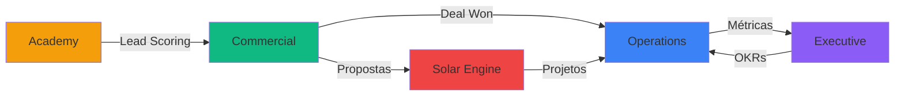
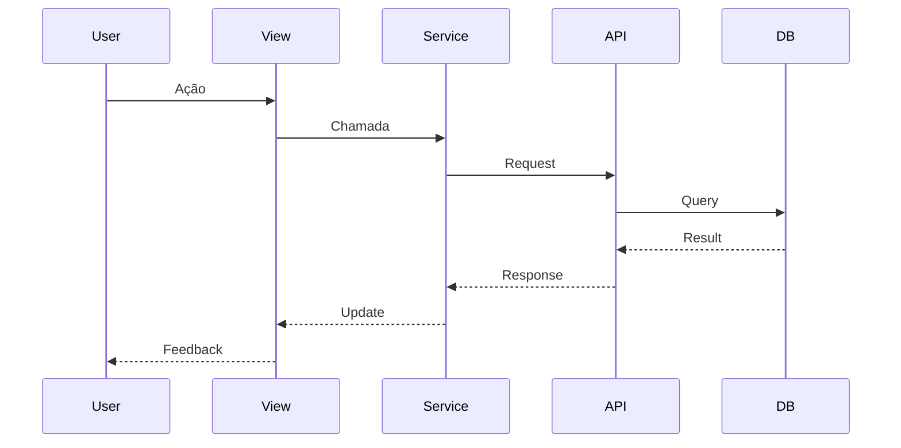

# 🗺️ Índice de Mapas de Interface - Neonorte | Nexus Monolith

> **Versão:** 3.0.0  
> **Última Atualização:** 2026-03-09

---

## 📋 Visão Geral

Este diretório contém a documentação detalhada de todos os módulos e views do sistema Neonorte | Nexus Monolith. Cada mapa descreve a estrutura de navegação, componentes, fluxos de dados e integrações de um módulo específico.

---

## 🧩 Módulos Principais

### 1. [Core Views](./CORE_VIEW_MAP.md)

**Status:** ✅ Operacional  
**Descrição:** Componentes compartilhados, infraestrutura e funcionalidades transversais.

**Principais Componentes:**

- Layout base do sistema
- Componentes UI reutilizáveis
- Serviços compartilhados
- Utilitários e helpers

---

### 2. [Operations (Ops)](./OPS_VIEW_MAP.md)

**Status:** ✅ Operacional  
**Descrição:** Gestão completa do ciclo de vida de projetos, desde planejamento estratégico até execução tática.

**Principais Views:**

- **Project Cockpit:** Visão micro de projetos
- **Kanban Board:** Execução diária de tarefas
- **Gantt Matrix:** Cronograma mestre com dependências
- **Strategy Review:** Alinhamento com OKRs

**Rotas:**

- `/ops/cockpit` - Cockpit de Projetos
- `/ops/kanban` - Kanban de Tarefas
- `/ops/gantt` - Cronograma Mestre
- `/ops/strategy` - Estratégia
- `/ops/portfolio` - Portfólio de Projetos

---

### 3. [Commercial](./COMMERCIAL_VIEW_MAP.md)

**Status:** ✅ Operacional (Expandido em v2.2)  
**Descrição:** Sistema completo de CRM com gestão de leads, oportunidades, missões comerciais e propostas técnicas.

**Principais Views:**

- **Commercial Pipeline:** Kanban de vendas
- **Commercial Performance:** Metas e painel de vendas
- **Solar Wizard:** Geração de propostas fotovoltaicas
- **Leads Pipeline:** Triagem e qualificação

**Rotas:**

- `/commercial/crm` - Pipeline de Vendas
- `/commercial/leads` - Gestão de Leads
- `/commercial/performance` - Performance Comercial
- `/commercial/quotes` - Solar Wizard

**Novidades v2.2:**

- ✨ Missões comerciais com gamificação
- ✨ Lead scoring automático
- ✨ Funil de 8 estágios com validações
- ✨ Propostas técnicas validadas por engenharia
- ✨ Guardrail "Sem Jeitinho"

---

### 4. [Executive](./EXECUTIVE_VIEW_MAP.md)

**Status:** ✅ Operacional  
**Descrição:** Painel de comando estratégico com visões consolidadas e de alto nível para tomada de decisão executiva.

**Principais Views:**

- **ApprovalCenterView:** Visão institucional para aprovações e SLA
- **Strategy Manager:** Gestão de OKRs e pilares estratégicos
- **Portfolio View:** Visão executiva de projetos
- **Financial Dashboard:** Curva S e Burn-rate

**Rotas:**

- `/executive/dashboard` - Dashboard Executivo
- `/executive/strategy` - Estratégia
- `/executive/portfolio` - Portfólio
- `/executive/bi` - Business Intelligence

---

### 5. Extranet (B2B/B2P)

**Status:** ✅ Operacional (Fase 2)  
**Descrição:** Portais Self-Service isolados para Clientes (B2B) e Fornecedores (B2P).

**Principais Views:**

- **Client Portal:** Dashboard de avanço de obra (Curva S, Budget), role `B2B_CLIENT`
- **Vendor Terminal:** Submissão de RDOs e acompanhamento de tasks, role `B2P_VENDOR`, Mobile-First

**Rotas:**

- `/extranet/client/dashboard` - Portal do Cliente
- `/extranet/vendor/tasks` - Terminal do Empreiteiro

---

### 6. Admin / Tenant Settings

**Status:** ✅ Operacional (Fase 3)  
**Descrição:** Configurações Enterprise por Tenant (SSO, API Quotas).

**Rotas:**

- `/admin/tenant` - SSO Configuration + API Usage Metrics

---

### 7. Academy

**Status:** 📋 Planejado (TRL 1)  
**Descrição:** Plataforma de treinamento e capacitação interna. Placeholder ativo.

---

## 📂 Mapas Especializados

### Analytics & Finance

- [BI Module](./analytics_finance/BI_MODULE_MAP.md) - Business Intelligence
- [Finance Module](./analytics_finance/FINANCE_MODULE_MAP.md) - Gestão Financeira

### Engineering

- [Solar Engine](./engineering/SOLAR_ENGINE_MAP.md) - Motor de cálculo fotovoltaico

### Security

- [IAM Module](./security/IAM_MODULE_MAP.md) - Identity & Access Management

### Strategy

- [Strategy Module](./strategy/STRATEGY_MODULE_MAP.md) - Gestão estratégica e OKRs

---

## 🔄 Fluxo de Dados Entre Módulos

### Integrações Principais

1. **Commercial → Operations**
   - Evento: `opportunity.closed_won`
   - Ação: Criação automática de projeto

2. **Academy → Commercial**
   - Evento: `course.completed`
   - Ação: Atualização de `academyScore` em Lead

3. **Solar → Operations**
   - Evento: `proposal.approved`
   - Ação: Criação de projeto tipo SOLAR

4. **Operations → Executive**
   - Agregação contínua de métricas
   - Atualização de progresso de OKRs

---

## 📊 Estatísticas de Documentação

| Módulo | Views | Rotas | Status |
| :--- | ---: | ---: | :--- |
| Core | 5 | 3 | ✅ Operacional |
| Operations | 6 | 7 | ✅ Operacional |
| Commercial | 4 | 4 | ✅ Operacional |
| Executive | 4 | 4 | ✅ Operacional |
| Extranet B2B/B2P | 2 | 2 | ✅ Operacional |
| Admin | 1 | 1 | ✅ Operacional |
| Academy | 0 | 0 | 📋 Planejado |
| **Total** | **22** | **21** | |

---

## 🎯 Padrões de Documentação

Cada mapa de interface deve conter:

### Estrutura Obrigatória

1. **Visão Geral**
   - Descrição do módulo
   - Objetivos principais
   - Status atual

2. **Estrutura de Navegação**
   - Tabela de rotas
   - Labels e ícones
   - Função macro de cada view

3. **Detalhamento de Componentes**
   - Localização no código
   - Função e features
   - Padrão UX utilizado

4. **Integração de Dados**
   - Services utilizados
   - Endpoints da API
   - Fluxos de dados (Mermaid)

5. **Componentes Satélites**
   - Componentes reutilizáveis
   - Helpers e utilitários

### Diagramas Mermaid

Todos os mapas devem incluir pelo menos um diagrama de sequência ilustrando o fluxo de dados principal.

**Exemplo:**

---

## 🔗 Referências Cruzadas

### ADRs Relacionados

- [ADR 001 - Monólito Modular](../adr/001-modular-monolith.md)
- [ADR 004 - Event-Driven Architecture](../adr/004-event-driven-architecture.md)
- [ADR 007 - Commercial Module Expansion](../adr/007-commercial-module-expansion.md)

### Documentação Técnica

- [CONTEXT.md - Schema de Dados](../../CONTEXT.md)
- [Glossário de Domínio](../glossary.md)
- [Guia de Desenvolvimento](../guides/create-module.md)

---

## 📝 Como Contribuir

### Criando um Novo Mapa

1. **Copie o template:** Use `CORE_VIEW_MAP.md` como base
2. **Preencha todas as seções:** Não deixe seções vazias
3. **Adicione diagramas:** Pelo menos um diagrama de sequência
4. **Atualize este índice:** Adicione referência ao novo mapa
5. **Revise:** Peça revisão de outro desenvolvedor

### Atualizando um Mapa Existente

1. **Identifique mudanças:** O que mudou no código?
2. **Atualize seções relevantes:** Não reescreva tudo
3. **Mantenha consistência:** Siga o padrão existente
4. **Atualize data:** Modifique o cabeçalho com data atual

---

## 🚀 Roadmap de Documentação

### Q1 2026

- ✅ Core Views Map
- ✅ Operations Map
- ✅ Commercial Map (expandido)
- ✅ Executive Map
- 🚧 Academy Map (em andamento)

### Q2 2026

- 📋 BI Module Map
- 📋 Finance Module Map
- 📋 IAM Module Map (detalhado)
- 📋 Solar Engine Map (técnico)

### Q3 2026

- 📋 API Reference completa
- 📋 Component Library Storybook
- 📋 E2E Test Coverage Map

---

**Mantido por:** Equipe de Arquitetura Neonorte | Nexus  
**Contato:** [Criar issue no repositório]
