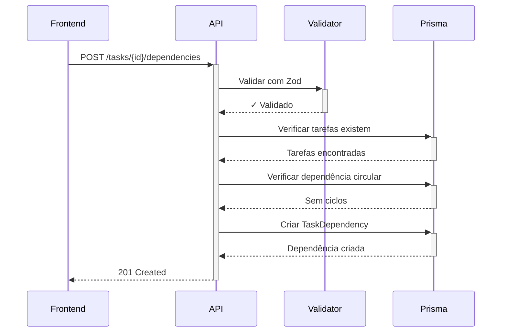

# 📜 TEMPLATE 05: O ESCRIBA (Documentação - Neonorte | Nexus Monolith)

> **💡 PARA QUE SERVE?**
>
> **O Cenário:** O código está pronto, mas ninguém sabe como usar. Ou você precisa explicar uma arquitetura complexa para outro dev (ou para você mesmo no futuro).
>
> **A Ajuda da IA:** A IA é ótima em resumir. Use isso para gerar Readmes, Docs de API, ADRs (Architecture Decision Records) ou diagramas.
>
> **Onde usar:** Atualização de INTERFACE_MAP.md, criação de Walkthroughs, documentação de Endpoints customizados, ADRs.

---

## ✂️ COPIE ISSO AQUI:

````xml
<mission>
  Gerar documentação técnica para: "{{NOME_DO_MODULO_OU_FEATURE}}".

  Público Alvo:
  {{ESCOLHA_UM}}
  - [ ] Desenvolvedores novos (onboarding)
  - [ ] Equipe de QA (como testar)
  - [ ] Gerente de projeto (visão geral)
  - [ ] Usuário final (manual de uso)
  - [ ] Eu mesmo no futuro (entender decisões)
</mission>

<source_material>
  <!-- LEIA O CÓDIGO PARA ENTENDER O QUE DOCUMENTAR -->
  <file path="{{CAMINHO_ABSOLUTO_ARQUIVO_PRINCIPAL}}" />
  <file path="{{CAMINHO_ABSOLUTO_ARQUIVO_DE_TIPOS}}" />
  <file path="{{CAMINHO_ABSOLUTO_SCHEMA_BD}}" />

  <!-- Contexto arquitetural -->
  <file path="c:/Users/Neonorte Tecnologia/Documents/Meus Projetos/Neonorte/Neonorte/CONTEXT.md" />
  <file path="c:/Users/Neonorte Tecnologia/Documents/Meus Projetos/Neonorte/Neonorte/nexus-monolith/backend/prisma/schema.prisma" />
</source_material>

<documentation_type>
  {{ESCOLHA_UM}}

  - [ ] **README.md** - Visão geral do módulo/feature
  - [ ] **API_REFERENCE.md** - Documentação de endpoints customizados
  - [ ] **WALKTHROUGH.md** - Tutorial passo-a-passo
  - [ ] **ADR (Architecture Decision Record)** - Decisão arquitetural
  - [ ] **USER_MANUAL.md** - Manual para usuário final
  - [ ] **TROUBLESHOOTING.md** - Guia de resolução de problemas
</documentation_type>

<output_requirements>
  Formato: Markdown (.md).
  Local: `nexus-monolith/docs/{{nome_do_arquivo}}.md`

  <sections_required>
    <!-- ADAPTE CONFORME O TIPO DE DOC -->

    **Para README/WALKTHROUGH:**
    - [ ] **Visão Geral:** O que é e para que serve.
    - [ ] **Arquitetura:** Diagrama Mermaid mostrando componentes.
    - [ ] **Como Usar:** Exemplo de código ou fluxo de uso.
    - [ ] **Estrutura de Dados:** Tabela explicando os campos principais.
    - [ ] **Comandos Úteis:** Scripts npm, migrações, etc.

    **Para API_REFERENCE:**
    - [ ] **Endpoints:** Lista de rotas com método HTTP.
    - [ ] **Request Schema:** Zod schema ou exemplo JSON.
    - [ ] **Response Schema:** Estrutura de retorno.
    - [ ] **Códigos de Erro:** HTTP status e mensagens.
    - [ ] **Exemplo cURL:** Requisição de exemplo.

    **Para ADR:**
    - [ ] **Contexto:** Por que essa decisão foi necessária?
    - [ ] **Decisão:** O que foi decidido?
    - [ ] **Alternativas Consideradas:** Outras opções avaliadas.
    - [ ] **Consequências:** Impactos (positivos e negativos).
    - [ ] **Status:** Aceita, Rejeitada, Superseded.
  </sections_required>

  <tone>
    Claro, Conciso e Profissional.
    Use emojis com moderação para facilitar a leitura visual.

    Evite:
    - Jargão desnecessário
    - Explicações óbvias ("Este arquivo contém código...")
    - Informações desatualizadas (sempre referencie o código atual)
  </tone>
</output_requirements>

<special_instructions>
  <!-- ESPECÍFICO DO NEXUS -->

  - **Diagramas Mermaid:** Use para fluxos complexos (ex: Migration strategy, Frontend-Backend data flow).
  - **Tabelas:** Para listar modelos do BD, endpoints, ou configurações.
  - **Code Blocks:** Sempre especifique a linguagem (```typescript, ```javascript, ```bash).
  - **Links Internos:** Referencie outros docs quando relevante (ex: "Ver CONTEXT.md para arquitetura geral").
  - **Screenshots:** Se houver UI, solicite screenshots (mas documente textualmente também).
</special_instructions>
````

---

## 📚 EXEMPLOS DE DOCUMENTAÇÃO NEXUS

### Exemplo 1: API Reference (Endpoint Customizado)

````markdown
# API Reference: Task Dependencies

## Overview

Endpoints customizados para gerenciar dependências entre tarefas operacionais (Finish-to-Start, Start-to-Start).

**Base URL:** `http://localhost:3000/api`

---

## Endpoints

### 1. Criar Dependência

**POST** `/tasks/:taskId/dependencies`

Cria uma dependência entre duas tarefas.

**Headers:**

```http
Authorization: Bearer {token}
Content-Type: application/json
```

**Path Parameters:**
| Parâmetro | Tipo | Descrição |
|-----------|--------|--------------------------|
| `taskId` | string | ID da tarefa sucessora |

**Request Body:**

```json
{
  "predecessorId": "clx123abc",
  "type": "FINISH_TO_START"
}
```

**Zod Schema:**

```typescript
const createDependencySchema = z.object({
  predecessorId: z.string().cuid(),
  type: z.enum(["FINISH_TO_START", "START_TO_START"]),
});
```

**Response (201 Created):**

```json
{
  "id": "clx456def",
  "predecessorId": "clx123abc",
  "successorId": "clx789ghi",
  "type": "FINISH_TO_START"
}
```

**Error Responses:**

| Status | Descrição                                |
| ------ | ---------------------------------------- |
| 400    | Validação falhou ou dependência circular |
| 404    | Tarefa predecessor/sucessor não existe   |
| 500    | Erro interno do servidor                 |

**Exemplo cURL:**

```bash
curl -X POST http://localhost:3000/api/tasks/clx789ghi/dependencies \
  -H "Content-Type: application/json" \
  -d '{"predecessorId": "clx123abc", "type": "FINISH_TO_START"}'
```

---

### 2. Listar Dependências

**GET** `/tasks/:taskId/dependencies`

Retorna todas as dependências de uma tarefa (predecessores e sucessores).

**Response (200 OK):**

```json
{
  "predecessors": [
    {
      "id": "clx456def",
      "task": {
        "id": "clx123abc",
        "title": "Setup Database",
        "status": "COMPLETED"
      }
    }
  ],
  "successors": [
    {
      "id": "clx789hij",
      "task": {
        "id": "clx321cba",
        "title": "Deploy Frontend",
        "status": "BACKLOG"
      }
    }
  ]
}
```

---

## Diagrama de Fluxo



---

## Restrições de Negócio

1. **Dependências Circulares:** Sistema previne A→B→A automaticamente.
2. **Duplicatas:** Não é possível criar a mesma dependência duas vezes (unique constraint).
3. **Tarefas do Mesmo Projeto:** Dependências só são permitidas entre tarefas do mesmo projeto.

---

## Código Fonte

- **Controller:** `backend/src/controllers/TaskDependencyController.js`
- **Validator:** `backend/src/validators/taskDependency.js`
- **Schema Prisma:** `backend/prisma/schema.prisma` (modelo `TaskDependency`)
````

---

### Exemplo 2: ADR (Architecture Decision Record)

````markdown
# ADR 001: Universal CRUD Controller Pattern

**Status:** ✅ Aceita  
**Data:** 2026-01-15  
**Autor:** Equipe Neonorte Dev  
**Contexto:** Neonorte | Nexus Monolith Backend

---

## Contexto

O Neonorte | Nexus 2.0 possui mais de 20 modelos Prisma (User, Project, Task, Strategy, etc.). Criar controllers customizados para cada um resultaria em:

- **Duplicação massiva** de código CRUD básico.
- **Manutenção difícil** ao adicionar novos recursos (ex: soft delete, auditoria).
- **Inconsistência** no padrão de resposta de APIs.

---

## Decisão

Implementar um **Universal CRUD Controller** em `backend/src/server.js` que mapeia dinamicamente rotas REST para modelos Prisma.

**Implementação:**

```javascript
// Universal CRUD Routes
app.get("/api/:resource", async (req, res) => {
  const data = await prisma[req.params.resource].findMany();
  res.json(data);
});

app.post("/api/:resource", async (req, res) => {
  const data = await prisma[req.params.resource].create({ data: req.body });
  res.json(data);
});

// PUT, DELETE seguem o mesmo padrão...
```

**Exemplos de Rotas Geradas:**

- `GET /api/users` → `prisma.user.findMany()`
- `POST /api/projects` → `prisma.project.create()`
- `PUT /api/strategies/:id` → `prisma.strategy.update()`

---

## Alternativas Consideradas

### 1. Controllers Individuais (Padrão Tradicional)

**Prós:**

- Total controle sobre cada endpoint.
- Fácil adicionar lógica customizada.

**Contras:**

- 20+ arquivos de controller duplicados.
- Manutenção escalaria linearmente com modelos.

### 2. GraphQL

**Prós:**

- Flexibilidade de queries.
- Reduz overfetching.

**Contras:**

- Complexidade adicional (Apollo Server, resolvers).
- Time não tem experiência com GraphQL.
- Overhead de setup para projeto MVP.

### 3. Prisma Auto-Generated API (Experimental)

**Prós:**

- Zero código de controller.

**Contras:**

- Feature experimental (Prisma 5.x beta).
- Pouco controle sobre validação e lógica de negócio.

---

## Consequências

### Positivas ✅

- **Rapidez:** Novos recursos só precisam definir o schema Prisma.
- **Consistência:** Todas as APIs seguem o mesmo padrão de resposta.
- **Manutenibilidade:** Mudanças globais (ex: adicionar auditoria) em 1 lugar.

### Negativas ⚠️

- **Limitação:** Lógica complexa (ex: projetos solares) ainda precisa de controllers customizados.
- **Segurança:** Requer middleware de validação Zod robusto para evitar inputs maliciosos.
- **Debugging:** Stack traces podem ser menos claros (erro genérico vs específico).

---

## Mitigações

1. **Validação Zod:** Middleware obrigatório em todas as rotas sensíveis.
2. **Controllers Customizados:** Permitir híbrido (universal + custom quando necessário).
3. **Documentação:** Manter `INTERFACE_MAP.md` atualizado com rotas especiais.

---

## Referências

- [Prisma Best Practices](https://www.prisma.io/docs/guides/performance-and-optimization)
- [Universal Controller Pattern (Medium)](https://medium.com/example)
- Código: `backend/src/server.js:L45-L120`
````

---

### Exemplo 3: Walkthrough (Feature Tutorial)

````markdown
# Walkthrough: Sistema de Comentários em Tarefas

**Versão:** 1.0  
**Data:** 2026-01-20  
**Autor:** Equipe Neonorte Dev

---

## 🎯 Visão Geral

Esta feature permite que usuários adicionem comentários textuais em tarefas operacionais, facilitando comunicação assíncrona sobre o trabalho.

**Tecnologias:**

- Backend: Prisma (modelo `TaskComment`)
- Frontend: React Hook Form + Zod
- UI: Shadcn/UI `Textarea` + `Button`

---

## 🗄️ Modelo de Dados

```prisma
model TaskComment {
  id        String          @id @default(cuid())
  taskId    String
  authorId  String
  content   String          @db.Text
  createdAt DateTime        @default(now())

  task   OperationalTask @relation(fields: [taskId], references: [id], onDelete: Cascade)
  author User            @relation(fields: [authorId], references: [id])

  @@index([taskId])
}
```

**Migração Aplicada:**

```bash
npx prisma migrate dev --name add_task_comments
```

---

## 🔌 API Endpoints

### Criar Comentário

**POST** `/api/tasks/:taskId/comments`

**Request:**

```json
{
  "content": "Tarefa bloqueada aguardando aprovação do cliente."
}
```

**Response (201):**

```json
{
  "id": "clx123",
  "taskId": "clx789",
  "authorId": "usr456",
  "content": "Tarefa bloqueada aguardando aprovação do cliente.",
  "createdAt": "2026-01-20T14:30:00Z",
  "author": {
    "fullName": "João Silva"
  }
}
```

### Listar Comentários

**GET** `/api/tasks/:taskId/comments`

---

## 🎨 UI Components

### 1. TaskCommentList.tsx

Exibe lista de comentários com avatar e timestamp.


### 2. TaskCommentForm.tsx

Formulário para adicionar novo comentário.

**Features:**

- Validação: Mínimo 1 caractere, máximo 2000.
- Auto-resize do textarea.
- Loading state durante submit.

---

## 🚀 Como Testar

1. **Iniciar o sistema:**

   ```bash
   docker-compose up -d
   ```

2. **Login como Admin:**
   - Username: `admin`
   - Password: `123`

3. **Navegar para uma tarefa:**
   - Menu → Gestão de Projetos → Selecionar projeto → Clicar em tarefa

4. **Adicionar comentário:**
   - Rolar até "Comentários"
   - Digitar texto
   - Clicar "Enviar"
   - ✅ Comentário deve aparecer instantaneamente na lista

5. **Verificar persistência:**
   - Recarregar página (F5)
   - Comentário deve permanecer

---

## 🔐 Segurança

- ✅ **Autenticação:** Apenas usuários logados podem comentar.
- ✅ **Autorização:** `authorId` é extraído do token JWT (não do request body).
- ✅ **Validação Zod:** Content limitado a 2000 caracteres.
- ✅ **SQL Injection:** Prevenido pelo Prisma ORM.

---

## 📝 Arquivos Modificados

| Arquivo                                       | Tipo     | Mudança                             |
| --------------------------------------------- | -------- | ----------------------------------- |
| `backend/prisma/schema.prisma`                | Schema   | Adicionado modelo `TaskComment`     |
| `backend/src/server.js`                       | Backend  | 2 novas rotas customizadas          |
| `frontend/src/modules/tasks/TaskView.tsx`     | Frontend | Integrado componente de comentários |
| `frontend/src/components/TaskCommentList.tsx` | Frontend | Novo componente                     |
| `frontend/src/components/TaskCommentForm.tsx` | Frontend | Novo componente                     |

---

## 📈 Melhorias Futuras

- [ ] Suporte a Markdown nos comentários
- [ ] Notificações em tempo real (WebSockets)
- [ ] Anexar arquivos aos comentários
- [ ] Editar/deletar comentários próprios
- [ ] Mencionar usuários (@username)
````

---

## 📋 CHECKLIST DE DOCUMENTAÇÃO

Antes de publicar documentação, verifique:

- [ ] **Precisão:** Código/comandos estão corretos e testados?
- [ ] **Atualidade:** Reflete o estado atual do código (não versões antigas)?
- [ ] **Completude:** Todas as seções obrigatórias foram preenchidas?
- [ ] **Clareza:** Um dev novo conseguiria seguir sem ajuda?
- [ ] **Formatação:** Markdown renderiza corretamente (testar em preview)?
- [ ] **Links:** Referências internas funcionam?
- [ ] **Diagramas:** Mermaid compila sem erros?

---

## 🎯 QUANDO DOCUMENTAR

**Sempre documente:**

- ✅ Endpoints customizados (fora do Universal CRUD)
- ✅ Decisões arquiteturais importantes (ADRs)
- ✅ Features complexas com múltiplos componentes
- ✅ Processos de deploy/migration

**Opcional (mas recomendado):**

- Módulos SQL (Solar, Comercial)
- Padrões de código específicos do time
- Troubleshooting guides para erros recorrentes
