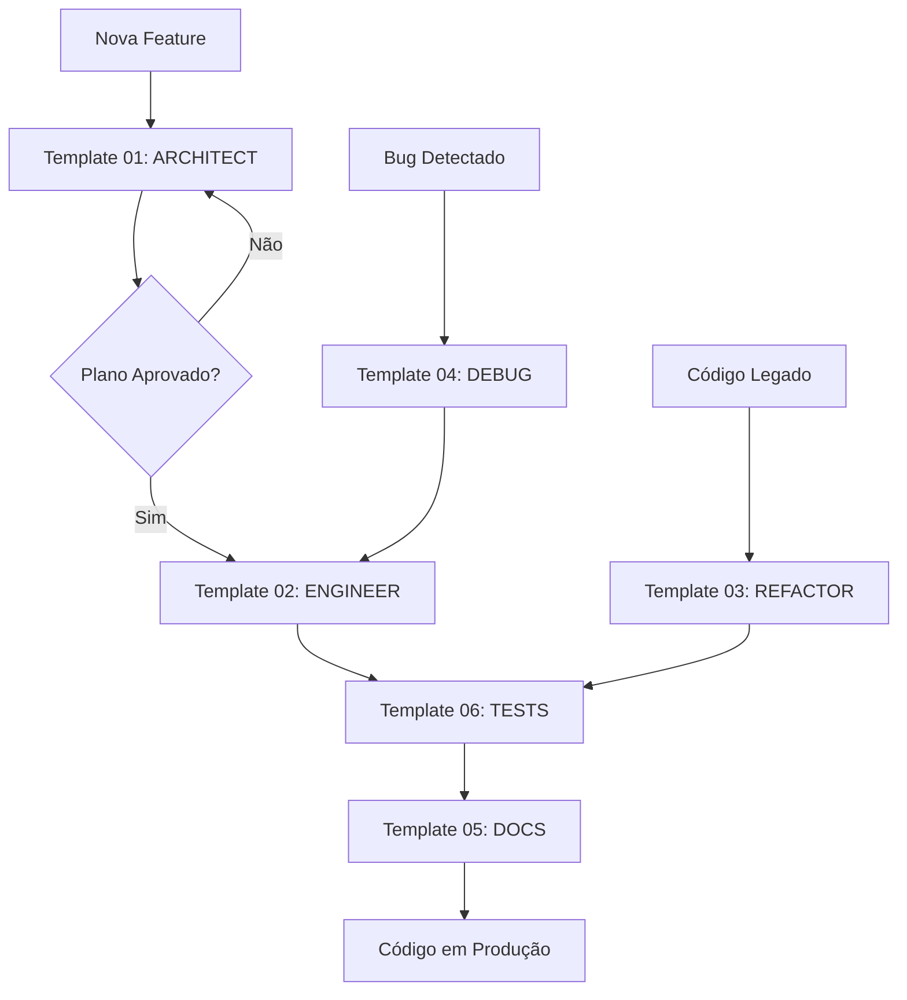

# 📚 Neonorte | Nexus Monolith - Prompt Templates

Bem-vindo à coleção de **templates de prompts** especificamente adaptados para o projeto **Neonorte Neonorte | Nexus 2.0 Monolith**.

Estes templates foram criados para guiar interações produtivas com IAs de código (como Antigravity, GitHub Copilot, ChatGPT, Claude, etc.), garantindo que o código gerado esteja alinhado com a arquitetura, padrões de segurança e princípios do projeto.

---

## 🗺️ Encontre o Template Certo

### 🔍 Por Tipo de Tarefa (Cenários Comuns)

#### Database

- **Preciso adicionar um campo ao banco?** → `01_DATABASE/ADD_FIELD_TO_MODEL.md`
- **Preciso criar um modelo novo no Prisma?** → `01_DATABASE/CREATE_NEW_MODEL.md`
- **Preciso adicionar relação entre modelos?** → `01_DATABASE/ADD_RELATION.md` ⭐ **Novo!**
- **Preciso auditar performance de banco?** → `01_DATABASE/DB_AUDIT_SCHEMA.md` ⭐ **Audit**

#### Backend API

- **Preciso criar um endpoint customizado?** → `02_BACKEND_API/CREATE_CUSTOM_ENDPOINT.md`
- **Preciso adicionar validação Zod?** → `02_BACKEND_API/ADD_ZOD_VALIDATION.md`
- **Preciso criar um controller modular?** → `02_BACKEND_API/CREATE_MODULE_CONTROLLER.md` ⭐ **Novo!**
- **Preciso extrair lógica para service?** → `02_BACKEND_API/CREATE_SERVICE_LAYER.md` ⭐ **Novo!**
- **Preciso auditar segurança de API?** → `02_BACKEND_API/API_AUDIT_ENDPOINT.md` ⭐ **Audit**

#### Frontend UI

- **Preciso criar uma nova tela?** → `03_FRONTEND_UI/CREATE_CRUD_VIEW.md`
- **Preciso adicionar campo a um formulário?** → `03_FRONTEND_UI/ADD_FORM_FIELD.md`
- **Preciso criar um wizard multi-etapas?** → `03_FRONTEND_UI/CREATE_WIZARD.md` ⭐ **Novo!**
- **Preciso criar um dashboard com widgets?** → `03_FRONTEND_UI/CREATE_DASHBOARD.md` ⭐ **Novo!**

#### Troubleshooting

- **Tenho um erro de migração Prisma?** → `06_TROUBLESHOOTING/PRISMA_MIGRATION_ERROR.md`
- **Tenho problema de CORS?** → `06_TROUBLESHOOTING/CORS_ISSUE.md`

### 🎨 UX/UI Design

- **Preciso redesenhar sidebar/navegação?** → `03_FRONTEND_UI/REDESIGN_SIDEBAR.md` ⭐
- **Preciso melhorar view existente (não sei o quê)?** → `03_FRONTEND_UI/UX_AUDIT_VIEW.md` ⭐ **Novo!**
- **Preciso criar widget de dashboard?** → `03_FRONTEND_UI/CREATE_DASHBOARD_WIDGET.md` (Em breve)
- **Preciso otimizar fluxo de navegação?** → `03_FRONTEND_UI/OPTIMIZE_NAVIGATION.md` (Em breve)

### 🏢 Por Módulo de Negócio

- **Solar:** `04_BUSINESS_MODULES/SOLAR_PROPOSAL_ENHANCEMENT.md`
- **Leads/CRM:** `04_BUSINESS_MODULES/LEAD_PIPELINE_STAGE.md`
- **Business Logic:** `04_BUSINESS_MODULES/LOGIC_AUDIT_FLOW.md` ⭐ **Audit**

---

## 📂 Estrutura de Diretórios

```
prompts/
├── 00_FOUNDATION/          # Templates base (genéricos)
│   ├── TEMPLATE_01_ARCHITECT.md
│   ├── TEMPLATE_02_ENGINEER.md
│   ├── TEMPLATE_03_REFACTOR.md
│   ├── TEMPLATE_04_DEBUG.md
│   ├── TEMPLATE_05_DOCS.md
│   └── TEMPLATE_06_TESTS.md
│
├── 01_DATABASE/            # Cenários de Schema/Migrations
│   ├── ADD_FIELD_TO_MODEL.md
│   ├── CREATE_NEW_MODEL.md
│   ├── ADD_RELATION.md ⭐ Novo
│   └── DB_AUDIT_SCHEMA.md ⭐ Audit
│
├── 02_BACKEND_API/         # Cenários de Backend
│   ├── CREATE_CUSTOM_ENDPOINT.md
│   ├── ADD_ZOD_VALIDATION.md
│   ├── CREATE_MODULE_CONTROLLER.md ⭐ Novo
│   ├── CREATE_SERVICE_LAYER.md ⭐ Novo
│   └── API_AUDIT_ENDPOINT.md ⭐ Audit
│
├── 03_FRONTEND_UI/         # Cenários de Frontend
│   ├── REDESIGN_SIDEBAR.md
│   ├── CREATE_CRUD_VIEW.md
│   ├── ADD_FORM_FIELD.md
│   ├── CREATE_WIZARD.md ⭐ Novo
│   ├── CREATE_DASHBOARD.md ⭐ Novo
│   └── UX_AUDIT_VIEW.md ⭐ Novo
│
├── 04_BUSINESS_MODULES/    # Módulos de Negócio Específicos
│   ├── SOLAR_PROPOSAL_ENHANCEMENT.md
│   ├── LEAD_PIPELINE_STAGE.md
│   └── LOGIC_AUDIT_FLOW.md ⭐ Audit
│
├── 05_DEPLOYMENT/          # Deploy/DevOps (futuro)
│
└── 06_TROUBLESHOOTING/     # Debugging Específico
    ├── PRISMA_MIGRATION_ERROR.md
    └── CORS_ISSUE.md
```

---

## 🎯 Para que servem estes templates?

**Problema:**  
Ao pedir ajuda a uma IA sem contexto adequado, você frequentemente recebe:

- Código que não segue os padrões do projeto
- Soluções que quebram a arquitetura existente
- Implementações sem validação de segurança (Zod, transações)
- Alucinações sobre arquivos/funções que não existem

**Solução:**  
Estes templates fornecem **contexto estruturado** à IA, incluindo:

- Stack tecnológica exata (versões, libs)
- Localização dos arquivos-chave (schema.prisma, CONTEXT.md)
- Padrões arquiteturais (Universal CRUD, Service Layer)
- Restrições de segurança (Zod mandatório, transações atômicas)

---

## 📖 Templates Foundation (Base)

| Template         | Quando Usar                          | Saída Esperada                |
| ---------------- | ------------------------------------ | ----------------------------- |
| **01_ARCHITECT** | Planejar nova feature ou arquitetura | `implementation_plan.md`      |
| **02_ENGINEER**  | Implementar plano aprovado           | Código funcional + docs       |
| **03_REFACTOR**  | Limpar código legado/otimizar        | Código refatorado             |
| **04_DEBUG**     | Investigar bugs e erros              | Análise RCA + correção        |
| **05_DOCS**      | Criar documentação técnica           | README, API docs, ADRs        |
| **06_TESTS**     | Gerar testes automatizados           | Arquivos `.test.js/.test.tsx` |

---

## 🚀 Como Usar

### Fluxo Recomendado



### Passo a Passo

1. **Escolha o template adequado** para sua tarefa.
2. **Abra o arquivo** correspondente (ex: `TEMPLATE_01_ARCHITECT.md`).
3. **Copie o bloco XML** da seção "COPIE ISSO AQUI".
4. **Substitua os placeholders** `{{VARIAVEL}}` com suas informações específicas.
5. **Envie para a IA** (Antigravity, ChatGPT, Claude, etc.).
6. **Revise a saída** e itere se necessário.

---

## 📖 Exemplo Prático

**Cenário:** Você quer adicionar um sistema de notificações por email.

### 1. Planejamento (Template 01)

```xml
<mission>
  Planejar a implementação da feature: "Sistema de Notificações por Email".
  Objetivo: Enviar emails automáticos quando tarefas forem atribuídas ou concluídas.
</mission>

<critical_files>
  <file path="c:/Users/.../nexus-monolith/backend/prisma/schema.prisma" />
  <file path="c:/Users/.../nexus-monolith/backend/src/services/TaskService.js" />
</critical_files>

<user_requirements>
  <backend>
    - Integrar com Nodemailer ou SendGrid
    - Criar modelo EmailNotification no Prisma
    - Service para enfileiramento de emails
  </backend>

  <constraints>
    - NÃO enviar emails em ambiente de desenvolvimento (usar flag de debug)
    - NÃO bloquear requisições esperando email ser enviado (async)
  </constraints>
</user_requirements>
```

**Saída da IA:** `implementation_plan.md` detalhando:

- Modelo Prisma `EmailNotification`
- Service `EmailService.js`
- Integração com provedor de email
- Diagrama Mermaid do fluxo

### 2. Aprovação → Implementação (Template 02)

Após revisar e aprovar o plano:

```xml
<mission>
  Executar plano para "Sistema de Notificações por Email".
</mission>

<step_1_database>
  Migração conforme planejado em implementation_plan.md
</step_1_database>

<!-- ... resto do protocolo de execução ... -->
```

**Saída da IA:**

- Código implementado
- Testes básicos
- `walkthrough.md` documentando o que foi feito

### 3. Testes (Template 06)

```xml
<mission>
  Criar cobertura de testes para: "EmailService.js".
</mission>

<test_strategy>
  - Mock do Nodemailer
  - Testar enfileiramento de emails
  - Simular falha de envio
</test_strategy>
```

**Saída da IA:** `EmailService.test.js` com casos de teste.

---

## 🏗️ Contexto Arquitetural do Neonorte | Nexus

Os templates já vêm pré-configurados com informações sobre:

### Backend

- **Runtime:** Node.js 18+
- **Framework:** Express.js 5.x
- **ORM:** Prisma 5.10.2
- **Database:** MySQL 8.0
- **Validation:** Zod 4.x (mandatório)

### Frontend

- **Framework:** React 19.2
- **Build:** Vite 7.x
- **Language:** TypeScript 5.9
- **Styling:** TailwindCSS 4.x
- **Components:** Shadcn/UI (Radix UI)

### Padrões-Chave

- **Universal CRUD Controller** (backend)
- **Service Layer Pattern** (backend)
- **React Hook Form + Zod** (frontend)
- **Atomic Transactions** (Prisma)
- **Security First** (Proteção CVE-2025-55182)

---

## ⚠️ Regras de Ouro (Não-Negociáveis)

Todos os templates reforçam estas regras:

1. **🔐 Segurança:**
   - Toda entrada de dados DEVE ser validada com Zod
   - Operações multi-tabela DEVEM usar transações Prisma
   - Nunca expor senhas/tokens em logs

2. **🏛️ Arquitetura:**
   - Respeitar o Universal CRUD Pattern
   - Separar lógica de negócio em Services
   - Não misturar responsabilidades

3. **📝 Qualidade:**
   - Código deve compilar sem erros (`npm run build`)
   - Substituir `any` por tipos adequados
   - Documentar decisões importantes

---

## 🆘 FAQ

### P: Preciso usar TODOS os templates para uma feature?

**R:** Não. Para features simples, apenas Template 01 + 02 pode ser suficiente. Testes e docs são recomendados mas não obrigatórios para MVPs.

### P: Posso customizar os templates?

**R:** Sim! Estes são pontos de partida. Ajuste conforme necessário, mas mantenha a estrutura básica (contexto + tarefa + restrições).

### P: A IA ignora minhas instruções. O que fazer?

**R:**

1. Certifique-se de preencher TODOS os placeholders `{{VARIAVEL}}`
2. Seja mais específico nas restrições
3. Adicione exemplos concretos
4. Use o Template 04 (DEBUG) se a IA gerar código com erros

### P: Como atualizar estes templates?

**R:** Ao evoluir a arquitetura do Neonorte | Nexus (ex: adicionar GraphQL), atualize os templates para refletir as novas tecnologias/padrões.

---

## 🎓 Recursos Adicionais

**Documentação do Projeto:**

- `../../CONTEXT.md` - Visão geral da arquitetura
- `../../INTERFACE_MAP.md` - Mapeamento de rotas/UI
- `../docs/` - Documentação técnica detalhada
- `../backend/prisma/schema.prisma` - Schema do banco de dados

**Guias de Estilo:**

- Clean Code (Robert C. Martin)
- SOLID Principles
- Prisma Best Practices

---

## 📞 Suporte

**Encontrou um problema com os templates?**

- Abra uma issue no repositório
- Consulte `FAQ_ERROS_COMUNS.md` (na raiz `_prompts/`)
- Fale com a equipe de arquitetura

---

## 📜 Licença

Estes templates são propriedade da **Neonorte Tecnologia** e destinam-se exclusivamente ao projeto Neonorte | Nexus 2.0.

---

**Última Atualização:** 2026-01-25  
**Versão dos Templates:** 1.0  
**Compatível com:** Neonorte | Nexus Monolith 2.1+
