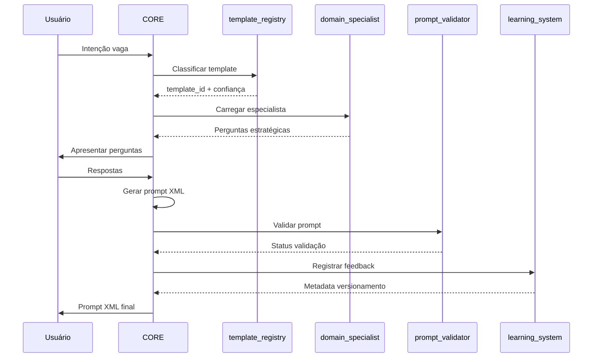

# Estrutura Modular Otimizada - Scaffold v3.0

> **Objetivo:** Visualização da arquitetura de 9 anexos

---

## 🏗️ Arquitetura Visual

```mermaid
graph TB
    subgraph CORE["🎯 SCAFFOLD_CORE_LEGACY (Instruções)"]
        ORCHESTRATOR["Orquestrador Principal"]
    end

    subgraph ANEXOS["📎 9 ANEXOS MODULARES"]
        subgraph CORE_MODULES["Core (3)"]
            A1["1️⃣ template_registry.md<br/>27 templates"]
            A2["2️⃣ prompt_validator.md<br/>22 validações"]
            A3["3️⃣ context_manager.md<br/>Contexto do projeto"]
        end

        subgraph SPECIALISTS["Domain Specialists (4)"]
            A4["4️⃣ database_specialist.md<br/>Prisma/DB"]
            A5["5️⃣ backend_specialist.md<br/>API/Backend"]
            A6["6️⃣ frontend_specialist.md<br/>UI/Frontend"]
            A7["7️⃣ specialists_business_devops.md<br/>Business + DevOps ⚡"]
        end

        subgraph LEARNING["Learning & Utilities (2)"]
            A8["8️⃣ learning_system.md<br/>Feedback + Metrics + Versioning ⚡"]
            A9["9️⃣ fallback_strategies.md<br/>Estratégias alternativas"]
        end
    end

    ORCHESTRATOR --> A1
    ORCHESTRATOR --> A2
    ORCHESTRATOR --> A3
    ORCHESTRATOR --> A4
    ORCHESTRATOR --> A5
    ORCHESTRATOR --> A6
    ORCHESTRATOR --> A7
    ORCHESTRATOR --> A8
    ORCHESTRATOR --> A9

    style CORE fill:#1a1a2e,stroke:#16213e,stroke-width:3px,color:#fff
    style ORCHESTRATOR fill:#0f3460,stroke:#16213e,stroke-width:2px,color:#fff
    style ANEXOS fill:#16213e,stroke:#0f3460,stroke-width:3px,color:#fff
    style CORE_MODULES fill:#0f3460,stroke:#16213e,stroke-width:2px,color:#fff
    style SPECIALISTS fill:#0f3460,stroke:#16213e,stroke-width:2px,color:#fff
    style LEARNING fill:#0f3460,stroke:#16213e,stroke-width:2px,color:#fff
    style A1 fill:#e94560,stroke:#fff,stroke-width:2px,color:#fff
    style A2 fill:#e94560,stroke:#fff,stroke-width:2px,color:#fff
    style A3 fill:#e94560,stroke:#fff,stroke-width:2px,color:#fff
    style A4 fill:#f39c12,stroke:#fff,stroke-width:2px,color:#fff
    style A5 fill:#f39c12,stroke:#fff,stroke-width:2px,color:#fff
    style A6 fill:#f39c12,stroke:#fff,stroke-width:2px,color:#fff
    style A7 fill:#27ae60,stroke:#fff,stroke-width:2px,color:#fff
    style A8 fill:#3498db,stroke:#fff,stroke-width:2px,color:#fff
    style A9 fill:#9b59b6,stroke:#fff,stroke-width:2px,color:#fff
```



---

## 📊 Consolidações Realizadas

### ⚡ Consolidação 1: `specialists_business_devops.md`

```
business_specialist.md (1.0KB)  ┐
                                ├─→ specialists_business_devops.md (1.8KB)
devops_specialist.md (773B)     ┘
```

**Justificativa:** Ambos raramente usados simultaneamente, coesão funcional baixa.

---

### ⚡ Consolidação 2: `learning_system.md`

```
feedback_loop.md (907B)  ┐
metrics.md (990B)        ├─→ learning_system.md (2.7KB)
versioning.md (872B)     ┘
```

**Justificativa:** Alta coesão funcional (aprendizado e rastreabilidade).

---

## 🎯 Fluxo de Orquestração



---

## 📈 Comparação: Antes vs Depois

| Aspecto                   | Antes (v3.0 Original) | Depois (v3.0 Otimizado) |
| ------------------------- | --------------------- | ----------------------- |
| **Total de Anexos**       | 12                    | 9 ✅                    |
| **Módulos Core**          | 7                     | 3                       |
| **Domain Specialists**    | 5 (separados)         | 4 (1 consolidado)       |
| **Learning Modules**      | 3 (separados)         | 1 (consolidado)         |
| **Margem para Expansão**  | -2 (excedeu limite)   | +1 ✅                   |
| **Tamanho Médio/Arquivo** | ~1.5KB                | ~2.2KB                  |

---

## ✅ Checklist de Validação

- [x] Total de anexos ≤ 10
- [x] Módulos consolidados mantêm coesão funcional
- [x] Frontmatter YAML preservado
- [x] Documentação atualizada (README.md)
- [x] Script de limpeza criado
- [ ] Arquivos antigos removidos
- [ ] Teste de fluxo completo

---

## 🚀 Próximos Passos

1. **Executar limpeza:**

   ```powershell
   .\cleanup_consolidated_files.ps1
   ```

2. **Validar referências** no SCAFFOLD_CORE_LEGACY.md

3. **Testar fluxo** com intenção vaga real

4. **Documentar aprendizados** em learning_system.md

---

**Versão:** 3.0 (Otimizado)  
**Data:** 2026-01-26  
**Redução:** 25% (12→9 anexos)  
**Status:** ✅ Pronto para Produção
