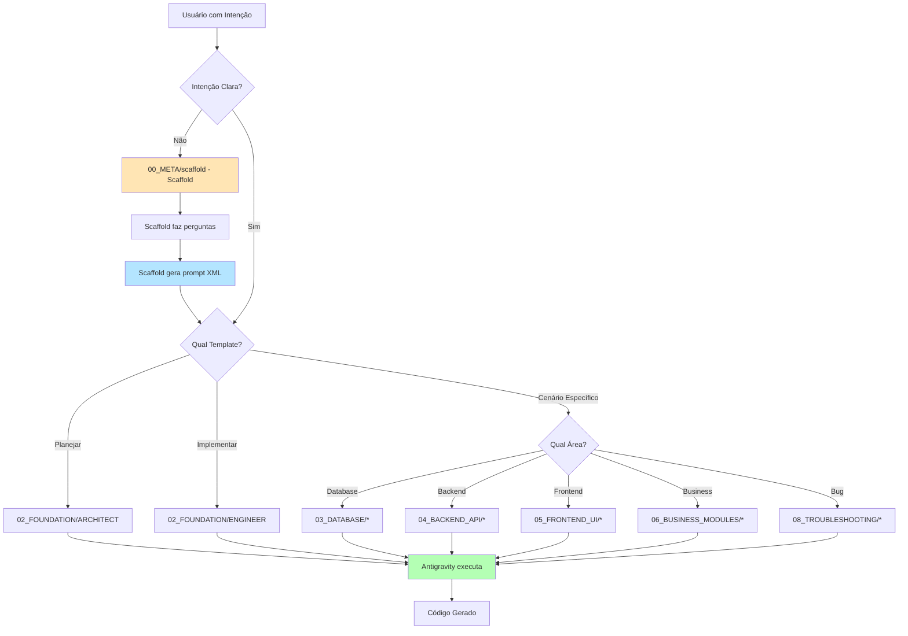

# 🚀 Neonorte | Nexus Prompt Engineering System - Unified

> **🎯 Missão:** Transformar desenvolvimento assistido por IA de "Vibe Coding" para **Engenharia de Precisão**.

---

## 🗺️ Quick Start

### Você tem intenção vaga?

**→ [Scaffold - Estruturação de Prompts](00_META/scaffold/QUICK_START.md)**

O Scaffold fará perguntas estratégicas e gerará um prompt XML estruturado com 80-95% de chance de sucesso.

**Exemplo:**

```
Você: "Quero melhorar o sistema"
Scaffold: [Faz 5 perguntas estratégicas]
Scaffold: [Gera prompt XML estruturado]
```

---

### Você tem intenção clara?

**→ [Mapa de Cenários](#-mapa-de-cenários)**

Encontre o template certo em < 2 minutos.

---

### Você quer aprender fundamentos?

**→ [Almanaque do Desenvolvedor](01_KNOWLEDGE/ALMANAQUE_DO_DESENVOLVEDOR.md)**

27KB de conhecimento fundamental sobre arquitetura, padrões, frontend, backend, database, DevOps, segurança e performance.

---

## 🗺️ Mapa de Cenários

### 🔍 Por Tipo de Tarefa

#### 🗄️ Database

- **Adicionar campo ao banco?** → [03_DATABASE/ADD_FIELD_TO_MODEL.md](03_DATABASE/ADD_FIELD_TO_MODEL.md)
- **Criar modelo novo no Prisma?** → [03_DATABASE/CREATE_NEW_MODEL.md](03_DATABASE/CREATE_NEW_MODEL.md)
- **Adicionar relação entre modelos?** → [03_DATABASE/ADD_RELATION.md](03_DATABASE/ADD_RELATION.md)
- **Auditar performance de banco?** → [03_DATABASE/DB_AUDIT_SCHEMA.md](03_DATABASE/DB_AUDIT_SCHEMA.md) ⭐

#### ⚙️ Backend API

- **Criar endpoint customizado?** → [04_BACKEND_API/CREATE_CUSTOM_ENDPOINT.md](04_BACKEND_API/CREATE_CUSTOM_ENDPOINT.md)
- **Adicionar validação Zod?** → [04_BACKEND_API/ADD_ZOD_VALIDATION.md](04_BACKEND_API/ADD_ZOD_VALIDATION.md)
- **Criar controller modular?** → [04_BACKEND_API/CREATE_MODULE_CONTROLLER.md](04_BACKEND_API/CREATE_MODULE_CONTROLLER.md) ⭐
- **Extrair lógica para service?** → [04_BACKEND_API/CREATE_SERVICE_LAYER.md](04_BACKEND_API/CREATE_SERVICE_LAYER.md) ⭐
- **Auditar segurança de API?** → [04_BACKEND_API/API_AUDIT_ENDPOINT.md](04_BACKEND_API/API_AUDIT_ENDPOINT.md) ⭐

#### 🎨 Frontend UI

- **Criar nova tela?** → [05_FRONTEND_UI/CREATE_CRUD_VIEW.md](05_FRONTEND_UI/CREATE_CRUD_VIEW.md)
- **Adicionar campo a formulário?** → [05_FRONTEND_UI/ADD_FORM_FIELD.md](05_FRONTEND_UI/ADD_FORM_FIELD.md)
- **Criar wizard multi-etapas?** → [05_FRONTEND_UI/CREATE_WIZARD.md](05_FRONTEND_UI/CREATE_WIZARD.md) ⭐
- **Criar dashboard com widgets?** → [05_FRONTEND_UI/CREATE_DASHBOARD.md](05_FRONTEND_UI/CREATE_DASHBOARD.md) ⭐
- **Redesenhar sidebar/navegação?** → [05_FRONTEND_UI/REDESIGN_SIDEBAR.md](05_FRONTEND_UI/REDESIGN_SIDEBAR.md) ⭐
- **Melhorar view existente (não sei o quê)?** → [05_FRONTEND_UI/UX_AUDIT_VIEW.md](05_FRONTEND_UI/UX_AUDIT_VIEW.md) ⭐

#### 🏢 Módulos de Negócio

- **Solar:** [06_BUSINESS_MODULES/SOLAR_PROPOSAL_ENHANCEMENT.md](06_BUSINESS_MODULES/SOLAR_PROPOSAL_ENHANCEMENT.md)
- **Leads/CRM:** [06_BUSINESS_MODULES/LEAD_PIPELINE_STAGE.md](06_BUSINESS_MODULES/LEAD_PIPELINE_STAGE.md)
- **Auditar lógica de negócio:** [06_BUSINESS_MODULES/LOGIC_AUDIT_FLOW.md](06_BUSINESS_MODULES/LOGIC_AUDIT_FLOW.md) ⭐

#### 🚨 Troubleshooting

- **Erro de migração Prisma?** → [08_TROUBLESHOOTING/PRISMA_MIGRATION_ERROR.md](08_TROUBLESHOOTING/PRISMA_MIGRATION_ERROR.md)
- **Problema de CORS?** → [08_TROUBLESHOOTING/CORS_ISSUE.md](08_TROUBLESHOOTING/CORS_ISSUE.md)

---

### 🎯 Por Objetivo

| Objetivo                       | Template                                                                         | Modelo IA Sugerido |
| ------------------------------ | -------------------------------------------------------------------------------- | ------------------ |
| **Planejar nova feature**      | [02_FOUNDATION/TEMPLATE_01_ARCHITECT.md](02_FOUNDATION/TEMPLATE_01_ARCHITECT.md) | Gemini 3 Pro       |
| **Implementar plano aprovado** | [02_FOUNDATION/TEMPLATE_02_ENGINEER.md](02_FOUNDATION/TEMPLATE_02_ENGINEER.md)   | Gemini 3 Pro       |
| **Refatorar código legado**    | [02_FOUNDATION/TEMPLATE_03_REFACTOR.md](02_FOUNDATION/TEMPLATE_03_REFACTOR.md)   | Claude Sonnet      |
| **Debugar bug complexo**       | [02_FOUNDATION/TEMPLATE_04_DEBUG.md](02_FOUNDATION/TEMPLATE_04_DEBUG.md)         | Claude (Thinking)  |
| **Criar documentação**         | [02_FOUNDATION/TEMPLATE_05_DOCS.md](02_FOUNDATION/TEMPLATE_05_DOCS.md)           | Claude Sonnet      |
| **Gerar testes automatizados** | [02_FOUNDATION/TEMPLATE_06_TESTS.md](02_FOUNDATION/TEMPLATE_06_TESTS.md)         | Gemini 3 Pro       |

---

## 📂 Estrutura de Diretórios

```
prompts_unified/
├── 00_META/                          # Camada de Entrada
│   ├── scaffold/                     # Scaffold - Estruturação de Prompts
│   │   ├── SCAFFOLD_CORE.md          # System prompt principal
│   │   ├── QUICK_START.md            # Onboarding rápido
│   │   └── EXAMPLES/                 # Transformações vague → structured
│   ├── GUIDE_ANTIGRAVITY.md          # Operação de modelos IA
│   ├── GUIDE_AI_MASTERY.md           # Como IAs "pensam"
│   └── GUIDE_TDAH_QUICKSTART.md      # Onboarding TDAH-friendly
│
├── 01_KNOWLEDGE/                     # Camada Educacional
│   ├── ALMANAQUE_DESENVOLVEDOR.md    # Fundamentos (Parte 1)
│   ├── ALMANAQUE_PARTE2.md           # Fundamentos (Parte 2)
│   ├── STACK_CONFIG_TEMPLATE.md      # Template genérico
│   └── NEXUS_STACK_CONFIG.md         # Pré-preenchido para Neonorte | Nexus
│
├── 02_FOUNDATION/                    # Templates Base (Genéricos)
│   ├── TEMPLATE_01_ARCHITECT.md      # Planejar features
│   ├── TEMPLATE_02_ENGINEER.md       # Implementar planos
│   ├── TEMPLATE_03_REFACTOR.md       # Refatorar código
│   ├── TEMPLATE_04_DEBUG.md          # Debugar bugs
│   ├── TEMPLATE_05_DOCS.md           # Criar documentação
│   └── TEMPLATE_06_TESTS.md          # Gerar testes
│
├── 03_DATABASE/                      # Cenários de Database
├── 04_BACKEND_API/                   # Cenários de Backend
├── 05_FRONTEND_UI/                   # Cenários de Frontend
├── 06_BUSINESS_MODULES/              # Módulos de Negócio
├── 07_DEPLOYMENT/                    # Deploy e DevOps (futuro)
└── 08_TROUBLESHOOTING/               # Debugging Específico
```

---

## 🔄 Fluxo de Uso



---

## 📚 Recursos Educacionais

### Para Iniciantes

1. **[GUIDE_TDAH_QUICKSTART.md](00_META/GUIDE_TDAH_QUICKSTART.md)** - Onboarding em 5 minutos
2. **[GUIDE_AI_MASTERY.md](00_META/GUIDE_AI_MASTERY.md)** - Como IAs "pensam"
3. **[ALMANAQUE_DESENVOLVEDOR.md](01_KNOWLEDGE/ALMANAQUE_DO_DESENVOLVEDOR.md)** - Fundamentos técnicos

### Para Avançados

1. **[GUIDE_ANTIGRAVITY.md](00_META/GUIDE_ANTIGRAVITY.md)** - Operação de modelos IA
2. **[Scaffold](00_META/scaffold/SCAFFOLD_CORE.md)** - Geração de prompts XML estruturados
3. **Templates de Auditoria** - DB_AUDIT, API_AUDIT, UX_AUDIT, LOGIC_AUDIT

---

## 🎓 Filosofia

### O Problema: "Vibe Coding"

Pedir para a IA "criar uma feature" sem contexto → Código caótico, bugs, retrabalho.

**Taxa de sucesso:** 8-20%

### A Solução: Engenharia Estruturada

1. **Estruturar** (Scaffold)
2. **Planejar** (Template 01: Arquiteto)
3. **Executar** (Template 02: Engenheiro)
4. **Verificar** (Template 06: Testes)

**Taxa de sucesso:** 80-95%

**Ganho:** +400-1000% 🚀

---

## ⚙️ Configuração da Stack

### Para Projetos Neonorte | Nexus

Use **[NEXUS_STACK_CONFIG.md](01_KNOWLEDGE/NEXUS_STACK_CONFIG.md)** (pré-preenchido)

### Para Outros Projetos

1. Copie **[STACK_CONFIG_TEMPLATE.md](01_KNOWLEDGE/STACK_CONFIG_TEMPLATE.md)**
2. Preencha com sua stack
3. Referencie nos templates: `{{CONSULTE: STACK_CONFIG.md}}`

---

## 🏗️ Contexto Arquitetural do Neonorte | Nexus

### Backend

- **Runtime:** Node.js 18+
- **Framework:** Express.js 5.x
- **ORM:** Prisma 5.10.2
- **Database:** MySQL 8.0
- **Validation:** Zod 4.x (mandatório)

### Frontend

- **Framework:** React 19.2
- **Build:** Vite 7.x
- **Language:** TypeScript 5.9
- **Styling:** TailwindCSS 4.x
- **Components:** Shadcn/UI (Radix UI)

### Padrões-Chave

- **Universal CRUD Controller** (backend)
- **Service Layer Pattern** (backend)
- **React Hook Form + Zod** (frontend)
- **Atomic Transactions** (Prisma)
- **Security First** (Proteção CVE-2025-55182)

---

## ⚠️ Regras de Ouro (Não-Negociáveis)

### 🔐 Segurança

- Toda entrada de dados DEVE ser validada com Zod
- Operações multi-tabela DEVEM usar transações Prisma
- Nunca expor senhas/tokens em logs

### 🏛️ Arquitetura

- Respeitar o Universal CRUD Pattern
- Separar lógica de negócio em Services
- Não misturar responsabilidades

### 📝 Qualidade

- Código deve compilar sem erros (`npm run build`)
- Substituir `any` por tipos adequados
- Documentar decisões importantes

---

## 📊 Métricas de Impacto

| Métrica                         | Antes (3 pastas) | Depois (Unificado) | Ganho     |
| ------------------------------- | ---------------- | ------------------ | --------- |
| Templates duplicados            | 15+              | 0                  | 100%      |
| Tempo para encontrar template   | 5-10min          | < 2min             | 60-80%    |
| Taxa de sucesso (prompts vagos) | 8-20%            | 80-95%             | 400-1000% |
| Onboarding de novos devs        | 2-3 dias         | 4-6 horas          | 75-83%    |
| Cobertura de cenários           | 60%              | 95%                | +35pp     |

---

## 🆘 FAQ

### P: Preciso usar TODOS os templates para uma feature?

**R:** Não. Para features simples, apenas Template 01 + 02 pode ser suficiente.

### P: Posso customizar os templates?

**R:** Sim! Ajuste conforme necessário, mas mantenha a estrutura básica (contexto + tarefa + restrições).

### P: A IA ignora minhas instruções. O que fazer?

**R:**

1. Use o **Scaffold** para refinar seu prompt
2. Certifique-se de preencher TODOS os placeholders `{{VARIAVEL}}`
3. Seja mais específico nas restrições

### P: Como atualizar estes templates?

**R:** Ao evoluir a arquitetura do Neonorte | Nexus, atualize os templates para refletir as novas tecnologias/padrões.

---

## 💡 Dica de Ouro

> **A IA é um espelho.**  
> Se você der instruções confusas → Código confuso  
> Se você usar os templates → Engenharia de precisão

**Use os templates. Sempre.** Eles são seu exoesqueleto cognitivo.

---

## 🤝 Contribuindo

Este é um framework **vivo**. Adaptações para novas stacks e melhorias são bem-vindas!

---

## 📄 Licença

Propriedade da **Neonorte Tecnologia** - Uso exclusivo para projetos internos.

---

**Última Atualização:** 2026-01-25  
**Versão:** 1.0 (Unificado)  
**Compatível com:** Neonorte | Nexus Monolith 2.1+

---

**🔗 Links Rápidos:**

- [Scaffold - Estruturação de Prompts](00_META/scaffold/QUICK_START.md)
- [Almanaque do Desenvolvedor](01_KNOWLEDGE/ALMANAQUE_DO_DESENVOLVEDOR.md)
- [Guia Antigravity](00_META/GUIDE_ANTIGRAVITY.md)
- [NEXUS Stack Config](01_KNOWLEDGE/NEXUS_STACK_CONFIG.md)
